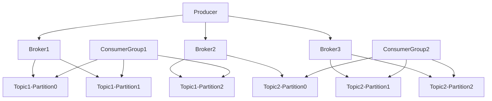
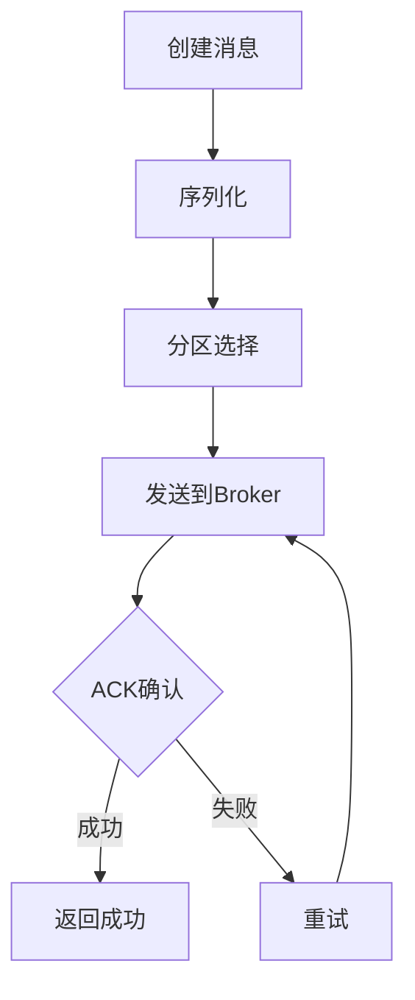
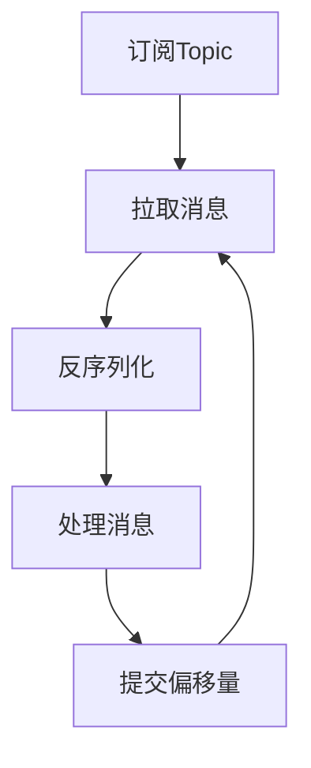
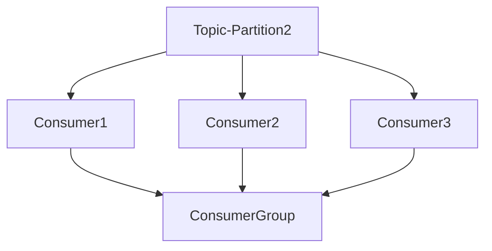

# 7.2 消息队列Kafka

> [!abstract] 核心问题
> Kafka的架构是什么？Producer、Consumer、Topic分别做什么？

## 一、Kafka概述

### 1. Kafka的定义

**定义**：Kafka是一个分布式的消息队列系统，用于处理实时数据流。

**设计目标**：

| 目标 | 说明 |
|-----|------|
| **高吞吐量** | 每秒处理百万级消息 |
| **低延迟** | 毫秒级延迟 |
| **高可靠** | 数据不丢失 |
| **可扩展** | 水平扩展 |

**适用场景**：

| 场景 | 说明 |
|-----|------|
| **实时数据流** | 处理实时数据流 |
| **日志收集** | 收集日志数据 |
| **事件驱动架构** | 构建事件驱动架构 |
| **流式处理** | 与Spark Streaming/Flink集成 |

### 2. Kafka与其他消息队列的对比

**对比表**：

| 对比项 | Kafka | RabbitMQ | ActiveMQ |
|-------|-------|----------|----------|
| **吞吐量** | 高 | 中 | 中 |
| **延迟** | 低 | 中 | 中 |
| **可靠性** | 高 | 高 | 高 |
| **扩展性** | 强 | 中 | 中 |
| **适用场景** | 大数据 | 企业级 | 企业级 |

## 二、Kafka架构

### 1. 架构组成

**架构图**：



**组件说明**：

| 组件 | 功能 | 说明 |
|-----|------|------|
| **Producer** | 生产者 | 发送消息 |
| **Consumer** | 消费者 | 消费消息 |
| **Broker** | 代理 | 存储消息 |
| **Topic** | 主题 | 消息分类 |
| **Partition** | 分区 | 消息分片 |
| **Consumer Group** | 消费者组 | 多个消费者协同消费 |

### 2. Topic

**定义**：Topic是消息的分类，类似于数据库的表。

**特点**：

| 特点 | 说明 |
|-----|------|
| **多分区** | 一个Topic可以有多个Partition |
| **顺序性** | 同一个Partition内的消息是有序的 |
| **持久性** | 消息持久化到磁盘 |

**创建Topic**：

```bash
# 创建Topic
kafka-topics.sh --create --topic mytopic --partitions 3 --replication-factor 2 --bootstrap-server localhost:9092

# 查看Topic列表
kafka-topics.sh --list --bootstrap-server localhost:9092

# 查看Topic详情
kafka-topics.sh --describe --topic mytopic --bootstrap-server localhost:9092
```

### 3. Partition

**定义**：Partition是Topic的分片，用于并行处理。

**特点**：

| 特点 | 说明 |
|-----|------|
| **并行处理** | 多个Partition可以并行处理 |
| **顺序性** | 同一个Partition内的消息是有序的 |
| **负载均衡** | 消息均匀分布到各个Partition |

**分区策略**：

| 策略 | 说明 |
|-----|------|
| **轮询** | 消息依次发送到各个Partition |
| **按Key分区** | 相同Key的消息发送到同一个Partition |
| **自定义分区** | 用户自定义分区策略 |

### 4. Producer

**定义**：Producer是消息的生产者，负责发送消息到Kafka。

**工作流程**：



**Producer配置**：

```properties
# bootstrap服务器
bootstrap.servers=localhost:9092

# 序列化器
key.serializer=org.apache.kafka.common.serialization.StringSerializer
value.serializer=org.apache.kafka.common.serialization.StringSerializer

# ACK级别
acks=all

# 重试次数
retries=3
```

**Producer示例**：

```java
// 创建Producer
Properties props = new Properties();
props.put("bootstrap.servers", "localhost:9092");
props.put("key.serializer", "org.apache.kafka.common.serialization.StringSerializer");
props.put("value.serializer", "org.apache.kafka.common.serialization.StringSerializer");

KafkaProducer<String, String> producer = new KafkaProducer<>(props);

// 发送消息
ProducerRecord<String, String> record = new ProducerRecord<>("mytopic", "key", "value");
producer.send(record);

// 关闭Producer
producer.close();
```

### 5. Consumer

**定义**：Consumer是消息的消费者，负责从Kafka读取消息。

**工作流程**：



**Consumer配置**：

```properties
# bootstrap服务器
bootstrap.servers=localhost:9092

# 反序列化器
key.deserializer=org.apache.kafka.common.serialization.StringDeserializer
value.deserializer=org.apache.kafka.common.serialization.StringDeserializer

# 消费者组ID
group.id=mygroup

# 自动提交偏移量
enable.auto.commit=true
auto.commit.interval.ms=1000
```

**Consumer示例**：

```java
// 创建Consumer
Properties props = new Properties();
props.put("bootstrap.servers", "localhost:9092");
props.put("key.deserializer", "org.apache.kafka.common.serialization.StringDeserializer");
props.put("value.deserializer", "org.apache.kafka.common.serialization.StringDeserializer");
props.put("group.id", "mygroup");

KafkaConsumer<String, String> consumer = new KafkaConsumer<>(props);

// 订阅Topic
consumer.subscribe(Arrays.asList("mytopic"));

// 消费消息
while (true) {
    ConsumerRecords<String, String> records = consumer.poll(Duration.ofMillis(100));
    for (ConsumerRecord<String, String> record : records) {
        System.out.println("offset = " + record.offset() + ", key = " + record.key() + ", value = " + record.value());
    }
}
```

### 6. Consumer Group

**定义**：Consumer Group是多个消费者的集合，协同消费一个Topic。

**特点**：

| 特点 | 说明 |
|-----|------|
| **负载均衡** | 每个Partition只被一个Consumer消费 |
| **故障恢复** | Consumer故障时，其他Consumer接管 |
| **并行消费** | 多个Consumer并行消费 |

**Consumer Group工作原理**：



## 三、Kafka存储机制

### 1. 日志存储

**定义**：Kafka将消息存储在日志文件中。

**结构**：

```
Topic/mytopic/
├── partition-0/
│   ├── 00000000000000000000.log
│   ├── 00000000000000000100.log
│   └── index/
│       ├── 00000000000000000000.index
│       └── 00000000000000000100.index
├── partition-1/
│   └── ...
└── partition-2/
    └── ...
```

**日志文件**：

| 文件类型 | 说明 |
|---------|------|
| **.log** | 消息数据文件 |
| **.index** | 偏移量索引文件 |
| **.timeindex** | 时间戳索引文件 |

### 2. 消息格式

**消息结构**：

| 字段 | 说明 |
|-----|------|
| **Offset** | 消息偏移量 |
| **Timestamp** | 时间戳 |
| **Key** | 消息键 |
| **Value** | 消息值 |

**消息大小**：

| 配置项 | 说明 | 默认值 |
|-------|------|-------|
| **message.max.bytes** | 最大消息大小 | 1MB |
| **replica.fetch.max.bytes** | 副本拉取最大大小 | 1MB |

### 3. 数据保留策略

**策略**：

| 策略 | 说明 |
|-----|------|
| **时间保留** | 按时间保留消息 |
| **大小保留** | 按大小保留消息 |

**配置**：

```properties
# 时间保留（7天）
log.retention.hours=168

# 大小保留（1GB）
log.retention.bytes=1073741824

# 日志段大小（1GB）
log.segment.bytes=1073741824
```

## 四、Kafka高级特性

### 1. 事务

**定义**：Kafka支持事务，保证消息的原子性。

**配置**：

```properties
# 启用事务
transactional.id=my-transaction-id
enable.idempotence=true
acks=all
```

**事务示例**：

```java
// 初始化事务
producer.initTransactions();

try {
    // 开始事务
    producer.beginTransaction();
    
    // 发送消息
    producer.send(new ProducerRecord<>("topic1", "key1", "value1"));
    producer.send(new ProducerRecord<>("topic2", "key2", "value2"));
    
    // 提交事务
    producer.commitTransaction();
} catch (ProducerFencedException | OutOfOrderSequenceException | AuthorizationException e) {
    // 中止事务
    producer.abortTransaction();
}
```

### 2. Exactly-Once语义

**定义**：Exactly-Once语义保证消息只被处理一次。

**实现方式**：

| 方式 | 说明 |
|-----|------|
| **幂等性** | 生产者幂等性 |
| **事务** | 事务保证 |
| **消费者事务** | 消费者事务 |

### 3. 流式处理集成

**Spark Streaming集成**：

```scala
// 创建Spark Streaming上下文
val ssc = new StreamingContext(sparkConf, Seconds(5))

// 从Kafka读取数据
val kafkaParams = Map[String, Object](
    "bootstrap.servers" -> "localhost:9092",
    "key.deserializer" -> classOf[StringDeserializer],
    "value.deserializer" -> classOf[StringDeserializer],
    "group.id" -> "spark-streaming-group",
    "auto.offset.reset" -> "latest"
)

val topics = Array("mytopic")
val stream = KafkaUtils.createDirectStream[String, String](
    ssc,
    PreferConsistent,
    Subscribe[String, String](topics, kafkaParams)
)

// 处理数据
stream.map(_.value()).print()

ssc.start()
ssc.awaitTermination()
```

> [!warning] 易错点
> Kafka的Topic是逻辑概念，Partition是物理概念！同一个Partition内的消息是有序的，但不同Partition之间没有顺序保证。

---

**导航**：上一节 [[7.1-大数据采集工具Flume.md]] · [[MOC - 第7章.md|返回章节导航]] · 下一节 [[7.3-数据预处理与ETL流程.md]]