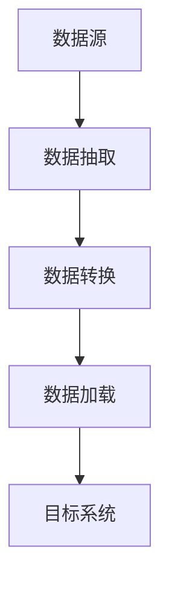

# 7.3 数据预处理与ETL流程

> [!abstract] 核心问题
> ETL流程是什么？包含哪些步骤？数据预处理有哪些技术？

## 一、ETL概述

### 1. ETL的定义

**定义**：ETL是指数据抽取（Extract）、转换（Transform）和加载（Load）的过程。

**设计目标**：

| 目标 | 说明 |
|-----|------|
| **数据集成** | 将多个数据源集成到一起 |
| **数据清洗** | 清洗脏数据 |
| **数据转换** | 将数据转换为目标格式 |
| **数据加载** | 将数据加载到目标系统 |

**适用场景**：

| 场景 | 说明 |
|-----|------|
| **数据仓库** | 构建数据仓库 |
| **数据集市** | 构建数据集市 |
| **数据分析** | 为数据分析准备数据 |
| **数据迁移** | 数据迁移 |

### 2. ETL与ELT的对比

**对比表**：

| 对比项 | ETL | ELT |
|-------|-----|-----|
| **处理顺序** | 抽取→转换→加载 | 抽取→加载→转换 |
| **转换位置** | 中间层 | 目标系统 |
| **适用场景** | 传统数据仓库 | 大数据 |
| **灵活性** | 低 | 高 |
| **性能** | 低 | 高 |

## 二、ETL流程

### 1. 流程概述

**流程图**：



**步骤说明**：

| 步骤 | 说明 |
|-----|------|
| **数据抽取** | 从数据源抽取数据 |
| **数据转换** | 清洗、转换数据 |
| **数据加载** | 将数据加载到目标系统 |

### 2. 数据抽取

**定义**：数据抽取是指从各种数据源抽取数据的过程。

**数据源类型**：

| 类型 | 说明 |
|-----|------|
| **数据库** | MySQL、Oracle、SQL Server |
| **文件** | CSV、Excel、JSON |
| **日志** | 服务器日志 |
| **API** | REST API |

**抽取方式**：

| 方式 | 说明 |
|-----|------|
| **全量抽取** | 抽取全部数据 |
| **增量抽取** | 抽取增量数据 |
| **实时抽取** | 实时抽取数据 |

**抽取工具**：

| 工具 | 说明 |
|-----|------|
| **Sqoop** | 数据库抽取 |
| **Flume** | 日志抽取 |
| **Kafka** | 实时数据抽取 |
| **NiFi** | 数据集成 |

### 3. 数据转换

**定义**：数据转换是指对抽取的数据进行清洗、转换和集成的过程。

**转换步骤**：

| 步骤 | 说明 |
|-----|------|
| **数据清洗** | 清洗脏数据 |
| **数据转换** | 转换数据格式 |
| **数据集成** | 集成多个数据源 |
| **数据聚合** | 聚合数据 |

**数据清洗技术**：

| 技术 | 说明 |
|-----|------|
| **去重** | 删除重复数据 |
| **补全** | 补全缺失数据 |
| **修正** | 修正错误数据 |
| **过滤** | 过滤无效数据 |

**数据转换技术**：

| 技术 | 说明 |
|-----|------|
| **类型转换** | 转换数据类型 |
| **格式转换** | 转换数据格式 |
| **字段映射** | 映射字段 |
| **数据派生** | 派生新字段 |

### 4. 数据加载

**定义**：数据加载是指将转换后的数据加载到目标系统的过程。

**目标系统**：

| 系统 | 说明 |
|-----|------|
| **数据仓库** | Hive、Impala |
| **数据库** | MySQL、Oracle |
| **数据湖** | HDFS、S3 |
| **NoSQL** | HBase、MongoDB |

**加载方式**：

| 方式 | 说明 |
|-----|------|
| **全量加载** | 加载全部数据 |
| **增量加载** | 加载增量数据 |
| **实时加载** | 实时加载数据 |

**加载策略**：

| 策略 | 说明 |
|-----|------|
| **覆盖加载** | 覆盖原有数据 |
| **追加加载** | 追加到原有数据 |
| **合并加载** | 合并原有数据 |

## 三、数据预处理技术

### 1. 数据清洗

**定义**：数据清洗是指处理脏数据的过程。

**脏数据类型**：

| 类型 | 说明 |
|-----|------|
| **缺失值** | 数据缺失 |
| **重复值** | 数据重复 |
| **错误值** | 数据错误 |
| **异常值** | 数据异常 |

**处理方法**：

| 方法 | 说明 |
|-----|------|
| **删除** | 删除脏数据 |
| **补全** | 补全缺失数据 |
| **修正** | 修正错误数据 |
| **标记** | 标记异常数据 |

**示例（Spark）**：

```scala
// 删除缺失值
val cleanedDF = df.na.drop()

// 补全缺失值
val filledDF = df.na.fill(0)

// 删除重复值
val deduplicatedDF = df.dropDuplicates()

// 过滤异常值
val filteredDF = df.filter($"age" > 0 && $"age" < 150)
```

### 2. 数据转换

**定义**：数据转换是指将数据转换为目标格式的过程。

**转换类型**：

| 类型 | 说明 |
|-----|------|
| **类型转换** | 转换数据类型 |
| **格式转换** | 转换数据格式 |
| **字段映射** | 映射字段 |
| **数据派生** | 派生新字段 |

**示例（Spark）**：

```scala
// 类型转换
val castDF = df.withColumn("age", $"age".cast("int"))

// 字段映射
val mappedDF = df.withColumn("gender", when($"sex" === "M", "男").otherwise("女"))

// 数据派生
val derivedDF = df.withColumn("birth_year", year(current_date) - $"age")
```

### 3. 数据集成

**定义**：数据集成是指将多个数据源集成到一起的过程。

**集成方式**：

| 方式 | 说明 |
|-----|------|
| **连接** | 连接多个数据集 |
| **合并** | 合并多个数据集 |
| **关联** | 关联多个数据集 |

**示例（Spark）**：

```scala
// 内连接
val joinedDF = df1.join(df2, "id")

// 左连接
val leftJoinedDF = df1.join(df2, "id", "left")

// 合并
val unionDF = df1.union(df2)
```

### 4. 数据聚合

**定义**：数据聚合是指对数据进行汇总的过程。

**聚合操作**：

| 操作 | 说明 |
|-----|------|
| **求和** | sum |
| **平均** | avg |
| **最大** | max |
| **最小** | min |
| **计数** | count |

**示例（Spark）**：

```scala
// 按性别分组，计算平均年龄
val aggregatedDF = df.groupBy("gender").agg(avg("age").alias("avg_age"))

// 按部门分组，计算人数和平均工资
val resultDF = df.groupBy("department")
    .agg(count("id").alias("count"), avg("salary").alias("avg_salary"))
```

## 四、ETL工具

### 1. Sqoop

**定义**：Sqoop是一个用于在Hadoop和关系型数据库之间传输数据的工具。

**功能**：

| 功能 | 说明 |
|-----|------|
| **导入数据** | 从数据库导入到Hadoop |
| **导出数据** | 从Hadoop导出到数据库 |
| **增量导入** | 增量导入数据 |

**使用示例**：

```bash
# 导入MySQL数据到HDFS
sqoop import \
    --connect jdbc:mysql://localhost:3306/test \
    --username root \
    --password password \
    --table users \
    --target-dir /user/hadoop/users

# 导出HDFS数据到MySQL
sqoop export \
    --connect jdbc:mysql://localhost:3306/test \
    --username root \
    --password password \
    --table users \
    --export-dir /user/hadoop/users
```

### 2. NiFi

**定义**：NiFi是一个用于自动化数据流动的工具。

**功能**：

| 功能 | 说明 |
|-----|------|
| **数据采集** | 采集各种数据源 |
| **数据处理** | 处理和转换数据 |
| **数据路由** | 路由数据到目标系统 |
| **数据监控** | 监控数据流动 |

**特点**：

| 特点 | 说明 |
|-----|------|
| **可视化** | 可视化数据流 |
| **可扩展** | 可扩展处理器 |
| **高可靠** | 数据不丢失 |

### 3. Flink

**定义**：Flink是一个用于流式数据处理的框架。

**功能**：

| 功能 | 说明 |
|-----|------|
| **流式处理** | 处理实时数据流 |
| **批处理** | 处理批量数据 |
| **ETL** | 数据抽取、转换、加载 |

**示例（Flink）**：

```java
// 创建Flink环境
StreamExecutionEnvironment env = StreamExecutionEnvironment.getExecutionEnvironment();

// 读取数据
DataStream<String> stream = env.readTextFile("input.txt");

// 处理数据
DataStream<String> processedStream = stream
    .filter(line -> line.length() > 0)
    .map(line -> line.toUpperCase());

// 写入数据
processedStream.writeAsText("output.txt");

// 执行
env.execute("ETL Job");
```

## 五、ETL最佳实践

### 1. 数据质量保证

**措施**：

| 措施 | 说明 |
|-----|------|
| **数据校验** | 校验数据质量 |
| **数据监控** | 监控数据质量 |
| **数据审计** | 审计数据变更 |

### 2. 性能优化

**策略**：

| 策略 | 说明 |
|-----|------|
| **并行处理** | 并行处理数据 |
| **增量处理** | 增量处理数据 |
| **分区处理** | 分区处理数据 |

### 3. 错误处理

**策略**：

| 策略 | 说明 |
|-----|------|
| **重试机制** | 失败时重试 |
| **错误日志** | 记录错误日志 |
| **异常处理** | 处理异常情况 |

> [!warning] 易错点
> ETL和ELT的区别！ETL是先转换后加载，ELT是先加载后转换。大数据场景下通常使用ELT。

---

**导航**：上一节 [[7.2-消息队列Kafka.md]] · [[MOC - 第7章.md|返回章节导航]]