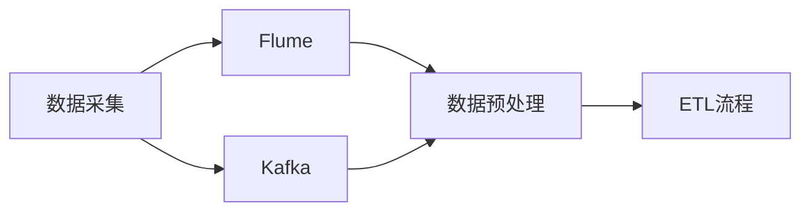

# 第7章-大数据采集与数据预处理

> [!abstract] 本章定位
> 本章介绍大数据采集工具和数据预处理流程，是大数据分析的基础步骤。

## 学习主线

## 章节内容

- [[7.1-大数据采集工具Flume.md]]：Flume架构、Source、Channel、Sink
- [[7.2-消息队列Kafka.md]]：Kafka架构、Producer、Consumer、Topic
- [[7.3-数据预处理与ETL流程.md]]：数据清洗、数据转换、数据加载

## 考点汇总

> [!important] 核心考点
> 1. Flume的架构：Source、Channel、Sink
> 2. Flume的配置和使用
> 3. Kafka的架构：Producer、Consumer、Topic、Broker
> 4. Kafka的配置和使用
> 5. ETL流程：数据抽取、转换、加载
> 6. 数据预处理技术：数据清洗、数据转换、数据集成

## 前后章节依赖

| 方向 | 章节 | 依赖关系 |
|-----|------|---------|
| 先修 | 第6章 | HBase是数据采集的目标存储 |
| 后续 | 第8章 | 数据预处理是数据挖掘的基础 |

## 复习自测

> [!question] 自测题
> 1. Flume的架构是什么？Source、Channel、Sink分别做什么？
> 2. Flume如何配置和使用？
> 3. Kafka的架构是什么？Producer、Consumer、Topic分别做什么？
> 4. Kafka如何配置和使用？
> 5. ETL流程是什么？包含哪些步骤？
> 6. 数据预处理有哪些技术？