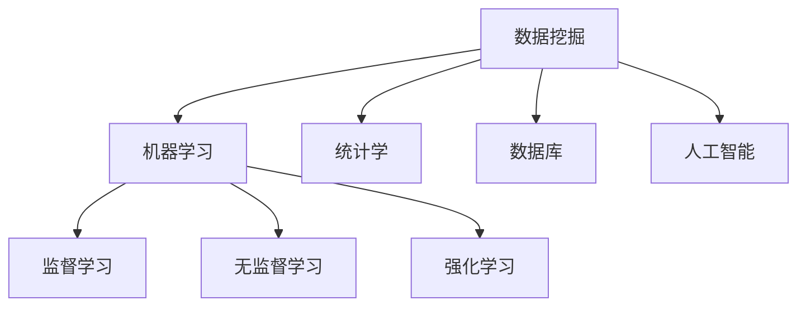
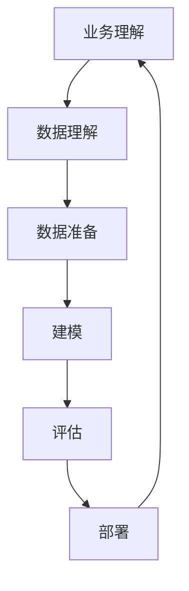
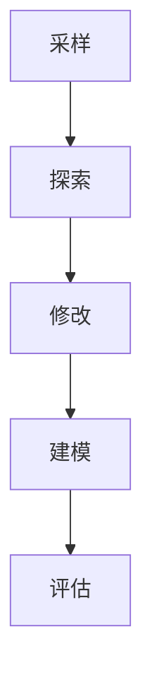

# 8.1 数据挖掘概述

> [!abstract] 核心问题
> 数据挖掘是什么？包含哪些步骤？

## 一、数据挖掘定义

### 1. 定义

**定义**：数据挖掘是指从大量数据中发现模式、知识和规律的过程。

**目标**：

| 目标 | 说明 |
|-----|------|
| **发现模式** | 发现数据中的模式 |
| **发现知识** | 发现数据中的知识 |
| **发现规律** | 发现数据中的规律 |
| **预测未来** | 预测未来趋势 |

**数据挖掘的特点**：

| 特点 | 说明 |
|-----|------|
| **自动化** | 自动发现模式 |
| **可扩展性** | 处理海量数据 |
| **多维度** | 从多个角度分析 |
| **实用性** | 发现有用的知识 |

### 2. 数据挖掘与相关技术的关系

**关系图**：



**对比表**：

| 技术 | 说明 |
|-----|------|
| **机器学习** | 让机器从数据中学习 |
| **统计学** | 用统计方法分析数据 |
| **数据库** | 存储和管理数据 |
| **人工智能** | 模拟人类智能 |

## 二、数据挖掘流程

### 1. CRISP-DM流程

**流程**：



**步骤说明**：

| 步骤 | 说明 |
|-----|------|
| **业务理解** | 理解业务需求 |
| **数据理解** | 理解数据 |
| **数据准备** | 准备数据 |
| **建模** | 构建模型 |
| **评估** | 评估模型 |
| **部署** | 部署模型 |

### 2. SEMMA流程

**流程**：



**步骤说明**：

| 步骤 | 说明 |
|-----|------|
| **采样** | 采样数据 |
| **探索** | 探索数据 |
| **修改** | 修改数据 |
| **建模** | 构建模型 |
| **评估** | 评估模型 |

### 3. 数据挖掘步骤详解

**步骤1：业务理解**

```
理解业务目标
确定数据挖掘目标
评估资源和约束
制定项目计划
```

**步骤2：数据理解**

```
收集数据
描述数据
探索数据
验证数据质量
```

**步骤3：数据准备**

```
选择数据
清洗数据
构建数据
转换数据
```

**步骤4：建模**

```
选择建模技术
生成测试设计
构建模型
评估模型
```

**步骤5：评估**

```
评估模型质量
检查业务目标
确定下一步行动
```

**步骤6：部署**

```
制定部署计划
监控和维护
评估效果
```

## 三、数据挖掘任务类型

### 1. 分类

**定义**：分类是指将数据分为不同类别的过程。

**特点**：

| 特点 | 说明 |
|-----|------|
| **监督学习** | 需要标注数据 |
| **预测类别** | 预测数据所属类别 |
| **训练模型** | 使用训练数据训练模型 |

**应用场景**：

| 场景 | 说明 |
|-----|------|
| **垃圾邮件分类** | 分类垃圾邮件 |
| **信用评估** | 评估信用风险 |
| **疾病诊断** | 诊断疾病 |

### 2. 聚类

**定义**：聚类是指将数据分为不同簇的过程，不需要标注数据。

**特点**：

| 特点 | 说明 |
|-----|------|
| **无监督学习** | 不需要标注数据 |
| **发现模式** | 发现数据中的模式 |
| **相似性度量** | 根据相似性分组 |

**应用场景**：

| 场景 | 说明 |
|-----|------|
| **客户细分** | 细分客户群体 |
| **图像分割** | 分割图像 |
| **异常检测** | 检测异常数据 |

### 3. 关联规则

**定义**：关联规则是指发现数据中项之间的关联关系。

**特点**：

| 特点 | 说明 |
|-----|------|
| **无监督学习** | 不需要标注数据 |
| **发现关联** | 发现项之间的关联 |
| **支持度和置信度** | 使用支持度和置信度衡量 |

**应用场景**：

| 场景 | 说明 |
|-----|------|
| **购物篮分析** | 分析购买行为 |
| **推荐系统** | 推荐商品 |
| **市场分析** | 分析市场趋势 |

### 4. 回归

**定义**：回归是指预测连续值的过程。

**特点**：

| 特点 | 说明 |
|-----|------|
| **监督学习** | 需要标注数据 |
| **预测连续值** | 预测连续值 |
| **拟合函数** | 拟合函数关系 |

**应用场景**：

| 场景 | 说明 |
|-----|------|
| **房价预测** | 预测房价 |
| **销售额预测** | 预测销售额 |
| **股票预测** | 预测股票价格 |

### 5. 异常检测

**定义**：异常检测是指发现数据中的异常值。

**特点**：

| 特点 | 说明 |
|-----|------|
| **无监督学习** | 不需要标注数据 |
| **发现异常** | 发现异常数据 |
| **偏离正常** | 偏离正常模式 |

**应用场景**：

| 场景 | 说明 |
|-----|------|
| **欺诈检测** | 检测欺诈行为 |
| **网络入侵检测** | 检测网络入侵 |
| **设备故障检测** | 检测设备故障 |

### 6. 任务类型对比

**对比表**：

| 任务类型 | 学习方式 | 目标 | 应用场景 |
|---------|---------|------|---------|
| **分类** | 监督学习 | 预测类别 | 垃圾邮件分类 |
| **聚类** | 无监督学习 | 发现模式 | 客户细分 |
| **关联规则** | 无监督学习 | 发现关联 | 购物篮分析 |
| **回归** | 监督学习 | 预测连续值 | 房价预测 |
| **异常检测** | 无监督学习 | 发现异常 | 欺诈检测 |

## 四、数据挖掘评估指标

### 1. 分类评估指标

**混淆矩阵**：

```
              预测正例   预测负例
真实正例      TP(真阳)  FN(假阴)
真实负例      FP(假阳)  TN(真阴)
```

**指标**：

| 指标 | 公式 | 说明 |
|-----|------|------|
| **准确率** | (TP+TN)/(TP+TN+FP+FN) | 正确预测的比例 |
| **精确率** | TP/(TP+FP) | 预测正例中真正例的比例 |
| **召回率** | TP/(TP+FN) | 真实正例中被预测为正例的比例 |
| **F1分数** | 2*精确率*召回率/(精确率+召回率) | 精确率和召回率的调和平均 |

### 2. 聚类评估指标

**指标**：

| 指标 | 说明 |
|-----|------|
| **轮廓系数** | 衡量聚类质量 |
| **DB指数** | 衡量聚类质量 |
| **CH指数** | 衡量聚类质量 |

### 3. 回归评估指标

**指标**：

| 指标 | 公式 | 说明 |
|-----|------|------|
| **MAE** | 平均绝对误差 | 平均绝对误差 |
| **MSE** | 均方误差 | 均方误差 |
| **RMSE** | 均方根误差 | 均方根误差 |
| **R²** | 决定系数 | 模型解释方差的比例 |

## 五、数据挖掘工具

### 1. 开源工具

**工具**：

| 工具 | 说明 |
|-----|------|
| **Spark MLlib** | Spark机器学习库 |
| **Scikit-learn** | Python机器学习库 |
| **TensorFlow** | Google机器学习框架 |
| **PyTorch** | Facebook机器学习框架 |

### 2. 商业工具

**工具**：

| 工具 | 说明 |
|-----|------|
| **IBM SPSS Modeler** | IBM数据挖掘工具 |
| **SAS Enterprise Miner** | SAS数据挖掘工具 |
| **Oracle Data Mining** | Oracle数据挖掘工具 |
| **Microsoft Azure ML** | Microsoft机器学习平台 |

> [!warning] 易错点
> 数据挖掘流程包含六个步骤：业务理解、数据理解、数据准备、建模、评估和部署！不要遗漏任何一个步骤。

---

**导航**：[[MOC - 第8章.md|返回章节导航]] · 下一节 [[8.2-常用数据挖掘算法.md]]