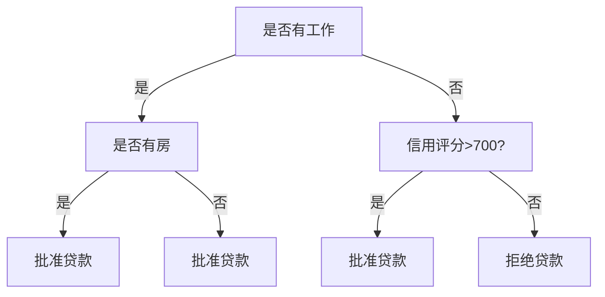
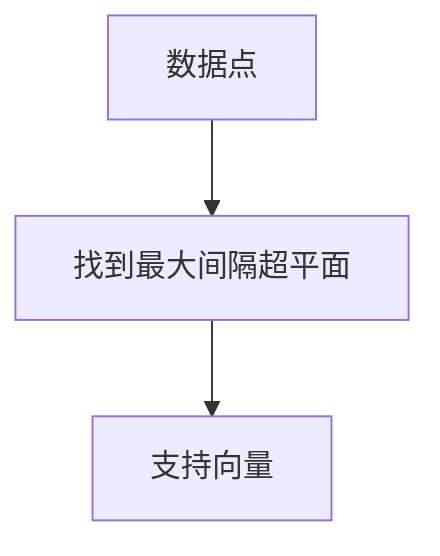
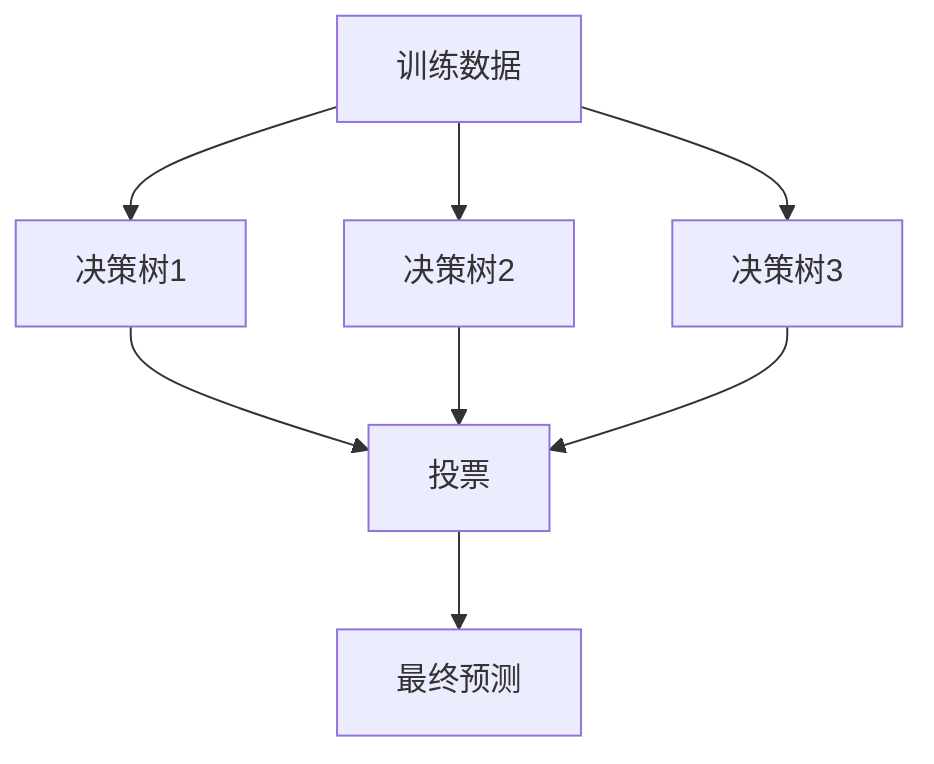
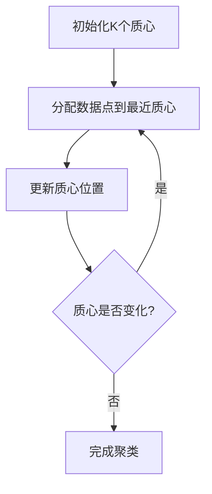
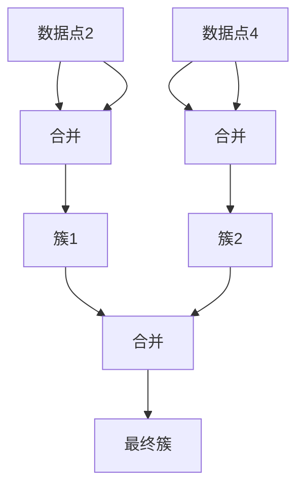
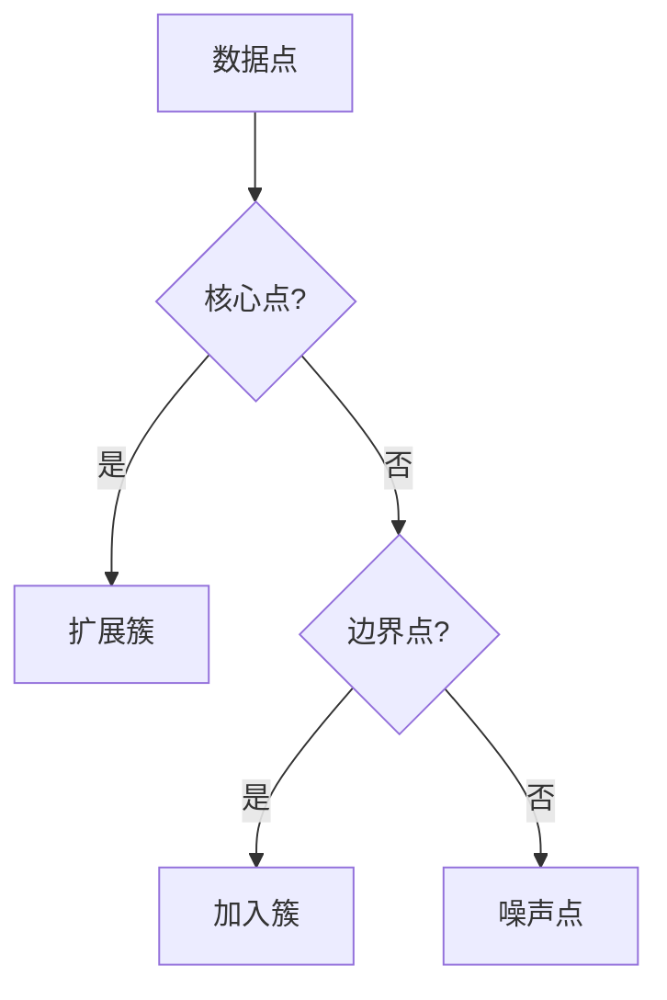
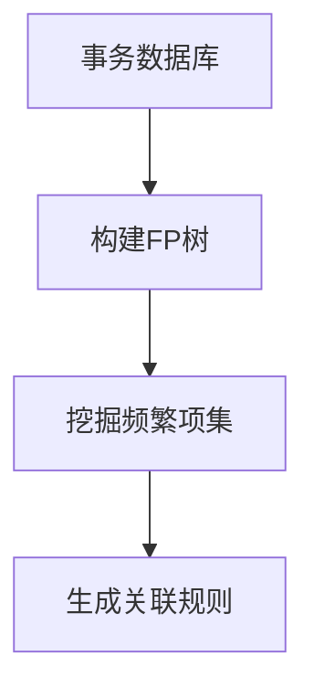

# 8.2 常用数据挖掘算法

> [!abstract] 核心问题
> 分类算法、聚类算法和关联规则有哪些？各有什么特点？

## 一、分类算法

### 1. 决策树

**定义**：决策树是一种基于树结构的分类算法。

**原理**：



**特点**：

| 特点 | 说明 |
|-----|------|
| **直观** | 易于理解和解释 |
| **高效** | 训练和预测效率高 |
| **可处理多种数据** | 可处理分类和数值数据 |
| **可能过拟合** | 可能过拟合 |

**算法**：

| 算法 | 说明 |
|-----|------|
| **ID3** | 基于信息增益 |
| **C4.5** | 基于信息增益比 |
| **CART** | 基于基尼系数 |

**信息增益**：

```
信息增益 = 熵(父节点) - 加权平均熵(子节点)

熵 = -Σ p(x) * log2(p(x))
```

**示例**：

```python
from sklearn.tree import DecisionTreeClassifier

# 创建决策树分类器
clf = DecisionTreeClassifier(criterion='gini')

# 训练模型
clf.fit(X_train, y_train)

# 预测
y_pred = clf.predict(X_test)
```

### 2. 朴素贝叶斯

**定义**：朴素贝叶斯是一种基于贝叶斯定理的分类算法，假设特征之间相互独立。

**原理**：

```
P(类别|特征) = P(特征|类别) * P(类别) / P(特征)

由于特征独立假设：
P(特征|类别) = Π P(特征i|类别)
```

**特点**：

| 特点 | 说明 |
|-----|------|
| **简单** | 算法简单 |
| **高效** | 训练和预测效率高 |
| **假设独立** | 假设特征之间相互独立 |
| **适合高维数据** | 适合高维数据 |

**类型**：

| 类型 | 说明 |
|-----|------|
| **高斯朴素贝叶斯** | 适合连续数据 |
| **多项式朴素贝叶斯** | 适合离散数据 |
| **伯努利朴素贝叶斯** | 适合二元数据 |

**示例**：

```python
from sklearn.naive_bayes import GaussianNB

# 创建朴素贝叶斯分类器
clf = GaussianNB()

# 训练模型
clf.fit(X_train, y_train)

# 预测
y_pred = clf.predict(X_test)
```

### 3. 支持向量机

**定义**：支持向量机是一种基于最大间隔的分类算法。

**原理**：



**特点**：

| 特点 | 说明 |
|-----|------|
| **最大间隔** | 找到最大间隔超平面 |
| **核函数** | 支持核函数 |
| **适合高维数据** | 适合高维数据 |
| **训练速度慢** | 训练速度较慢 |

**核函数**：

| 核函数 | 说明 |
|-------|------|
| **线性核** | 线性分类 |
| **多项式核** | 多项式分类 |
| **径向基核** | 非线性分类 |

**示例**：

```python
from sklearn.svm import SVC

# 创建支持向量机分类器
clf = SVC(kernel='rbf')

# 训练模型
clf.fit(X_train, y_train)

# 预测
y_pred = clf.predict(X_test)
```

### 4. 随机森林

**定义**：随机森林是一种基于决策树集成的分类算法。

**原理**：



**特点**：

| 特点 | 说明 |
|-----|------|
| **集成学习** | 集成多个决策树 |
| **随机性** | 随机选择特征和样本 |
| **抗过拟合** | 抗过拟合能力强 |
| **可并行** | 训练可并行 |

**参数**：

| 参数 | 说明 | 默认值 |
|-----|------|-------|
| **n_estimators** | 树的数量 | 100 |
| **max_depth** | 树的最大深度 | None |
| **min_samples_split** | 最小分割样本数 | 2 |

**示例**：

```python
from sklearn.ensemble import RandomForestClassifier

# 创建随机森林分类器
clf = RandomForestClassifier(n_estimators=100)

# 训练模型
clf.fit(X_train, y_train)

# 预测
y_pred = clf.predict(X_test)
```

### 5. 分类算法对比

**对比表**：

| 算法 | 优点 | 缺点 | 适用场景 |
|-----|------|------|---------|
| **决策树** | 直观、高效 | 可能过拟合 | 分类问题 |
| **朴素贝叶斯** | 简单、高效 | 假设独立 | 文本分类 |
| **支持向量机** | 最大间隔、适合高维 | 训练慢 | 分类问题 |
| **随机森林** | 抗过拟合、可并行 | 解释性差 | 分类问题 |

## 二、聚类算法

### 1. K-Means

**定义**：K-Means是一种基于距离的聚类算法。

**原理**：



**步骤**：

| 步骤 | 说明 |
|-----|------|
| **初始化** | 初始化K个质心 |
| **分配** | 将数据点分配到最近的质心 |
| **更新** | 更新质心位置 |
| **重复** | 重复步骤2和3 |

**距离度量**：

| 度量 | 公式 |
|-----|------|
| **欧氏距离** | sqrt(Σ(xi-yi)²) |
| **曼哈顿距离** | Σ|xi-yi| |
| **余弦相似度** | cos(θ) |

**特点**：

| 特点 | 说明 |
|-----|------|
| **简单** | 算法简单 |
| **高效** | 训练效率高 |
| **需要指定K** | 需要预先指定K |
| **对初始质心敏感** | 对初始质心敏感 |

**示例**：

```python
from sklearn.cluster import KMeans

# 创建K-Means聚类器
kmeans = KMeans(n_clusters=3)

# 训练模型
kmeans.fit(X)

# 获取聚类结果
labels = kmeans.labels_
```

### 2. 层次聚类

**定义**：层次聚类是一种基于层次的聚类算法。

**类型**：

| 类型 | 说明 |
|-----|------|
| **凝聚式** | 从单个数据点开始，逐步合并 |
| **分裂式** | 从所有数据点开始，逐步分裂 |

**原理**：



**距离度量**：

| 度量 | 说明 |
|-----|------|
| **单链接** | 两个簇中最近点的距离 |
| **完全链接** | 两个簇中最远点的距离 |
| **平均链接** | 两个簇中所有点的平均距离 |

**特点**：

| 特点 | 说明 |
|-----|------|
| **层次结构** | 生成层次结构 |
| **不需要指定K** | 不需要预先指定K |
| **计算复杂度高** | 计算复杂度高 |

**示例**：

```python
from sklearn.cluster import AgglomerativeClustering

# 创建层次聚类器
clustering = AgglomerativeClustering(n_clusters=3, linkage='ward')

# 训练模型
labels = clustering.fit_predict(X)
```

### 3. DBSCAN

**定义**：DBSCAN是一种基于密度的聚类算法。

**原理**：



**参数**：

| 参数 | 说明 |
|-----|------|
| **ε** | 邻域半径 |
| **MinPts** | 邻域内最小点数 |

**点的类型**：

| 类型 | 说明 |
|-----|------|
| **核心点** | 邻域内有足够多的点 |
| **边界点** | 邻域内点不足但在核心点邻域内 |
| **噪声点** | 既不是核心点也不是边界点 |

**特点**：

| 特点 | 说明 |
|-----|------|
| **密度聚类** | 基于密度聚类 |
| **不需要指定K** | 不需要预先指定K |
| **发现任意形状的簇** | 可以发现任意形状的簇 |
| **对参数敏感** | 对ε和MinPts敏感 |

**示例**：

```python
from sklearn.cluster import DBSCAN

# 创建DBSCAN聚类器
dbscan = DBSCAN(eps=0.5, min_samples=5)

# 训练模型
labels = dbscan.fit_predict(X)
```

### 4. 聚类算法对比

**对比表**：

| 算法 | 优点 | 缺点 | 适用场景 |
|-----|------|------|---------|
| **K-Means** | 简单、高效 | 需要指定K | 球形簇 |
| **层次聚类** | 层次结构、不需要K | 计算复杂 | 层次数据 |
| **DBSCAN** | 密度聚类、任意形状 | 对参数敏感 | 密度数据 |

## 三、关联规则

### 1. Apriori算法

**定义**：Apriori算法是一种基于频繁项集的关联规则挖掘算法。

**原理**：

```
频繁项集：支持度 >= 最小支持度
关联规则：置信度 >= 最小置信度

支持度 = P(A ∪ B) = 包含A和B的事务数 / 总事务数
置信度 = P(B|A) = 包含A和B的事务数 / 包含A的事务数
```

**步骤**：

| 步骤 | 说明 |
|-----|------|
| **生成候选集** | 生成1-项集候选集 |
| **筛选频繁项集** | 筛选出频繁项集 |
| **生成关联规则** | 从频繁项集生成关联规则 |
| **筛选规则** | 筛选出满足置信度的规则 |

**示例**：

```python
from mlxtend.frequent_patterns import apriori
from mlxtend.frequent_patterns import association_rules

# 生成频繁项集
frequent_itemsets = apriori(df, min_support=0.1, use_colnames=True)

# 生成关联规则
rules = association_rules(frequent_itemsets, metric='confidence', min_threshold=0.5)
```

### 2. FP-Growth算法

**定义**：FP-Growth算法是一种基于FP树的关联规则挖掘算法。

**原理**：



**步骤**：

| 步骤 | 说明 |
|-----|------|
| **构建FP树** | 构建FP树 |
| **挖掘条件模式基** | 挖掘条件模式基 |
| **构建条件FP树** | 构建条件FP树 |
| **挖掘频繁项集** | 递归挖掘频繁项集 |

**特点**：

| 特点 | 说明 |
|-----|------|
| **高效** | 比Apriori高效 |
| **一次扫描** | 只需要一次扫描数据库 |
| **内存消耗** | 可能消耗大量内存 |

**示例**：

```python
from mlxtend.frequent_patterns import fpgrowth

# 生成频繁项集
frequent_itemsets = fpgrowth(df, min_support=0.1, use_colnames=True)

# 生成关联规则
rules = association_rules(frequent_itemsets, metric='confidence', min_threshold=0.5)
```

### 3. 关联规则评估

**指标**：

| 指标 | 公式 | 说明 |
|-----|------|------|
| **支持度** | P(A ∪ B) | 规则出现的频率 |
| **置信度** | P(B\|A) | 规则的可信度 |
| **提升度** | P(B\|A) / P(B) | 规则的提升效果 |

**示例**：

```
购物篮分析：
事务1：牛奶、面包、鸡蛋
事务2：牛奶、面包、可乐
事务3：面包、鸡蛋、可乐
事务4：牛奶、鸡蛋、可乐

频繁项集：{牛奶, 面包}支持度=2/4=0.5
关联规则：牛奶 -> 面包，置信度=2/3=0.67，提升度=0.67/(3/4)=0.89
```

> [!warning] 易错点
> 分类算法是监督学习，聚类算法是无监督学习！不要混淆两者的区别。

---

**导航**：上一节 [[8.1-数据挖掘概述.md]] · [[MOC - 第8章.md|返回章节导航]] · 下一节 [[8.3-大数据分析实战.md]]