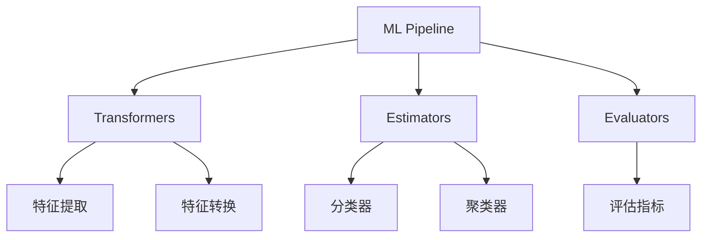

# 8.3 大数据分析实战

> [!abstract] 核心问题
> 如何使用Spark MLlib进行数据挖掘？有哪些实战案例？

## 一、Spark MLlib概述

### 1. MLlib定义

**定义**：MLlib是Spark的机器学习库，提供了分布式机器学习算法。

**功能**：

| 功能 | 说明 |
|-----|------|
| **分类算法** | 决策树、随机森林、朴素贝叶斯 |
| **聚类算法** | K-Means、层次聚类 |
| **回归算法** | 线性回归、逻辑回归 |
| **协同过滤** | 推荐系统 |
| **特征工程** | 特征提取、特征转换 |

**特点**：

| 特点 | 说明 |
|-----|------|
| **分布式** | 分布式计算 |
| **高效** | 基于Spark的高效计算 |
| **易用** | API简洁易用 |
| **集成** | 与Spark生态系统集成 |

### 2. MLlib组件

**组件**：

| 组件 | 说明 |
|-----|------|
| **MLlib** | 原始API（RDD-based） |
| **ML** | 高级API（DataFrame-based） |
| **Spark SQL** | 数据处理 |
| **Spark Streaming** | 流式处理 |

**ML库架构**：



## 二、Spark MLlib实战

### 1. 环境配置

**配置Spark环境**：

```python
from pyspark.sql import SparkSession

# 创建SparkSession
spark = SparkSession.builder \
    .appName("MLlib Demo") \
    .getOrCreate()

# 查看Spark配置
print(spark.sparkContext.getConf().getAll())
```

### 2. 数据加载与预处理

**加载数据**：

```python
# 加载CSV数据
df = spark.read.csv("data/train.csv", header=True, inferSchema=True)

# 查看数据结构
df.printSchema()

# 查看数据摘要
df.describe().show()

# 查看前5行数据
df.show(5)
```

**数据预处理**：

```python
# 处理缺失值
df_clean = df.na.fill(0)

# 删除重复值
df_dedup = df_clean.dropDuplicates()

# 类型转换
df_cast = df_dedup.withColumn("age", df_dedup["age"].cast("int"))

# 特征选择
df_selected = df_cast.select("age", "income", "label")
```

### 3. 特征工程

**特征提取**：

```python
from pyspark.ml.feature import VectorAssembler

# 创建特征向量
assembler = VectorAssembler(
    inputCols=["age", "income"],
    outputCol="features"
)

df_features = assembler.transform(df_selected)
df_features.show(5)
```

**特征转换**：

```python
from pyspark.ml.feature import StandardScaler

# 标准化特征
scaler = StandardScaler(
    inputCol="features",
    outputCol="scaled_features",
    withStd=True,
    withMean=False
)

scaler_model = scaler.fit(df_features)
df_scaled = scaler_model.transform(df_features)
df_scaled.show(5)
```

**标签编码**：

```python
from pyspark.ml.feature import StringIndexer

# 编码标签
indexer = StringIndexer(
    inputCol="label",
    outputCol="indexed_label"
)

indexer_model = indexer.fit(df_scaled)
df_indexed = indexer_model.transform(df_scaled)
df_indexed.show(5)
```

### 4. 模型训练

**训练集和测试集划分**：

```python
# 划分训练集和测试集
train_df, test_df = df_indexed.randomSplit([0.8, 0.2], seed=42)

# 查看数据集大小
print(f"训练集大小: {train_df.count()}")
print(f"测试集大小: {test_df.count()}")
```

**训练分类模型**：

```python
from pyspark.ml.classification import RandomForestClassifier

# 创建随机森林分类器
rf = RandomForestClassifier(
    featuresCol="scaled_features",
    labelCol="indexed_label",
    numTrees=100,
    maxDepth=5
)

# 训练模型
rf_model = rf.fit(train_df)

# 查看模型摘要
print(rf_model.featureImportances)
```

**训练回归模型**：

```python
from pyspark.ml.regression import LinearRegression

# 创建线性回归模型
lr = LinearRegression(
    featuresCol="scaled_features",
    labelCol="income"
)

# 训练模型
lr_model = lr.fit(train_df)

# 查看模型参数
print(f"系数: {lr_model.coefficients}")
print(f"截距: {lr_model.intercept}")
```

### 5. 模型评估

**分类模型评估**：

```python
from pyspark.ml.evaluation import MulticlassClassificationEvaluator

# 预测
predictions = rf_model.transform(test_df)

# 评估模型
evaluator = MulticlassClassificationEvaluator(
    labelCol="indexed_label",
    predictionCol="prediction",
    metricName="accuracy"
)

accuracy = evaluator.evaluate(predictions)
print(f"准确率: {accuracy}")
```

**回归模型评估**：

```python
from pyspark.ml.evaluation import RegressionEvaluator

# 预测
predictions = lr_model.transform(test_df)

# 评估模型
evaluator = RegressionEvaluator(
    labelCol="income",
    predictionCol="prediction",
    metricName="rmse"
)

rmse = evaluator.evaluate(predictions)
print(f"RMSE: {rmse}")
```

### 6. 模型保存与加载

**保存模型**：

```python
# 保存模型
rf_model.save("models/random_forest_model")

# 保存管道
pipeline_model.save("models/pipeline_model")
```

**加载模型**：

```python
from pyspark.ml.classification import RandomForestClassificationModel

# 加载模型
loaded_model = RandomForestClassificationModel.load("models/random_forest_model")

# 使用模型预测
predictions = loaded_model.transform(test_df)
```

## 三、实战案例

### 1. 用户行为分析

**场景**：分析用户行为数据，了解用户偏好。

**步骤**：

| 步骤 | 说明 |
|-----|------|
| **数据采集** | 采集用户行为数据 |
| **数据清洗** | 清洗数据 |
| **特征提取** | 提取用户行为特征 |
| **用户分群** | 使用聚类算法分群 |
| **结果分析** | 分析用户群体特征 |

**代码示例**：

```python
# 用户行为数据
user_behavior_df = spark.read.csv("data/user_behavior.csv", header=True, inferSchema=True)

# 特征提取
assembler = VectorAssembler(
    inputCols=["click_count", "purchase_count", "page_view"],
    outputCol="features"
)

df_features = assembler.transform(user_behavior_df)

# K-Means聚类
from pyspark.ml.clustering import KMeans

kmeans = KMeans(k=3, seed=42)
model = kmeans.fit(df_features)

# 获取聚类结果
predictions = model.transform(df_features)
predictions.groupBy("prediction").count().show()
```

### 2. 销售预测

**场景**：预测未来销售额。

**步骤**：

| 步骤 | 说明 |
|-----|------|
| **数据采集** | 采集历史销售数据 |
| **特征工程** | 构建时间特征 |
| **模型训练** | 训练回归模型 |
| **模型评估** | 评估模型 |
| **销售预测** | 预测未来销售额 |

**代码示例**：

```python
# 销售数据
sales_df = spark.read.csv("data/sales.csv", header=True, inferSchema=True)

# 特征工程
from pyspark.sql.functions import month, year, dayofmonth

df_features = sales_df.withColumn("month", month("date")) \
    .withColumn("year", year("date")) \
    .withColumn("day", dayofmonth("date"))

# 特征向量
assembler = VectorAssembler(
    inputCols=["month", "year", "day", "promotion"],
    outputCol="features"
)

df_vector = assembler.transform(df_features)

# 线性回归
from pyspark.ml.regression import LinearRegression

lr = LinearRegression(featuresCol="features", labelCol="sales")
model = lr.fit(df_vector)

# 预测
predictions = model.transform(df_vector)
predictions.select("date", "sales", "prediction").show(5)
```

### 3. 推荐系统

**场景**：基于协同过滤推荐商品。

**步骤**：

| 步骤 | 说明 |
|-----|------|
| **数据采集** | 采集用户评分数据 |
| **模型训练** | 训练协同过滤模型 |
| **生成推荐** | 生成推荐结果 |
| **评估推荐** | 评估推荐效果 |

**代码示例**：

```python
# 用户评分数据
ratings_df = spark.read.csv("data/ratings.csv", header=True, inferSchema=True)

# 转换为Rating格式
from pyspark.ml.recommendation import ALS, ALSModel

# 创建ALS模型
als = ALS(
    maxIter=5,
    regParam=0.01,
    userCol="user_id",
    itemCol="item_id",
    ratingCol="rating"
)

# 训练模型
model = als.fit(ratings_df)

# 为用户推荐商品
user_recs = model.recommendForAllUsers(10)
user_recs.show(5)

# 为商品推荐用户
item_recs = model.recommendForAllItems(10)
item_recs.show(5)
```

### 4. 异常检测

**场景**：检测欺诈交易。

**步骤**：

| 步骤 | 说明 |
|-----|------|
| **数据采集** | 采集交易数据 |
| **特征提取** | 提取交易特征 |
| **模型训练** | 训练异常检测模型 |
| **异常检测** | 检测异常交易 |

**代码示例**：

```python
# 交易数据
transactions_df = spark.read.csv("data/transactions.csv", header=True, inferSchema=True)

# 特征提取
assembler = VectorAssembler(
    inputCols=["amount", "frequency", "location"],
    outputCol="features"
)

df_features = assembler.transform(transactions_df)

# 使用Isolation Forest检测异常
from pyspark.ml.feature import IsolationForest

iso_forest = IsolationForest(
    numTrees=100,
    maxDepth=10,
    featuresCol="features",
    predictionCol="prediction",
    contamination=0.05
)

model = iso_forest.fit(df_features)
predictions = model.transform(df_features)

# 查看异常检测结果
predictions.groupBy("prediction").count().show()
```

## 四、大数据分析最佳实践

### 1. 数据质量保证

**措施**：

| 措施 | 说明 |
|-----|------|
| **数据校验** | 校验数据质量 |
| **数据监控** | 监控数据质量 |
| **数据审计** | 审计数据变更 |

### 2. 性能优化

**策略**：

| 策略 | 说明 |
|-----|------|
| **数据分区** | 分区处理数据 |
| **缓存数据** | 缓存中间结果 |
| **并行处理** | 并行处理数据 |

### 3. 模型选择

**建议**：

| 任务类型 | 推荐算法 |
|---------|---------|
| **分类** | 随机森林、梯度提升树 |
| **回归** | 线性回归、梯度提升树 |
| **聚类** | K-Means、DBSCAN |
| **推荐** | ALS协同过滤 |

### 4. 模型评估

**指标**：

| 任务类型 | 评估指标 |
|---------|---------|
| **分类** | 准确率、F1分数 |
| **回归** | RMSE、R² |
| **聚类** | 轮廓系数 |

> [!warning] 易错点
> Spark MLlib有两个API：MLlib（RDD-based）和ML（DataFrame-based）！推荐使用ML API。

---

**导航**：上一节 [[8.2-常用数据挖掘算法.md]] · [[MOC - 第8章.md|返回章节导航]]