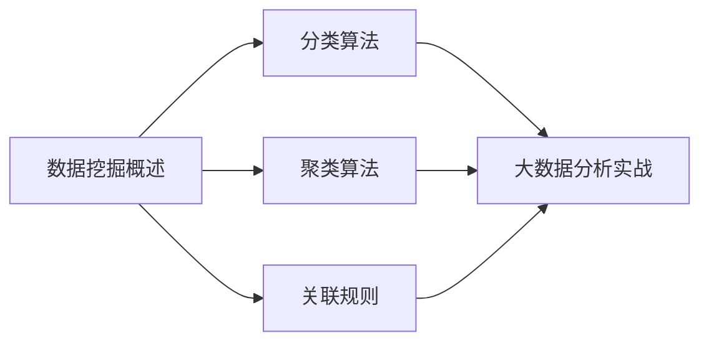

# 第8章-数据挖掘与大数据分析算法

> [!abstract] 本章定位
> 本章介绍数据挖掘的基本概念和常用算法，是大数据分析的核心内容。

## 学习主线

## 章节内容

- [[8.1-数据挖掘概述.md]]：数据挖掘定义、流程、任务类型
- [[8.2-常用数据挖掘算法.md]]：分类算法、聚类算法、关联规则
- [[8.3-大数据分析实战.md]]：Spark MLlib、实战案例

## 考点汇总

> [!important] 核心考点
> 1. 数据挖掘的定义和流程
> 2. 数据挖掘任务类型：分类、聚类、关联规则
> 3. 分类算法：决策树、朴素贝叶斯、支持向量机、随机森林
> 4. 聚类算法：K-Means、层次聚类、DBSCAN
> 5. 关联规则：Apriori算法、FP-Growth算法
> 6. Spark MLlib的使用
> 7. 大数据分析实战案例

## 前后章节依赖

| 方向 | 章节 | 依赖关系 |
|-----|------|---------|
| 先修 | 第7章 | 数据预处理是数据挖掘的基础 |
| 后续 | 第9章 | 数据挖掘结果需要数据治理 |

## 复习自测

> [!question] 自测题
> 1. 数据挖掘是什么？包含哪些步骤？
> 2. 数据挖掘有哪些任务类型？
> 3. 分类算法有哪些？各有什么特点？
> 4. 聚类算法有哪些？各有什么特点？
> 5. 关联规则是什么？Apriori算法的原理是什么？
> 6. 如何使用Spark MLlib进行数据挖掘？