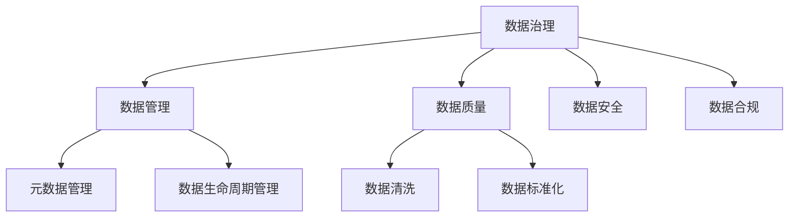
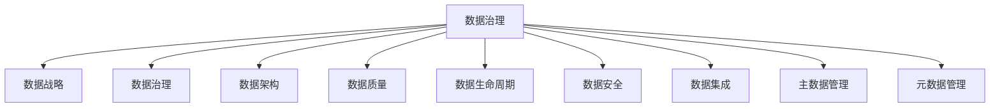
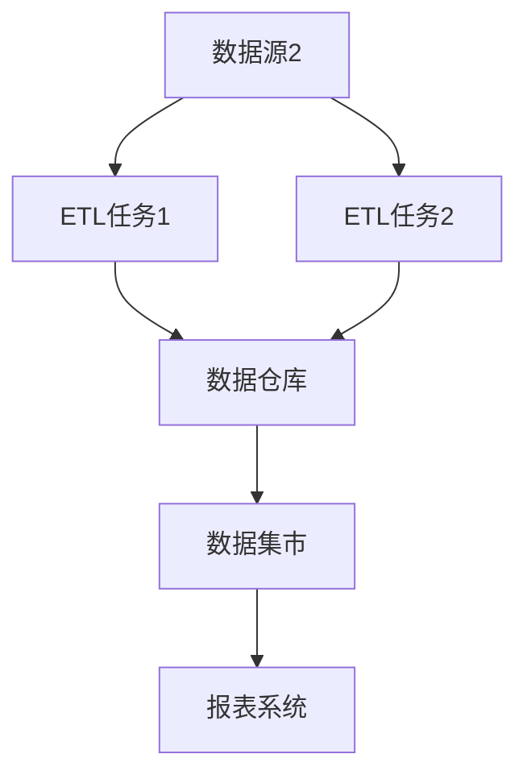
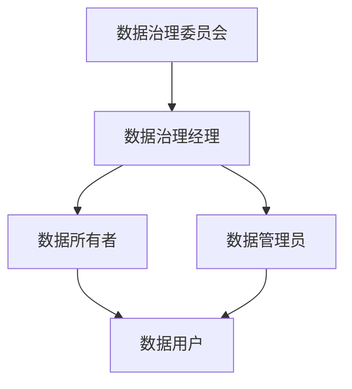

# 9.1 数据治理概述

> [!abstract] 核心问题
> 数据治理是什么？包含哪些框架？

## 一、数据治理定义

### 1. 定义

**定义**：数据治理是指对数据资产进行管理和控制的过程，确保数据的质量、安全性、合规性和可用性。

**目标**：

| 目标 | 说明 |
|-----|------|
| **数据质量** | 确保数据的准确性、完整性和一致性 |
| **数据安全** | 确保数据的安全性和保密性 |
| **数据合规** | 确保数据符合法律法规 |
| **数据可用** | 确保数据的可用性和可访问性 |

**数据治理的重要性**：

| 重要性 | 说明 |
|-------|------|
| **决策支持** | 提供高质量数据支持决策 |
| **风险控制** | 控制数据安全和合规风险 |
| **业务价值** | 最大化数据的业务价值 |
| **成本降低** | 降低数据管理成本 |

### 2. 数据治理与相关概念的关系

**关系图**：



**对比表**：

| 概念 | 说明 |
|-----|------|
| **数据管理** | 管理数据资产 |
| **数据质量** | 保证数据质量 |
| **数据安全** | 保证数据安全 |
| **数据合规** | 保证数据合规 |

## 二、数据治理框架

### 1. DAMA-DMBOK框架

**框架**：



**组成**：

| 组成 | 说明 |
|-----|------|
| **数据战略** | 制定数据战略 |
| **数据治理** | 建立数据治理组织和流程 |
| **数据架构** | 设计数据架构 |
| **数据质量** | 管理数据质量 |
| **数据生命周期** | 管理数据生命周期 |
| **数据安全** | 管理数据安全 |
| **数据集成** | 管理数据集成 |
| **主数据管理** | 管理主数据 |
| **元数据管理** | 管理元数据 |

### 2. CMMI数据管理成熟度模型

**成熟度等级**：

| 等级 | 说明 |
|-----|------|
| **Level 1** | 初始级：无统一管理 |
| **Level 2** | 管理级：基本管理流程 |
| **Level 3** | 定义级：标准化流程 |
| **Level 4** | 量化管理级：量化指标 |
| **Level 5** | 优化级：持续改进 |

### 3. ISO 38505标准

**标准内容**：

| 内容 | 说明 |
|-----|------|
| **治理框架** | 建立数据治理框架 |
| **治理原则** | 遵循数据治理原则 |
| **治理流程** | 建立数据治理流程 |
| **治理评估** | 评估数据治理效果 |

## 三、元数据管理

### 1. 元数据定义

**定义**：元数据是描述数据的数据，包括数据的结构、内容、来源、格式等信息。

**类型**：

| 类型 | 说明 |
|-----|------|
| **技术元数据** | 数据的技术属性 |
| **业务元数据** | 数据的业务含义 |
| **管理元数据** | 数据的管理信息 |

**技术元数据**：

| 元数据 | 说明 |
|-------|------|
| **表结构** | 表名、列名、数据类型 |
| **数据格式** | CSV、JSON、Parquet |
| **数据来源** | 数据源、采集时间 |
| **数据血缘** | 数据的流向和转换关系 |

**业务元数据**：

| 元数据 | 说明 |
|-------|------|
| **业务定义** | 数据的业务含义 |
| **业务规则** | 数据的业务规则 |
| **数据所有者** | 数据的所有者 |
| **数据分类** | 数据的分类 |

### 2. 元数据管理实践

**元数据管理工具**：

| 工具 | 说明 |
|-----|------|
| **Apache Atlas** | Hadoop生态元数据管理 |
| **Amundsen** | LinkedIn元数据管理 |
| **DataHub** | LinkedIn元数据管理 |
| **AWS Glue** | AWS元数据管理 |

**元数据管理流程**：

| 流程 | 说明 |
|-----|------|
| **元数据采集** | 采集元数据 |
| **元数据存储** | 存储元数据 |
| **元数据查询** | 查询元数据 |
| **元数据分析** | 分析元数据 |

**Apache Atlas**：

```properties
# Atlas配置
atlas.graph.storage.backend=cassandra
atlas.graph.storage.hostname=cassandra-host
atlas.graph.storage.port=9042
atlas.graph.storage.keyspace=atlas
```

### 3. 数据血缘

**定义**：数据血缘是指数据的流向和转换关系。

**重要性**：

| 重要性 | 说明 |
|-------|------|
| **数据溯源** | 追溯数据来源 |
| **影响分析** | 分析数据变更影响 |
| **合规审计** | 满足合规审计要求 |
| **问题定位** | 定位数据问题 |

**数据血缘图**：



## 四、数据质量管理

### 1. 数据质量定义

**定义**：数据质量是指数据满足使用要求的程度。

**维度**：

| 维度 | 说明 |
|-----|------|
| **准确性** | 数据的准确性 |
| **完整性** | 数据的完整性 |
| **一致性** | 数据的一致性 |
| **及时性** | 数据的及时性 |
| **唯一性** | 数据的唯一性 |
| **有效性** | 数据的有效性 |

### 2. 数据质量评估

**评估指标**：

| 指标 | 说明 |
|-----|------|
| **准确率** | 正确数据的比例 |
| **完整率** | 完整数据的比例 |
| **一致率** | 一致数据的比例 |
| **及时率** | 及时数据的比例 |

**评估方法**：

| 方法 | 说明 |
|-----|------|
| **规则检查** | 检查数据是否符合规则 |
| **统计分析** | 分析数据统计特征 |
| **用户反馈** | 收集用户反馈 |
| **对比分析** | 对比不同数据源 |

### 3. 数据质量改进

**改进流程**：

| 流程 | 说明 |
|-----|------|
| **问题识别** | 识别数据质量问题 |
| **根因分析** | 分析问题根因 |
| **制定方案** | 制定改进方案 |
| **实施改进** | 实施改进措施 |
| **监控评估** | 监控改进效果 |

## 五、数据治理组织

### 1. 组织架构

**角色**：

| 角色 | 职责 |
|-----|------|
| **数据治理委员会** | 制定数据治理策略 |
| **数据治理经理** | 管理数据治理工作 |
| **数据所有者** | 负责数据资产 |
| **数据管理员** | 管理数据日常工作 |
| **数据用户** | 使用数据 |

**组织架构图**：



### 2. 数据治理流程

**流程**：

| 流程 | 说明 |
|-----|------|
| **数据需求管理** | 管理数据需求 |
| **数据变更管理** | 管理数据变更 |
| **数据问题管理** | 管理数据问题 |
| **数据审计管理** | 管理数据审计 |

> [!warning] 易错点
> 数据治理和数据管理的区别！数据治理是战略性的，数据管理是操作性的。

---

**导航**：[[MOC - 第9章.md|返回章节导航]] · 下一节 [[9.2-数据安全.md]]