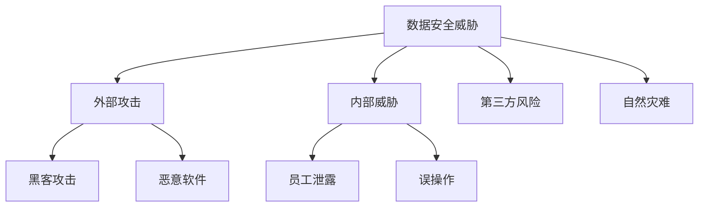

# 9.2 数据安全

> [!abstract] 核心问题
> 数据安全有哪些威胁？如何防护？

## 一、数据安全概述

### 1. 数据安全定义

**定义**：数据安全是指保护数据免受未授权访问、篡改、泄露和破坏的过程。

**目标**：

| 目标 | 说明 |
|-----|------|
| **机密性** | 保护数据不被未授权访问 |
| **完整性** | 保护数据不被篡改 |
| **可用性** | 确保数据可正常使用 |
| **不可否认性** | 确保操作不可否认 |

**数据安全的重要性**：

| 重要性 | 说明 |
|-------|------|
| **业务连续性** | 保障业务正常运行 |
| **合规要求** | 满足法律法规要求 |
| **客户信任** | 维护客户信任 |
| **竞争优势** | 保护竞争优势 |

### 2. 数据安全威胁

**威胁类型**：

| 类型 | 说明 |
|-----|------|
| **数据泄露** | 数据被未授权访问 |
| **数据篡改** | 数据被恶意修改 |
| **数据丢失** | 数据被意外或恶意删除 |
| **拒绝服务** | 数据服务被拒绝 |
| **身份伪造** | 身份被伪造 |

**威胁来源**：

| 来源 | 说明 |
|-----|------|
| **外部攻击** | 黑客攻击、恶意软件 |
| **内部威胁** | 员工泄露、误操作 |
| **第三方风险** | 供应商、合作伙伴 |
| **自然灾难** | 火灾、地震、洪水 |

**安全威胁图**：



## 二、数据安全防护策略

### 1. 加密

**定义**：加密是指将明文转换为密文的过程。

**类型**：

| 类型 | 说明 |
|-----|------|
| **对称加密** | 使用相同密钥加密和解密 |
| **非对称加密** | 使用公钥和私钥加密和解密 |
| **哈希函数** | 将数据转换为固定长度的哈希值 |

**对称加密算法**：

| 算法 | 说明 |
|-----|------|
| **AES** | 高级加密标准 |
| **DES** | 数据加密标准 |
| **3DES** | 三重数据加密标准 |

**非对称加密算法**：

| 算法 | 说明 |
|-----|------|
| **RSA** | 经典非对称加密算法 |
| **ECC** | 椭圆曲线加密算法 |

**哈希函数**：

| 函数 | 说明 |
|-----|------|
| **MD5** | 消息摘要算法5（已不安全） |
| **SHA-1** | 安全哈希算法1（已不安全） |
| **SHA-256** | 安全哈希算法256 |
| **SHA-512** | 安全哈希算法512 |

**加密示例**：

```python
from cryptography.fernet import Fernet

# 生成密钥
key = Fernet.generate_key()
cipher_suite = Fernet(key)

# 加密数据
data = b"Hello, World!"
encrypted_data = cipher_suite.encrypt(data)

# 解密数据
decrypted_data = cipher_suite.decrypt(encrypted_data)
```

### 2. 访问控制

**定义**：访问控制是指限制对数据和系统的访问权限。

**类型**：

| 类型 | 说明 |
|-----|------|
| **身份认证** | 验证用户身份 |
| **授权** | 授予用户权限 |
| **审计** | 记录用户操作 |

**身份认证方法**：

| 方法 | 说明 |
|-----|------|
| **密码认证** | 使用密码认证 |
| **多因素认证** | 使用多种认证因素 |
| **生物认证** | 使用生物特征认证 |

**授权模型**：

| 模型 | 说明 |
|-----|------|
| **RBAC** | 基于角色的访问控制 |
| **ABAC** | 基于属性的访问控制 |
| **DAC** | 自主访问控制 |
| **MAC** | 强制访问控制 |

**Hadoop访问控制**：

```xml
<!-- HDFS权限配置 -->
<property>
    <name>dfs.permissions.enabled</name>
    <value>true</value>
</property>

<!-- YARN权限配置 -->
<property>
    <name>yarn.acl.enable</name>
    <value>true</value>
</property>
```

### 3. 审计

**定义**：审计是指记录和审查用户操作的过程。

**审计内容**：

| 内容 | 说明 |
|-----|------|
| **访问日志** | 记录用户访问记录 |
| **操作日志** | 记录用户操作记录 |
| **变更日志** | 记录数据变更记录 |

**审计工具**：

| 工具 | 说明 |
|-----|------|
| **Hadoop Audit Log** | Hadoop审计日志 |
| **Apache Ranger** | 数据访问控制和审计 |
| **Apache Sentry** | Hive访问控制和审计 |

**Apache Ranger配置**：

```properties
# Ranger配置
ranger.admin.username=admin
ranger.admin.password=password
ranger.database.host=localhost
ranger.database.name=ranger
```

### 4. 备份与恢复

**定义**：备份与恢复是指定期备份数据并在需要时恢复数据的过程。

**备份类型**：

| 类型 | 说明 |
|-----|------|
| **全量备份** | 备份全部数据 |
| **增量备份** | 备份增量数据 |
| **差异备份** | 备份差异数据 |

**恢复策略**：

| 策略 | 说明 |
|-----|------|
| **RPO** | 恢复点目标 |
| **RTO** | 恢复时间目标 |

**HDFS备份**：

```bash
# 创建HDFS快照
hdfs dfsadmin -allowSnapshot /user/hadoop/data
hdfs dfs -createSnapshot /user/hadoop/data snapshot1

# 恢复快照
hdfs dfs -restoreSnapshot /user/hadoop/data snapshot1
```

### 5. 网络安全

**定义**：网络安全是指保护网络基础设施和通信安全。

**防护措施**：

| 措施 | 说明 |
|-----|------|
| **防火墙** | 过滤网络流量 |
| **入侵检测** | 检测入侵行为 |
| **VPN** | 虚拟专用网络 |
| **SSL/TLS** | 加密网络通信 |

**SSL/TLS配置**：

```xml
<!-- Hadoop SSL配置 -->
<property>
    <name>dfs.http.policy</name>
    <value>HTTPS_ONLY</value>
</property>
```

## 三、大数据安全实践

### 1. Hadoop安全

**Hadoop安全组件**：

| 组件 | 说明 |
|-----|------|
| **Kerberos** | 身份认证 |
| **HDFS ACL** | HDFS访问控制 |
| **YARN ACL** | YARN访问控制 |
| **Apache Ranger** | 统一访问控制 |
| **Apache Sentry** | Hive访问控制 |

**Kerberos配置**：

```properties
# Kerberos配置
hadoop.security.authentication=kerberos
hadoop.security.authorization=true
dfs.namenode.kerberos.principal=hdfs/_HOST@EXAMPLE.COM
dfs.datanode.kerberos.principal=hdfs/_HOST@EXAMPLE.COM
```

### 2. Spark安全

**Spark安全措施**：

| 措施 | 说明 |
|-----|------|
| **身份认证** | Kerberos认证 |
| **加密** | SSL加密 |
| **访问控制** | Spark ACL |
| **审计** | 审计日志 |

**Spark安全配置**：

```properties
# Spark安全配置
spark.authenticate=true
spark.network.crypto.enabled=true
spark.acls.enable=true
```

### 3. 数据脱敏

**定义**：数据脱敏是指对敏感数据进行处理，使其无法识别原始信息。

**脱敏方法**：

| 方法 | 说明 |
|-----|------|
| **掩码** | 替换部分字符 |
| **加密** | 加密敏感数据 |
| **泛化** | 替换为更通用的值 |
| **删除** | 删除敏感数据 |

**脱敏示例**：

```python
# 身份证号脱敏
def mask_id_card(id_card):
    if len(id_card) == 18:
        return id_card[:4] + "**********" + id_card[-4:]
    return id_card

# 手机号脱敏
def mask_phone(phone):
    if len(phone) == 11:
        return phone[:3] + "****" + phone[-4:]
    return phone
```

## 四、数据安全最佳实践

### 1. 安全策略

**策略**：

| 策略 | 说明 |
|-----|------|
| **最小权限原则** | 授予最小必要权限 |
| **数据分类分级** | 对数据进行分类分级 |
| **安全审计** | 定期安全审计 |
| **安全培训** | 开展安全培训 |

### 2. 安全评估

**评估方法**：

| 方法 | 说明 |
|-----|------|
| **渗透测试** | 模拟攻击测试 |
| **漏洞扫描** | 扫描安全漏洞 |
| **安全审计** | 审计安全配置 |

### 3. 应急响应

**响应流程**：

| 流程 | 说明 |
|-----|------|
| **发现** | 发现安全事件 |
| **评估** | 评估事件影响 |
| **响应** | 采取响应措施 |
| **恢复** | 恢复系统正常 |
| **总结** | 总结经验教训 |

> [!warning] 易错点
> 数据安全的三个目标：机密性、完整性和可用性！不要遗漏任何一个目标。

---

**导航**：上一节 [[9.1-数据治理概述.md]] · [[MOC - 第9章.md|返回章节导航]] · 下一节 [[9.3-大数据合规与隐私保护.md]]