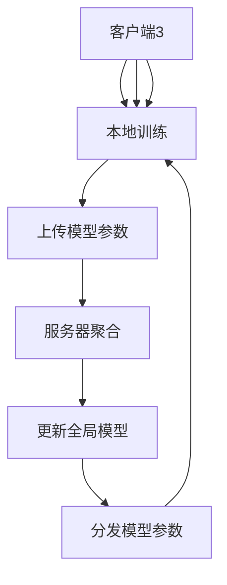

# 9.3 大数据合规与隐私保护

> [!abstract] 核心问题
> 数据合规法规有哪些？隐私保护技术有哪些？

## 一、数据合规概述

### 1. 数据合规定义

**定义**：数据合规是指确保数据处理活动符合法律法规和行业标准的要求。

**目标**：

| 目标 | 说明 |
|-----|------|
| **遵守法规** | 遵守数据相关法律法规 |
| **保护隐私** | 保护个人隐私 |
| **避免处罚** | 避免法律处罚 |
| **维护信任** | 维护用户信任 |

**数据合规的重要性**：

| 重要性 | 说明 |
|-------|------|
| **法律风险** | 避免法律风险 |
| **业务影响** | 避免业务影响 |
| **品牌声誉** | 维护品牌声誉 |
| **用户信任** | 维护用户信任 |

### 2. 全球数据合规法规

**国际法规**：

| 法规 | 发布机构 | 适用范围 |
|-----|---------|---------|
| **GDPR** | 欧盟 | 欧盟境内数据处理 |
| **CCPA** | 加州 | 加州居民数据 |
| **PDPA** | 新加坡 | 新加坡数据处理 |
| **PDPO** | 香港 | 香港数据处理 |

**国内法规**：

| 法规 | 发布机构 | 适用范围 |
|-----|---------|---------|
| **网络安全法** | 全国人大 | 网络安全 |
| **个人信息保护法** | 全国人大 | 个人信息保护 |
| **数据安全法** | 全国人大 | 数据安全 |
| **电子商务法** | 全国人大 | 电子商务 |

## 二、GDPR

### 1. GDPR概述

**定义**：GDPR（General Data Protection Regulation）是欧盟的通用数据保护条例。

**生效时间**：2018年5月25日

**适用范围**：

| 范围 | 说明 |
|-----|------|
| **欧盟境内** | 在欧盟境内处理数据 |
| **欧盟境外** | 向欧盟居民提供服务 |

**GDPR原则**：

| 原则 | 说明 |
|-----|------|
| **合法性、公平性和透明性** | 合法、公平、透明处理数据 |
| **目的限制** | 数据处理目的明确 |
| **数据最小化** | 只收集必要数据 |
| **准确性** | 数据准确、及时更新 |
| **存储限制** | 数据存储时间合理 |
| **完整性和保密性** | 保护数据安全 |

### 2. GDPR权利

**用户权利**：

| 权利 | 说明 |
|-----|------|
| **知情权** | 用户有权知道数据处理情况 |
| **访问权** | 用户有权访问个人数据 |
| **更正权** | 用户有权更正错误数据 |
| **删除权** | 用户有权删除个人数据 |
| **数据可携权** | 用户有权获取数据副本 |
| **拒绝权** | 用户有权拒绝数据处理 |

### 3. GDPR合规要求

**合规要求**：

| 要求 | 说明 |
|-----|------|
| **数据保护影响评估** | 评估数据处理影响 |
| **数据保护官** | 指定数据保护官 |
| **数据泄露通知** | 72小时内通知监管机构 |
| **合同条款** | 签订数据处理合同 |

**处罚规定**：

| 处罚等级 | 金额 |
|---------|------|
| **一级** | 最高1000万欧元或全球营收的2% |
| **二级** | 最高2000万欧元或全球营收的4% |

## 三、国内数据合规法规

### 1. 网络安全法

**定义**：网络安全法是中国的网络安全基本法。

**生效时间**：2017年6月1日

**主要内容**：

| 内容 | 说明 |
|-----|------|
| **网络安全等级保护** | 实施网络安全等级保护 |
| **数据分类分级** | 对数据进行分类分级 |
| **数据跨境传输** | 规范数据跨境传输 |
| **个人信息保护** | 保护个人信息 |

### 2. 个人信息保护法

**定义**：个人信息保护法是中国的个人信息保护专门法。

**生效时间**：2021年11月1日

**主要内容**：

| 内容 | 说明 |
|-----|------|
| **个人信息定义** | 定义个人信息 |
| **知情同意** | 处理个人信息需知情同意 |
| **数据最小化** | 只收集必要数据 |
| **数据跨境传输** | 规范数据跨境传输 |
| **个人权利** | 保障个人权利 |

**个人权利**：

| 权利 | 说明 |
|-----|------|
| **知情权** | 知道个人信息处理情况 |
| **决定权** | 决定个人信息处理 |
| **删除权** | 删除个人信息 |
| **更正权** | 更正错误信息 |
| **可携权** | 获取数据副本 |

### 3. 数据安全法

**定义**：数据安全法是中国的数据安全专门法。

**生效时间**：2021年9月1日

**主要内容**：

| 内容 | 说明 |
|-----|------|
| **数据分类分级** | 对数据进行分类分级 |
| **数据安全管理制度** | 建立数据安全管理制度 |
| **数据安全审查** | 开展数据安全审查 |
| **数据跨境传输** | 规范数据跨境传输 |

## 四、隐私保护技术

### 1. 数据脱敏

**定义**：数据脱敏是指对敏感数据进行处理，使其无法识别原始信息。

**脱敏方法**：

| 方法 | 说明 |
|-----|------|
| **掩码** | 替换部分字符 |
| **加密** | 加密敏感数据 |
| **泛化** | 替换为更通用的值 |
| **删除** | 删除敏感数据 |

**脱敏示例**：

```python
# 姓名脱敏
def mask_name(name):
    if len(name) == 2:
        return name[0] + "*"
    elif len(name) > 2:
        return name[0] + "*" * (len(name) - 2) + name[-1]
    return name

# 地址脱敏
def mask_address(address):
    return address[:3] + "****" + address[-3:]
```

### 2. 加密

**定义**：加密是指将明文转换为密文的过程。

**加密类型**：

| 类型 | 说明 |
|-----|------|
| **对称加密** | 使用相同密钥加密和解密 |
| **非对称加密** | 使用公钥和私钥加密和解密 |
| **同态加密** | 对密文进行计算 |

**同态加密**：

```python
# 同态加密示例
from phe import paillier

# 生成密钥对
public_key, private_key = paillier.generate_paillier_keypair()

# 加密数据
a = public_key.encrypt(5)
b = public_key.encrypt(3)

# 对密文进行计算
c = a + b
d = a * b

# 解密结果
print(private_key.decrypt(c))  # 8
print(private_key.decrypt(d))  # 15
```

### 3. 差分隐私

**定义**：差分隐私是一种隐私保护技术，通过添加噪声保护数据隐私。

**原理**：

```
差分隐私 = 数据 + 噪声

噪声添加方法：
- 拉普拉斯机制
- 高斯机制
```

**拉普拉斯机制**：

```python
import numpy as np

# 拉普拉斯噪声
def laplace_noise(scale):
    return np.random.laplace(0, scale)

# 添加噪声
def add_noise(data, epsilon):
    scale = 1 / epsilon
    return data + laplace_noise(scale)

# 示例
data = 100
epsilon = 1.0
noisy_data = add_noise(data, epsilon)
print(f"原始数据: {data}, 加噪后: {noisy_data}")
```

### 4. 联邦学习

**定义**：联邦学习是一种分布式机器学习技术，数据不离开本地。

**原理**：



**特点**：

| 特点 | 说明 |
|-----|------|
| **数据本地化** | 数据不离开本地 |
| **模型共享** | 共享模型参数 |
| **隐私保护** | 保护数据隐私 |
| **分布式训练** | 分布式训练模型 |

**联邦学习示例**：

```python
import torch
import torch.nn as nn
import torch.optim as optim

# 本地模型训练
def local_train(model, data, labels, epochs=5):
    criterion = nn.CrossEntropyLoss()
    optimizer = optim.SGD(model.parameters(), lr=0.01)
    
    for epoch in range(epochs):
        optimizer.zero_grad()
        outputs = model(data)
        loss = criterion(outputs, labels)
        loss.backward()
        optimizer.step()
    
    return model.state_dict()

# 服务器模型聚合
def server_aggregate(local_models):
    global_model = {}
    num_models = len(local_models)
    
    for key in local_models[0].keys():
        global_model[key] = sum(model[key] for model in local_models) / num_models
    
    return global_model
```

### 5. 隐私计算

**定义**：隐私计算是指在保护数据隐私的前提下进行数据计算。

**技术类型**：

| 类型 | 说明 |
|-----|------|
| **安全多方计算** | 多方协作计算 |
| **同态加密** | 对密文进行计算 |
| **差分隐私** | 添加噪声保护隐私 |
| **联邦学习** | 分布式机器学习 |

## 五、数据合规最佳实践

### 1. 合规策略

**策略**：

| 策略 | 说明 |
|-----|------|
| **数据分类分级** | 对数据进行分类分级 |
| **隐私影响评估** | 评估隐私影响 |
| **合规培训** | 开展合规培训 |
| **合规审计** | 定期合规审计 |

### 2. 数据跨境传输

**要求**：

| 要求 | 说明 |
|-----|------|
| **数据本地化** | 数据存储在境内 |
| **安全评估** | 进行安全评估 |
| **合同约定** | 签订合同 |
| **审批备案** | 获得审批备案 |

### 3. 数据生命周期管理

**管理流程**：

| 流程 | 说明 |
|-----|------|
| **数据采集** | 合法采集数据 |
| **数据存储** | 安全存储数据 |
| **数据使用** | 合法使用数据 |
| **数据销毁** | 安全销毁数据 |

### 4. 合规工具

**工具**：

| 工具 | 说明 |
|-----|------|
| **数据分类工具** | 分类数据 |
| **隐私评估工具** | 评估隐私影响 |
| **数据脱敏工具** | 脱敏数据 |
| **合规管理工具** | 管理合规 |

> [!warning] 易错点
> 个人信息保护法和数据安全法的区别！个人信息保护法侧重个人信息保护，数据安全法侧重数据安全。

---

**导航**：上一节 [[9.2-数据安全.md]] · [[MOC - 第9章.md|返回章节导航]]