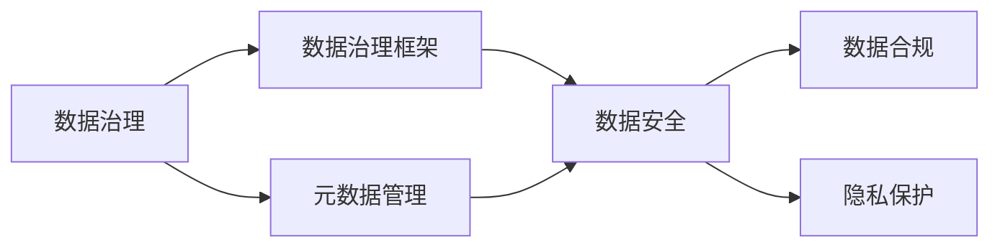

# 第9章-大数据治理与数据安全

> [!abstract] 本章定位
> 本章介绍大数据治理和数据安全的概念与实践，是大数据应用的重要保障。

## 学习主线

## 章节内容

- [[9.1-数据治理概述.md]]：数据治理定义、框架、元数据管理
- [[9.2-数据安全.md]]：数据安全威胁、防护策略、访问控制
- [[9.3-大数据合规与隐私保护.md]]：数据合规法规、隐私保护技术、GDPR

## 考点汇总

> [!important] 核心考点
> 1. 数据治理的定义和框架
> 2. 元数据管理的概念和实践
> 3. 数据安全威胁：数据泄露、数据篡改、数据丢失
> 4. 数据安全防护策略：加密、访问控制、审计
> 5. 数据合规法规：GDPR、网络安全法、个人信息保护法
> 6. 隐私保护技术：脱敏、加密、差分隐私
> 7. 大数据安全最佳实践

## 前后章节依赖

| 方向 | 章节 | 依赖关系 |
|-----|------|---------|
| 先修 | 第8章 | 数据挖掘结果需要数据治理 |
| 后续 | 无 | 本章是课程最后一章 |

## 复习自测

> [!question] 自测题
> 1. 数据治理是什么？包含哪些框架？
> 2. 元数据管理是什么？如何管理元数据？
> 3. 数据安全有哪些威胁？如何防护？
> 4. 数据合规法规有哪些？各自的要求是什么？
> 5. 隐私保护技术有哪些？如何实现？
> 6. 大数据安全有哪些最佳实践？