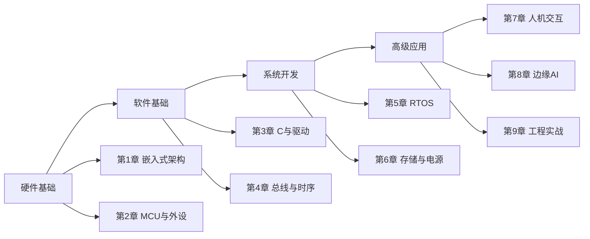
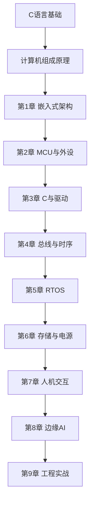

# 嵌入式系统

> [!abstract] 课程概述
> 本课程系统介绍嵌入式系统的硬件架构、软件设计和工程实践，涵盖MCU、RTOS、驱动开发、通信协议、边缘AI等核心内容。

## 课程学习主线

## 章节导航

### 基础篇

| 章节 | 主题 | 核心内容 |
|------|------|---------|
| [[MOC - 第1章 嵌入式系统基础概念与软硬件架构\|第1章]] | 嵌入式架构 | 定义特征、四层硬件、RTOS概述 |
| [[MOC - 第2章 嵌入式硬件核心-MCU与外设\|第2章]] | MCU与外设 | ARM架构、GPIO、定时器、ADC |

### 开发篇

| 章节 | 主题 | 核心内容 |
|------|------|---------|
| [[MOC - 第3章 嵌入式C语言与底层驱动开发\|第3章]] | C与驱动 | 寄存器操作、HAL库、驱动框架 |
| [[MOC - 第4章 中断定时器与通信总线\|第4章]] | 总线与时序 | 中断、定时器、I2C/SPI/UART/CAN |

### 系统篇

| 章节 | 主题 | 核心内容 |
|------|------|---------|
| [[MOC - 第5章 实时操作系统RTOS内核原理\|第5章]] | RTOS内核 | 任务调度、信号量、消息队列 |
| [[MOC - 第6章 嵌入式存储与电源管理\|第6章]] | 存储与电源 | Flash、EEPROM、电池管理 |

### 应用篇

| 章节 | 主题 | 核心内容 |
|------|------|---------|
| [[MOC - 第7章 嵌入式人机交互与传感器采集\|第7章]] | 交互与传感 | LCD、触摸屏、传感器采集 |
| [[MOC - 第8章 嵌入式AI部署\|第8章]] | 边缘AI | 轻量化模型、TFLite、部署实战 |
| [[MOC - 第9章 嵌入式开发调试与工程实战\|第9章]] | 工程实战 | 调试技巧、项目实战 |

## 知识点与习题索引

### 知识点（9章 × 3节 = 27节）

- 第1章：1.1 嵌入式定义、特征与应用场景 / 1.2 嵌入式硬件四层架构 / 1.3 实时操作系统RTOS概述
- 第2章：2.1 MCU核心架构 / 2.2 外设接口 / 2.3 开发板选型
- 第3章：3.1 嵌入式C特点 / 3.2 寄存器与HAL / 3.3 驱动框架
- 第4章：4.1 中断与定时器 / 4.2 串行通信UART / 4.3 I2C与SPI总线
- 第5章：5.1 RTOS调度 / 5.2 同步机制 / 5.3 任务间通信
- 第6章：6.1 Flash与EEPROM / 6.2 SD卡与文件系统 / 6.3 电源管理
- 第7章：7.1 LCD显示 / 7.2 触摸屏 / 7.3 传感器采集
- 第8章：8.1 边缘计算 / 8.2 模型轻量化 / 8.3 TFLite部署
- 第9章：9.1 调试方法 / 9.2 性能优化 / 9.3 项目实战

### 习题（9章）

- 习题-第1章-嵌入式系统基础概念.md
- 习题-第2章-MCU与外设硬件.md
- 习题-第3章-嵌入式C底层开发.md
- 习题-第4章-总线与时序通信.md
- 习题-第5章-RTOS内核原理.md
- 习题-第6章-存储与电源管理.md
- 习题-第7章-传感器与交互.md
- 习题-第8章-嵌入式边缘AI部署.md
- 习题-第9章-开发调试工程.md

## 学习路径建议

## 先修知识

| 知识领域 | 说明 |
|---------|------|
| C语言程序设计 | 掌握C语言语法、指针、结构体 |
| 计算机组成原理 | 了解CPU、内存、IO基本概念 |
| 数字逻辑 | 了解GPIO、时序等基本概念 |

## 工具与环境

| 工具 | 用途 |
|-----|------|
| Keil / STM32CubeIDE | 编译与调试 |
| STM32开发板 | 硬件平台 |
| J-Link / ST-Link | 下载与调试 |
| Logic Analyzer | 时序分析 |
| TFLite / OpenMV | 边缘AI部署 |