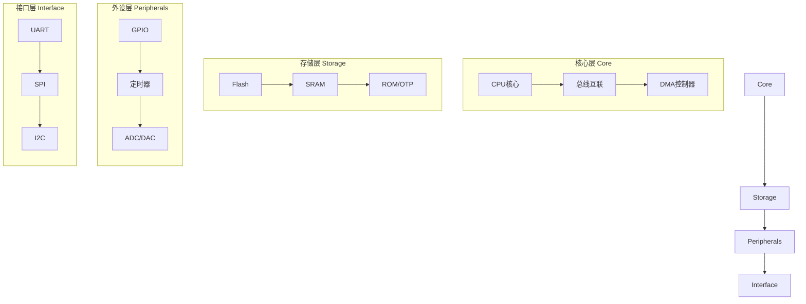
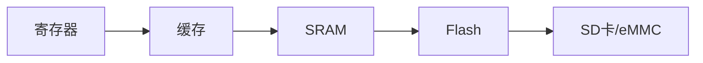

# 1.2 嵌入式硬件四层架构

## 一、四层架构总览



| 层级 | 组件 | 功能 |
|-----|------|------|
| 核心层 | CPU、DMA、总线 | 计算与数据搬运 |
| 存储层 | Flash、SRAM、ROM | 程序与数据存储 |
| 外设层 | GPIO、Timer、ADC、DAC | 与外部交互的基本外设 |
| 接口层 | UART、SPI、I2C、CAN | 与其他设备通信 |

## 二、核心层

### 1. CPU核心

#### ARM Cortex-M系列

| 型号 | 架构 | 典型主频 | 应用 |
|-----|------|---------|------|
| Cortex-M0/M0+ | ARMv6-M | <50MHz | 低端MCU |
| Cortex-M3 | ARMv7-M | <100MHz | 中端MCU |
| Cortex-M4 | ARMv7-ME（DSP） | <200MHz | 带DSP |
| Cortex-M7 | ARMv7-ME（双发射） | <400MHz | 高性能MCU |
| Cortex-M33 | ARMv8-M | <200MHz | 带TrustZone |

#### Cortex-A系列

| 型号 | 架构 | 典型主频 | 应用 |
|-----|------|---------|------|
| Cortex-A5 | ARMv7-A | <800MHz | 入门MPU |
| Cortex-A7 | ARMv7-A | <1.2GHz | 中低端 |
| Cortex-A53 | ARMv8-A | <2GHz | 64位入门 |
| Cortex-A72 | ARMv8-A | <2.5GHz | 高性能 |

### 2. MCU vs MPU vs SoC

| 类型 | 特点 | 代表产品 | 适用场景 |
|-----|------|---------|---------|
| MCU | 单核+片上存储+外设 | STM32、GD32、NRF52 | 控制类、简单应用 |
| MPU | 多核+MMU+外部存储 | i.MX6、RK3288 | 运行Linux |
| SoC | MPU+外设+网络+GPU | RK3566、A133 | 复杂系统 |

### 3. DMA控制器

> [!important] DMA（Direct Memory Access）
> 直接内存访问，允许外设直接与内存传输数据，无需CPU参与。

**应用场景**：
- 串口大批量数据接收
- ADC连续采样
- 屏幕显示数据搬运

## 三、存储层

### 1. Flash存储器

| 类型 | 特点 | 容量范围 | 代表型号 |
|-----|------|---------|---------|
| NOR Flash | 随机读取、按块擦除 | 128KB~16MB | W25Q128、GD25Q32 |
| NAND Flash | 页读取、按块擦除、容量大 | 16MB~128GB | K9F1G08、MT29F2G08 |
| eMMC | NAND+控制器 | 4GB~256GB | 通用eMMC |
| QSPI NOR | 快速随机读 | 1MB~256MB | W25Q512 |

**Flash操作**：
- 读：按字节随机读取
- 写：必须先擦除再写入（擦除到全1）
- 擦除：按扇区/块擦除
- 寿命：擦写次数有限（通常10万~100万次）

### 2. SRAM

| 特性 | 说明 |
|-----|------|
| 存储原理 | 触发器（6T单元） |
| 速度 | 极快（ns级） |
| 功耗 | 较高（需持续供电） |
| 易失性 | 掉电丢失 |
| 容量 | 片上SRAM通常16KB~1MB |

### 3. 存储器层次



| 层次 | 速度 | 容量 | 成本 |
|-----|------|------|------|
| 寄存器 | 最快 | 最小 | 最高 |
| Cache | 快 | 小 | 高 |
| SRAM | 中 | 中 | 中 |
| Flash | 慢 | 大 | 低 |
| SD/eMMC | 最慢 | 最大 | 最低 |

## 四、外设层

### 1. GPIO（通用输入输出）

**基本操作**：
```c
// GPIO初始化
RCC_AHB1PeriphClockCmd(RCC_AHB1Periph_GPIOC, ENABLE);

GPIO_InitTypeDef GPIO_InitStruct;
GPIO_InitStruct.GPIO_Pin = GPIO_Pin_13;
GPIO_InitStruct.GPIO_Mode = GPIO_Mode_OUT;
GPIO_InitStruct.GPIO_Speed = GPIO_Speed_2MHz;
GPIO_Init(GPIOC, &GPIO_InitStruct);

// 输出控制
GPIO_SetBits(GPIOC, GPIO_Pin_13);    // 拉高
GPIO_ResetBits(GPIOC, GPIO_Pin_13);  // 拉低

// 读取输入
uint8_t status = GPIO_ReadInputDataBit(GPIOA, GPIO_Pin_0);
```

**GPIO模式**：

| 模式 | 说明 |
|-----|------|
| 输入浮空 | 高阻输入 |
| 输入上拉/下拉 | 带内部上下拉电阻 |
| 输出推挽 | 可输出高低电平 |
| 输出开漏 | 需外接上拉电阻 |
| 复用功能 | 外设功能引脚 |
| 模拟输入 | 用于ADC采样 |

### 2. 定时器/计数器

**功能**：
- 定时中断（周期性任务）
- 计数器（外部事件计数）
- PWM输出（电机控制、LED调光）
- 输入捕获（测量脉冲宽度）
- 正交编码器接口

**定时器资源对比**：

| MCU | 高级定时器 | 通用定时器 | 基本定时器 |
|-----|----------|----------|----------|
| STM32F1 | TIM1 | TIM2~TIM4 | TIM6~TIM7 |
| STM32F4 | TIM1、TIM8 | TIM2~TIM7、TIM9~TIM14 | TIM6~TIM7 |

### 3. ADC（模数转换）

**参数**：

| 参数 | 典型值 |
|-----|--------|
| 分辨率 | 8/10/12位 |
| 采样率 | 1~100MSPS |
| 通道数 | 8~24路 |
| 参考电压 | 3.3V |
| 转换时间 | 1~100μs |

**工作模式**：
- 单次转换
- 连续转换
- 扫描模式（多路）
- 注入通道（高优先级）
- DMA模式

### 4. DAC（数模转换）

**应用**：
- 模拟电压输出
- 音频信号生成
- 电机模拟控制

## 五、接口层

### 1. UART（通用异步收发器）

**特点**：
- 全双工异步通信
- TX/RX两根线
- 波特率：9600~921600
- 单字节传输

**参数配置**：
```c
USART_InitTypeDef USART_InitStruct;
USART_InitStruct.USART_BaudRate = 115200;
USART_InitStruct.USART_WordLength = USART_WordLength_8b;
USART_InitStruct.USART_StopBits = USART_StopBits_1;
USART_InitStruct.USART_Parity = USART_Parity_No;
USART_Init(USART1, &USART_InitStruct);
```

### 2. SPI（串行外设接口）

**特点**：
- 全双工同步通信
- SCK/MOSI/MISO/CS四根线
- 主从模式
- 高速（可达50MHz+）

**工作模式**：
- Mode 0/1/2/3（CPOL/CPHA）
- 单次传输8/16位

### 3. I2C（集成电路间总线）

**特点**：
- 半双工同步通信
- SDA/SCL两根线
- 多主多从
- 速度标准100KHz、快速400KHz

**地址机制**：
- 7位地址（128个从设备）
- 10位地址（1024个从设备）
- 广播地址

### 4. CAN（控制器局域网）

**特点**：
- 半双工差分通信
- 250Kbps~1Mbps
- 支持多主仲裁
- 抗干扰能力强

**应用**：
- 汽车电子（CAN总线标准）
- 工业自动化
- 机器人控制

## 六、硬件选型参考

### 1. 选型因素

| 因素 | 说明 |
|-----|------|
| 处理能力 | 算法复杂度、实时性要求 |
| 存储 | 代码大小、数据存储 |
| 外设需求 | GPIO、串口、ADC、PWM等 |
| 通信接口 | UART、SPI、I2C、CAN |
| 工作温度 | 工业级-40~85℃、汽车级-40~125℃ |
| 封装 | 最小尺寸、散热需求 |
| 成本 | BOM成本、量产价格 |
| 生态 | 开发工具、SDK、社区支持 |

### 2. 典型MCU选择

| 应用 | 推荐系列 |
|-----|---------|
| 简单控制（LED、继电器） | STM32F0/GD32E230 |
| 物联网节点 | STM32L0/GD32L150 |
| 通用工业控制 | STM32F1/GD32F103 |
| 高性能算法 | STM32F4/GD32F407 |
| 边缘AI | STM32H7/RK3588 |
| 无线通信 | nRF52/CC2650 |

---

**导航**：上一节 [[1.1-嵌入式定义、特征与应用场景]] · [[MOC - 第1章\|返回章节导航]] · 下一节 [[1.3-实时操作系统RTOS概述]]