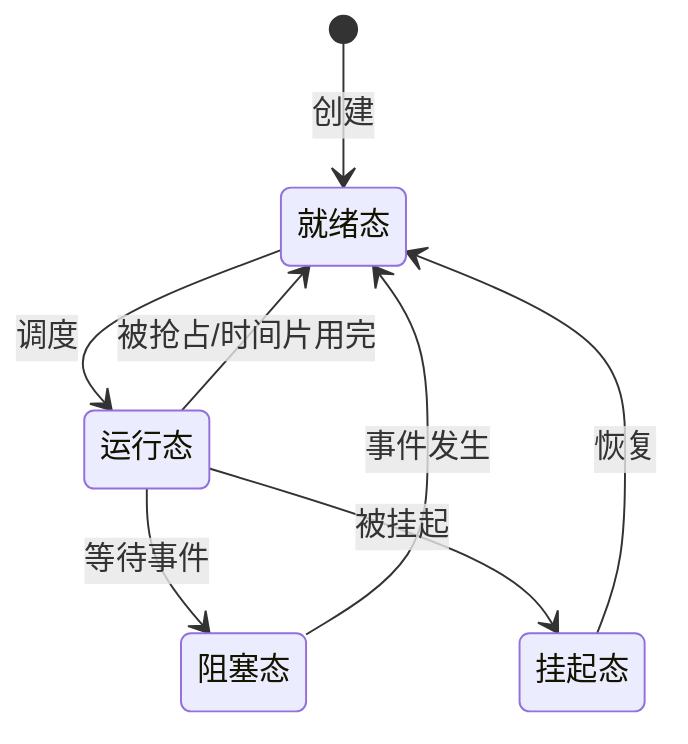
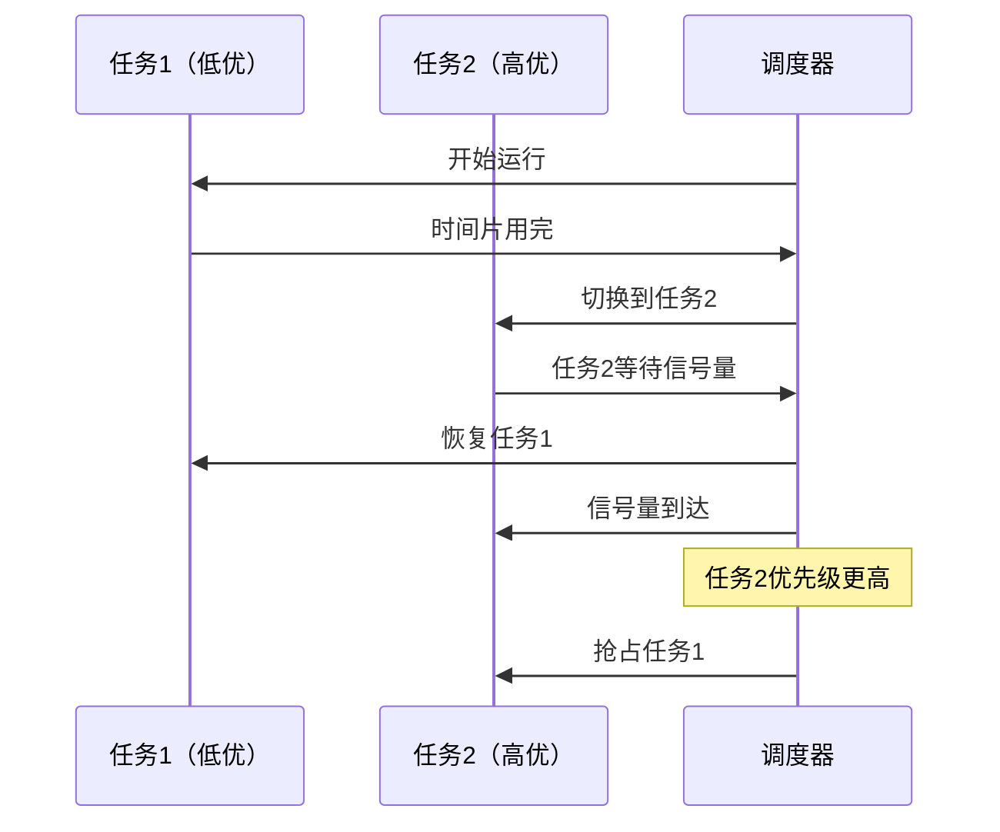

# 1.3 实时操作系统RTOS概述

## 一、RTOS的定义与特征

### 1. 定义

> [!quote] 实时操作系统（Real-Time Operating System, RTOS）
> 是指能够在确定的时间内响应外部事件、完成任务调度的操作系统。

### 2. 核心特征

| 特征 | 说明 |
|-----|------|
| **确定性（Determinism）** | 操作时间可预测、可保证 |
| **响应性（Responsiveness）** | 快速响应外部事件 |
| **并发性（Concurrency）** | 支持多任务并发执行 |
| **可抢占性（Preemptability）** | 高优先级任务可抢占低优先级任务 |
| **内存管理** | 管理堆、栈、静态内存 |
| **同步机制** | 信号量、互斥量、消息队列 |

### 3. 实时性分类

| 类型 | 说明 | 典型应用 |
|-----|------|---------|
| **硬实时（Hard Real-Time）** | 必须在deadline前完成，否则系统失效 | 刹车控制、飞控系统 |
| **软实时（Soft Real-Time）** | 偶尔超过deadline可接受 | 音视频播放、UI刷新 |

## 二、三种软件架构对比

### 1. 裸机系统

```c
// 裸机系统示例
int main(void) {
    hardware_init();
    
    while(1) {
        // 主循环
        do_task1();
        do_task2();
    }
}
```

**特点**：
- 无操作系统
- 直接操作硬件寄存器
- 简单、高效
- 无法处理复杂调度

**适用**：简单控制、资源极小的MCU

### 2. 前后台系统

```c
// 前后台系统示例
void main(void) {
    hardware_init();
    
    while(1) {
        // 后台：主循环
        process_background();
    }
}

// 前台：中断服务函数
void EXTI_IRQHandler(void) {
    if(EXTI_GetITStatus(EXTI_Line0) != RESET) {
        // 快速处理
        handle_event();
        EXTI_ClearITPendingBit(EXTI_Line0);
    }
}
```

**特点**：
- 主循环+中断
- 中断做快速处理，主循环做耗时操作
- 无法实现真正的多任务
- 复杂应用难以维护

### 3. RTOS系统

```c
// RTOS系统示例（FreeRTOS）
void vTaskTask1(void *pvParameters) {
    while(1) {
        // 执行任务1
        process_task1();
        // 延时
        vTaskDelay(pdMS_TO_TICKS(100));
    }
}

void vTaskTask2(void *pvParameters) {
    while(1) {
        // 执行任务2
        process_task2();
        // 延时
        vTaskDelay(pdMS_TO_TICKS(50));
    }
}

int main(void) {
    hardware_init();
    xTaskCreate(vTaskTask1, "Task1", 256, NULL, 1, NULL);
    xTaskCreate(vTaskTask2, "Task2", 256, NULL, 2, NULL);
    vTaskStartScheduler();
    
    while(1);
}
```

**特点**：
- 真正的多任务调度
- 基于优先级抢占
- 任务间通信（信号量、消息队列）
- 系统复杂性大幅提升

## 三、主流RTOS对比

### 1. 通用RTOS

| RTOS | 类型 | 许可 | 特点 |
|------|------|------|------|
| FreeRTOS | 实时 | MIT | 最流行、生态好 |
| RT-Thread | 实时 | Apache | 国产、功能丰富 |
| uC/OS | 实时 | 商业 | 经典、教程多 |
| VxWorks | 硬实时 | 商业 | 航空航天级 |
| QNX | 硬实时 | 商业 | 汽车电子首选 |

### 2. 开源RTOS对比

| 特性 | FreeRTOS | RT-Thread | Zephyr |
|-----|----------|-----------|--------|
| 语言 | C | C/C++ | C |
| 内核大小 | 3~10KB | 4~20KB | ~50KB |
| 调度算法 | 优先级抢占 | 优先级抢占+时间片 | 优先级抢占 |
| 网络栈 | 需移植 | 内置 | 内置 |
| 文件系统 | 需移植 | 内置FAT/LittleFS | 内置 |
| 组件 | 丰富 | 最丰富 | 丰富 |
| 硬件支持 | 极广 | 广 | 极广 |
| 社区 | 全球活跃 | 中国为主 | 全球活跃 |

## 四、RTOS核心概念

### 1. 任务（Task）

> [!important] 任务 = 进程
> RTOS中通常称为"任务"，每个任务是一个独立的执行单元，有自己的栈和状态。

**任务状态**：



| 状态 | 说明 |
|-----|------|
| 就绪（Ready） | 就绪但未运行（有更高优先级任务运行） |
| 运行（Running） | 正在运行（单核只能一个） |
| 阻塞（Blocked） | 等待事件（延时、信号量、消息等） |
| 挂起（Suspended） | 被人为挂起 |

### 2. 优先级

- 优先级数值：数值越小，优先级越高（FreeRTOS）
- 或反之：数值越大，优先级越高（uC/OS）
- 优先级反转问题

#### 优先级反转示例

```
任务C（高） 等待资源 → 被阻塞
任务B（中） 占用CPU → 抢占任务C的资源提供者（任务A）
任务A（低） 持有资源 → 被任务B抢占，无法释放资源
结果：任务C因任务B而延迟，出现优先级反转
```

#### 解决方案：优先级继承

```
任务A的优先级被临时提升到任务C的优先级
任务B无法抢占任务A
任务A执行完毕，释放资源，恢复原优先级
```

### 3. 调度算法

#### 优先级抢占调度



#### 时间片轮转

- 同优先级任务轮转
- 每个任务运行固定时间片
- 保证公平性

### 4. 同步与互斥

#### 信号量（Semaphore）

| 类型 | 说明 |
|-----|------|
| 二值信号量 | 0/1，用于资源互斥 |
| 计数信号量 | 0~N，用于资源计数 |
| 事件信号量 | 用于事件同步 |

```c
// 二值信号量示例
SemaphoreHandle_t xSemaphore;

// 创建信号量
xSemaphore = xSemaphoreCreateBinary();

// 任务1：发送信号
void vTaskSender(void) {
    // ... 产生事件
    xSemaphoreGive(xSemaphore);
}

// 任务2：接收信号
void vTaskReceiver(void) {
    while(1) {
        // 等待信号
        xSemaphoreTake(xSemaphore, portMAX_DELAY);
        // ... 处理事件
    }
}
```

#### 互斥量（Mutex）

> [!tip] 互斥量 vs 信号量
> - 互斥量：用于保护共享资源，支持优先级继承，只有持有者能释放
> - 信号量：用于同步和资源计数，任何任务都能释放

```c
// 互斥量示例
SemaphoreHandle_t xMutex;
int shared_counter = 0;

void vTaskIncrement(void) {
    while(1) {
        xSemaphoreTake(xMutex, portMAX_DELAY);
        shared_counter++;
        xSemaphoreGive(xMutex);
        vTaskDelay(pdMS_TO_TICKS(10));
    }
}
```

### 5. 消息队列

```c
QueueHandle_t xQueue;

void vTaskProducer(void) {
    int value = 0;
    while(1) {
        xQueueSend(xQueue, &value, 0);
        value++;
        vTaskDelay(pdMS_TO_TICKS(100));
    }
}

void vTaskConsumer(void) {
    int received;
    while(1) {
        if(xQueueReceive(xQueue, &received, portMAX_DELAY) == pdPASS) {
            // 处理接收到的数据
        }
    }
}
```

## 五、RTOS vs Linux

| 对比项 | RTOS（FreeRTOS） | 嵌入式Linux |
|-------|-----------------|-------------|
| 内核大小 | ~10KB | ~1MB+ |
| 启动时间 | <1ms | 1~10s |
| 内存需求 | <64KB | >32MB |
| 实时性 | 硬实时 | 软实时（需补丁） |
| 开发难度 | 中等 | 较高 |
| 生态 | 较少 | 丰富 |
| 文件系统 | 可选 | 内置 |
| 网络栈 | 可选 | 内置 |
| GUI | 可选 | 可选 |
| 适用场景 | 简单控制 | 复杂应用 |

## 六、选择建议

### 什么时候用RTOS

- 硬实时需求（控制类）
- 资源受限（内存<256KB）
- 启动时间敏感
- 简单应用（无文件系统/网络需求）

### 什么时候用Linux

- 软实时需求可接受
- 需要文件系统/网络/GUI
- 复杂应用（需要多进程、多线程）
- 需要丰富的开源生态
- 团队熟悉Linux开发

---

**导航**：上一节 [[1.2-嵌入式硬件四层架构]] · [[MOC - 第1章\|返回章节导航]]