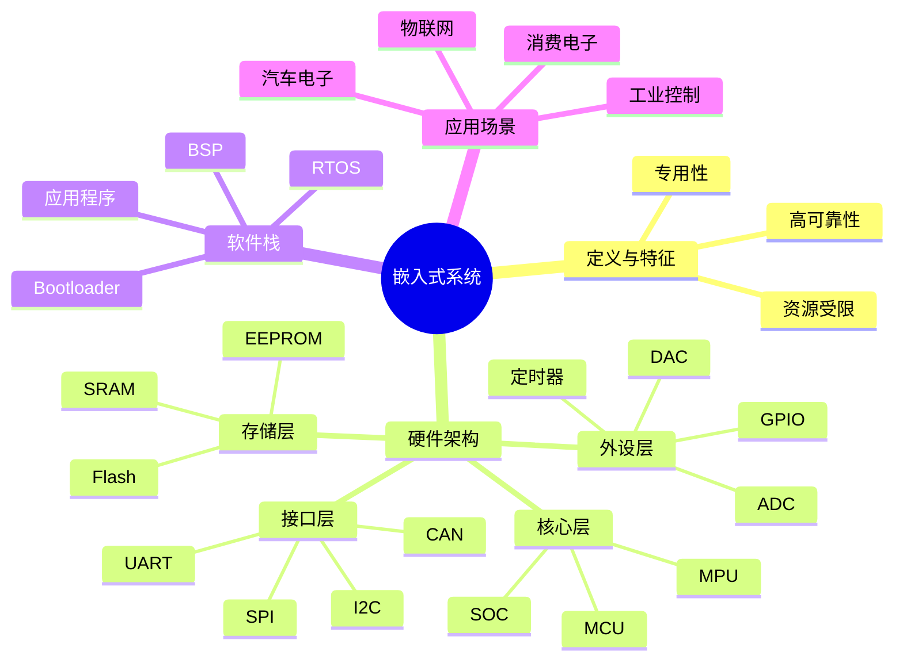

# 第1章 嵌入式系统基础概念与软硬件架构

> [!abstract] 本章定位
> 本章介绍嵌入式系统的基本概念、特征和应用场景，建立对嵌入式系统的整体认知。

## 学习主线

## 章节内容

- [[1.1-嵌入式定义、特征与应用场景]]：嵌入式系统定义、典型特征、应用领域
- [[1.2-嵌入式硬件四层架构]]：MCU、存储器、外设、接口总线
- [[1.3-实时操作系统RTOS概述]]：RTOS定义、特点、分类、对比Linux

## 核心考点

> [!important] 必掌握
> 1. 嵌入式系统的定义与典型特征（专用性、资源受限、可靠性）
> 2. 嵌入式硬件四层架构（核心层、存储层、外设层、接口层）
> 3. MCU/MPU/SOC的区别与代表产品
> 4. RTOS的三大特征（实时性、多任务、可裁剪）
> 5. 前后台系统与RTOS的对比

## 知识图谱

## 复习自测

> [!question] 自测题
> 1. 嵌入式系统的典型特征有哪些？
> 2. 画出嵌入式硬件四层架构示意图。
> 3. MCU、MPU、SOC有什么区别？
> 4. RTOS的核心特征是什么？
> 5. 前后台系统与RTOS各有什么优缺点？
> 6. 嵌入式系统在工业、消费、汽车、医疗领域各有哪些典型应用？