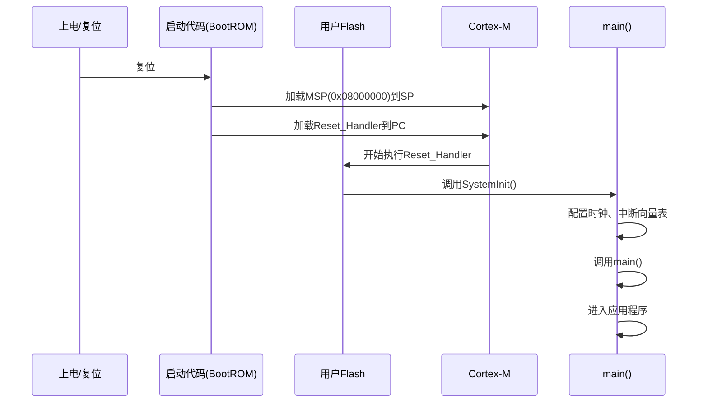

# 2.1 MCU核心架构与启动流程

## 一、Cortex-M内核架构

### 1. 三级流水线


| 阶段 | 说明 |
|-----|------|
| IF（Fetch） | 从Flash取指令 |
| ID（Decode） | 译码指令，读寄存器 |
| EX（Execute） | 执行指令，写寄存器 |

**作用**：三条指令并行执行，提高吞吐量

### 2. 寄存器组

| 寄存器 | 位数 | 说明 |
|-------|------|------|
| R0~R12 | 32位 | 通用寄存器 |
| SP（R13） | 32位 | 栈指针 |
| LR（R14） | 32位 | 链接寄存器（保存返回地址） |
| PC（R15） | 32位 | 程序计数器 |
| xPSR | 32位 | 程序状态寄存器 |
| MSP | 32位 | 主栈指针（异常模式使用） |
| PSP | 32位 | 进程栈指针（线程模式使用） |

### 3. 存储器映射

```
地址空间划分：
0x0000 0000 ~ 0x0003 FFFF  启动区（BootROM）
0x0800 0000 ~ 0x080F FFFF  主Flash
0x2000 0000 ~ 0x2001 FFFF  SRAM
0x4000 0000 ~ 0x5FFF FFFF  外设寄存器
0xE000 0000 ~ 0xE00F FFFF  内核私有外设
```

### 4. 中断向量表

| 偏移 | 中断源 | 说明 |
|-----|--------|------|
| 0x00 | - | 初始MSP值 |
| 0x04 | Reset | 复位 |
| 0x08 | NMI | 不可屏蔽中断 |
| 0x0C | HardFault | 硬件错误 |
| 0x10 | MemManage | 内存管理异常 |
| 0x14 | BusFault | 总线错误 |
| 0x18 | UsageFault | 使用错误 |
| 0x1C~0x2B | - | 保留 |
| 0x2C | SVCall | 系统调用 |
| 0x30 | Debug Monitor | 调试监控 |
| 0x34 | - | 保留 |
| 0x38 | PendSV | 可挂起系统服务 |
| 0x3C | SysTick | 系统滴答定时器 |
| 0x40+ | 外部中断0~239 | 外设中断 |

## 二、时钟系统

### 1. 时钟源

| 时钟源 | 类型 | 频率范围 | 用途 |
|-------|------|---------|------|
| HSI | 内部RC | 8MHz±1% | 启动默认时钟 |
| HSE | 外部晶振 | 4~26MHz | 高精度时钟 |
| LSI | 内部RC | 32KHz±12% | 低功耗/看门狗 |
| LSE | 外部晶振 | 32.768KHz | RTC时钟 |

### 2. 时钟树

```mermaid
flowchart TD
    HSE[HSE外部晶振] --> PLL[PLL锁相环]
    HSI[HSI内部RC] --> PLL
    PLL --> SYSCLK[系统时钟]
    SYSCLK --> AHB[AHB总线分频]
    AHB --> APB1[APB1分频]
    AHB --> APB2[APB2分频]
    LSE[LSE外部晶振] --> RTC[RTC时钟]
    LSI[LSI内部RC] --> WDG[看门狗]
    
    SYSCLK --> CPU
    APB1 --> 定时器2/3/4, USART2/3, SPI2, I2C1/2
    APB2 --> 定时器1, USART1, SPI1, ADC, GPIO
```

### 3. PLL配置

```c
// PLL配置示例
void Clock_Init(void) {
    // 1. 使能HSE
    RCC_OSCILLATORTYPE_HSEConfig(RCC_OSCILLATORTYPE_HSE_ON);
    while(RCC_GetFlagStatus(RCC_FLAG_HSERDY) == RESET);
    
    // 2. 配置PLL
    RCC_PLLConfig(RCC_PLLSource_HSE_Div1, RCC_PLLMul_9);
    // HSE=8MHz, PLL倍频9, SYSCLK=72MHz
    
    // 3. 使能PLL
    RCC_PLLCmd(ENABLE);
    while(RCC_GetFlagStatus(RCC_FLAG_PLLRDY) == RESET);
    
    // 4. 选择PLL作为系统时钟
    RCC_SYSCLKConfig(RCC_SYSCLKSource_PLLCLK);
    
    // 5. 配置总线分频
    RCC_HCLKConfig(RCC_SYSCLK_Div1);    // AHB = 72MHz
    RCC_PCLK2Config(RCC_HCLK_Div1);     // APB2 = 72MHz
    RCC_PCLK1Config(RCC_HCLK_Div2);     // APB1 = 36MHz
}
```

### 4. 时钟配置注意事项

> [!warning] 重要
> - APB1最大时钟为36MHz（定时器2/3/4、USART2等挂在此总线）
> - APB2最大时钟为72MHz（定时器1、USART1、ADC等挂在此总线）
> - ADC时钟不超过14MHz（STM32F1）

## 三、MCU启动流程

### 1. 启动模式

| BOOT引脚 | 启动模式 | 启动介质 |
|----------|---------|---------|
| 0 | 主Flash | 用户Flash |
| 1 | 系统存储器 | BootLoader（串口下载） |
| x | 嵌入式SRAM | SRAM调试 |

### 2. 启动流程详解



### 3. 启动代码分析

```c
// startup_stm32f10x_md.s（复位处理）
Reset_Handler:
    // 1. 调用SystemInit（配置时钟）
    bl  SystemInit
    
    // 2. 初始化数据段（.data拷贝、.bss清零）
    ldr r0, =_sidata
    ldr r1, =_sdata
    ldr r2, =_edata
    copy_loop:
        cmp r1, r2
        bge copy_end
        ldr r3, [r0]
        str r3, [r1]
        adds r0, 4
        adds r1, 4
        b copy_loop
    copy_end:
    
    // 3. 清零BSS段
    ldr r0, =_sbss
    ldr r1, =_ebss
    mov r2, #0
    zero_loop:
        cmp r0, r1
        bge zero_end
        str r2, [r0]
        adds r0, 4
        b zero_loop
    zero_end:
    
    // 4. 调用main()
    bl main
    
    // 5. 如果main返回，死循环
    b .
```

### 4. SystemInit函数

```c
void SystemInit(void) {
    // 1. 配置时钟（通常在startup中已调用）
    // SystemCoreClockUpdate();
    
    // 2. 配置FPU（如果支持）
    #if (__FPU_PRESENT == 1) && (__FPU_USED == 1)
        SCB->CPACR |= ((3UL << 10*2)|(3UL << 11*2));
    #endif
    
    // 3. 设置向量表偏移
    // SCB->VTOR = 0x08000000;
}
```

### 5. main()函数模板

```c
int main(void) {
    // 1. 系统时钟配置
    SystemClock_Config();
    
    // 2. 外设初始化
    LED_Init();
    USART1_Init(115200);
    
    // 3. 应用逻辑
    while(1) {
        // 主循环
    }
}
```

## 四、调试接口

### 1. 调试方式

| 接口 | 说明 |
|-----|------|
| JTAG | 4线调试（TDI/TDO/TCLK/TMS） |
| SWD | 2线调试（SWDIO/SWCLK），推荐 |
| 串口 | 用于日志输出和ISP下载 |

### 2. SWD调试接口

```
SWD接口连接：
SWDIO -> PA13
SWCLK -> PA14
GND   -> GND
```

### 3. 开发工具

| 工具 | 说明 |
|-----|------|
| Keil MDK | ARM官方IDE |
| STM32CubeIDE | ST官方IDE（基于Eclipse） |
| IAR | 商业IDE |
| PlatformIO | 开源跨平台 |

---

**导航**：[[MOC - 第2章\|返回章节导航]] · 下一节 [[2.2-GPIO与中断控制器]]