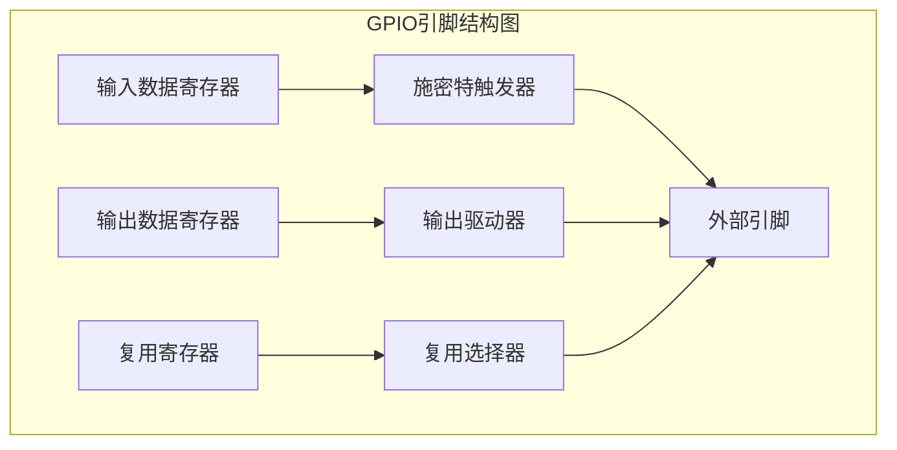
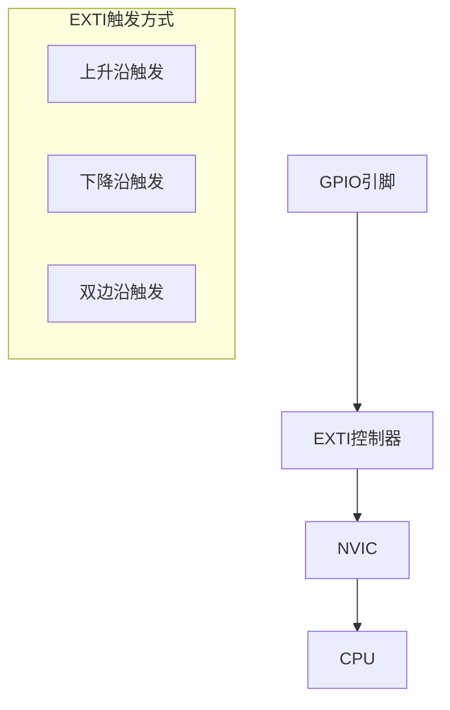
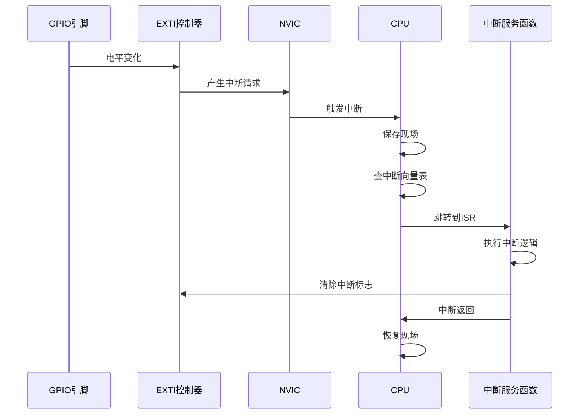

# 2.2 GPIO与中断控制器

## 一、GPIO原理

### 1. GPIO结构



### 2. GPIO的6种模式

| 模式 | 说明 | 上拉/下拉 | 典型应用 |
|-----|------|----------|---------|
| 输入浮空 | 高阻输入，无上下拉 | 无 | 按键（外部有上下拉） |
| 输入上拉 | 高阻输入，内部上拉 | 上拉 | 按键（无外部电阻） |
| 输入下拉 | 高阻输入，内部下拉 | 下拉 | 传感器低电平有效 |
| 输出推挽 | 可输出高低电平 | 无 | LED、继电器 |
| 输出开漏 | 需外接上拉电阻 | 无 | I2C总线、LED（多路） |
| 复用功能 | 外设功能引脚 | 无 | USART、SPI、TIM等 |

### 3. GPIO配置示例

#### LED点亮（输出推挽）

```c
void LED_Init(void) {
    GPIO_InitTypeDef GPIO_InitStruct;
    
    // 使能GPIOC时钟
    RCC_APB2PeriphClockCmd(RCC_APB2Periph_GPIOC, ENABLE);
    
    // 配置PC13为推挽输出
    GPIO_InitStruct.GPIO_Pin = GPIO_Pin_13;
    GPIO_InitStruct.GPIO_Mode = GPIO_Mode_Out_PP;
    GPIO_InitStruct.GPIO_Speed = GPIO_Speed_50MHz;
    GPIO_Init(GPIOC, &GPIO_InitStruct);
    
    // 默认熄灭（低电平点亮）
    GPIO_SetBits(GPIOC, GPIO_Pin_13);
}

void LED_Toggle(void) {
    if(GPIO_ReadOutputDataBit(GPIOC, GPIO_Pin_13)) {
        GPIO_ResetBits(GPIOC, GPIO_Pin_13);  // 点亮
    } else {
        GPIO_SetBits(GPIOC, GPIO_Pin_13);   // 熄灭
    }
}
```

#### 按键读取（输入上拉）

```c
#define KEY_PIN  GPIO_Pin_0
#define KEY_PORT GPIOA

void KEY_Init(void) {
    GPIO_InitTypeDef GPIO_InitStruct;
    
    RCC_APB2PeriphClockCmd(RCC_APB2Periph_GPIOA, ENABLE);
    
    GPIO_InitStruct.GPIO_Pin = KEY_PIN;
    GPIO_InitStruct.GPIO_Mode = GPIO_Mode_IPU;  // 输入上拉
    GPIO_Init(GPIOA, &GPIO_InitStruct);
}

// 按键检测（查询法）
uint8_t KEY_Scan(void) {
    // 低电平有效
    if(GPIO_ReadInputDataBit(KEY_PORT, KEY_PIN) == 0) {
        delay_ms(20);  // 消抖
        if(GPIO_ReadInputDataBit(KEY_PORT, KEY_PIN) == 0) {
            return 1;  // 按下
        }
    }
    return 0;  // 未按下
}
```

#### 串口TX引脚（复用功能）

```c
void USART1_GPIO_Init(void) {
    GPIO_InitTypeDef GPIO_InitStruct;
    
    RCC_APB2PeriphClockCmd(RCC_APB2Periph_GPIOA, ENABLE);
    
    // PA9 - USART1_TX 复用推挽输出
    GPIO_InitStruct.GPIO_Pin = GPIO_Pin_9;
    GPIO_InitStruct.GPIO_Mode = GPIO_Mode_AF_PP;
    GPIO_InitStruct.GPIO_Speed = GPIO_Speed_50MHz;
    GPIO_Init(GPIOA, &GPIO_InitStruct);
    
    // PA10 - USART1_RX 浮空输入
    GPIO_InitStruct.GPIO_Pin = GPIO_Pin_10;
    GPIO_InitStruct.GPIO_Mode = GPIO_Mode_IN_FLOATING;
    GPIO_Init(GPIOA, &GPIO_InitStruct);
}
```

## 二、EXTI外部中断

### 1. EXTI架构



### 2. EXTI配置步骤

```c
void KEY_EXTI_Init(void) {
    GPIO_InitTypeDef GPIO_InitStruct;
    EXTI_InitTypeDef EXTI_InitStruct;
    NVIC_InitTypeDef NVIC_InitStruct;
    
    // 1. GPIO配置
    RCC_APB2PeriphClockCmd(RCC_APB2Periph_GPIOA | RCC_APB2Periph_AFIO, ENABLE);
    
    GPIO_InitStruct.GPIO_Pin = GPIO_Pin_0;
    GPIO_InitStruct.GPIO_Mode = GPIO_Mode_IPU;
    GPIO_Init(GPIOA, &GPIO_InitStruct);
    
    // 2. 配置EXTI线（PA0对应EXTI0）
    GPIO_EXTILineConfig(GPIO_PortSourceGPIOA, GPIO_PinSource0);
    
    // 3. 配置EXTI触发方式
    EXTI_InitStruct.EXTI_Line = EXTI_Line0;
    EXTI_InitStruct.EXTI_Mode = EXTI_Mode_Interrupt;
    EXTI_InitStruct.EXTI_Trigger = EXTI_Trigger_Falling;  // 下降沿
    EXTI_InitStruct.EXTI_LineCmd = ENABLE;
    EXTI_Init(&EXTI_InitStruct);
    
    // 4. 配置NVIC
    NVIC_InitStruct.NVIC_IRQChannel = EXTI0_IRQn;
    NVIC_InitStruct.NVIC_IRQChannelPreemptionPriority = 0x02;
    NVIC_InitStruct.NVIC_IRQChannelSubPriority = 0x02;
    NVIC_InitStruct.NVIC_IRQChannelCmd = ENABLE;
    NVIC_Init(&NVIC_InitStruct);
}
```

### 3. 中断服务函数

```c
// EXTI0中断服务函数
void EXTI0_IRQHandler(void) {
    // 检查中断标志
    if(EXTI_GetITStatus(EXTI_Line0) != RESET) {
        // 处理中断
        key_pressed = 1;
        
        // 清除中断标志
        EXTI_ClearITPendingBit(EXTI_Line0);
    }
}
```

> [!warning] 注意
> 中断服务函数名必须与启动文件中的定义完全一致！EXTI0_IRQHandler、EXTI1_IRQHandler等。

## 三、NVIC嵌套向量中断控制器

### 1. NVIC功能

- 管理所有中断源的使能/禁止
- 配置中断优先级
- 响应中断请求
- 支持嵌套中断

### 2. 优先级分组


| 分组方式 | 抢占优先级位数 | 子优先级位数 | 说明 |
|---------|--------------|------------|------|
| NVIC_PriorityGroup_0 | 0位 | 4位 | 无抢占，只有子优先级 |
| NVIC_PriorityGroup_1 | 1位 | 3位 | 1级抢占，8级子 |
| NVIC_PriorityGroup_2 | 2位 | 2位 | 4级抢占，4级子 |
| NVIC_PriorityGroup_3 | 3位 | 1位 | 8级抢占，2级子 |
| NVIC_PriorityGroup_4 | 4位 | 0位 | 16级抢占，无子 |

### 3. 分组设置

```c
// 优先级分组设置（在NVIC_PriorityGroupConfig之前调用）
NVIC_PriorityGroupConfig(NVIC_PriorityGroup_2);
// 4级抢占优先级，4级子优先级
```

### 4. 中断优先级规则

> [!important] 规则
> 1. 抢占优先级（Preemption）：数值越小优先级越高，高抢占可中断低抢占
> 2. 子优先级（Sub Priority）：同一抢占优先级下，子优先级高的先执行
> 3. 只有抢占优先级不同才能嵌套
> 4. FreeRTOS中通常使用NVIC_PriorityGroup_4

### 5. NVIC完整配置示例

```c
void NVIC_Config(void) {
    // 1. 设置优先级分组
    NVIC_PriorityGroupConfig(NVIC_PriorityGroup_2);
    
    // 2. 配置USART1中断
    NVIC_InitTypeDef NVIC_InitStruct;
    NVIC_InitStruct.NVIC_IRQChannel = USART1_IRQn;
    NVIC_InitStruct.NVIC_IRQChannelPreemptionPriority = 1;
    NVIC_InitStruct.NVIC_IRQChannelSubPriority = 1;
    NVIC_InitStruct.NVIC_IRQChannelCmd = ENABLE;
    NVIC_Init(&NVIC_InitStruct);
    
    // 3. 配置EXTI0中断
    NVIC_InitStruct.NVIC_IRQChannel = EXTI0_IRQn;
    NVIC_InitStruct.NVIC_IRQChannelPreemptionPriority = 2;
    NVIC_InitStruct.NVIC_IRQChannelSubPriority = 0;
    NVIC_Init(&NVIC_InitStruct);
}
```

## 四、中断处理流程



## 五、中断与轮询选择

| 对比项 | 中断 | 轮询 |
|-------|------|------|
| 响应速度 | 快（硬件响应） | 慢（软件检查） |
| CPU占用 | 低（无事件时不占用） | 高（持续占用） |
| 实现复杂度 | 较高 | 低 |
| 可靠性 | 高（无遗漏） | 低（可能漏检） |
| 适用场景 | 实时性要求高 | 简单、低频事件 |

### 选择建议

- 实时性要求高 → 中断
- 事件频率低（如按键） → 中断或轮询
- 事件频率高（如高速数据） → DMA+中断
- 无实时要求 → 轮询

---

**导航**：上一节 [[2.1-MCU核心架构与启动流程]] · [[MOC - 第2章\|返回章节导航]] · 下一节 [[2.3-定时器、ADC与DAC外设]]