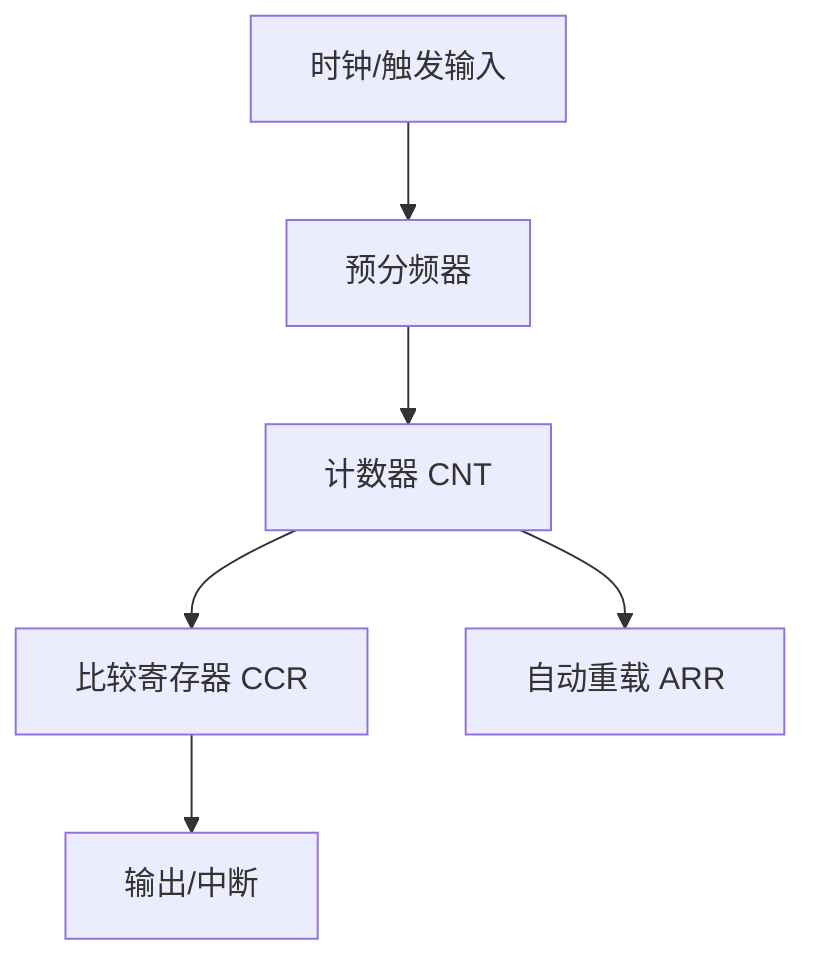

# 2.3 定时器、ADC与DAC外设

## 一、定时器

### 1. STM32F1定时器资源

| 定时器 | 类型 | 功能 |
|-------|------|------|
| TIM1 | 高级定时器 | PWM、输入捕获、编码器、互补输出 |
| TIM2/TIM3/TIM4 | 通用定时器 | 定时计数、PWM、输入捕获 |
| TIM6/TIM7 | 基本定时器 | 定时计数、DAC触发 |

### 2. 定时器基本结构



### 3. 定时器参数

| 参数 | 寄存器 | 说明 |
|-----|-------|------|
| 预分频系数 | PSC | 分频后时钟 = fCK_PSC / (PSC+1) |
| 自动重载值 | ARR | 计数周期 = (ARR+1) 个时钟周期 |
| 当前计数值 | CNT | 当前计数值 |
| 比较值 | CCR1~CCR4 | 输出翻转/捕获值 |

### 4. 定时中断配置

```c
void TIM2_Init(void) {
    TIM_TimeBaseInitTypeDef TIM_TimeBaseStruct;
    NVIC_InitTypeDef NVIC_InitStruct;
    
    // 1. 使能TIM2时钟
    RCC_APB1PeriphClockCmd(RCC_APB1Periph_TIM2, ENABLE);
    
    // 2. 配置定时器
    TIM_TimeBaseStruct.TIM_Prescaler = 7200 - 1;  // 72MHz/7200 = 10KHz
    TIM_TimeBaseStruct.TIM_Period = 10000 - 1;    // 10KHz/10000 = 1Hz
    TIM_TimeBaseStruct.TIM_ClockDivision = TIM_CKD_DIV1;
    TIM_TimeBaseStruct.TIM_CounterMode = TIM_CounterMode_Up;
    TIM_TimeBaseInit(TIM2, &TIM_TimeBaseStruct);
    
    // 3. 清除更新中断标志
    TIM_ClearFlag(TIM2, TIM_FLAG_Update);
    
    // 4. 使能更新中断
    TIM_ITConfig(TIM2, TIM_IT_Update, ENABLE);
    
    // 5. 配置NVIC
    NVIC_InitStruct.NVIC_IRQChannel = TIM2_IRQn;
    NVIC_InitStruct.NVIC_IRQChannelPreemptionPriority = 1;
    NVIC_InitStruct.NVIC_IRQChannelSubPriority = 1;
    NVIC_InitStruct.NVIC_IRQChannelCmd = ENABLE;
    NVIC_Init(&NVIC_InitStruct);
    
    // 6. 启动定时器
    TIM_Cmd(TIM2, ENABLE);
}

// TIM2中断服务函数
void TIM2_IRQHandler(void) {
    if(TIM_GetITStatus(TIM2, TIM_IT_Update) != RESET) {
        // 1秒定时到
        second++;
        
        TIM_ClearITPendingBit(TIM2, TIM_IT_Update);
    }
}
```

### 5. PWM输出配置

```c
void TIM3_PWM_Init(void) {
    TIM_TimeBaseInitTypeDef TIM_TimeBaseStruct;
    TIM_OCInitTypeDef TIM_OCInitStruct;
    GPIO_InitTypeDef GPIO_InitStruct;
    
    // 1. GPIO配置（TIM3_CH1 -> PA6 复用推挽）
    RCC_APB2PeriphClockCmd(RCC_APB2Periph_GPIOA, ENABLE);
    RCC_APB1PeriphClockCmd(RCC_APB1Periph_TIM3, ENABLE);
    
    GPIO_InitStruct.GPIO_Pin = GPIO_Pin_6;
    GPIO_InitStruct.GPIO_Mode = GPIO_Mode_AF_PP;
    GPIO_InitStruct.GPIO_Speed = GPIO_Speed_50MHz;
    GPIO_Init(GPIOA, &GPIO_InitStruct);
    
    // 2. 定时器基础配置
    TIM_TimeBaseStruct.TIM_Prescaler = 72 - 1;    // 1MHz
    TIM_TimeBaseStruct.TIM_Period = 1000 - 1;      // 1KHz
    TIM_TimeBaseStruct.TIM_CounterMode = TIM_CounterMode_Up;
    TIM_TimeBaseInit(TIM3, &TIM_TimeBaseStruct);
    
    // 3. PWM通道配置
    TIM_OCInitStruct.TIM_OCMode = TIM_OCMode_PWM1;
    TIM_OCInitStruct.TIM_OutputState = TIM_OutputState_Enable;
    TIM_OCInitStruct.TIM_Pulse = 500;  // 50%占空比
    TIM_OCInitStruct.TIM_OCPolarity = TIM_OCPolarity_High;
    TIM_OC1Init(TIM3, &TIM_OCInitStruct);
    TIM_OC1PreloadConfig(TIM3, TIM_OCPreload_Enable);
    
    // 4. 启动
    TIM_ARRPreloadConfig(TIM3, ENABLE);
    TIM_Cmd(TIM3, ENABLE);
}

// 设置PWM占空比
void PWM_SetDuty(uint16_t duty) {
    TIM_SetCompare1(TIM3, duty);
}
```

### 6. PWM频率与占空比计算

| 参数 | 公式 | 示例 |
|-----|------|------|
| PWM频率 | fCK_CNT / ((PSC+1) × (ARR+1)) | 72MHz / (72×1000) = 1KHz |
| 占空比 | CCR / (ARR+1) × 100% | 500/1000 = 50% |

### 7. 输入捕获

```c
void TIM1_Capture_Init(void) {
    TIM_ICInitTypeDef TIM_ICInitStruct;
    
    RCC_APB2PeriphClockCmd(RCC_APB2Periph_TIM1 | RCC_APB2Periph_GPIOA, ENABLE);
    
    // PA8 -> TIM1_CH1
    GPIO_InitTypeDef GPIO_InitStruct;
    GPIO_InitStruct.GPIO_Pin = GPIO_Pin_8;
    GPIO_InitStruct.GPIO_Mode = GPIO_Mode_IPD;  // 下拉输入
    GPIO_Init(GPIOA, &GPIO_InitStruct);
    
    // 定时器基础配置
    TIM_TimeBaseInitTypeDef TIM_TimeBaseStruct;
    TIM_TimeBaseStruct.TIM_Prescaler = 72 - 1;
    TIM_TimeBaseStruct.TIM_Period = 0xFFFF;
    TIM_TimeBaseStruct.TIM_CounterMode = TIM_CounterMode_Up;
    TIM_TimeBaseInit(TIM1, &TIM_TimeBaseStruct);
    
    // 输入捕获配置
    TIM_ICInitStruct.TIM_ICPolarity = TIM_ICPolarity_Rising;  // 上升沿
    TIM_ICInitStruct.TIM_ICSelection = TIM_ICSelection_DirectTI;
    TIM_ICInitStruct.TIM_ICPrescaler = TIM_ICPSC_DIV1;
    TIM_ICInitStruct.TIM_ICFilter = 0x00;
    TIM_ICInit(TIM1, TIM_Channel_1, &TIM_ICInitStruct);
    
    // 使能捕获中断
    TIM_ITConfig(TIM1, TIM_IT_CC1, ENABLE);
    
    TIM_Cmd(TIM1, ENABLE);
}
```

## 二、ADC模数转换器

### 1. STM32F1 ADC特性

| 特性 | 说明 |
|-----|------|
| 分辨率 | 12位 |
| 转换时间 | 1μs（最快） |
| 通道数 | 10个外部通道 |
| 采样率 | 最大1MHz |
| 参考电压 | 3.3V |
| 输入电压 | 0~VREF（3.3V） |

### 2. ADC通道映射

| 通道 | GPIO引脚 |
|-----|---------|
| ADC_Channel_0 | PA0 |
| ADC_Channel_1 | PA1 |
| ADC_Channel_2 | PA2 |
| ... | ... |
| ADC_Channel_15 | Internal（温度传感器） |
| ADC_Channel_16 | Internal（内部参考） |

### 3. ADC单次转换

```c
void ADC1_Init(void) {
    ADC_InitTypeDef ADC_InitStruct;
    GPIO_InitTypeDef GPIO_InitStruct;
    
    // 1. GPIO配置（模拟输入）
    RCC_APB2PeriphClockCmd(RCC_APB2Periph_GPIOA, ENABLE);
    RCC_APB2PeriphClockCmd(RCC_APB2Periph_ADC1, ENABLE);
    RCC_ADCCLKConfig(RCC_PCLK2_Div6);  // ADC时钟 = 72MHz/6 = 12MHz
    
    GPIO_InitStruct.GPIO_Pin = GPIO_Pin_0;
    GPIO_InitStruct.GPIO_Mode = GPIO_Mode_AIN;  // 模拟输入
    GPIO_Init(GPIOA, &GPIO_InitStruct);
    
    // 2. ADC配置
    ADC_InitStruct.ADC_Mode = ADC_Mode_Independent;
    ADC_InitStruct.ADC_ScanConvMode = DISABLE;  // 单次转换
    ADC_InitStruct.ADC_ContinuousConvMode = DISABLE;
    ADC_InitStruct.ADC_ExternalTrigConv = ADC_ExternalTrigConv_None;
    ADC_InitStruct.ADC_DataAlign = ADC_DataAlign_Right;
    ADC_InitStruct.ADC_NbrOfChannel = 1;
    ADC_Init(ADC1, &ADC_InitStruct);
    
    // 3. 使能ADC
    ADC_Cmd(ADC1, ENABLE);
    
    // 4. 复位校准
    ADC_ResetCalibration(ADC1);
    while(ADC_GetResetCalibrationStatus(ADC1));
    
    // 5. 启动校准
    ADC_StartCalibration(ADC1);
    while(ADC_GetCalibrationStatus(ADC1));
}

uint16_t ADC_GetValue(uint8_t channel) {
    // 配置通道
    ADC_RegularChannelConfig(ADC1, channel, 1, ADC_SampleTime_239Cycles5);
    
    // 启动转换
    ADC_SoftwareStartConvCmd(ADC1, ENABLE);
    
    // 等待转换完成
    while(ADC_GetFlagStatus(ADC1, ADC_FLAG_EOC) == RESET);
    
    // 读取结果
    return ADC_GetConversionValue(ADC1);
}

// 转换为电压值
float ADC_ToVoltage(uint16_t adc_value) {
    return (float)adc_value * 3.3f / 4096;
}
```

### 4. ADC连续转换+DMA

```c
uint16_t ADC_Values[10];  // DMA缓冲区

void ADC1_DMA_Init(void) {
    // ... ADC初始化（略）
    
    // 配置为连续转换模式
    ADC_InitStruct.ADC_ContinuousConvMode = ENABLE;
    ADC_InitStruct.ADC_ScanConvMode = ENABLE;
    ADC_InitStruct.ADC_NbrOfChannel = 3;
    ADC_Init(ADC1, &ADC_InitStruct);
    
    // 配置规则通道（3个通道）
    ADC_RegularChannelConfig(ADC1, ADC_Channel_0, 1, ADC_SampleTime_239Cycles5);
    ADC_RegularChannelConfig(ADC1, ADC_Channel_1, 2, ADC_SampleTime_239Cycles5);
    ADC_RegularChannelConfig(ADC1, ADC_Channel_2, 3, ADC_SampleTime_239Cycles5);
    
    // 使能DMA请求
    ADC_DMACmd(ADC1, ENABLE);
    
    // DMA配置
    DMA_InitTypeDef DMA_InitStruct;
    RCC_AHBPeriphClockCmd(RCC_AHBPeriph_DMA1, ENABLE);
    
    DMA_InitStruct.DMA_PeripheralBaseAddr = (uint32_t)&ADC1->DR;
    DMA_InitStruct.DMA_MemoryBaseAddr = (uint32_t)ADC_Values;
    DMA_InitStruct.DMA_DIR = DMA_PeripheralToMemory;
    DMA_InitStruct.DMA_BufferSize = 10;
    DMA_InitStruct.DMA_PeripheralInc = DMA_PeripheralInc_Disable;
    DMA_InitStruct.DMA_MemoryInc = DMA_MemoryInc_Enable;
    DMA_InitStruct.DMA_PeripheralDataWidth = DMA_PeripheralDataWidth_Word;
    DMA_InitStruct.DMA_MemoryDataWidth = DMA_MemoryDataWidth_HalfWord;
    DMA_InitStruct.DMA_Mode = DMA_Mode_Circular;  // 循环模式
    DMA_InitStruct.DMA_Priority = DMA_Priority_High;
    DMA_Init(DMA1_Channel1, &DMA_InitStruct);
    
    DMA_Cmd(DMA1_Channel1, ENABLE);
    
    // 启动ADC
    ADC_Cmd(ADC1, ENABLE);
    ADC_StartCalibration(ADC1);
    ADC_SoftwareStartConvCmd(ADC1, ENABLE);
}
```

## 三、DAC数模转换器

### 1. STM32F1 DAC特性

| 特性 | 说明 |
|-----|------|
| 分辨率 | 12位 |
| 输出电压 | 0~3.3V |
| 通道数 | 2个（DAC1、DAC2） |
| 触发方式 | 软件触发/外部触发 |

### 2. DAC配置示例

```c
void DAC_Init(void) {
    GPIO_InitTypeDef GPIO_InitStruct;
    
    // 1. GPIO配置（DAC输出引脚：PA4=DAC1, PA5=DAC2）
    RCC_APB1PeriphClockCmd(RCC_APB1Periph_DAC, ENABLE);
    RCC_APB2PeriphClockCmd(RCC_APB2Periph_GPIOA, ENABLE);
    
    GPIO_InitStruct.GPIO_Pin = GPIO_Pin_4;
    GPIO_InitStruct.GPIO_Mode = GPIO_Mode_AIN;  // 模拟模式
    GPIO_Init(GPIOA, &GPIO_InitStruct);
    
    // 2. DAC配置
    DAC_InitTypeDef DAC_InitStruct;
    DAC_InitStruct.DAC_Trigger = DAC_Trigger_Software;
    DAC_InitStruct.DAC_WaveGeneration = DAC_WaveGeneration_None;
    DAC_InitStruct.DAC_OutputBuffer = DAC_OutputBuffer_Enable;
    DAC_Init(DAC_Channel_1, &DAC_InitStruct);
    
    // 3. 使能DAC通道
    DAC_Cmd(DAC_Channel_1, ENABLE);
}

void DAC_SetVoltage(float voltage) {
    // 转换为DAC值
    uint16_t dac_value = (uint16_t)(voltage * 4096 / 3.3);
    if(dac_value > 4095) dac_value = 4095;
    
    DAC_SetChannel1Data(DAC_Align_12b_R, dac_value);
    DAC_SoftwareTriggerCmd(DAC_Channel_1, ENABLE);
}
```

### 3. DAC应用场景

- 模拟电压输出
- 音频信号生成（PWM更常用）
- 电机模拟控制
- 传感器激励信号

## 四、综合应用示例

### 数据采集系统

```c
// 数据采集系统：ADC + 定时器 + DMA
// 1kHz采样率，采集3个通道

#define SAMPLE_RATE 1000
#define SAMPLES_PER_BUFFER 100

uint16_t ADC_Buffer[3][SAMPLES_PER_BUFFER];
volatile uint8_t buffer_ready = 0;

void Data_Acq_Init(void) {
    // TIM2触发ADC
    TIM_TimeBaseInitTypeDef TIM_TimeBaseStruct;
    
    RCC_APB1PeriphClockCmd(RCC_APB1Periph_TIM2, ENABLE);
    
    TIM_TimeBaseStruct.TIM_Prescaler = 72 - 1;  // 1MHz
    TIM_TimeBaseStruct.TIM_Period = 1000 - 1;    // 1KHz
    TIM_TimeBaseStruct.TIM_ClockDivision = TIM_CKD_DIV1;
    TIM_TimeBaseStruct.TIM_CounterMode = TIM_CounterMode_Up;
    TIM_TimeBaseInit(TIM2, &TIM_TimeBaseStruct);
    
    // 选择TIM2 TRGO作为ADC触发
    TIM_SelectOutputTrigger(TIM2, TIM_TRGOSource_Update);
    
    TIM_Cmd(TIM2, ENABLE);
    
    // ADC + DMA初始化（见前面示例）
    ADC1_DMA_Init();
}
```

---

**导航**：上一节 [[2.2-GPIO与中断控制器]] · [[MOC - 第2章\|返回章节导航]]