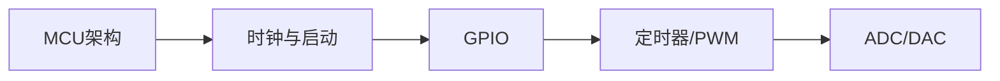
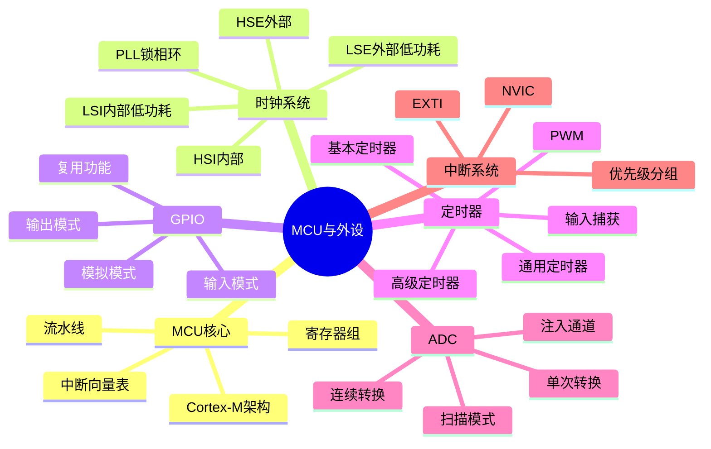

# 第2章 嵌入式硬件核心：MCU与外设

> [!abstract] 本章定位
> 本章深入MCU内部架构，学习各类外设的原理与配置方法，为后续驱动开发打下基础。

## 学习主线

## 章节内容

- [[2.1-MCU核心架构与启动流程]]：ARM架构、时钟树、Boot流程
- [[2.2-GPIO与中断控制器]]：GPIO配置、EXTI中断、NVIC
- [[2.3-定时器、ADC与DAC外设]]：定时器/PWM、ADC采样、DAC输出

## 核心考点

> [!important] 必掌握
> 1. Cortex-M内核架构、寄存器组、寻址模式
> 2. 时钟源选择与时钟树配置（HSI/HSE/LSI/LSE）
> 3. 启动流程：BootLoader → SystemInit → main
> 4. GPIO六种模式的区别与使用场景
> 5. EXTI外部中断配置与NVIC优先级分组
> 6. 定时器的计数模式、PWM输出、输入捕获
> 7. ADC的转换模式、DMA传输、校准

## 知识图谱

## 复习自测

> [!question] 自测题
> 1. Cortex-M3的三级流水线是什么？
> 2. STM32的时钟树是怎样的？PLL如何配置？
> 3. 描述MCU的启动流程。
> 4. GPIO的六种模式分别是什么？适用场景？
> 5. NVIC的优先级分组有哪几种？
> 6. 如何配置定时器输出PWM？
> 7. ADC的DMA模式如何配置？