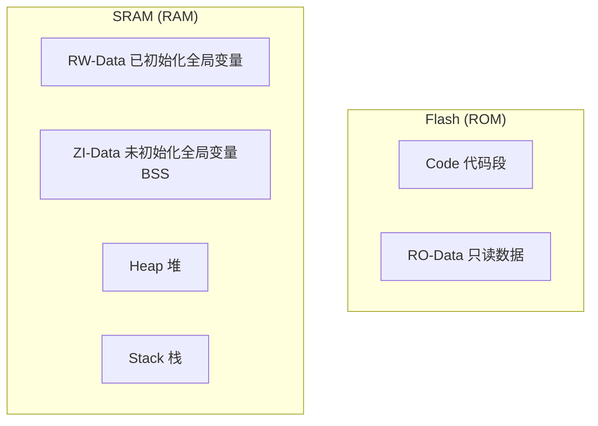

# 3.1 嵌入式C语言特性与内存模型

## 一、嵌入式C语言特殊关键字

### 1. volatile关键字

#### 作用

> [!important] volatile
> 告诉编译器**不要优化**对该变量的读取和写入操作，每次都必须真正从内存读取或写入。

#### 为什么需要volatile

```c
// 错误示例：编译器优化导致问题
int flag = 0;  // 没有volatile

// 中断中修改flag
void EXTI_IRQHandler(void) {
    flag = 1;  // 编译器可能优化掉，不真正写入内存
}

// 主循环检查flag
void main(void) {
    while(1) {
        if(flag) {  // 编译器可能直接用寄存器缓存的旧值
            do_something();
            flag = 0;
        }
    }
}
```

#### 正确用法

```c
// 正确示例
volatile int flag = 0;  // 使用volatile

// 中断中修改flag
void EXTI_IRQHandler(void) {
    flag = 1;  // 真正写入内存
}

// 主循环检查flag
void main(void) {
    while(1) {
        if(flag) {  // 每次从内存读取最新值
            do_something();
            flag = 0;
        }
    }
}
```

#### 使用场景

| 场景 | 示例 |
|-----|------|
| 中断与主循环共享变量 | `volatile int flag` |
| 多任务共享变量（RTOS） | `volatile uint32_t counter` |
| 硬件寄存器 | `volatile uint32_t *reg = (volatile uint32_t*)0x40021000` |
| DMA缓冲区 | `volatile uint16_t dma_buffer[100]` |
| 多线程共享变量 | `volatile int shared_data` |

#### volatile与const

| 关键字 | 含义 | 示例 |
|-------|------|------|
| volatile | 不优化读写 | `volatile int flag` |
| const | 只读变量 | `const int MAX = 100` |
| const volatile | 只读+不优化 | `const volatile uint32_t status` |

### 2. register关键字

```c
// 请求将变量放入寄存器（编译器可能忽略）
register int counter = 0;
```

> [!tip] 现代编译器优化能力很强，通常不需要手动使用register

### 3. typedef与struct

```c
// 嵌入式中常用typedef定义硬件相关类型
typedef volatile uint32_t reg32_t;
typedef volatile uint16_t reg16_t;
typedef volatile uint8_t reg8_t;

// GPIO寄存器结构体
typedef struct {
    reg32_t MODER;    // 模式寄存器
    reg32_t OTYPER;   // 输出类型寄存器
    reg32_t OSPEEDR;  // 输出速度寄存器
    reg32_t PUPDR;    // 上下拉寄存器
    reg32_t IDR;      // 输入数据寄存器
    reg32_t ODR;      // 输出数据寄存器
    reg32_t BSRR;     // 位设置/清除寄存器
    reg32_t LCKR;     // 锁定寄存器
    reg32_t AFRL;     // 复用功能低寄存器
    reg32_t AFRH;     // 复用功能高寄存器
} GPIO_TypeDef;
```

## 二、嵌入式内存模型

### 1. 内存区域划分



| 区域 | 存储位置 | 说明 | 示例 |
|-----|---------|------|------|
| Code/Text | Flash | 程序代码 | 函数机器码 |
| RO-Data/Const | Flash | 只读常量 | `const char *str = "Hello"` |
| RW-Data | Flash→SRAM | 已初始化全局变量 | `int count = 10` |
| ZI-Data/BSS | SRAM | 未初始化全局/静态变量 | `static int sum` |
| Heap | SRAM | 动态分配内存 | `malloc()/free()` |
| Stack | SRAM | 函数调用栈/局部变量 | 局部变量、返回地址 |

### 2. 内存布局示例

```c
// 全局变量
int g_count = 100;          // RW-Data (Flash→SRAM)
int g_sum;                  // ZI-Data/BSS (SRAM)
static int s_flag = 0;      // ZI-Data/BSS (SRAM)
const char *g_version = "1.0";  // RO-Data (Flash)

// 局部变量
void function(void) {
    int local_var = 10;      // Stack (SRAM)
    static int local_static = 20;  // ZI-Data/BSS (SRAM)
    char *ptr = malloc(100); // Heap (SRAM)
}
```

### 3. 栈与堆

| 对比项 | 栈 | 堆 |
|-------|------|------|
| 分配方式 | 自动分配/释放 | 手动分配/释放 |
| 增长方向 | 从高地址向低地址 | 从低地址向高地址 |
| 速度 | 快 | 慢 |
| 大小 | 编译时确定 | 运行时可变 |
| 碎片 | 无 | 可能有 |
| 溢出风险 | 栈溢出（无限递归） | 内存泄漏（忘记释放） |
| 使用 | 局部变量、函数调用 | 动态数据结构 |

### 4. 内存布局示意

```
高地址
┌─────────────────┐
│    Stack 栈      │  ← SP
│  (函数调用栈)    │
├─────────────────┤
│     (空)         │
├─────────────────┤
│    Heap 堆       │  ← 向上增长
│  (动态分配)      │
├─────────────────┤
│   ZI-Data/BSS   │  未初始化全局/静态变量
├─────────────────┤
│   RW-Data       │  已初始化全局变量
├─────────────────┤
│   RO-Data       │  只读常量
├─────────────────┤
│   Code/Text     │  程序代码
└─────────────────┘
低地址
```

### 5. 链接脚本

```ld
/* STM32F103 linker script示例 */
MEMORY
{
    FLASH (rx)  : ORIGIN = 0x08000000, LENGTH = 64K
    RAM (rwx)   : ORIGIN = 0x20000000, LENGTH = 20K
}

SECTIONS
{
    .isr_vector : { KEEP(*(.isr_vector)) } > FLASH
    .text : { *(.text*) } > FLASH
    .rodata : { *(.rodata*) } > FLASH
    .data : { *(.data*) } > RAM AT > FLASH
    .bss : { *(.bss*) } > RAM
    ._user_heap_stack :
    {
        . = ALIGN(8);
        PROVIDE(end = .);
        PROVIDE(_end = .);
        . = . + 0x400;    /* Heap size */
        . = . + 0x1000;   /* Stack size */
    } > RAM
}
```

## 三、嵌入式编程规范

### 1. 数据类型定义

```c
// 标准整数类型
typedef unsigned char  uint8_t;
typedef unsigned short uint16_t;
typedef unsigned int   uint32_t;
typedef unsigned long  uint64_t;

typedef signed char    int8_t;
typedef signed short   int16_t;
typedef signed int     int32_t;
typedef signed long    int64_t;

// 布尔类型
typedef int bool_t;
#define TRUE  1
#define FALSE 0
```

### 2. 编程最佳实践

| 实践 | 说明 |
|-----|------|
| 使用固定宽度类型 | `uint32_t` 而非 `int` |
| 避免位运算不确定 | 移位使用无符号类型 |
| 初始化所有变量 | 防止未定义行为 |
| 检查指针有效性 | NULL检查 |
| 避免内存泄漏 | malloc/free配对 |
| 使用const修饰 | 只读变量用const |
| 函数短小精悍 | 单一职责 |

### 3. 防御性编程

```c
// 示例：安全的缓冲区复制
void safe_copy(uint8_t *dst, uint8_t *src, uint16_t dst_size, uint16_t src_size) {
    if(dst == NULL || src == NULL) return;
    if(dst_size == 0 || src_size == 0) return;
    
    uint16_t copy_size = (src_size < dst_size) ? src_size : dst_size;
    memcpy(dst, src, copy_size);
}

// 示例：带超时的循环
uint32_t wait_for_flag(volatile uint32_t *flag, uint32_t timeout_ms) {
    uint32_t elapsed = 0;
    while(*flag == 0) {
        if(elapsed >= timeout_ms) return 0;
        delay_ms(1);
        elapsed++;
    }
    return 1;
}
```

---

**导航**：[[MOC - 第3章\|返回章节导航]] · 下一节 [[3.2-直接寄存器操作与位操作]]