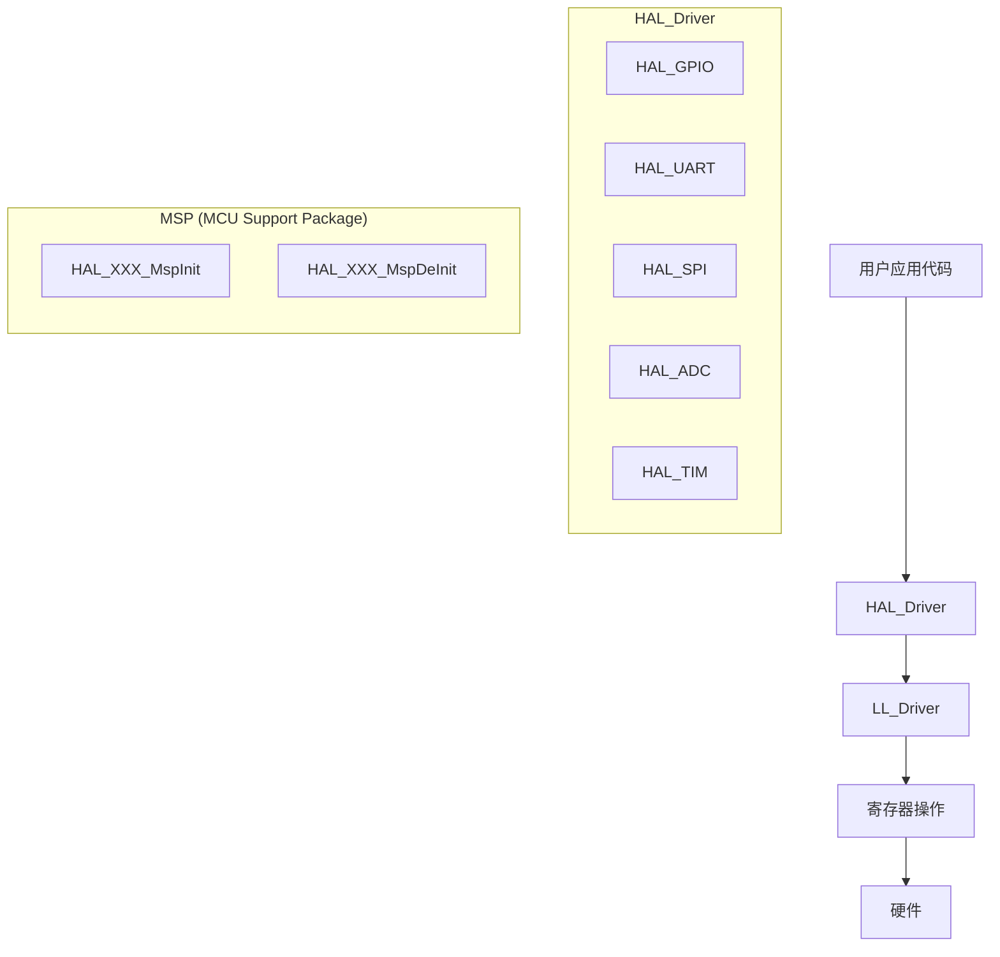
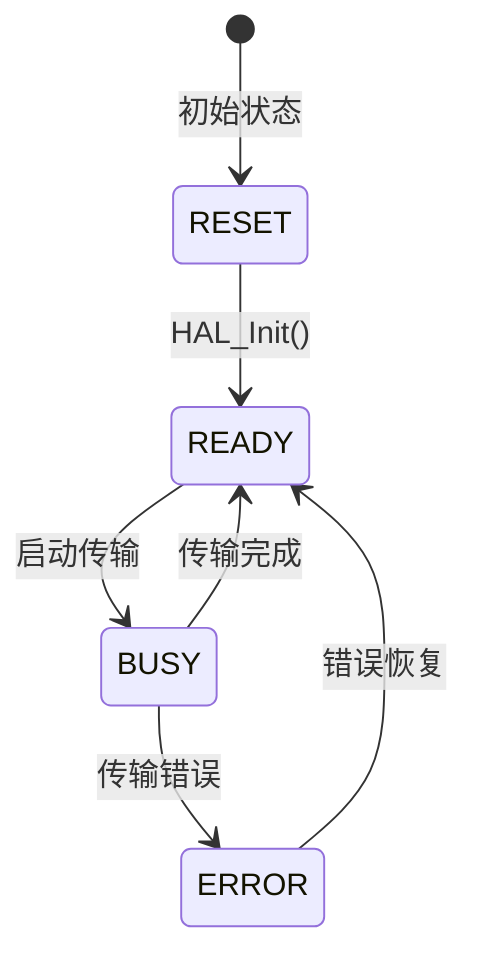

# 3.3 HAL库与驱动开发框架

## 一、HAL库概述

### 1. HAL库的层次结构



### 2. HAL库优点

| 优点 | 说明 |
|-----|------|
| 移植性好 | 不同MCU系列兼容 |
| 代码规范 | 统一的API接口 |
| 功能完善 | 覆盖所有外设 |
| 配合CubeMX | 图形化配置生成代码 |
| 支持RTOS | 集成RTOS支持 |

### 3. HAL库文件结构

```
HAL库文件：
├── Inc/
│   ├── stm32f1xx_hal_conf.h      # 配置文件
│   ├── stm32f1xx_hal_def.h       # 通用定义
│   └── stm32f1xx_hal.h           # 主头文件
├── Src/
│   ├── stm32f1xx_hal_gpio.c      # GPIO驱动
│   ├── stm32f1xx_hal_uart.c      # UART驱动
│   ├── stm32f1xx_hal_spi.c       # SPI驱动
│   ├── stm32f1xx_hal_i2c.c       # I2C驱动
│   ├── stm32f1xx_hal_adc.c       # ADC驱动
│   ├── stm32f1xx_hal_timer.c     # 定时器驱动
│   └── ...                        # 其他外设
└── Templates/
    └── stm32f1xx_hal_msp.c       # MSP模板
```

## 二、HAL库核心概念

### 1. Handle结构体

```c
// GPIO_HandleTypeDef
typedef struct {
    GPIO_TypeDef *Instance;     // 外设基地址
    GPIO_InitTypeDef Init;      // 初始化参数
    uint8_t State;              // 外设状态
    void *Lock;                 // 互斥锁
} GPIO_HandleTypeDef;

// UART_HandleTypeDef
typedef struct {
    USART_TypeDef *Instance;    // 外设基地址
    UART_InitTypeDef Init;      // 初始化参数
    uint8_t State;              // 外设状态
    uint8_t Mode;               // 工作模式
    void *RxState;              // 接收状态
    void *TxState;              // 发送状态
    uint8_t *pTxBuffPtr;        // 发送缓冲区指针
    uint16_t TxXferSize;        // 发送数据大小
    uint16_t TxXferCount;       // 已发送数据计数
    uint8_t *pRxBuffPtr;        // 接收缓冲区指针
    uint16_t RxXferSize;        // 接收数据大小
    uint16_t RxXferCount;       // 已接收数据计数
    uint32_t ErrorCode;         // 错误码
    void *Lock;                 // 互斥锁
} UART_HandleTypeDef;
```

### 2. 状态机



### 3. 三种传输模式

| 模式 | 说明 | 函数 |
|-----|------|------|
| 阻塞模式 | CPU等待完成 | `HAL_UART_Transmit()` |
| 中断模式 | 中断处理 | `HAL_UART_Transmit_IT()` |
| DMA模式 | DMA传输 | `HAL_UART_Transmit_DMA()` |

## 三、MSP回调机制

### 1. MSP_Init / MSP_DeInit

```c
// stm32f1xx_hal_msp.c
#include "stm32f1xx_hal.h"

// GPIO MSP初始化
void HAL_GPIO_MspInit(GPIO_TypeDef *GPIOx, uint16_t GPIO_Pin) {
    GPIO_InitTypeDef GPIO_InitStruct;
    
    // 使能时钟
    if(GPIOx == GPIOA) __HAL_RCC_GPIOA_CLK_ENABLE();
    else if(GPIOx == GPIOB) __HAL_RCC_GPIOB_CLK_ENABLE();
    else if(GPIOx == GPIOC) __HAL_RCC_GPIOC_CLK_ENABLE();
    
    // 配置GPIO（如果需要中断）
    if(GPIO_Pin == GPIO_PIN_0) {
        GPIO_InitStruct.Pin = GPIO_Pin;
        GPIO_InitStruct.Mode = GPIO_MODE_IT_RISING;
        GPIO_InitStruct.Pull = GPIO_NOPULL;
        HAL_GPIO_Init(GPIOx, &GPIO_InitStruct);
        
        // 配置NVIC
        HAL_NVIC_SetPriority(EXTI0_IRQn, 2, 0);
        HAL_NVIC_EnableIRQ(EXTI0_IRQn);
    }
}

// UART MSP初始化
void HAL_UART_MspInit(UART_HandleTypeDef *huart) {
    GPIO_InitTypeDef GPIO_InitStruct;
    
    if(huart->Instance == USART1) {
        // 使能时钟
        __HAL_RCC_USART1_CLK_ENABLE();
        __HAL_RCC_GPIOA_CLK_ENABLE();
        
        // 配置GPIO
        GPIO_InitStruct.Pin = GPIO_PIN_9;       // TX
        GPIO_InitStruct.Mode = GPIO_MODE_AF_PP;
        GPIO_InitStruct.Speed = GPIO_SPEED_FREQ_HIGH;
        HAL_GPIO_Init(GPIOA, &GPIO_InitStruct);
        
        GPIO_InitStruct.Pin = GPIO_PIN_10;     // RX
        GPIO_InitStruct.Mode = GPIO_MODE_INPUT;
        GPIO_InitStruct.Pull = GPIO_NOPULL;
        HAL_GPIO_Init(GPIOA, &GPIO_InitStruct);
    }
}

// 外设MSP反初始化
void HAL_UART_MspDeInit(UART_HandleTypeDef *huart) {
    if(huart->Instance == USART1) {
        __HAL_RCC_USART1_CLK_DISABLE();
        HAL_GPIO_DeInit(GPIOA, GPIO_PIN_9 | GPIO_PIN_10);
    }
}
```

### 2. 回调调用流程

```
HAL_UART_Init()
    → HAL_UART_MspInit()  // 配置时钟、GPIO、中断
    → 配置UART寄存器
    → 返回

HAL_UART_Transmit_IT()
    → 配置UART传输
    → 使能UART TXE中断
    → 返回
    
UART IRQ Handler
    → HAL_UART_IRQHandler()
    → HAL_UART_TxCpltCallback()  // 传输完成回调
```

## 四、HAL库开发模板

### 1. 完整的GPIO驱动

```c
// gpio.c
#include "gpio.h"

// 全局句柄
GPIO_HandleTypeDef led_gpio;

// GPIO初始化
void MX_GPIO_Init(void) {
    GPIO_InitTypeDef GPIO_InitStruct = {0};
    
    // 使能GPIOC时钟
    __HAL_RCC_GPIOC_CLK_ENABLE();
    
    // 配置LED引脚 (PC13)
    HAL_GPIO_WritePin(GPIOC, GPIO_PIN_13, GPIO_PIN_SET);
    
    GPIO_InitStruct.Pin = GPIO_PIN_13;
    GPIO_InitStruct.Mode = GPIO_MODE_OUTPUT_PP;
    GPIO_InitStruct.Pull = GPIO_NOPULL;
    GPIO_InitStruct.Speed = GPIO_SPEED_FREQ_LOW;
    HAL_GPIO_Init(GPIOC, &GPIO_InitStruct);
    
    // 配置KEY引脚 (PA0)
    __HAL_RCC_GPIOA_CLK_ENABLE();
    
    GPIO_InitStruct.Pin = GPIO_PIN_0;
    GPIO_InitStruct.Mode = GPIO_MODE_INPUT;
    GPIO_InitStruct.Pull = GPIO_PULLUP;
    HAL_GPIO_Init(GPIOA, &GPIO_InitStruct);
}

// LED控制
void LED_Toggle(void) {
    HAL_GPIO_TogglePin(GPIOC, GPIO_PIN_13);
}

void LED_Set(uint8_t state) {
    HAL_GPIO_WritePin(GPIOC, GPIO_PIN_13, state ? GPIO_PIN_RESET : GPIO_PIN_SET);
}

// KEY读取
uint8_t KEY_Read(void) {
    return (HAL_GPIO_ReadPin(GPIOA, GPIO_PIN_0) == GPIO_PIN_RESET) ? 1 : 0;
}
```

### 2. 完整的UART驱动

```c
// uart.c
#include "uart.h"

UART_HandleTypeDef huart1;

void MX_USART1_UART_Init(void) {
    huart1.Instance = USART1;
    huart1.Init.BaudRate = 115200;
    huart1.Init.WordLength = UART_WORDLENGTH_8B;
    huart1.Init.StopBits = UART_STOPBITS_1;
    huart1.Init.Parity = UART_PARITY_NONE;
    huart1.Init.Mode = UART_MODE_TX_RX;
    huart1.Init.HwFlowCtl = UART_HWCONTROL_NONE;
    huart1.Init.OverSampling = UART_OVERSAMPLING_16;
    
    if(HAL_UART_Init(&huart1) != HAL_OK) {
        Error_Handler();
    }
}

// 阻塞发送
void UART_SendData(uint8_t *data, uint16_t len) {
    HAL_UART_Transmit(&huart1, data, len, HAL_MAX_DELAY);
}

// 中断发送
void UART_SendData_IT(uint8_t *data, uint16_t len) {
    HAL_UART_Transmit_IT(&huart1, data, len);
}

// 中断接收回调
void HAL_UART_RxCpltCallback(UART_HandleTypeDef *huart) {
    if(huart->Instance == USART1) {
        // 处理接收到的数据
        extern uint8_t rx_data;
        HAL_UART_Receive_IT(&huart1, &rx_data, 1);
    }
}
```

### 3. 完整的定时器PWM驱动

```c
// pwm.c
#include "pwm.h"

TIM_HandleTypeDef htim3;

void MX_TIM3_Init(void) {
    TIM_OC_InitTypeDef sConfigOC = {0};
    
    htim3.Instance = TIM3;
    htim3.Init.Prescaler = 72 - 1;
    htim3.Init.CounterMode = TIM_COUNTERMODE_UP;
    htim3.Init.Period = 1000 - 1;
    htim3.Init.ClockDivision = TIM_CLOCKDIVISION_DIV1;
    htim3.Init.AutoReloadPreload = TIM_AUTORELOAD_PRELOAD_DISABLE;
    
    if(HAL_TIM_PWM_Init(&htim3) != HAL_OK) {
        Error_Handler();
    }
    
    sConfigOC.OCMode = TIM_OCMODE_PWM1;
    sConfigOC.Pulse = 500;
    sConfigOC.OCPolarity = TIM_OCPOLARITY_HIGH;
    sConfigOC.OCFastMode = TIM_OCFAST_DISABLE;
    
    if(HAL_TIM_PWM_ConfigChannel(&htim3, &sConfigOC, TIM_CHANNEL_1) != HAL_OK) {
        Error_Handler();
    }
    
    HAL_TIM_PWM_Start(&htim3, TIM_CHANNEL_1);
}

// 设置占空比
void PWM_SetDuty(uint16_t duty) {
    __HAL_TIM_SET_COMPARE(&htim3, TIM_CHANNEL_1, duty);
}
```

## 五、CubeMX代码生成

### 1. CubeMX配置步骤

1. 选择MCU型号
2. 配置引脚和外设
3. 设置时钟
4. 配置中断优先级
5. 设置工程参数
6. 生成代码

### 2. 生成的文件结构

```
Project/
├── Core/
│   ├── Inc/
│   │   ├── main.h
│   │   ├── stm32f1xx_hal_conf.h
│   │   ├── stm32f1xx_it.h
│   │   └── sys.h
│   └── Src/
│       ├── main.c
│       ├── gpio.c
│       ├── uart.c
│       ├── tim.c
│       ├── stm32f1xx_hal_msp.c
│       ├── stm32f1xx_it.c
│       └── system_stm32f1xx.c
├── MDK-ARM/
│   └── Project.uvprojx
└── README.md
```

### 3. main.c模板

```c
#include "main.h"
#include "gpio.h"
#include "usart.h"
#include "tim.h"

void SystemClock_Config(void);

int main(void) {
    HAL_Init();
    SystemClock_Config();
    
    MX_GPIO_Init();
    MX_USART1_UART_Init();
    MX_TIM3_Init();
    
    while(1) {
        HAL_GPIO_TogglePin(GPIOC, GPIO_PIN_13);
        HAL_Delay(500);
    }
}

void HAL_PPP_MspInit(void) {
    // CubeMX生成的MSP初始化代码
}

void Error_Handler(void) {
    __disable_irq();
    while(1) {}
}
```

## 六、调试技巧

### 1. 添加调试打印

```c
// 添加调试打印宏
#define DEBUG_LOG(fmt, ...) do { \
    printf("[DEBUG] " fmt "\r\n", ##__VA_ARGS__); \
} while(0)

// 使用示例
DEBUG_LOG("System started, clock: %lu Hz", SystemCoreClock);
```

### 2. 使用断点

| 方法 | 说明 |
|-----|------|
| SWD调试器 | 硬件断点 |
| Software Breakpoint | 软件断点（有限） |
| 条件断点 | 满足条件时暂停 |
| 数据断点 | 访问特定地址时暂停 |

### 3. 查看寄存器

```
调试器中可以查看：
- 所有MCU寄存器
- 外设寄存器
- 内存区域
- 堆栈内容
- 变量值
```

---

**导航**：上一节 [[3.2-直接寄存器操作与位操作]] · [[MOC - 第3章\|返回章节导航]]