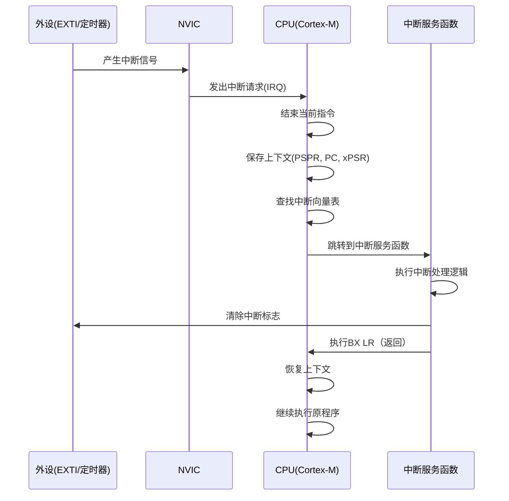
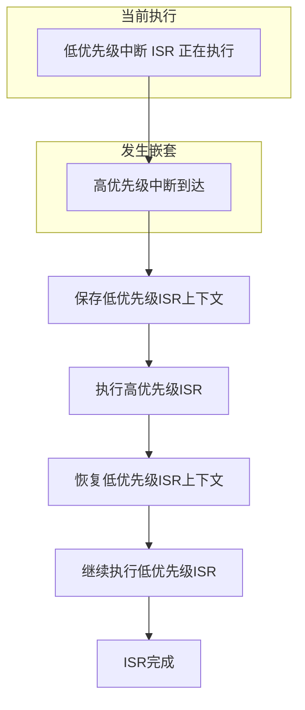

# 4.1 中断系统与NVIC

## 一、中断基础

### 1. 中断的概念

> [!quote] 中断
> 是CPU在执行当前程序时，由于外部或内部事件的发生，暂时停止当前程序的执行，转而去处理该事件，处理完毕后再返回原程序继续执行的过程。

### 2. 中断的作用

| 作用 | 说明 |
|-----|------|
| 响应外部事件 | 按键、传感器等 |
| 定时处理 | 周期性任务 |
| 数据传输 | 串口、SPI等数据收发 |
| 故障处理 | 异常、错误检测 |

### 3. 中断 vs 查询

| 对比项 | 中断 | 查询 |
|-------|------|------|
| CPU效率 | 高（不忙等） | 低（持续检查） |
| 响应速度 | 快（硬件级） | 慢（软件循环） |
| 实时性 | 好 | 差 |
| 实现复杂度 | 较高 | 简单 |
| 可靠性 | 高 | 低 |

### 4. 中断分类

| 分类 | 说明 | 示例 |
|-----|------|------|
| 外部中断（EXTI） | 外部引脚触发 | 按键、传感器 |
| 定时器中断 | 定时器溢出 | 定时任务 |
| 通信中断 | 通信事件 | 串口收发、SPI收发 |
| ADC中断 | ADC转换完成 | 数据采集 |
| 异常中断 | 程序异常 | HardFault、MemManage |

## 二、中断处理流程

### 1. 完整流程



### 2. 中断向量表

```c
// 中断向量表（部分）
__Vectors:
    .word _estack               // 0x00: 初始MSP值
    .word Reset_Handler         // 0x04: 复位
    .word NMI_Handler           // 0x08: NMI
    .word HardFault_Handler     // 0x0C: 硬件错误
    .word MemManage_Handler     // 0x10: 内存管理
    .word BusFault_Handler      // 0x14: 总线错误
    .word UsageFault_Handler    // 0x18: 使用错误
    .word 0                     // 0x1C-0x2B: 保留
    .word SVC_Handler           // 0x2C: SVC
    .word DebugMon_Handler      // 0x30: 调试监控
    .word 0                     // 0x34: 保留
    .word PendSV_Handler        // 0x38: PendSV
    .word SysTick_Handler       // 0x3C: SysTick
    // 外部中断（STM32）
    .word WWDG_IRQHandler        // 0x40
    .word PVD_IRQHandler        // 0x44
    .word TAMPER_IRQHandler     // 0x48
    .word RTC_IRQHandler        // 0x4C
    .word FLASH_IRQHandler      // 0x50
    .word RCC_IRQHandler        // 0x54
    .word EXTI0_IRQHandler      // 0x58: EXTI线0
    .word EXTI1_IRQHandler      // 0x5C: EXTI线1
    // ... 更多中断
```

### 3. 中断服务函数模板

```c
// 中断服务函数的标准模板
void EXTI0_IRQHandler(void) {
    // 1. 检查中断标志
    if(EXTI_GetITStatus(EXTI_Line0) != RESET) {
        // 2. 执行中断处理逻辑
        // ... 快速处理，避免中断嵌套
        
        // 3. 清除中断标志（必须！）
        EXTI_ClearITPendingBit(EXTI_Line0);
    }
}
```

> [!warning] 重要
> - 中断服务函数必须尽量简短、快速
> - 必须清除中断标志，否则会重复触发
> - 不要在中断中使用阻塞操作
> - 使用volatile修饰共享变量

## 三、NVIC配置

### 1. NVIC寄存器

| 寄存器 | 说明 |
|-------|------|
| ISER | 中断使能 |
| ICER | 中断禁用 |
| ISPR | 中断挂起 |
| ICPR | 中断解挂起 |
| IPR[0~59] | 中断优先级 |
| STIR | 软件触发中断 |

### 2. 优先级分组

```
NVIC优先级寄存器IPR格式（每组4位）：
bit[7:4]: 抢占优先级
bit[3:0]: 子优先级

优先级分组决定了抢占和子优先级的位数分配：
```

| 分组 | 抢占位 | 子优先级位 | 说明 |
|-----|-------|----------|------|
| NVIC_PriorityGroup_0 | 0位 | 4位 | 无抢占 |
| NVIC_PriorityGroup_1 | 1位 | 3位 | 2级抢占，8级子 |
| NVIC_PriorityGroup_2 | 2位 | 2位 | 4级抢占，4级子 |
| NVIC_PriorityGroup_3 | 3位 | 1位 | 8级抢占，2级子 |
| NVIC_PriorityGroup_4 | 4位 | 0位 | 16级抢占 |

### 3. NVIC配置步骤

```c
// 步骤1：设置优先级分组
NVIC_PriorityGroupConfig(NVIC_PriorityGroup_2);

// 步骤2：配置具体中断
NVIC_InitTypeDef NVIC_InitStruct;

NVIC_InitStruct.NVIC_IRQChannel = EXTI0_IRQn;
NVIC_InitStruct.NVIC_IRQChannelPreemptionPriority = 0;  // 最高抢占
NVIC_InitStruct.NVIC_IRQChannelSubPriority = 0;         // 最高子优先级
NVIC_InitStruct.NVIC_IRQChannelCmd = ENABLE;

NVIC_Init(&NVIC_InitStruct);
```

### 4. 优先级计算

```c
// 计算优先级寄存器值
uint8_t priority = (preemption << 4) | sub_priority;

// 设置优先级
NVIC_SetPriority(EXTI0_IRQn, priority);
```

### 5. 抢占与响应



**嵌套规则**：
- 只有抢占优先级高的可以抢占低的
- 抢占优先级相同，子优先级高的先执行（不能嵌套）
- Cortex-M3支持最多2级嵌套

## 四、EXTI外部中断

### 1. EXTI线路

| EXTI线 | 对应引脚 |
|--------|---------|
| EXTI0 | PA0~PG0 |
| EXTI1 | PA1~PG1 |
| EXTI2 | PA2~PG2 |
| ... | ... |
| EXTI15 | PA15~PG15 |
| EXTI16 | PVD |
| EXTI17 | RTC闹钟 |
| EXTI18 | USB唤醒 |
| EXTI19 | ETH唤醒 |

### 2. EXTI配置示例

```c
// EXTI配置：PA0下降沿触发
void EXTI0_Config(void) {
    GPIO_InitTypeDef GPIO_InitStruct;
    EXTI_InitTypeDef EXTI_InitStruct;
    NVIC_InitTypeDef NVIC_InitStruct;
    
    // GPIO配置
    RCC_APB2PeriphClockCmd(RCC_APB2Periph_GPIOA | RCC_APB2Periph_AFIO, ENABLE);
    
    GPIO_InitStruct.GPIO_Pin = GPIO_Pin_0;
    GPIO_InitStruct.GPIO_Mode = GPIO_Mode_IPU;
    GPIO_Init(GPIOA, &GPIO_InitStruct);
    
    // EXTI线映射
    GPIO_EXTILineConfig(GPIO_PortSourceGPIOA, GPIO_PinSource0);
    
    // EXTI配置
    EXTI_InitStruct.EXTI_Line = EXTI_Line0;
    EXTI_InitStruct.EXTI_Mode = EXTI_Mode_Interrupt;
    EXTI_InitStruct.EXTI_Trigger = EXTI_Trigger_Falling;
    EXTI_InitStruct.EXTI_LineCmd = ENABLE;
    EXTI_Init(&EXTI_InitStruct);
    
    // NVIC配置
    NVIC_InitStruct.NVIC_IRQChannel = EXTI0_IRQn;
    NVIC_InitStruct.NVIC_IRQChannelPreemptionPriority = 1;
    NVIC_InitStruct.NVIC_IRQChannelSubPriority = 1;
    NVIC_InitStruct.NVIC_IRQChannelCmd = ENABLE;
    NVIC_Init(&NVIC_InitStruct);
}
```

### 3. 双边沿触发EXTI

```c
// 双边沿触发
EXTI_InitStruct.EXTI_Trigger = EXTI_Trigger_Rising_Falling;
```

### 4. EXTI与事件

| 模式 | 说明 |
|-----|------|
| EXTI_Mode_Interrupt | 产生中断 |
| EXTI_Mode_Event | 仅产生事件（不中断CPU） |

## 五、中断开发规范

### 1. 规范总结

| 规范 | 说明 |
|-----|------|
| ISR要短 | 中断服务函数尽量简短 |
| 清除标志 | 必须清除中断标志 |
| 使用volatile | 共享变量使用volatile |
| 避免阻塞 | 不要在ISR中使用延时、等待 |
| 保护共享资源 | 注意ISR与主循环的竞争 |

### 2. 共享资源保护

```c
// 方法1：关中断保护
void update_shared_var(void) {
    __disable_irq();  // 关中断
    shared_var = new_value;
    __enable_irq();   // 开中断
}

// 方法2：原子操作（Cortex-M3）
void toggle_shared_flag(void) {
    // 使用LDREX/STREX指令实现原子操作
    // 或使用CMSIS函数
    uint32_t primask = __get_PRIMASK();
    __disable_irq();
    shared_flag = !shared_flag;
    if(!primask) __enable_irq();
}
```

### 3. 中断与主循环协作

```c
// 中断中设置标志
volatile uint8_t data_received = 0;
volatile uint8_t rx_data;

void USART1_IRQHandler(void) {
    if(USART_GetITStatus(USART1, USART_IT_RXNE) != RESET) {
        rx_data = USART_ReceiveData(USART1);
        data_received = 1;
    }
}

// 主循环中处理
void main(void) {
    while(1) {
        if(data_received) {
            process_data(rx_data);
            data_received = 0;
        }
    }
}
```

---

**导航**：[[MOC - 第4章\|返回章节导航]] · 下一节 [[4.2-定时器与PWM输出]]