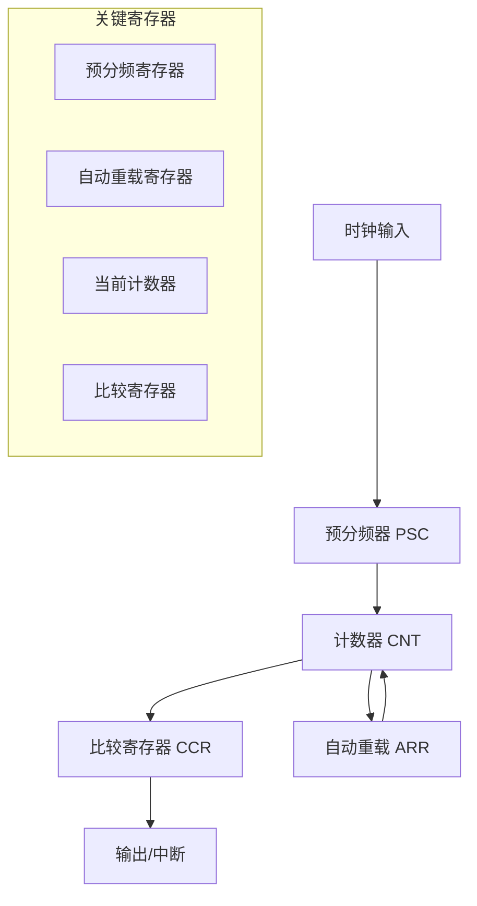
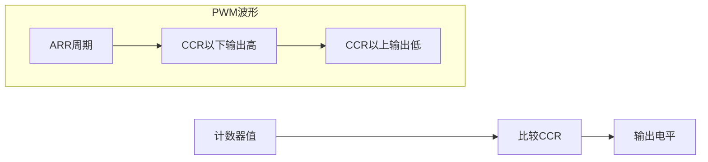
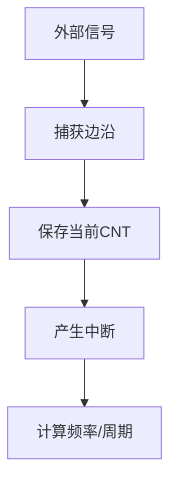

# 4.2 定时器与PWM输出

## 一、定时器基础

### 1. 定时器结构



### 2. 定时器时钟

```
定时器时钟 = 总线时钟 / (PSC + 1)
定时器周期 = (ARR + 1) / 定时器时钟
```

**示例**：
- 总线时钟：72MHz (APB1)
- 预分频：72 → 定时器时钟 = 1MHz
- 自动重载：1000 → 定时器周期 = 1ms (1KHz)

### 3. 计数模式

| 模式 | 说明 |
|-----|------|
| 向上计数 | CNT从0计数到ARR，溢出 |
| 向下计数 | CNT从ARR计数到0，溢出 |
| 中央对齐 | 向上向下对称计数 |

## 二、定时器中断

### 1. 定时中断配置

```c
// 1Hz定时中断配置
void TIM2_Init(void) {
    TIM_TimeBaseInitTypeDef TIM_TimeBaseStruct;
    NVIC_InitTypeDef NVIC_InitStruct;
    
    // 使能时钟
    RCC_APB1PeriphClockCmd(RCC_APB1Periph_TIM2, ENABLE);
    
    // 定时器基础配置
    TIM_TimeBaseStruct.TIM_Prescaler = 7200 - 1;  // 72MHz / 7200 = 10KHz
    TIM_TimeBaseStruct.TIM_Period = 10000 - 1;    // 10KHz / 10000 = 1Hz
    TIM_TimeBaseStruct.TIM_ClockDivision = TIM_CKD_DIV1;
    TIM_TimeBaseStruct.TIM_CounterMode = TIM_CounterMode_Up;
    TIM_TimeBaseInit(TIM2, &TIM_TimeBaseStruct);
    
    // 清除标志
    TIM_ClearFlag(TIM2, TIM_FLAG_Update);
    
    // 使能更新中断
    TIM_ITConfig(TIM2, TIM_IT_Update, ENABLE);
    
    // NVIC配置
    NVIC_InitStruct.NVIC_IRQChannel = TIM2_IRQn;
    NVIC_InitStruct.NVIC_IRQChannelPreemptionPriority = 1;
    NVIC_InitStruct.NVIC_IRQChannelSubPriority = 0;
    NVIC_InitStruct.NVIC_IRQChannelCmd = ENABLE;
    NVIC_Init(&NVIC_InitStruct);
    
    // 启动定时器
    TIM_Cmd(TIM2, ENABLE);
}

// 定时中断服务函数
volatile uint32_t system_time_ms = 0;

void TIM2_IRQHandler(void) {
    if(TIM_GetITStatus(TIM2, TIM_IT_Update) != RESET) {
        // 1秒到
        system_time_ms++;
        
        // 清除中断标志
        TIM_ClearITPendingBit(TIM2, TIM_IT_Update);
    }
}
```

### 2. 常用定时中断周期

| 需求 | PSC | ARR | 定时器时钟 |
|-----|-----|-----|----------|
| 1ms | 72-1 | 1000-1 | 1MHz |
| 10ms | 720-1 | 10000-1 | 100KHz |
| 100ms | 7200-1 | 10000-1 | 10KHz |
| 1s | 7200-1 | 10000-1 | 10KHz |

### 3. 多定时器应用

```c
// 定时器1：100ms (用于UI刷新)
void TIM1_Init(void) {
    // ... 配置TIM1, PSC=7200-1, ARR=1000-1
    // 周期 = 100ms
}

void TIM1_IRQHandler(void) {
    // 100ms到，刷新UI
    if(TIM_GetITStatus(TIM1, TIM_IT_Update) != RESET) {
        ui_refresh_flag = 1;
        TIM_ClearITPendingBit(TIM1, TIM_IT_Update);
    }
}

// 定时器2：1s (用于系统计时)
// ... 同上

// 定时器3：用于PWM
// ... PWM配置
```

## 三、PWM输出

### 1. PWM原理



**PWM参数**：
- 频率 = 定时器时钟 / (ARR + 1)
- 占空比 = CCR / (ARR + 1) × 100%

### 2. PWM配置

```c
// TIM3 CH1 PWM配置（PA6）
void TIM3_PWM_Init(void) {
    TIM_TimeBaseInitTypeDef TIM_TimeBaseStruct;
    TIM_OCInitTypeDef TIM_OCInitStruct;
    GPIO_InitTypeDef GPIO_InitStruct;
    
    // GPIO配置
    RCC_APB2PeriphClockCmd(RCC_APB2Periph_GPIOA, ENABLE);
    RCC_APB1PeriphClockCmd(RCC_APB1Periph_TIM3, ENABLE);
    
    GPIO_InitStruct.GPIO_Pin = GPIO_Pin_6;
    GPIO_InitStruct.GPIO_Mode = GPIO_Mode_AF_PP;
    GPIO_InitStruct.GPIO_Speed = GPIO_Speed_50MHz;
    GPIO_Init(GPIOA, &GPIO_InitStruct);
    
    // 定时器配置
    TIM_TimeBaseStruct.TIM_Prescaler = 72 - 1;    // 1MHz
    TIM_TimeBaseStruct.TIM_Period = 1000 - 1;      // 1KHz
    TIM_TimeBaseStruct.TIM_CounterMode = TIM_CounterMode_Up;
    TIM_TimeBaseInit(TIM3, &TIM_TimeBaseStruct);
    
    // PWM通道配置
    TIM_OCInitStruct.TIM_OCMode = TIM_OCMode_PWM1;
    TIM_OCInitStruct.TIM_OutputState = TIM_OutputState_Enable;
    TIM_OCInitStruct.TIM_Pulse = 500;  // 50%占空比
    TIM_OCInitStruct.TIM_OCPolarity = TIM_OCPolarity_High;
    TIM_OC1Init(TIM3, &TIM_OCInitStruct);
    TIM_OC1PreloadConfig(TIM3, TIM_OCPreload_Enable);
    
    // 启动
    TIM_ARRPreloadConfig(TIM3, ENABLE);
    TIM_Cmd(TIM3, ENABLE);
}

// 修改PWM占空比
void PWM_SetDuty(uint16_t duty) {
    if(duty > 999) duty = 999;
    TIM_SetCompare1(TIM3, duty);
}
```

### 3. PWM应用

| 应用 | 说明 |
|-----|------|
| LED调光 | 调节亮度 |
| 电机控制 | 控制电机转速 |
| 舵机控制 | 控制舵机角度 |
| 蜂鸣器 | 输出特定频率 |

### 4. 多路PWM

```c
// 多路PWM配置（RGB LED）
void TIM3_RGB_PWM_Init(void) {
    // CH1 (PA6) - Red
    TIM_OCInitStruct.TIM_Channel = TIM_Channel_1;
    TIM_OC1Init(TIM3, &TIM_OCInitStruct);
    
    // CH2 (PA7) - Green
    TIM_OCInitStruct.TIM_Pulse = 0;
    TIM_OC2Init(TIM3, &TIM_OCInitStruct);
    
    // CH3 (PB0) - Blue
    TIM_OCInitStruct.TIM_Pulse = 0;
    TIM_OC3Init(TIM3, &TIM_OCInitStruct);
}

// 设置RGB颜色
void RGB_SetColor(uint8_t r, uint8_t g, uint8_t b) {
    TIM_SetCompare1(TIM3, r * 4);  // 0~1020
    TIM_SetCompare2(TIM3, g * 4);
    TIM_SetCompare3(TIM3, b * 4);
}
```

## 四、输入捕获

### 1. 输入捕获原理



### 2. 输入捕获配置

```c
// TIM1 CH1 输入捕获（PA8）
void TIM1_Capture_Init(void) {
    TIM_ICInitTypeDef TIM_ICInitStruct;
    GPIO_InitTypeDef GPIO_InitStruct;
    
    // GPIO配置
    RCC_APB2PeriphClockCmd(RCC_APB2Periph_TIM1 | RCC_APB2Periph_GPIOA, ENABLE);
    
    GPIO_InitStruct.GPIO_Pin = GPIO_Pin_8;
    GPIO_InitStruct.GPIO_Mode = GPIO_Mode_IPD;
    GPIO_Init(GPIOA, &GPIO_InitStruct);
    
    // 定时器基础配置
    TIM_TimeBaseInitTypeDef TIM_TimeBaseStruct;
    TIM_TimeBaseStruct.TIM_Prescaler = 72 - 1;  // 1MHz
    TIM_TimeBaseStruct.TIM_Period = 0xFFFF;
    TIM_TimeBaseStruct.TIM_CounterMode = TIM_CounterMode_Up;
    TIM_TimeBaseInit(TIM1, &TIM_TimeBaseStruct);
    
    // 输入捕获配置
    TIM_ICInitStruct.TIM_ICPolarity = TIM_ICPolarity_Rising;
    TIM_ICInitStruct.TIM_ICSelection = TIM_ICSelection_DirectTI;
    TIM_ICInitStruct.TIM_ICPrescaler = TIM_ICPSC_DIV1;
    TIM_ICInitStruct.TIM_ICFilter = 0x00;
    TIM_ICInit(TIM1, TIM_Channel_1, &TIM_ICInitStruct);
    
    // 使能捕获中断
    TIM_ITConfig(TIM1, TIM_IT_CC1, ENABLE);
    
    TIM_Cmd(TIM1, ENABLE);
}

// 捕获中断处理
volatile uint16_t capture_value = 0;
volatile uint8_t capture_flag = 0;

void TIM1_CC1_IRQHandler(void) {
    if(TIM_GetITStatus(TIM1, TIM_IT_CC1) != RESET) {
        capture_value = TIM_GetCapture1(TIM1);
        capture_flag = 1;
        TIM_ClearITPendingBit(TIM1, TIM_IT_CC1);
    }
}
```

### 3. 频率测量

```c
// 频率测量：利用两个捕获计算周期
uint32_t measure_frequency(void) {
    static uint16_t last_capture = 0;
    uint16_t current_capture;
    uint32_t period;
    uint32_t frequency;
    
    if(capture_flag) {
        current_capture = capture_value;
        capture_flag = 0;
        
        // 计算周期（1MHz时钟）
        if(current_capture > last_capture) {
            period = current_capture - last_capture;
        } else {
            period = (0xFFFF - last_capture) + current_capture + 1;
        }
        
        last_capture = current_capture;
        
        // 计算频率
        if(period > 0) {
            frequency = 1000000 / period;  // Hz
            return frequency;
        }
    }
    
    return 0;
}
```

## 五、定时器综合应用

### 1. 舵机控制

```c
// 舵机PWM：50Hz，占空比对应角度
// 0.5ms~2.5ms对应0°~180°
// 计算：CCR = (angle / 180 * 2000) + 500

void Servo_SetAngle(uint8_t angle) {
    uint16_t pulse = (uint16_t)(angle * 2000 / 180) + 500;
    TIM_SetCompare1(TIM3, pulse);
}
```

### 2. 超声波测距

```c
// HC-SR04超声波模块
// Trig: 发送10us以上脉冲
// Echo: 测量高电平时间

void Ultrasonic_Init(void) {
    // Trig引脚配置
    GPIO_InitStruct.GPIO_Pin = GPIO_Pin_0;
    GPIO_InitStruct.GPIO_Mode = GPIO_Mode_OUT;
    GPIO_Init(GPIOA, &GPIO_InitStruct);
    
    // Echo引脚配置（输入捕获）
    TIM_ICInitTypeDef TIM_ICInitStruct;
    // ... TIM1_CH1输入捕获配置
}

float Ultrasonic_Read(void) {
    // 发送10us脉冲
    GPIO_SetBits(GPIOA, GPIO_Pin_0);
    delay_us(20);
    GPIO_ResetBits(GPIOA, GPIO_Pin_0);
    
    // 等待Echo响应并测量
    // ... 使用输入捕获测量高电平时间
    
    // 计算距离（cm）
    // distance = high_time * 0.0343 / 2
    float distance = capture_time * 0.0343f / 2.0f;
    return distance;
}
```

---

**导航**：上一节 [[4.1-中断系统与NVIC]] · [[MOC - 第4章\|返回章节导航]] · 下一节 [[4.3-串行通信总线]]