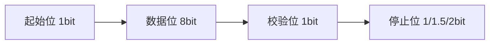
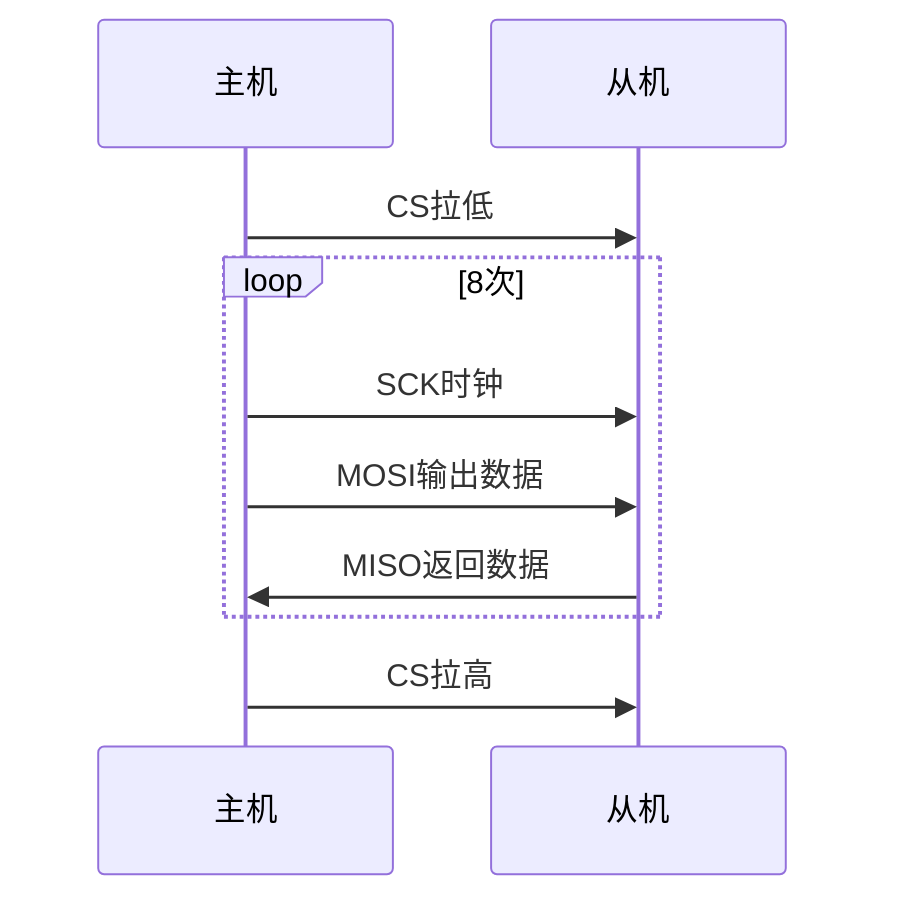
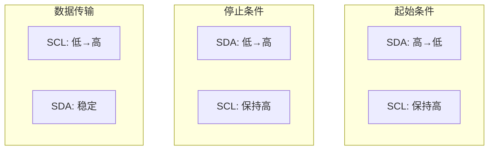
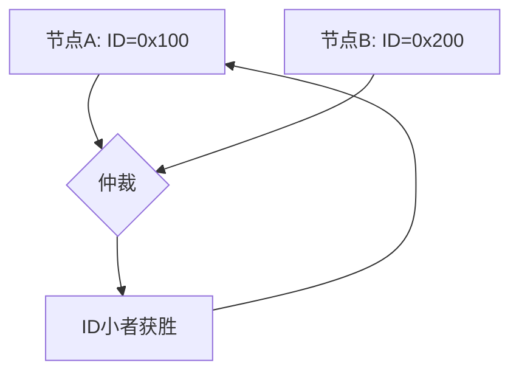

# 4.3 串行通信总线

## 一、UART通用异步收发器

### 1. UART协议

#### 帧格式



| 部分 | 说明 |
|-----|------|
| 起始位 | 1位，低电平，标识帧开始 |
| 数据位 | 8位，低位在前 |
| 校验位 | 可选，奇校验/偶校验 |
| 停止位 | 1/1.5/2位，高电平，标识帧结束 |
| 空闲位 | 高电平，标识无数据传输 |

#### 波特率

```
波特率 = 时钟频率 / (16 * USARTDIV)

常用波特率：
9600, 19200, 38400, 57600, 115200, 230400, 460800, 921600
```

### 2. UART配置

```c
// USART1配置
void USART1_Init(void) {
    GPIO_InitTypeDef GPIO_InitStruct;
    USART_InitTypeDef USART_InitStruct;
    NVIC_InitTypeDef NVIC_InitStruct;
    
    // GPIO配置
    RCC_APB2PeriphClockCmd(RCC_APB2Periph_GPIOA | RCC_APB2Periph_USART1, ENABLE);
    
    // PA9: TX (复用推挽)
    GPIO_InitStruct.GPIO_Pin = GPIO_Pin_9;
    GPIO_InitStruct.GPIO_Mode = GPIO_Mode_AF_PP;
    GPIO_InitStruct.GPIO_Speed = GPIO_Speed_50MHz;
    GPIO_Init(GPIOA, &GPIO_InitStruct);
    
    // PA10: RX (浮空输入)
    GPIO_InitStruct.GPIO_Pin = GPIO_Pin_10;
    GPIO_InitStruct.GPIO_Mode = GPIO_Mode_IN_FLOATING;
    GPIO_Init(GPIOA, &GPIO_InitStruct);
    
    // USART配置
    USART_InitStruct.USART_BaudRate = 115200;
    USART_InitStruct.USART_WordLength = USART_WordLength_8b;
    USART_InitStruct.USART_StopBits = USART_StopBits_1;
    USART_InitStruct.USART_Parity = USART_Parity_No;
    USART_InitStruct.USART_Mode = USART_Mode_RxTx;
    USART_Init(USART1, &USART_InitStruct);
    
    // 使能接收中断
    USART_ITConfig(USART1, USART_IT_RXNE, ENABLE);
    
    // NVIC配置
    NVIC_InitStruct.NVIC_IRQChannel = USART1_IRQn;
    NVIC_InitStruct.NVIC_IRQChannelPreemptionPriority = 1;
    NVIC_InitStruct.NVIC_IRQChannelSubPriority = 0;
    NVIC_InitStruct.NVIC_IRQChannelCmd = ENABLE;
    NVIC_Init(&NVIC_InitStruct);
    
    // 使能USART
    USART_Cmd(USART1, ENABLE);
}
```

### 3. UART数据收发

```c
// 发送单个字节
void USART1_SendByte(uint8_t byte) {
    USART_SendData(USART1, byte);
    while(USART_GetFlagStatus(USART1, USART_FLAG_TXE) == RESET);
}

// 发送字符串
void USART1_SendString(char *str) {
    while(*str) {
        USART1_SendByte(*str++);
    }
}

// 发送数据缓冲区
void USART1_SendBuffer(uint8_t *buf, uint16_t len) {
    for(uint16_t i = 0; i < len; i++) {
        USART1_SendByte(buf[i]);
    }
}

// 中断接收
volatile uint8_t uart_rx_data;
volatile uint8_t uart_rx_flag = 0;

void USART1_IRQHandler(void) {
    if(USART_GetITStatus(USART1, USART_IT_RXNE) != RESET) {
        uart_rx_data = USART_ReceiveData(USART1);
        uart_rx_flag = 1;
    }
}
```

## 二、SPI串行外设接口

### 1. SPI协议

#### 信号线

| 信号线 | 说明 |
|-------|------|
| SCK | 串行时钟 |
| MOSI | 主出从入（Master Out Slave In） |
| MISO | 主入从出（Master In Slave Out） |
| CS | 片选（低有效） |

#### 四种模式

| 模式 | CPOL | CPHA | 说明 |
|-----|------|------|------|
| Mode 0 | 0 | 0 | 空闲低，上升沿采样 |
| Mode 1 | 0 | 1 | 空闲低，下降沿采样 |
| Mode 2 | 1 | 0 | 空闲高，下降沿采样 |
| Mode 3 | 1 | 1 | 空闲高，上升沿采样 |

#### 数据传输



### 2. SPI配置

```c
// SPI1配置（Mode 0）
void SPI1_Init(void) {
    GPIO_InitTypeDef GPIO_InitStruct;
    SPI_InitTypeDef SPI_InitStruct;
    
    // GPIO配置
    RCC_APB2PeriphClockCmd(RCC_APB2Periph_GPIOA | RCC_APB2Periph_SPI1, ENABLE);
    
    // PA5: SCK
    GPIO_InitStruct.GPIO_Pin = GPIO_Pin_5;
    GPIO_InitStruct.GPIO_Mode = GPIO_Mode_AF_PP;
    GPIO_InitStruct.GPIO_Speed = GPIO_Speed_50MHz;
    GPIO_Init(GPIOA, &GPIO_InitStruct);
    
    // PA7: MOSI
    GPIO_InitStruct.GPIO_Pin = GPIO_Pin_7;
    GPIO_Init(GPIOA, &GPIO_InitStruct);
    
    // PA6: MISO
    GPIO_InitStruct.GPIO_Pin = GPIO_Pin_6;
    GPIO_InitStruct.GPIO_Mode = GPIO_Mode_IN_FLOATING;
    GPIO_Init(GPIOA, &GPIO_InitStruct);
    
    // SPI配置
    SPI_InitStruct.SPI_Direction = SPI_Direction_2Lines_FullDuplex;
    SPI_InitStruct.SPI_Mode = SPI_Mode_Master;
    SPI_InitStruct.SPI_DataSize = SPI_DataSize_8b;
    SPI_InitStruct.SPI_CPOL = SPI_CPOL_Low;        // Mode 0
    SPI_InitStruct.SPI_CPHA = SPI_CPHA_1Edge;     // Mode 0
    SPI_InitStruct.SPI_NSS = SPI_NSS_Soft;
    SPI_InitStruct.SPI_BaudRatePrescaler = SPI_BaudRatePrescaler_16;
    SPI_InitStruct.SPI_FirstBit = SPI_FirstBit_MSB;
    SPI_InitStruct.SPI_CRCPolynomial = 7;
    SPI_Init(SPI1, &SPI_InitStruct);
    
    SPI_Cmd(SPI1, ENABLE);
}
```

### 3. SPI数据传输

```c
// SPI读写（同时进行）
uint8_t SPI1_Transfer(uint8_t data) {
    SPI_I2S_SendData(SPI1, data);
    while(SPI_I2S_GetFlagStatus(SPI1, SPI_I2S_FLAG_TXE) == RESET);
    while(SPI_I2S_GetFlagStatus(SPI1, SPI_I2S_FLAG_RXNE) == RESET);
    return SPI_I2S_ReceiveData(SPI1);
}

// 从Flash读取数据
void Flash_ReadData(uint32_t addr, uint8_t *buf, uint16_t len) {
    // 1. CS拉低
    GPIO_ResetBits(GPIOA, GPIO_Pin_4);
    
    // 2. 发送读取命令
    SPI1_Transfer(0x03);  // READ命令
    SPI1_Transfer((addr >> 16) & 0xFF);
    SPI1_Transfer((addr >> 8) & 0xFF);
    SPI1_Transfer(addr & 0xFF);
    
    // 3. 接收数据
    for(uint16_t i = 0; i < len; i++) {
        buf[i] = SPI1_Transfer(0xFF);
    }
    
    // 4. CS拉高
    GPIO_SetBits(GPIOA, GPIO_Pin_4);
}
```

## 三、I2C总线

### 1. I2C协议

#### 信号线

| 信号线 | 说明 |
|-------|------|
| SDA | 数据线（双向） |
| SCL | 时钟线（由主机控制） |

#### 关键信号

| 信号 | 说明 |
|-----|------|
| 起始条件 | SCL高时，SDA从高变低 |
| 停止条件 | SCL高时，SDA从低变高 |
| 数据有效 | SCL高时，SDA保持稳定 |
| ACK | 接收方在第9个时钟拉低SDA |



### 2. I2C地址与传输

| 类型 | 格式 |
|-----|------|
| 7位地址 | 1bit R/W + 7bit 地址 |
| 10位地址 | 扩展地址格式 |

**数据传输步骤**：
1. 主机产生起始条件
2. 主机发送从机地址（R/W位）
3. 从机回应ACK
4. 发送/接收数据
5. 主机产生停止条件

### 3. 软件I2C实现

```c
// 软件I2C（GPIO模拟）
#define I2C_SCL_HIGH()  GPIO_SetBits(GPIOB, GPIO_Pin_6)
#define I2C_SCL_LOW()   GPIO_ResetBits(GPIOB, GPIO_Pin_6)
#define I2C_SDA_HIGH()  GPIO_SetBits(GPIOB, GPIO_Pin_7)
#define I2C_SDA_LOW()   GPIO_ResetBits(GPIOB, GPIO_Pin_7)
#define I2C_SDA_READ()  GPIO_ReadInputDataBit(GPIOB, GPIO_Pin_7)

// I2C初始化
void I2C_Init(void) {
    GPIO_InitTypeDef GPIO_InitStruct;
    
    RCC_APB2PeriphClockCmd(RCC_APB2Periph_GPIOB, ENABLE);
    
    // SCL (PB6) 推挽输出
    GPIO_InitStruct.GPIO_Pin = GPIO_Pin_6;
    GPIO_InitStruct.GPIO_Mode = GPIO_Mode_Out_OD;
    GPIO_InitStruct.GPIO_Speed = GPIO_Speed_50MHz;
    GPIO_Init(GPIOB, &GPIO_InitStruct);
    
    // SDA (PB7) 推挽输出
    GPIO_InitStruct.GPIO_Pin = GPIO_Pin_7;
    GPIO_Init(GPIOB, &GPIO_InitStruct);
    
    I2C_SCL_HIGH();
    I2C_SDA_HIGH();
}

// 起始条件
void I2C_Start(void) {
    I2C_SDA_HIGH();
    I2C_SCL_HIGH();
    delay_us(5);
    I2C_SDA_LOW();  // SDA拉低
    delay_us(5);
    I2C_SCL_LOW();  // SCL拉低
    delay_us(5);
}

// 停止条件
void I2C_Stop(void) {
    I2C_SDA_LOW();
    I2C_SCL_HIGH();
    delay_us(5);
    I2C_SDA_HIGH();  // SDA拉高
    delay_us(5);
}

// 发送字节
void I2C_SendByte(uint8_t byte) {
    uint8_t i;
    for(i = 0; i < 8; i++) {
        if(byte & 0x80) I2C_SDA_HIGH();
        else I2C_SDA_LOW();
        delay_us(2);
        I2C_SCL_HIGH();
        delay_us(5);
        I2C_SCL_LOW();
        byte <<= 1;
    }
    // 等待ACK
    I2C_SDA_HIGH();
    delay_us(2);
    I2C_SCL_HIGH();
    delay_us(5);
    I2C_SCL_LOW();
}
```

### 4. 硬件I2C配置

```c
// 硬件I2C1配置
void I2C1_Init(void) {
    I2C_InitTypeDef I2C_InitStruct;
    GPIO_InitTypeDef GPIO_InitStruct;
    
    // GPIO配置
    RCC_APB2PeriphClockCmd(RCC_APB2Periph_GPIOB | RCC_APB2Periph_I2C1, ENABLE);
    
    // PB6: SCL
    GPIO_InitStruct.GPIO_Pin = GPIO_Pin_6;
    GPIO_InitStruct.GPIO_Mode = GPIO_Mode_AF_OD;
    GPIO_Init(GPIOB, &GPIO_InitStruct);
    
    // PB7: SDA
    GPIO_InitStruct.GPIO_Pin = GPIO_Pin_7;
    GPIO_Init(GPIOB, &GPIO_InitStruct);
    
    // I2C配置
    I2C_InitStruct.I2C_Mode = I2C_Mode_I2C;
    I2C_InitStruct.I2C_DutyCycle = I2C_DutyCycle_2;
    I2C_InitStruct.I2C_OwnAddress1 = 0;
    I2C_InitStruct.I2C_Ack = I2C_Ack_Enable;
    I2C_InitStruct.I2C_AddressingMode = I2C_AddressingMode_Dual;
    I2C_InitStruct.I2C_GeneralCall = I2C_GeneralCall_Disable;
    I2C_InitStruct.I2C_NoStretchMode = I2C_NoStretchMode_Disable;
    I2C_Init(&I2C1, &I2C_InitStruct);
    
    I2C_Cmd(I2C1, ENABLE);
}
```

## 四、CAN总线

### 1. CAN协议

#### 特点

| 特点 | 说明 |
|-----|------|
| 多主通信 | 所有节点都可以发送 |
| 仲裁机制 | 按优先级仲裁 |
| 差分传输 | 抗干扰能力强 |
| 错误检测 | 自动检测和重传 |
| 总线速率 | 最高1Mbps |

#### 报文格式

| 字段 | 说明 |
|-----|------|
| 仲裁场 | 11/29位ID + RTR位 |
| 控制场 | DLC + 保留位 |
| 数据场 | 0~8字节数据 |
| CRC场 | 15位CRC校验 |
| 应答场 | ACK Slot + ACK Delimiter |
| 帧结束 | 7个隐性位 |

### 2. CAN仲裁机制



**规则**：
- ID越小，优先级越高
- 仲裁按位进行，显性位（0）优先于隐性位（1）
- 失败的节点转为接收模式

### 3. CAN配置

```c
// CAN配置
void CAN1_Init(void) {
    GPIO_InitTypeDef GPIO_InitStruct;
    CAN_InitTypeDef CAN_InitStruct;
    CAN_FilterInitTypeDef CAN_FilterInitStruct;
    
    // GPIO配置
    RCC_APB2PeriphClockCmd(RCC_APB2Periph_GPIOA | RCC_APB2Periph_CAN1, ENABLE);
    
    // PA11: CAN_RX
    GPIO_InitStruct.GPIO_Pin = GPIO_Pin_11;
    GPIO_InitStruct.GPIO_Mode = GPIO_Mode_IPU;
    GPIO_Init(GPIOA, &GPIO_InitStruct);
    
    // PA12: CAN_TX
    GPIO_InitStruct.GPIO_Pin = GPIO_Pin_12;
    GPIO_InitStruct.GPIO_Mode = GPIO_Mode_AF_PP;
    GPIO_InitStruct.GPIO_Speed = GPIO_Speed_50MHz;
    GPIO_Init(GPIOA, &GPIO_InitStruct);
    
    // CAN配置
    CAN_InitStruct.CAN_TTCM = DISABLE;
    CAN_InitStruct.CAN_ABOM = DISABLE;
    CAN_InitStruct.CAN_AWUM = DISABLE;
    CAN_InitStruct.CAN_NART = ENABLE;
    CAN_InitStruct.CAN_RFLM = DISABLE;
    CAN_InitStruct.CAN_TXFP = DISABLE;
    CAN_InitStruct.CAN_Mode = CAN_Mode_Normal;
    CAN_InitStruct.CAN_SJW = CAN_SJW_1tq;
    CAN_InitStruct.CAN_BS1 = CAN_BS1_8tq;
    CAN_InitStruct.CAN_BS2 = CAN_BS2_7tq;
    CAN_InitStruct.CAN_Prescaler = 9;
    CAN_Init(CAN1, &CAN_InitStruct);
    
    // 过滤器配置
    CAN_FilterInitStruct.CAN_FilterNumber = 0;
    CAN_FilterInitStruct.CAN_FilterMode = CAN_FilterMode_IdMask;
    CAN_FilterInitStruct.CAN_FilterScale = CAN_FilterScale_32bit;
    CAN_FilterInitStruct.CAN_FilterIdHigh = 0x0000;
    CAN_FilterInitStruct.CAN_FilterIdLow = 0x0000;
    CAN_FilterInitStruct.CAN_FilterMaskIdHigh = 0x0000;
    CAN_FilterInitStruct.CAN_FilterMaskIdLow = 0x0000;
    CAN_FilterInitStruct.CAN_FilterFIFOAssignment = CAN_Filter_FIFO0;
    CAN_FilterInitStruct.CAN_FilterActivation = ENABLE;
    CAN_FilterInit(&CAN_FilterInitStruct);
}
```

### 4. CAN数据收发

```c
// CAN发送
void CAN1_Send(uint32_t id, uint8_t *data, uint8_t len) {
    CanTxMsg TxMessage;
    
    TxMessage.StdId = id;
    TxMessage.ExtId = 0;
    TxMessage.RTR = CAN_RTR_Data;
    TxMessage.IDE = CAN_Id_Standard;
    TxMessage.DLC = len;
    
    for(uint8_t i = 0; i < len; i++) {
        TxMessage.Data[i] = data[i];
    }
    
    CAN_Transmit(CAN1, &TxMessage);
}

// CAN接收（中断）
void CAN1_RX0_IRQHandler(void) {
    CanRxMsg RxMessage;
    
    if(CAN_GetITStatus(CAN1, CAN_IT_FMP0) != RESET) {
        CAN_Receive(CAN1, CAN_FIFO0, &RxMessage);
        
        // 处理接收到的数据
        process_can_data(RxMessage.StdId, RxMessage.Data, RxMessage.DLC);
    }
}
```

## 五、通信总线对比

| 对比项 | UART | SPI | I2C | CAN |
|-------|------|-----|-----|-----|
| 类型 | 异步 | 同步 | 同步 | 异步 |
| 线数 | 2 (TX/RX) | 4 (SCK/MOSI/MISO/CS) | 2 (SDA/SCL) | 2 (CAN_H/CAN_L) |
| 速率 | 最高5Mbps | 最高50Mbps | 最高1Mbps | 最高1Mbps |
| 通信方式 | 点对点 | 主从 | 主从 | 多主 |
| 全双工 | 是 | 是 | 否 | 是 |
| 寻址 | 无 | CS片选 | 7/10位地址 | 11/29位ID |
| 应用 | 调试、蓝牙 | Flash、OLED | EEPROM、传感器 | 汽车、工业 |

---

**导航**：上一节 [[4.2-定时器与PWM输出]] · [[MOC - 第4章\|返回章节导航]]