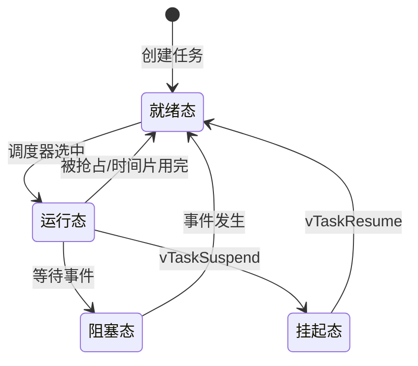

# 5.1 RTOS基础与任务状态

## 一、RTOS概述

### 1. 什么是RTOS

> [!quote] 实时操作系统（RTOS）
> 是一种能够对事件做出快速、可预测响应的操作系统，保证任务在规定时间内完成执行。

### 2. RTOS vs 裸机系统

| 对比项 | 裸机系统 | RTOS |
|-------|---------|------|
| 程序结构 | 单循环 + 中断 | 多任务并发 |
| 执行方式 | 顺序执行 | 并行执行（伪并行） |
| 实时性 | 依赖中断 | 调度器保证 |
| 开发复杂度 | 低 | 中 |
| 资源利用 | 低 | 高 |
| 维护性 | 差 | 好 |
| 适用场景 | 简单应用 | 复杂多任务 |

### 3. RTOS核心特性

| 特性 | 说明 |
|-----|------|
| 多任务 | 支持多个任务并发执行 |
| 任务调度 | 内核决定哪个任务运行 |
| 中断响应 | 快速响应外部事件 |
| 同步机制 | 任务间的通信与同步 |
| 可裁剪 | 可根据需求裁剪功能 |

### 4. 常见RTOS

| RTOS | 特点 | 应用 |
|------|------|------|
| FreeRTOS | 开源、轻量、功能全 | 工业、消费电子 |
| uCOS-II/III | 经典教材、结构清晰 | 教学、工业 |
| RT-Thread | 国产、C语言、组件化 | 物联网、嵌入式 |
| VxWorks | 商业、实时性强 | 航空航天、军事 |
| QNX | 微内核、高可靠 | 汽车、医疗 |
| Windows Embedded | 微软生态 | 工业控制 |
| Linux RT | 通用、社区支持 | 复杂应用 |

## 二、任务基础

### 1. 任务的概念

> [!quote] 任务（Task）
> 是RTOS中最小的调度单位，由三部分组成：
> - 任务代码（函数）
> - 任务控制块（TCB）
> - 任务栈空间

### 2. 任务与函数的区别

| 对比项 | 函数 | 任务 |
|-------|------|------|
| 入口 | 被调用一次 | 被调度执行 |
| 返回 | 可以返回 | 通常不返回 |
| 栈 | 共享栈 | 独立栈 |
| 状态 | 无状态 | 有状态 |
| 调度 | 无 | 内核调度 |

### 3. 任务优先级

```
优先级范围：0 ~ configMAX_PRIORITIES - 1
数值越大，优先级越高

示例（FreeRTOS）：
configMAX_PRIORITIES = 32
优先级：0 (最低) ~ 31 (最高)
```

### 4. 任务栈

```c
// 任务栈大小
#define TASK_STACK_SIZE  256  // words (1024 bytes)

// 栈空间分配（静态分配）
static StackType_t xTaskStack[TASK_STACK_SIZE];
static StaticTask_t xTaskBuffer;

// 或使用动态分配
// xTaskCreate 会自动分配栈空间
```

## 三、任务状态

### 1. 任务三态模型



### 2. 状态说明

| 状态 | 说明 |
|-----|------|
| 就绪态（Ready） | 任务就绪，等待CPU调度 |
| 运行态（Running） | 任务正在执行 |
| 阻塞态（Blocked） | 任务等待事件（延迟、信号量、队列等） |
| 挂起态（Suspended） | 任务被挂起，不参与调度 |

### 3. 状态转换条件

| 转换 | 触发条件 |
|-----|---------|
| 就绪 → 运行 | 调度器选择该任务 |
| 运行 → 就绪 | 被更高优先级抢占 / 时间片用完 |
| 运行 → 阻塞 | 调用阻塞API（如vTaskDelay） |
| 阻塞 → 就绪 | 等待的事件发生 |
| 运行 → 挂起 | vTaskSuspend |
| 挂起 → 就绪 | vTaskResume |

## 四、任务创建

### 1. FreeRTOS任务创建

```c
#include "FreeRTOS.h"
#include "task.h"

// 任务函数
void vTaskCode(void *pvParameters) {
    // 任务主体代码
    while(1) {
        // 周期性任务
        vTaskDelay(pdMS_TO_TICKS(1000));  // 延时1秒
    }
}

// 任务创建（动态分配）
void create_tasks(void) {
    TaskHandle_t xTaskHandle;
    
    BaseType_t xResult = xTaskCreate(
        vTaskCode,          // 任务函数
        "Task1",            // 任务名称
        256,                // 栈大小（words）
        NULL,               // 参数
        tskIDLE_PRIORITY+1, // 优先级
        &xTaskHandle        // 任务句柄
    );
    
    if(xResult != pdPASS) {
        // 创建失败
    }
}
```

### 2. 静态任务创建

```c
// 静态分配任务内存
#define TASK_STACK_SIZE 128

static StackType_t xTaskStack[TASK_STACK_SIZE];
static StaticTask_t xTaskBuffer;

TaskHandle_t create_task_static(void) {
    return xTaskCreateStatic(
        vTaskCode,
        "StaticTask",
        TASK_STACK_SIZE,
        NULL,
        1,
        xTaskStack,
        &xTaskBuffer
    );
}
```

### 3. 多任务创建示例

```c
// 系统初始化
void system_init(void) {
    // 创建任务
    xTaskCreate(led_task, "LED", 128, NULL, 2, NULL);
    xTaskCreate(lcd_task, "LCD", 256, NULL, 1, NULL);
    xTaskCreate(uart_task, "UART", 128, NULL, 3, NULL);
    
    // 启动调度器
    vTaskStartScheduler();
    
    // 如果到达这里，说明内存不足
    while(1);
}
```

### 4. 任务删除

```c
// 删除自己
void vTaskDelete_self(void) {
    vTaskDelete(NULL);  // NULL表示删除当前任务
}

// 删除指定任务
void delete_task(TaskHandle_t xHandle) {
    vTaskDelete(xHandle);
}
```

## 五、任务编程模式

### 1. 单次执行任务

```c
void one_shot_task(void *pvParameters) {
    // 执行一次操作
    do_something();
    
    // 删除自己
    vTaskDelete(NULL);
}
```

### 2. 周期任务

```c
void periodic_task(void *pvParameters) {
    TickType_t xLastWakeTime = xTaskGetTickCount();
    
    while(1) {
        // 执行任务
        do_something();
        
        // 延时到下一个周期
        vTaskDelayUntil(&xLastWakeTime, pdMS_TO_TICKS(100));
    }
}
```

### 3. 事件驱动任务

```c
void event_task(void *pvParameters) {
    while(1) {
        // 等待事件（阻塞）
        EventBits_t xBits = xEventGroupWaitBits(
            xEventGroup,
            EVENT_FLAG_ANY,
            pdTRUE,
            pdFALSE,
            portMAX_DELAY
        );
        
        // 处理事件
        handle_events(xBits);
    }
}
```

### 4. 状态机任务

```c
typedef enum {
    STATE_IDLE,
    STATE_RUNNING,
    STATE_ERROR
} SystemState;

void state_machine_task(void *pvParameters) {
    SystemState state = STATE_IDLE;
    
    while(1) {
        switch(state) {
            case STATE_IDLE:
                if(start_condition()) {
                    state = STATE_RUNNING;
                }
                break;
                
            case STATE_RUNNING:
                if(error_detected()) {
                    state = STATE_ERROR;
                }
                do_work();
                break;
                
            case STATE_ERROR:
                if(recover()) {
                    state = STATE_IDLE;
                }
                break;
        }
        
        vTaskDelay(pdMS_TO_TICKS(10));
    }
}
```

## 六、任务管理API

### 1. 常用API

| API | 说明 |
|-----|------|
| xTaskCreate | 创建任务（动态） |
| xTaskCreateStatic | 创建任务（静态） |
| vTaskDelete | 删除任务 |
| vTaskSuspend | 挂起任务 |
| vTaskResume | 恢复任务 |
| vTaskDelay | 相对延时 |
| vTaskDelayUntil | 绝对延时 |
| xTaskGetHandle | 获取任务句柄 |
| uxTaskGetNumberOfTasks | 获取任务数量 |

### 2. 延时对比

| 函数 | 说明 | 使用场景 |
|-----|------|---------|
| vTaskDelay | 相对当前时间延时 | 不确定周期 |
| vTaskDelayUntil | 绝对时间延时 | 固定周期 |

```c
// 相对延时
void relative_delay_task(void) {
    while(1) {
        do_work();
        vTaskDelay(pdMS_TO_TICKS(100));  // 延时100ms
    }
}

// 绝对延时（固定周期）
void absolute_delay_task(void) {
    TickType_t last_time = xTaskGetTickCount();
    
    while(1) {
        do_work();
        vTaskDelayUntil(&last_time, pdMS_TO_TICKS(100));
        // 保证每100ms执行一次
    }
}
```

---

**导航**：[[MOC - 第5章\|返回章节导航]] · 下一节 [[5.2-任务调度与优先级反转]]