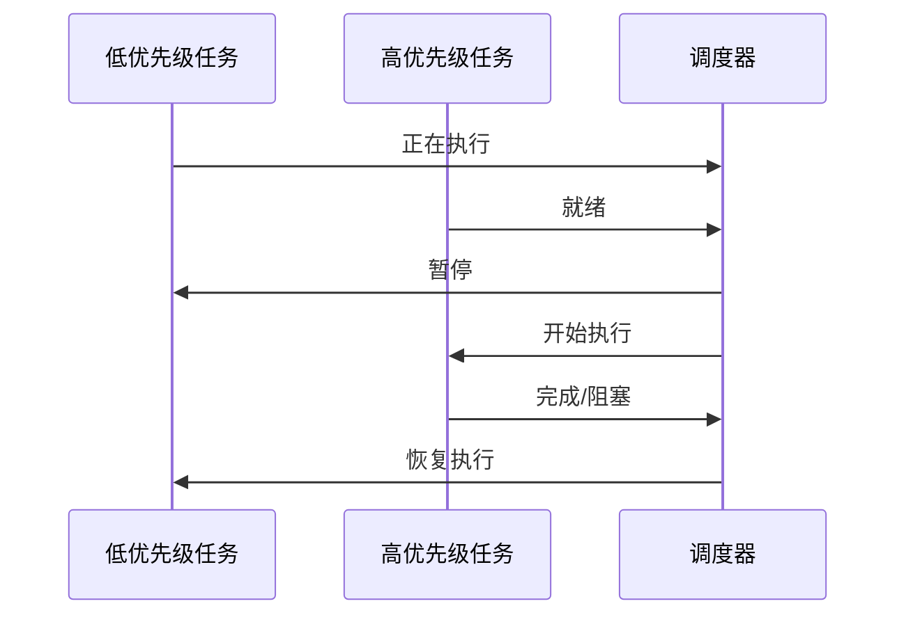
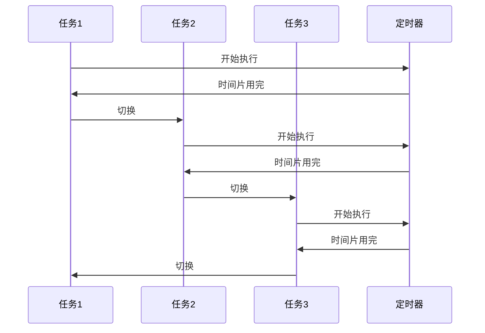
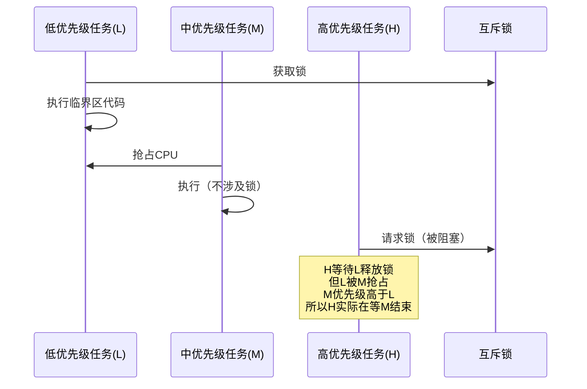
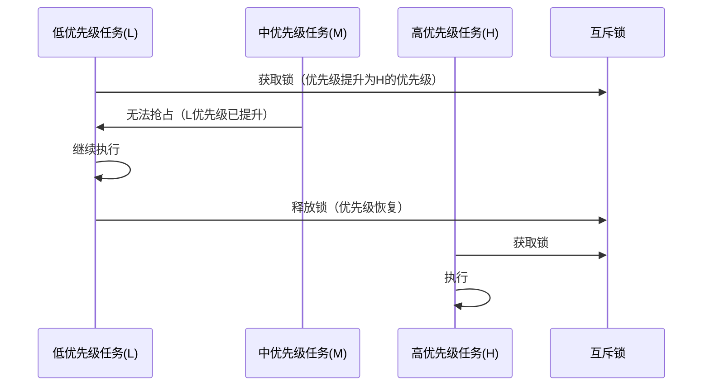

# 5.2 任务调度与优先级反转

## 一、调度算法

### 1. 调度器基础

> [!quote] 任务调度器
> 决定哪个就绪态任务获得CPU使用权的算法。

### 2. 常见调度算法

| 算法 | 说明 | 适用场景 |
|-----|------|---------|
| 先来先服务（FCFS） | 按创建顺序执行 | 简单系统 |
| 最短作业优先（SJF） | 优先执行短任务 | 批处理 |
| 优先级调度 | 按优先级执行 | 实时系统 |
| 时间片轮转 | 固定时间片切换 | 通用系统 |
| 多级反馈队列 | 动态调整优先级 | 复杂系统 |

### 3. RTOS常用调度

#### 抢占式调度



**特点**：
- 高优先级任务可以抢占低优先级任务
- 保证高实时性任务的响应时间
- 是RTOS的默认调度方式

#### 时间片轮转



**特点**：
- 所有任务平分CPU时间
- 防止单个任务垄断CPU
- 时间片大小影响系统响应性

#### 优先级抢占 + 时间片

```
FreeRTOS默认调度策略：
- 高优先级任务：立即抢占
- 同优先级任务：时间片轮转
- 空闲任务：系统空闲时运行
```

### 4. FreeRTOS调度器

```c
// 调度器配置
void scheduler_config(void) {
    // 启动调度器
    vTaskStartScheduler();
}

// 挂起调度器
void suspend_scheduler(void) {
    taskSCHEDULE_LOCK_T xLock = portMAX_DELAY;
    vTaskSuspendAll();
    // 临界区代码
    // ...
    xTaskResumeAll();
}
```

## 二、优先级反转

### 1. 问题描述

> [!warning] 优先级反转
> 低优先级任务持有资源，高优先级任务需要该资源，而中优先级任务抢占了低优先级任务的执行，导致高优先级任务反而要等待中优先级任务的现象。

### 2. 发生过程



**分析**：
1. 任务L（低）获取资源R
2. 任务M（中）抢占L
3. 任务H（高）请求资源R，被阻塞
4. H本应抢占M，但H在等待L释放锁
5. L在等待CPU（被M抢占）
6. 结果：H等待M结束 → 优先级反转

### 3. 解决方案

#### 优先级继承（Priority Inheritance）



**原理**：
- 当高优先级任务H请求被低优先级任务L持有的资源时
- 内核临时将L的优先级提升到H的优先级
- 这样中优先级任务M就无法抢占L
- L尽快完成临界区，释放资源
- 资源释放后，L的优先级恢复

#### 优先级天花板（Priority Ceiling）

```
协议规则：
1. 每个资源关联一个天花板优先级
2. 任务获取资源时，优先级提升到天花板
3. 任务释放资源时，优先级恢复
4. 天花板优先级 = 可能请求该资源的最高优先级
```

**优缺点**：
- 需要预先知道资源的最高请求优先级
- 实现比优先级继承简单
- 可能导致不必要的优先级提升

#### 禁用中断

```c
// 禁用中断保护临界区
void critical_section(void) {
    portENTER_CRITICAL();  // 关中断
    // 临界区代码
    // ...
    portEXIT_CRITICAL();   // 开中断
}
```

**优缺点**：
- 简单直接
- 会影响中断响应
- 临界区必须很短

### 4. FreeRTOS互斥量的优先级继承

```c
// 创建互斥量
SemaphoreHandle_t xMutex;

void create_mutex(void) {
    xMutex = xSemaphoreCreateMutex();
}

// 使用互斥量
void use_mutex(void) {
    // 获取互斥量（包含优先级继承）
    if(xSemaphoreTake(xMutex, pdMS_TO_TICKS(100)) == pdTRUE) {
        // 临界区代码
        // 优先级自动提升
        
        // 释放互斥量（优先级自动恢复）
        xSemaphoreGive(xMutex);
    }
}
```

### 5. 优先级反转 vs 优先级反转

| 方案 | 原理 | 优点 | 缺点 |
|-----|------|------|------|
| 优先级继承 | 临时提升资源持有者的优先级 | 动态响应 | 需要内核支持 |
| 优先级天花板 | 预定义资源的最高优先级 | 实现简单 | 必须预知优先级 |
| 禁用中断 | 禁止所有中断 | 简单 | 影响实时性 |
| 关调度器 | 停止任务切换 | 彻底解决 | 影响系统响应 |

## 三、任务同步

### 1. 同步 vs 互斥

| 概念 | 说明 | 示例 |
|-----|------|------|
| 互斥（Mutual Exclusion） | 多个任务不能同时访问共享资源 | 读写全局变量 |
| 同步（Synchronization） | 多个任务按特定顺序执行 | 生产者-消费者 |

### 2. 同步机制对比

| 机制 | 用途 | FreeRTOS实现 |
|-----|------|-------------|
| 信号量 | 同步/资源计数 | Semaphore |
| 互斥量 | 互斥访问/优先级继承 | Mutex |
| 事件标志组 | 多事件同步 | EventGroup |
| 消息队列 | 数据传递/同步 | Queue |
| 软件定时器 | 定时触发 | Timer |

### 3. 信号量类型

#### 二值信号量

```c
// 创建二值信号量
SemaphoreHandle_t xBinarySem;

void init_binary_sem(void) {
    xBinarySem = xSemaphoreCreateBinary();
}

// 中断中释放信号量
void ISR_release(void) {
    BaseType_t xHigherPriorityTaskWoken = pdFALSE;
    xSemaphoreGiveFromISR(xBinarySem, &xHigherPriorityTaskWoken);
    portYIELD_FROM_ISR(xHigherPriorityTaskWoken);
}

// 任务中获取信号量
void task_wait(void) {
    xSemaphoreTake(xBinarySem, portMAX_DELAY);
    // 处理事件
}
```

#### 计数信号量

```c
// 创建计数信号量（初始值5）
SemaphoreHandle_t xCountSem;

void init_count_sem(void) {
    xCountSem = xSemaphoreCreateCounting(10, 5);
}

// 获取资源
void acquire_resource(void) {
    if(xSemaphoreTake(xCountSem, pdMS_TO_TICKS(100)) == pdTRUE) {
        // 使用资源
        use_resource();
        // 释放资源
        xSemaphoreGive(xCountSem);
    }
}
```

#### 信号量 vs 互斥量

| 对比项 | 信号量 | 互斥量 |
|-------|--------|--------|
| 主要用途 | 同步 | 互斥访问 |
| 所有权 | 无特定所有者 | 有所有者 |
| 优先级继承 | 不支持 | 支持 |
| 优先级反转 | 可能发生 | 防止 |
| 创建方式 | xSemaphoreCreateBinary/Counting | xSemaphoreCreateMutex |
| 优先级 | 不记录所有者优先级 | 记录所有者优先级 |

## 四、临界区保护

### 1. 保护方法

| 方法 | 范围 | 说明 |
|-----|------|------|
| 关中断 | 中断级 | 最高优先级，影响实时性 |
| 关调度器 | 任务级 | 禁止任务切换，允许中断 |
| 互斥量 | 任务级 | 支持优先级继承 |
| 信号量 | 任务级 | 不支持优先级继承 |

### 2. 选择原则

```
选择合适的保护方法：

1. 中断与任务共享 → 关中断 / 关调度器
2. 任务间共享，需优先级继承 → 互斥量
3. 任务间同步，不需互斥 → 信号量
4. 多资源分配 → 计数信号量
```

### 3. 临界区设计规范

```c
// 好的临界区设计
void good_critical_design(void) {
    // 1. 获取互斥量
    if(xSemaphoreTake(xMutex, pdMS_TO_TICKS(10)) == pdTRUE) {
        // 2. 快速操作
        update_shared_data();
        
        // 3. 立即释放
        xSemaphoreGive(xMutex);
    }
    
    // 4. 耗时操作放在锁外
    process_data();
}

// 不好的设计
void bad_critical_design(void) {
    xSemaphoreTake(xMutex, portMAX_DELAY);
    
    // 不要在锁内：
    // - 调用可能阻塞的函数
    // - 执行耗时操作
    // - 调用其他可能获取同一锁的函数
    
    xSemaphoreGive(xMutex);
}
```

---

**导航**：上一节 [[5.1-RTOS基础与任务状态]] · [[MOC - 第5章\|返回章节导航]] · 下一节 [[5.3-FreeRTOS内核实践]]