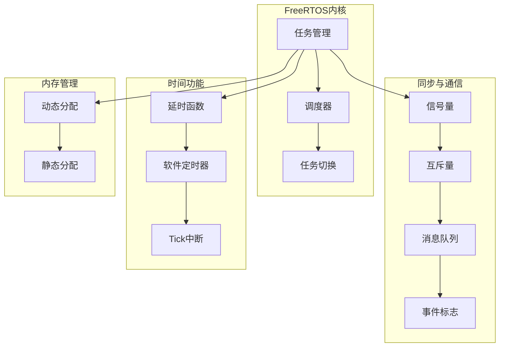
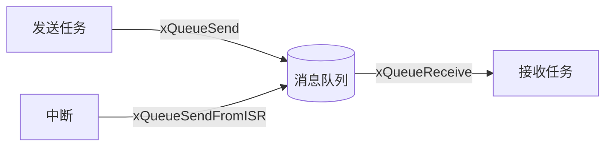

# 5.3 FreeRTOS内核实践

## 一、FreeRTOS简介

### 1. FreeRTOS特点

| 特点 | 说明 |
|-----|------|
| 开源免费 | MIT许可，可商业使用 |
| 轻量高效 | 内核最小仅6KB |
| 功能完善 | 任务、信号量、队列、定时器等 |
| 架构支持 | 支持Cortex-M、RISC-V等 |
| 社区活跃 | 广泛应用，文档丰富 |

### 2. FreeRTOS功能模块



### 3. 关键配置项

```c
// FreeRTOSConfig.h 关键配置
#define configUSE_PREEMPTION             1    // 启用抢占式调度
#define configUSE_TIME_SLICING          1    // 启用时间片轮转
#define configMAX_PRIORITIES            32   // 最大优先级数
#define configMINIMAL_STACK_SIZE       128  // 最小栈大小
#define configTOTAL_HEAP_SIZE           (15*1024)  // 堆大小
#define configUSE_MUTEXES                1    // 启用互斥量
#define configUSE_COUNTING_SEMAPHORES    1    // 启用计数信号量
#define configUSE_QUEUE_SETS             1    // 启用队列集
#define configUSE_TIMERS                 1    // 启用软件定时器
#define configTOTAL_TIMER_TASKS         1    // 定时器任务数
```

## 二、任务创建与管理

### 1. 基础任务示例

```c
#include "FreeRTOS.h"
#include "task.h"
#include "queue.h"
#include "semphr.h"

// 任务1：LED闪烁
void led_task(void *pvParameters) {
    GPIO_InitTypeDef GPIO_InitStruct;
    // LED GPIO初始化...
    
    while(1) {
        GPIO_SetBits(GPIOB, GPIO_Pin_0);
        vTaskDelay(pdMS_TO_TICKS(500));
        GPIO_ResetBits(GPIOB, GPIO_Pin_0);
        vTaskDelay(pdMS_TO_TICKS(500));
    }
}

// 任务2：串口接收处理
void uart_task(void *pvParameters) {
    extern QueueHandle_t uart_rx_queue;
    uint8_t data;
    
    while(1) {
        // 从队列获取数据
        if(xQueueReceive(uart_rx_queue, &data, portMAX_DELAY) == pdPASS) {
            process_uart_data(data);
        }
    }
}

// 系统初始化
void app_init(void) {
    // 创建任务
    xTaskCreate(led_task, "LED", 128, NULL, 2, NULL);
    xTaskCreate(uart_task, "UART", 256, NULL, 3, NULL);
    
    // 启动调度器
    vTaskStartScheduler();
    
    // 不应到达这里
    while(1);
}
```

### 2. 任务优先级设计

```
优先级分配原则：

优先级 0 (最低) → 空闲任务
优先级 1       → 低优先级后台任务（如数据存储）
优先级 2       → 普通业务任务（如UI刷新）
优先级 3       → 通信处理（如蓝牙、WiFi）
优先级 4       → 实时控制（如电机控制）
优先级 5 (最高) → 紧急响应（如安全检测）

示例：
- 空闲任务: 优先级 0
- 数据记录任务: 优先级 1
- 显示更新任务: 优先级 2
- 蓝牙通信任务: 优先级 3
- 电机控制任务: 优先级 4
- 紧急停止任务: 优先级 5
```

### 3. 任务栈检查

```c
// 检查任务栈使用情况
void check_task_stack_usage(void) {
    TaskStatus_t xTaskDetails;
    
    vTaskGetInfo(NULL, &xTaskDetails, pdTRUE, eInvalid);
    
    printf("任务栈剩余: %d words\n", 
           xTaskDetails.usStackHighWaterMark);
}

// 通过Hook函数检查
void vApplicationStackOverflowHook(TaskHandle_t xTask, char *pcTaskName) {
    // 栈溢出处理
    printf("任务栈溢出: %s\n", pcTaskName);
    
    // 可以重启系统或进入安全模式
    while(1);
}
```

## 三、消息队列

### 1. 队列基础



### 2. 队列创建与使用

```c
// 创建消息队列
#define QUEUE_LENGTH 10
#define ITEM_SIZE    sizeof(uint8_t)

QueueHandle_t xDataQueue;

void create_queue(void) {
    xDataQueue = xQueueCreate(QUEUE_LENGTH, ITEM_SIZE);
    if(xDataQueue == NULL) {
        // 创建失败，内存不足
    }
}

// 发送数据（任务上下文）
void send_data(uint8_t data) {
    if(xQueueSend(xDataQueue, &data, pdMS_TO_TICKS(10)) != pdPASS) {
        // 队列满，处理错误
    }
}

// 发送数据（中断上下文）
void send_data_from_isr(uint8_t data) {
    BaseType_t xHigherPriorityTaskWoken = pdFALSE;
    
    xQueueSendFromISR(xDataQueue, &data, &xHigherPriorityTaskWoken);
    portYIELD_FROM_ISR(xHigherPriorityTaskWoken);
}

// 接收数据
void receive_data_task(void) {
    uint8_t data;
    
    while(1) {
        if(xQueueReceive(xDataQueue, &data, portMAX_DELAY) == pdPASS) {
            process_data(data);
        }
    }
}
```

### 3. 队列在中断中使用

```c
// UART接收中断
void USART1_IRQHandler(void) {
    static BaseType_t xHigherPriorityTaskWoken = pdFALSE;
    uint8_t data;
    
    if(USART_GetITStatus(USART1, USART_IT_RXNE) != RESET) {
        data = USART_ReceiveData(USART1);
        
        // 发送到队列
        xQueueSendFromISR(xDataQueue, &data, &xHigherPriorityTaskWoken);
        
        // 触发上下文切换
        portYIELD_FROM_ISR(xHigherPriorityTaskWoken);
    }
}
```

### 4. 队列集

```c
// 队列集：一个等待多个队列
QueueSetHandle_t xQueueSet;

void create_queue_set(void) {
    xQueueSet = xQueueCreateSet(3);
    
    xQueueAddToSet(xUartQueue, xQueueSet);
    xQueueAddToSet(xSpiQueue, xQueueSet);
    xQueueAddToSet(xI2cQueue, xQueueSet);
}

// 等待任意队列数据
void wait_any_queue(void) {
    QueueSetMemberHandle_t xActivatedMember;
    
    while(1) {
        xActivatedMember = xQueueSelectFromSet(xQueueSet, portMAX_DELAY);
        
        if(xActivatedMember == xUartQueue) {
            handle_uart_data();
        } else if(xActivatedMember == xSpiQueue) {
            handle_spi_data();
        } else if(xActivatedMember == xI2cQueue) {
            handle_i2c_data();
        }
    }
}
```

## 四、信号量与互斥量

### 1. 信号量使用示例

```c
// 二值信号量：任务同步
SemaphoreHandle_t xDataReadySem;

void producer_task(void) {
    while(1) {
        // 生产数据
        produce_data();
        
        // 通知消费者
        xSemaphoreGive(xDataReadySem);
    }
}

void consumer_task(void) {
    while(1) {
        // 等待数据
        xSemaphoreTake(xDataReadySem, portMAX_DELAY);
        
        // 消费数据
        consume_data();
    }
}
```

### 2. 互斥量使用示例

```c
// 互斥量：保护共享资源
SemaphoreHandle_t xSharedMutex;
uint32_t shared_resource = 0;

void task_a(void) {
    while(1) {
        if(xSemaphoreTake(xSharedMutex, pdMS_TO_TICKS(10)) == pdTRUE) {
            // 访问共享资源
            shared_resource++;
            
            // 释放互斥量
            xSemaphoreGive(xSharedMutex);
        }
        
        vTaskDelay(pdMS_TO_TICKS(10));
    }
}

void task_b(void) {
    while(1) {
        if(xSemaphoreTake(xSharedMutex, pdMS_TO_TICKS(10)) == pdTRUE) {
            // 访问共享资源
            printf("Resource: %d\n", shared_resource);
            
            xSemaphoreGive(xSharedMutex);
        }
        
        vTaskDelay(pdMS_TO_TICKS(10));
    }
}
```

### 3. 计数信号量示例

```c
// 计数信号量：资源池管理
#define MAX_RESOURCES 5

SemaphoreHandle_t xResourceSem;
uint8_t resources[MAX_RESOURCES];

void resource_pool_init(void) {
    xResourceSem = xSemaphoreCreateCounting(MAX_RESOURCES, MAX_RESOURCES);
}

uint8_t* acquire_resource(void) {
    if(xSemaphoreTake(xResourceSem, pdMS_TO_TICKS(100)) == pdTRUE) {
        for(int i = 0; i < MAX_RESOURCES; i++) {
            if(!resource_used[i]) {
                resource_used[i] = 1;
                return &resources[i];
            }
        }
        xSemaphoreGive(xResourceSem);  // 归还
    }
    return NULL;
}

void release_resource(uint8_t *resource) {
    int index = resource - resources;
    resource_used[index] = 0;
    xSemaphoreGive(xResourceSem);
}
```

## 五、事件标志组

### 1. 事件标志组基础

```c
// 事件标志组
EventGroupHandle_t xEventGroup;

#define EVENT_BUTTON1   (1 << 0)
#define EVENT_BUTTON2   (1 << 1)
#define EVENT_DATA_READY (1 << 2)
#define EVENT_TIMEOUT    (1 << 3)
```

### 2. 事件使用示例

```c
void event_producer_task(void) {
    while(1) {
        if(button1_pressed()) {
            xEventGroupSetBits(xEventGroup, EVENT_BUTTON1);
        }
        if(button2_pressed()) {
            xEventGroupSetBits(xEventGroup, EVENT_BUTTON2);
        }
        
        vTaskDelay(pdMS_TO_TICKS(50));
    }
}

void event_consumer_task(void) {
    EventBits_t xBits;
    
    while(1) {
        // 等待任意事件
        xBits = xEventGroupWaitBits(
            xEventGroup,
            EVENT_BUTTON1 | EVENT_BUTTON2,
            pdTRUE,          // 清除已设置的位
            pdFALSE,         // 任一事件即可
            portMAX_DELAY
        );
        
        // 处理事件
        if(xBits & EVENT_BUTTON1) {
            handle_button1();
        }
        if(xBits & EVENT_BUTTON2) {
            handle_button2();
        }
    }
}
```

## 六、软件定时器

### 1. 定时器创建

```c
// 软件定时器
TimerHandle_t xTimer;

void timer_callback(TimerHandle_t xTimer) {
    printf("定时器触发！\n");
    // 定时器回调中不要执行耗时操作
}

void create_timer(void) {
    xTimer = xTimerCreate(
        "MyTimer",
        pdMS_TO_TICKS(1000),  // 1秒周期
        pdTRUE,                // 自动重载
        NULL,
        timer_callback
    );
}
```

### 2. 定时器操作

```c
// 启动定时器
void start_timer(void) {
    xTimerStart(xTimer, 0);  // 0表示立即执行
}

// 停止定时器
void stop_timer(void) {
    xTimerStop(xTimer, pdMS_TO_TICKS(100));
}

// 重置定时器
void reset_timer(void) {
    xTimerReset(xTimer, pdMS_TO_TICKS(100));
}

// 改变周期
void change_timer_period(TickType_t new_period) {
    xTimerChangePeriod(xTimer, new_period, pdMS_TO_TICKS(100));
}
```

### 3. 单次定时器

```c
// 单次定时器
TimerHandle_t xOneShotTimer;

void one_shot_callback(TimerHandle_t xTimer) {
    printf("单次定时器触发！\n");
    // 执行一次性操作
}

void create_one_shot_timer(void) {
    xOneShotTimer = xTimerCreate(
        "OneShot",
        pdMS_TO_TICKS(5000),  // 5秒后触发
        pdFALSE,              // 单次，不重载
        NULL,
        one_shot_callback
    );
}
```

## 七、综合应用示例

### 1. 数据采集系统

```c
// 任务优先级
#define TASK_ADC_PRIORITY    4  // 高优先级
#define TASK_PROCESS_PRIORITY 2
#define TASK_DISPLAY_PRIORITY 1

QueueHandle_t adc_data_queue;

// ADC采集任务（高优先级）
void adc_task(void *pvParameters) {
    uint16_t adc_value;
    
    while(1) {
        // 启动ADC转换
        ADC_StartConversion(ADC1);
        
        // 等待转换完成
        while(ADC_GetFlagStatus(ADC1, ADC_FLAG_EOC) == RESET);
        
        // 读取值
        adc_value = ADC_GetConversionValue(ADC1);
        
        // 发送到队列
        xQueueSend(adc_data_queue, &adc_value, 0);
    }
}

// 数据处理任务（中优先级）
void process_task(void *pvParameters) {
    uint16_t raw_value;
    float filtered_value;
    
    while(1) {
        // 等待ADC数据
        xQueueReceive(adc_data_queue, &raw_value, portMAX_DELAY);
        
        // 数据滤波
        filtered_value = low_pass_filter(raw_value);
        
        // 更新共享变量
        if(xSemaphoreTake(xDataMutex, 10) == pdTRUE) {
            current_value = filtered_value;
            xSemaphoreGive(xDataMutex);
        }
    }
}

// 显示任务（低优先级）
void display_task(void *pvParameters) {
    while(1) {
        // 读取当前值
        if(xSemaphoreTake(xDataMutex, 10) == pdTRUE) {
            display_value = current_value;
            xSemaphoreGive(xDataMutex);
        }
        
        // 刷新显示
        lcd_show_value(display_value);
        
        vTaskDelay(pdMS_TO_TICKS(100));
    }
}
```

### 2. 按键处理系统

```c
// 按键事件定义
#define KEY_EVENT_NONE   0
#define KEY_EVENT_SHORT  1
#define KEY_EVENT_LONG   2

EventGroupHandle_t key_events;

// 按键检测中断
void EXTI0_IRQHandler(void) {
    static uint32_t press_time = 0;
    BaseType_t xHigherPriorityTaskWoken = pdFALSE;
    uint32_t current_time;
    
    if(EXTI_GetITStatus(EXTI_Line0) != RESET) {
        current_time = HAL_GetTick();
        
        if(!key_pressed) {
            // 按键按下
            press_time = current_time;
            key_pressed = 1;
        } else {
            // 按键释放
            if(current_time - press_time > 1000) {
                xEventGroupSetBitsFromISR(key_events, KEY_EVENT_LONG, &xHigherPriorityTaskWoken);
            } else {
                xEventGroupSetBitsFromISR(key_events, KEY_EVENT_SHORT, &xHigherPriorityTaskWoken);
            }
            key_pressed = 0;
        }
        
        EXTI_ClearITPendingBit(EXTI_Line0);
        portYIELD_FROM_ISR(xHigherPriorityTaskWoken);
    }
}

// 按键处理任务
void key_process_task(void) {
    EventBits_t bits;
    
    while(1) {
        bits = xEventGroupWaitBits(key_events, 
                                    KEY_EVENT_SHORT | KEY_EVENT_LONG,
                                    pdTRUE, pdFALSE, portMAX_DELAY);
        
        if(bits & KEY_EVENT_SHORT) {
            handle_short_press();
        }
        if(bits & KEY_EVENT_LONG) {
            handle_long_press();
        }
    }
}
```

---

**导航**：上一节 [[5.2-任务调度与优先级反转]] · [[MOC - 第5章\|返回章节导航]]