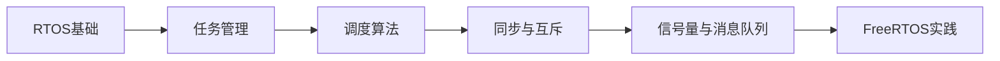

# 第5章 实时操作系统RTOS内核原理

> [!abstract] 本章定位
> 本章学习RTOS的核心概念、任务调度、同步机制和常见RTOS（FreeRTOS、uCOS）的使用方法。

## 学习主线

## 章节内容

- [[5.1-RTOS基础与任务状态]]：RTOS特性、任务创建、状态切换
- [[5.2-任务调度与优先级反转]]：调度算法、优先级反转与继承
- [[5.3-FreeRTOS内核实践]]：FreeRTOS任务、队列、信号量、定时器

## 核心考点

> [!important] 必掌握
> 1. RTOS与裸机系统的区别
> 2. 任务的三态模型与状态转换
> 3. 抢占式调度与时间片轮转
> 4. 优先级反转问题的成因与解决方案
> 5. 信号量、互斥量、消息队列的使用场景
> 6. FreeRTOS任务创建与删除
> 7. 二值信号量与计数信号量的区别

## 复习自测

> [!question] 自测题
> 1. RTOS的三个基本特性是什么？
> 2. 任务有哪些状态？如何转换？
> 3. 什么是优先级反转？如何解决？
> 4. 信号量和互斥量有什么区别？
> 5. 如何使用FreeRTOS创建一个周期性任务？
> 6. 消息队列和信号量的使用场景分别是什么？