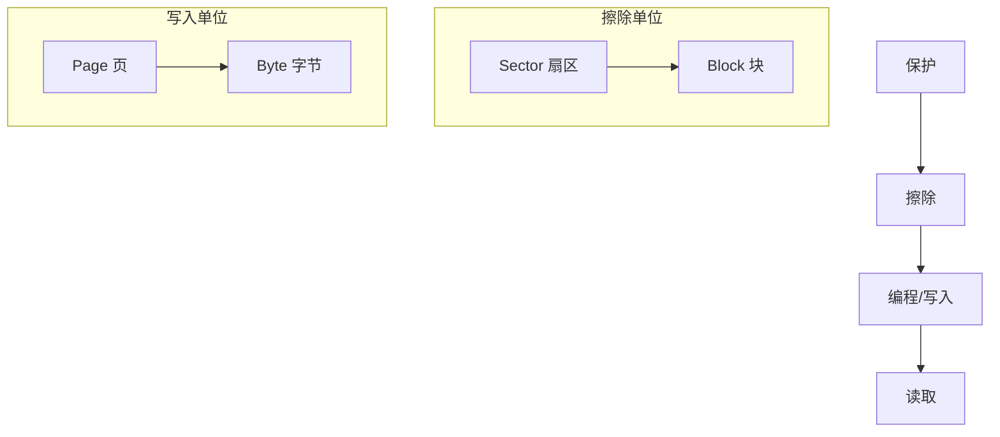
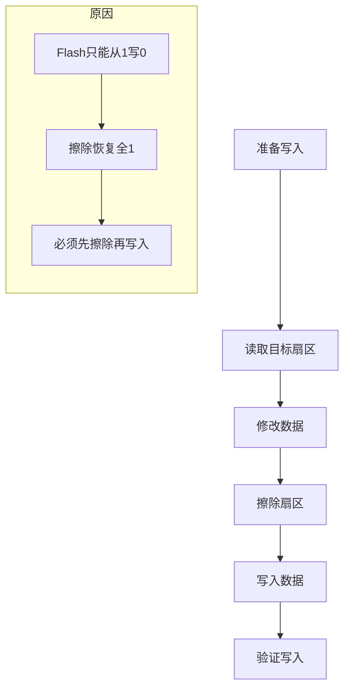

# 6.1 Flash与EEPROM存储

## 一、Flash存储器基础

### 1. Flash类型

| 类型 | 特点 | 应用 |
|-----|------|------|
| NOR Flash | 随机读取，按扇区擦除 | Bootloader、程序存储 |
| NAND Flash | 顺序读取，按块擦除 | 大容量数据存储 |
| SPI Flash | 串行接口，体积小 | 外部存储扩展 |

### 2. Flash基本操作



**操作特点**：
- 擦除：将存储单元全部置1
- 写入：将需要的位置0（只能从1→0）
- 读取：不改变数据状态
- 保护：防止误擦写

### 3. Flash寿命

```
Flash擦写次数限制：
- NOR Flash: 10,000 ~ 100,000次/扇区
- NAND Flash: 1,000,000次/块
- SPI Flash: 10,000 ~ 100,000次/扇区

影响因素：
- 擦写次数
- 温度（高温加速老化）
- 写入电压
```

### 4. STM32片内Flash

```c
// STM32F103 Flash结构
// 容量: 64KB / 128KB / 256KB / 512KB
// 扇区大小: 1KB 或 2KB（小容量）, 128KB（大容量）

#define FLASH_SECTOR_SIZE  128  // KB

// Flash映射
// 0x08000000 ~ 0x0800FFFF
```

## 二、SPI Flash驱动

### 1. SPI Flash命令集

| 命令 | 代码 | 说明 |
|-----|------|------|
| READ | 0x03 | 读取数据 |
| FAST_READ | 0x0B | 快速读取 |
| PAGE_PROGRAM | 0x02 | 页编程（256字节） |
| SECTOR_ERASE | 0x20 | 扇区擦除（4KB） |
| BLOCK_ERASE | 0x52 | 块擦除（32/64KB） |
| CHIP_ERASE | 0xC7 | 整片擦除 |
| RDSR | 0x05 | 读状态寄存器 |
| WREN | 0x06 | 写使能 |
| RDID | 0x9F | 读JEDEC ID |

### 2. SPI Flash初始化

```c
#define W25Q16  // Winbond W25Q16 (2MBit = 256KB)

// 状态寄存器位定义
#define W25Q16_BUSY    0x01  // 忙标志
#define W25Q16_WEL     0x02  // 写使能锁

// 初始化
void SPI_Flash_Init(void) {
    // SPI初始化（Mode 0, 1MHz）
    SPI_InitTypeDef SPI_InitStruct;
    // ... SPI配置代码
    
    // 读取ID
    uint32_t id = SPI_Flash_ReadID();
    printf("Flash ID: 0x%06X\n", id);
    // W25Q16: 0xEF4015
    // W25Q64: 0xEF4017
}
```

### 3. SPI Flash读写

```c
// 读取状态寄存器
uint8_t SPI_Flash_ReadSR(void) {
    uint8_t sr;
    CS_LOW();
    SPI_Transfer(0x05);  // RDSR命令
    sr = SPI_Transfer(0xFF);  // 读取
    CS_HIGH();
    return sr;
}

// 等待Flash就绪
void SPI_Flash_WaitReady(void) {
    while(SPI_Flash_ReadSR() & W25Q16_BUSY);
}

// 写使能
void SPI_Flash_WriteEnable(void) {
    CS_LOW();
    SPI_Transfer(0x06);  // WREN命令
    CS_HIGH();
}

// 扇区擦除（4KB）
void SPI_Flash_EraseSector(uint32_t addr) {
    SPI_Flash_WriteEnable();
    SPI_Flash_WaitReady();
    
    CS_LOW();
    SPI_Transfer(0x20);  // SECTOR_ERASE
    SPI_Transfer((addr >> 16) & 0xFF);
    SPI_Transfer((addr >> 8) & 0xFF);
    SPI_Transfer(addr & 0xFF);
    CS_HIGH();
    
    SPI_Flash_WaitReady();  // 等待擦除完成
}

// 页编程（最多256字节）
void SPI_Flash_PageProgram(uint32_t addr, uint8_t *data, uint16_t len) {
    SPI_Flash_WriteEnable();
    SPI_Flash_WaitReady();
    
    CS_LOW();
    SPI_Transfer(0x02);  // PAGE_PROGRAM
    SPI_Transfer((addr >> 16) & 0xFF);
    SPI_Transfer((addr >> 8) & 0xFF);
    SPI_Transfer(addr & 0xFF);
    
    for(uint16_t i = 0; i < len; i++) {
        SPI_Transfer(data[i]);
    }
    CS_HIGH();
    
    SPI_Flash_WaitReady();
}

// 读取数据
void SPI_Flash_ReadData(uint32_t addr, uint8_t *buf, uint32_t len) {
    CS_LOW();
    SPI_Transfer(0x03);  // READ命令
    SPI_Transfer((addr >> 16) & 0xFF);
    SPI_Transfer((addr >> 8) & 0xFF);
    SPI_Transfer(addr & 0xFF);
    
    for(uint32_t i = 0; i < len; i++) {
        buf[i] = SPI_Transfer(0xFF);
    }
    CS_HIGH();
}
```

### 4. SPI Flash擦写流程



## 三、EEPROM存储

### 1. EEPROM vs Flash

| 对比项 | EEPROM | Flash |
|-------|--------|-------|
| 擦写单位 | 字节 | 扇区/页 |
| 擦写次数 | 1,000,000+ | 10,000~100,000 |
| 写入速度 | 慢 | 快 |
| 擦除时间 | 无（按字节写） | 慢（ms级） |
| 成本 | 高 | 低 |
| 容量 | 小（KB级） | 大（MB级） |
| 典型应用 | 配置参数 | 程序存储、数据存储 |

### 2. I2C EEPROM（如AT24C02）

```c
// AT24C02参数
// 容量: 2Kbit (256字节)
// 页大小: 8字节
// 擦写次数: 1,000,000次
// 写周期: 10ms

// 写入一个字节
uint8_t EEPROM_WriteByte(uint16_t addr, uint8_t data) {
    // 起始
    I2C_Start();
    // 设备地址 + 写
    I2C_SendByte(0xA0);  // A2 A1 A0 = 000
    I2C_WaitAck();
    // 内存地址
    I2C_SendByte(addr & 0xFF);
    I2C_WaitAck();
    // 数据
    I2C_SendByte(data);
    I2C_WaitAck();
    // 停止
    I2C_Stop();
    
    // 等待写入完成
    delay_ms(10);
    
    return 0;
}

// 读取一个字节
uint8_t EEPROM_ReadByte(uint16_t addr) {
    uint8_t data;
    
    I2C_Start();
    I2C_SendByte(0xA0);
    I2C_WaitAck();
    I2C_SendByte(addr & 0xFF);
    I2C_WaitAck();
    
    I2C_Start();  // 重复起始
    I2C_SendByte(0xA1);  // 读
    I2C_WaitAck();
    
    data = I2C_ReadByte(1);  // ACK
    I2C_Stop();
    
    return data;
}
```

### 3. EEPROM页写入

```c
// 页写入（最多8字节）
uint8_t EEPROM_WritePage(uint16_t addr, uint8_t *data, uint8_t len) {
    uint8_t i;
    
    if(len > 8) return 1;
    
    I2C_Start();
    I2C_SendByte(0xA0);
    I2C_WaitAck();
    I2C_SendByte(addr & 0xFF);
    I2C_WaitAck();
    
    for(i = 0; i < len; i++) {
        I2C_SendByte(data[i]);
        I2C_WaitAck();
    }
    
    I2C_Stop();
    delay_ms(10);
    
    return 0;
}
```

## 四、存储管理

### 1. 磨损均衡

```
目的：延长Flash整体寿命

策略：
1. 轮询写入（Round-Robin）
2. 随机选址写入
3. 标记已写扇区
4. 垃圾回收（GC）
```

### 2. 数据完整性保护

```c
// 数据校验存储结构
typedef struct {
    uint32_t magic;      // 魔数标识
    uint32_t version;    // 版本号
    uint8_t data[100];  // 实际数据
    uint32_t checksum;   // CRC32校验
} StorageBlock;

// 写入数据（带校验）
void storage_write(StorageBlock *block) {
    // 计算校验
    block->checksum = crc32_calc(block, 
                                  offsetof(StorageBlock, checksum));
    
    // 写入Flash
    Flash_EraseSector(block_addr);
    Flash_WritePage(block_addr, (uint8_t*)block, sizeof(StorageBlock));
}

// 读取并校验
uint8_t storage_read(StorageBlock *block) {
    uint32_t stored_checksum, calc_checksum;
    
    Flash_ReadData(block_addr, (uint8_t*)block, sizeof(StorageBlock));
    
    // 校验
    stored_checksum = block->checksum;
    calc_checksum = crc32_calc(block, 
                                offsetof(StorageBlock, checksum));
    
    if(stored_checksum != calc_checksum) {
        return 1;  // 数据损坏
    }
    
    return 0;
}
```

### 3. 参数存储示例

```c
// 系统参数结构
typedef struct {
    float sensor_calibration;  // 传感器校准值
    uint16_t alarm_threshold;  // 报警阈值
    uint8_t mode;              // 工作模式
    uint8_t reserved[50];      // 预留
    uint32_t checksum;         // 校验和
} SystemParams;

#define PARAMS_ADDR  0x0000  // 存储地址

// 初始化参数（带默认值）
SystemParams g_params = {
    .sensor_calibration = 1.0f,
    .alarm_threshold = 1000,
    .mode = 1
};

// 从Flash加载参数
void params_load(void) {
    SystemParams temp;
    
    Flash_ReadData(PARAMS_ADDR, (uint8_t*)&temp, sizeof(SystemParams));
    
    if(temp.checksum == crc32_calc(&temp, offsetof(SystemParams, checksum))) {
        // 参数有效
        g_params = temp;
    } else {
        // 使用默认值
        params_save();  // 写入默认值
    }
}

// 保存参数到Flash
void params_save(void) {
    g_params.checksum = crc32_calc(&g_params, 
                                    offsetof(SystemParams, checksum));
    
    // 读-改-写流程
    Flash_EraseSector(PARAMS_ADDR);
    Flash_PageProgram(PARAMS_ADDR, (uint8_t*)&g_params, sizeof(SystemParams));
}
```

---

**导航**：[[MOC - 第6章\|返回章节导航]] · 下一节 [[6.2-SD卡与文件系统]]