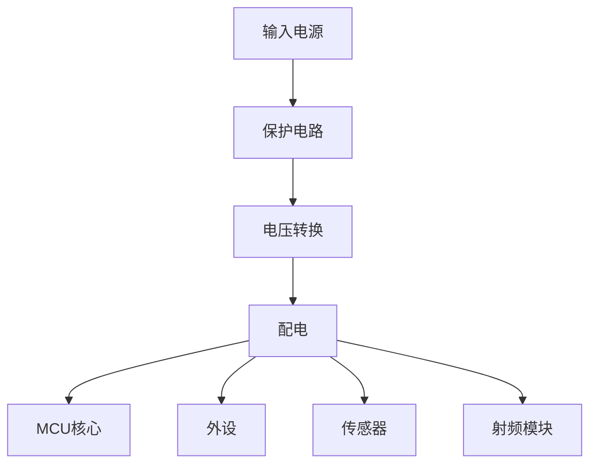
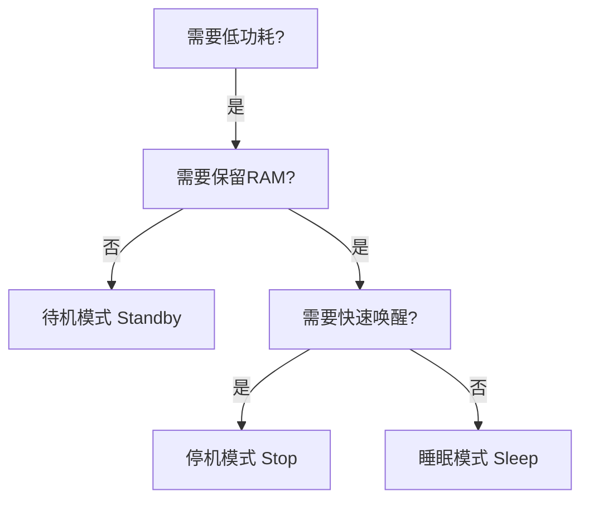

# 6.3 电源管理与低功耗

## 一、电源管理基础

### 1. 电源模块类型

| 类型 | 说明 | 效率 |
|-----|------|------|
| LDO（线性稳压） | 简单、低噪声 | 低 |
| DC-DC（开关稳压） | 高效率 | 高 |
| 电荷泵（Charge Pump） | 倍压/反压 | 中等 |

### 2. 电源架构



### 3. 典型供电方案

| 应用 | 输入电压 | 转换方式 | 输出电压 |
|-----|---------|---------|---------|
| 锂电池 | 3.0~4.2V | LDO/DC-DC | 3.3V |
| 5V适配器 | 5V | LDO | 3.3V |
| 太阳能 | 3~5V | DC-DC | 5V/3.3V |
| 工业电源 | 12~24V | DC-DC | 5V/3.3V |

## 二、STM32低功耗模式

### 1. 低功耗模式对比

| 模式 | 电流 | MCU状态 | 唤醒方式 | 恢复时间 |
|-----|------|---------|---------|---------|
| 睡眠（Sleep） | ~几mA | CPU停止 | 中断/事件 | 即时 |
| 停机（Stop） | ~几μA | RAM/寄存器保持 | EXTI/RTC | 几μs |
| 待机（Standby） | ~几nA | 仅备份寄存器 | RTC/复位 | 复位启动 |

### 2. 三种模式详解

#### 睡眠模式（Sleep）

```c
// 进入睡眠模式
void enter_sleep_mode(void) {
    __WFI();  // Wait For Interrupt
    // 或
    __WFE();  // Wait For Event
}

// 特点：
// - CPU停止运行
// - 时钟继续运行
// - RAM/寄存器全部保持
// - 任意中断可唤醒
// - 唤醒后继续执行
```

#### 停机模式（Stop）

```c
// 进入停机模式
void enter_stop_mode(void) {
    PWR_EnterSTOPMode(PWR_Regulator_LowPower, PWR_STOPEntry_WFI);
}

// 特点：
// - 所有时钟停止
// - RAM/寄存器保持
// - 功耗极低
// - EXTI/RTC可唤醒
// - 唤醒后需要重新配置时钟
```

#### 待机模式（Standby）

```c
// 进入待机模式
void enter_standby_mode(void) {
    PWR_EnterSTANDBYMode();
}

// 特点：
// - 最深度低功耗
// - 仅备份寄存器保持
// - 功耗最低
// - RTC/复位可唤醒
// - 唤醒后相当于复位
```

### 3. 低功耗模式选择



### 4. 低功耗模式唤醒

```c
// 配置WKUP（唤醒）引脚
void wkup_config(void) {
    EXTI_InitTypeDef EXTI_InitStruct;
    GPIO_InitTypeDef GPIO_InitStruct;
    
    // 使能PWR和AFIO时钟
    RCC_APB1PeriphClockCmd(RCC_APB1Periph_PWR, ENABLE);
    RCC_APB2PeriphClockCmd(RCC_APB2Periph_AFIO, ENABLE);
    
    // 配置WKUP引脚（PA0）
    GPIO_InitStruct.GPIO_Pin = GPIO_Pin_0;
    GPIO_InitStruct.GPIO_Mode = GPIO_Mode_IPD;
    GPIO_Init(GPIOA, &GPIO_InitStruct);
    
    // 配置EXTI线
    GPIO_EXTILineConfig(GPIO_PortSourceGPIOA, GPIO_PinSource0);
    
    EXTI_InitStruct.EXTI_Line = EXTI_Line0;
    EXTI_InitStruct.EXTI_Mode = EXTI_Mode_Interrupt;
    EXTI_InitStruct.EXTI_Trigger = EXTI_Trigger_Rising;
    EXTI_InitStruct.EXTI_LineCmd = ENABLE;
    EXTI_Init(&EXTI_InitStruct);
    
    // 使能WKUP
    PWR_WakeUpPinCmd(ENABLE);
}

// 停机模式唤醒流程
void stop_wakeup_sequence(void) {
    // 1. 配置唤醒源
    wkup_config();
    
    // 2. 配置GPIO为模拟输入（减少漏电流）
    GPIO_ConfigAsAnalog();
    
    // 3. 进入停机模式
    PWR_EnterSTOPMode(PWR_Regulator_LowPower, PWR_STOPEntry_WFI);
    
    // 4. 唤醒后重新配置时钟
    SystemClock_Config();
    
    // 5. 重新配置GPIO
    GPIO_Reconfigure();
    
    // 6. 恢复外设配置
    Periph_Reconfigure();
}
```

## 三、外设低功耗管理

### 1. 外设时钟管理

```c
// 按需使能/禁用外设时钟
void peripheral_power_management(void) {
    // 禁用不需要的外设时钟
    RCC_APB1PeriphClockCmd(RCC_APB1Periph_TIM2, DISABLE);
    RCC_APB1PeriphClockCmd(RCC_APB1Periph_USART2, DISABLE);
    RCC_APB2PeriphClockCmd(RCC_APB2Periph_ADC1, DISABLE);
    
    // 进入低功耗前禁用GPIOs
    // 未使用的GPIO配置为模拟输入
}
```

### 2. GPIO低功耗配置

```c
// 配置未使用的GPIO为模拟模式
void GPIO_ConfigAsAnalog(void) {
    GPIO_InitTypeDef GPIO_InitStruct;
    
    // GPIOA
    GPIO_InitStruct.GPIO_Pin = GPIO_Pin_All;
    GPIO_InitStruct.GPIO_Mode = GPIO_Mode_AIN;
    GPIO_Init(GPIOA, &GPIO_InitStruct);
    
    // GPIOB
    GPIO_Init(GPIOB, &GPIO_InitStruct);
    
    // GPIOC
    GPIO_Init(GPIOC, &GPIO_InitStruct);
    
    // 重新配置需要使用的引脚
    // ...
}
```

### 3. 外设低功耗模式

| 外设 | 低功耗模式 | 电流 |
|-----|----------|------|
| UART | 待机模式 | ~1μA |
| SPI | 待机模式 | ~1μA |
| I2C | 待机模式 | ~1μA |
| ADC | 关断 | 几μA |
| 定时器 | 停止 | 几μA |

## 四、RTOS低功耗设计

### 1. Tickless Idle

> [!quote] Tickless Idle
> 当所有任务都进入阻塞状态时，RTOS可以停止系统Tick中断，进入低功耗模式。

```c
// FreeRTOS Tickless Idle实现
void vApplicationSleep(TickType_t xExpectedIdleTime) {
    // 1. 关闭系统Tick
    portSUPPRESS_TICKS_AND_SLEEP(xExpectedIdleTime);
}

// 自定义睡眠实现
void custom_sleep(TickType_t expected_idle_time) {
    // 计算实际睡眠时间
    TickType_t sleep_time = expected_idle_time;
    
    // 如果有其他唤醒源，取最小值
    if(rtc_alarm_time < sleep_time) {
        sleep_time = rtc_alarm_time;
    }
    
    // 配置RTC闹钟
    rtc_set_alarm(sleep_time);
    
    // 进入停机模式
    PWR_EnterSTOPMode(PWR_Regulator_LowPower, PWR_STOPEntry_WFI);
    
    // 唤醒后恢复Tick
    SystemClock_Config();
    
    // 调整系统时间
    xTaskIncrementTick(sleep_time);
}
```

### 2. 低功耗任务设计

```c
// 周期任务使用绝对延时
void low_power_task(void *pvParameters) {
    TickType_t last_time = xTaskGetTickCount();
    
    while(1) {
        // 执行任务
        do_work();
        
        // 延时到下一个周期
        vTaskDelayUntil(&last_time, pdMS_TO_TICKS(1000));
    }
}

// 使用事件等待
void event_driven_task(void *pvParameters) {
    while(1) {
        // 等待事件（阻塞，不占用CPU）
        EventBits_t bits = xEventGroupWaitBits(
            xEventGroup,
            ALL_EVENTS,
            pdTRUE,
            pdFALSE,
            portMAX_DELAY  // 无限等待
        );
        
        // 处理事件
        handle_events(bits);
    }
}
```

### 3. 空闲任务钩子

```c
// 空闲任务钩子函数
void vApplicationIdleHook(void) {
    // 在这里可以进入低功耗模式
    
    // 方法1：进入睡眠
    __WFI();
    
    // 方法2：进入停机（如果Tickless Idle已禁用）
    // PWR_EnterSTOPMode(...);
}

// 堆栈溢出检测
void vApplicationStackOverflowHook(TaskHandle_t xTask, char *pcTaskName) {
    // 处理堆栈溢出
    while(1);
}

// 内存分配失败
void vApplicationMallocFailedHook(void) {
    // 处理内存不足
    while(1);
}
```

## 五、功耗优化技术

### 1. 系统级优化

| 技术 | 说明 |
|-----|------|
| 动态调频（DVFS） | 根据负载调整CPU频率 |
| 时钟门控 | 关闭不使用的外设时钟 |
| 分区供电 | 分别为不同模块供电 |
| 电源管理IC | 使用PMIC统一管理 |
| 电池管理 | 优化充放电策略 |

### 2. 软件级优化

```c
// 1. 减少轮询，使用中断
// 不好：
while(!data_ready);

// 好：
xSemaphoreTake(xDataSem, portMAX_DELAY);

// 2. 使用DMA减少CPU占用
HAL_DMA_Start(&hdma_adc, ...);
// 而不是：
while(!DMA完成);

// 3. 批量处理
// 不好：每次处理一条
while(1) {
    process_one_item();
    delay(100);
}

// 好：批量处理
while(1) {
    process_all_items();
    delay(1000);
}

// 4. 使用定时器而非延时
// 不好：阻塞延时
HAL_Delay(1000);

// 好：非阻塞定时器
xTimerCreate("Timer", pdMS_TO_TICKS(1000), ...);
```

### 3. 硬件级优化

| 优化项 | 说明 |
|-------|------|
| 选择低功耗MCU | 如STM32L系列 |
| 优化供电方案 | 使用DC-DC替代LDO |
| 添加外部唤醒源 | RTC、比较器等 |
| 使用低功耗外设 | 如低功耗传感器 |
| PCB优化 | 减少漏电流路径 |

### 4. 功耗测量

```c
// 使用ADC测量电源电流
float measure_current(void) {
    uint16_t adc_value;
    float voltage, current;
    
    // 读取ADC
    adc_value = ADC_GetValue(ADC_Channel_0);
    
    // 转换为电压
    voltage = adc_value * 3.3f / 4096.0f;
    
    // 计算电流（采样电阻1Ω）
    current = voltage / 1.0f;
    
    return current;
}

// 功耗统计
typedef struct {
    float avg_current;
    float max_current;
    float min_current;
    float total_charge;
    uint32_t samples;
} PowerStats;

PowerStats g_power_stats;

void power_monitor_task(void *pvParameters) {
    float current;
    
    while(1) {
        current = measure_current();
        
        // 更新统计
        g_power_stats.samples++;
        g_power_stats.total_charge += current * 0.1f;  // 100ms采样
        
        if(current > g_power_stats.max_current) {
            g_power_stats.max_current = current;
        }
        if(current < g_power_stats.min_current || g_power_stats.samples == 1) {
            g_power_stats.min_current = current;
        }
        g_power_stats.avg_current = g_power_stats.total_charge / 
                                     (g_power_stats.samples * 0.1f);
        
        vTaskDelay(pdMS_TO_TICKS(100));
    }
}
```

## 六、低功耗应用示例

### 1. 温度传感器节点

```c
// 应用场景：电池供电，每10分钟测量一次温度
// 优化目标：平均电流<10μA

void sensor_node_init(void) {
    // 初始化
    rtc_init();
    temperature_sensor_init();
    radio_init();
    
    // 进入主循环
    while(1) {
        // 1. 唤醒（RTC闹钟）
        rtc_wait_alarm();
        
        // 2. 唤醒后工作
        float temp = read_temperature();
        radio_send_data(temp);
        
        // 3. 完成后进入停机模式
        PWR_EnterSTOPMode(PWR_Regulator_LowPower, PWR_STOPEntry_WFI);
        // 功耗：~5μA
    }
}
```

### 2. 智能手表

```c
// 应用场景：显示时间+心率监测
// 要求：1周续航

void smart_watch_main(void) {
    // 任务1：时钟显示（1Hz）
    xTaskCreate(display_task, "Display", 256, NULL, 2, NULL);
    
    // 任务2：心率监测（1Hz）
    xTaskCreate(heart_rate_task, "HR", 512, NULL, 3, NULL);
    
    // 任务3：低功耗管理
    xTaskCreate(power_mgmt_task, "Power", 128, NULL, 4, NULL);
    
    vTaskStartScheduler();
}

void display_task(void *pvParameters) {
    while(1) {
        // 更新显示
        update_display();
        
        // 进入低功耗显示模式
        display_low_power_mode();
        
        vTaskDelay(pdMS_TO_TICKS(1000));
    }
}

void power_mgmt_task(void *pvParameters) {
    while(1) {
        // 监测电池电量
        float battery = read_battery();
        
        if(battery < 0.1f) {
            // 电量低，进入深度待机
            PWR_EnterSTANDBYMode();
        }
        
        // 正常模式，进入停机
        PWR_EnterSTOPMode(PWR_Regulator_LowPower, PWR_STOPEntry_WFI);
        
        // 唤醒后恢复
        SystemClock_Config();
        
        vTaskDelay(pdMS_TO_TICKS(60000));  // 每分钟检查
    }
}
```

---

**导航**：上一节 [[6.2-SD卡与文件系统]] · [[MOC - 第6章\|返回章节导航]]