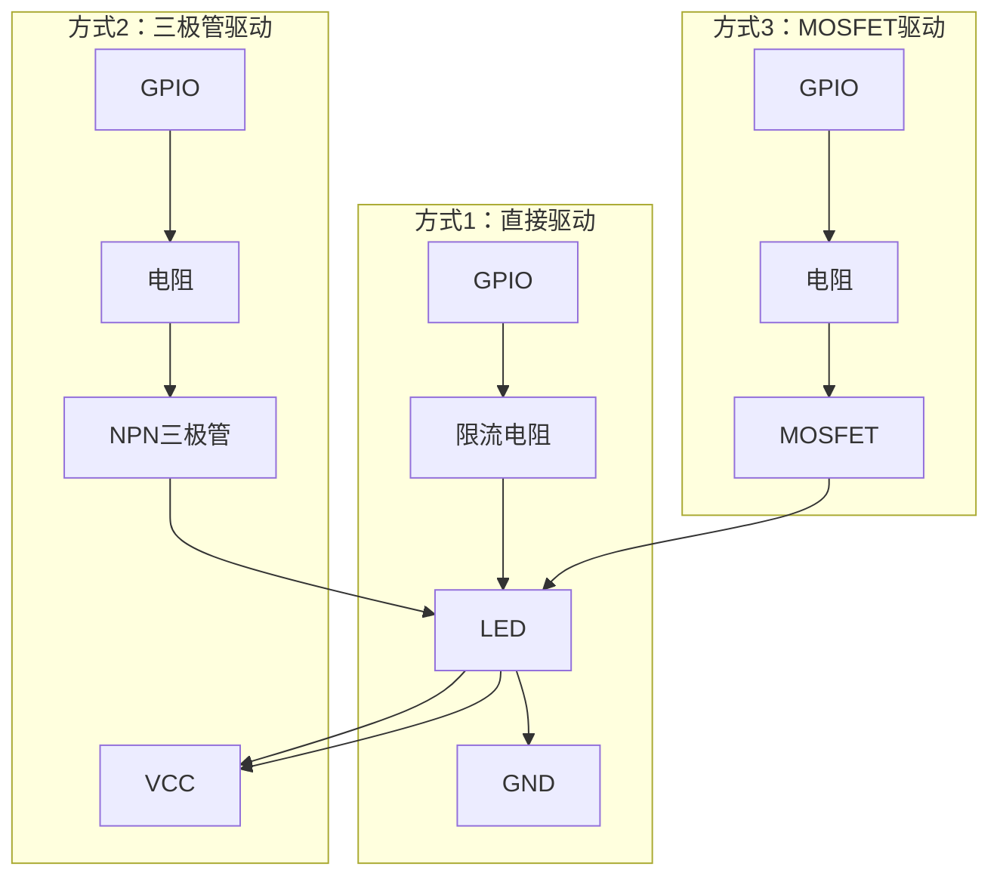
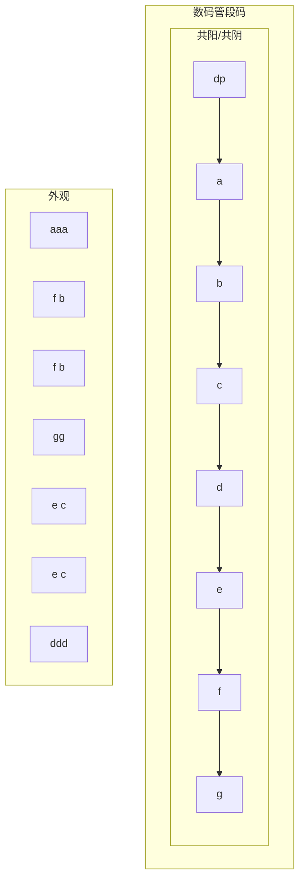
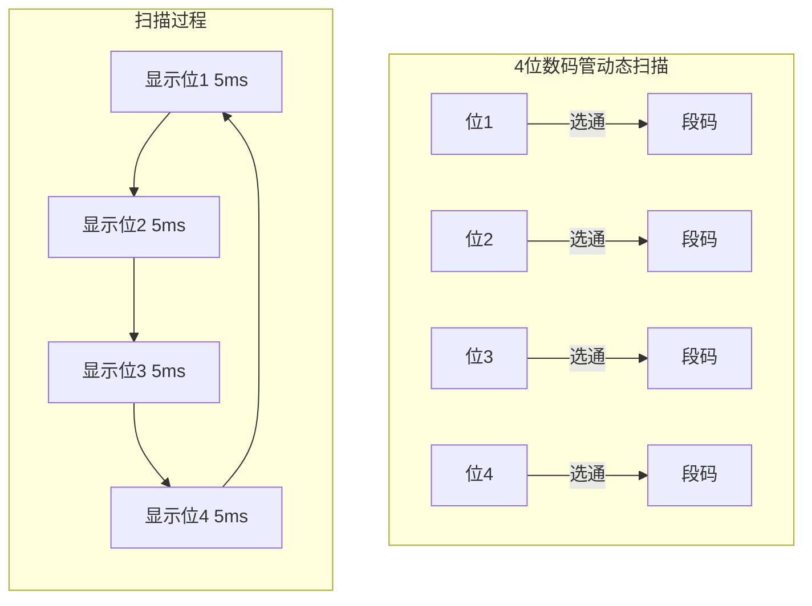
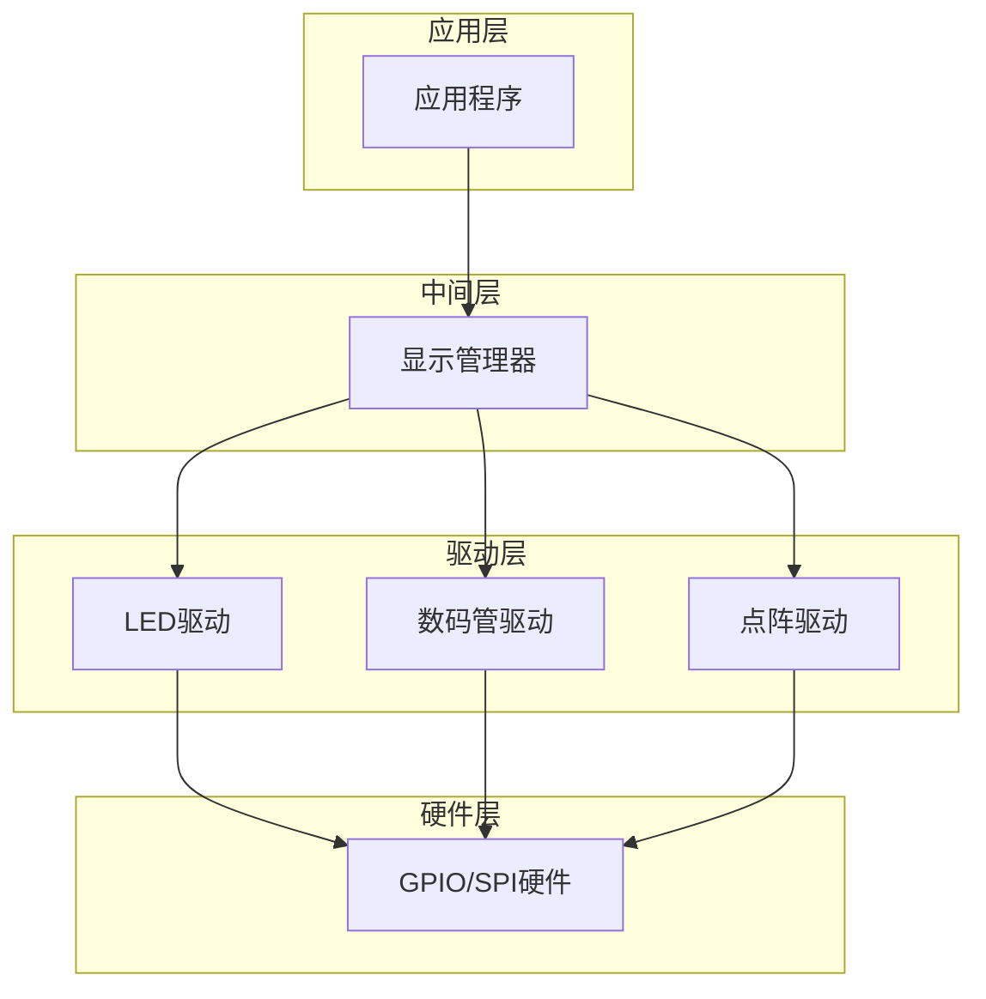

# 7.1 LED与数码管显示

## 一、LED驱动基础

### 1. LED连接方式



### 2. LED驱动代码

```c
// 静态驱动
#define LED_PIN  GPIO_Pin_0
#define LED_PORT GPIOA

void LED_Init(void) {
    GPIO_InitTypeDef GPIO_InitStruct;
    
    RCC_APB2PeriphClockCmd(RCC_APB2Periph_GPIOA, ENABLE);
    
    GPIO_InitStruct.GPIO_Pin = LED_PIN;
    GPIO_InitStruct.GPIO_Mode = GPIO_Mode_Out_PP;
    GPIO_InitStruct.GPIO_Speed = GPIO_Speed_2MHz;
    GPIO_Init(LED_PORT, &GPIO_InitStruct);
    
    GPIO_ResetBits(LED_PORT, LED_PIN);
}

void LED_ON(void) {
    GPIO_SetBits(LED_PORT, LED_PIN);
}

void LED_OFF(void) {
    GPIO_ResetBits(LED_PORT, LED_PIN);
}

void LED_Toggle(void) {
    if(GPIO_ReadOutputDataBit(LED_PORT, LED_PIN) == Bit_SET) {
        LED_OFF();
    } else {
        LED_ON();
    }
}
```

### 3. LED闪烁示例

```c
// 方式1：延时法（阻塞）
void LED_Blink_Delay(void) {
    while(1) {
        LED_ON();
        delay_ms(500);
        LED_OFF();
        delay_ms(500);
    }
}

// 方式2：定时器中断法
volatile uint32_t led_tick = 0;

void TIM2_IRQHandler(void) {
    if(TIM_GetITStatus(TIM2, TIM_IT_Update) != RESET) {
        led_tick++;
        TIM_ClearITPendingBit(TIM2, TIM_IT_Update);
    }
}

void LED_Blink_Timer(void) {
    uint32_t last_tick = 0;
    
    while(1) {
        if(led_tick - last_tick >= 500) {
            LED_Toggle();
            last_tick = led_tick;
        }
    }
}

// 方式3：RTOS任务法
void LED_Task(void *pvParameters) {
    while(1) {
        LED_Toggle();
        vTaskDelay(pdMS_TO_TICKS(500));
    }
}
```

## 二、数码管显示

### 1. 数码管结构



**段码定义**：
```
a: 上
b: 右上
c: 右下
d: 下
e: 左下
f: 左上
g: 中
dp: 小数点
```

### 2. 数码管段码表

```c
// 共阳极段码表（低电平点亮）
// bit: dp g f e d c b a
const uint8_t seg_code_common_anode[16] = {
    0xC0,  // 0
    0xF9,  // 1
    0xA4,  // 2
    0xB0,  // 3
    0x99,  // 4
    0x92,  // 5
    0x82,  // 6
    0xF8,  // 7
    0x80,  // 8
    0x90,  // 9
    0x88,  // A
    0x83,  // B
    0xC6,  // C
    0xA1,  // D
    0x86,  // E
    0x8E   // F
};

// 共阴极段码表（高电平点亮）
const uint8_t seg_code_common_cathode[16] = {
    0x3F,  // 0
    0x06,  // 1
    0x5B,  // 2
    0x4F,  // 3
    0x66,  // 4
    0x6D,  // 5
    0x7D,  // 6
    0x07,  // 7
    0x7F,  // 8
    0x6F,  // 9
    0x77,  // A
    0x7C,  // B
    0x39,  // C
    0x5E,  // D
    0x79,  // E
    0x71   // F
};
```

### 3. 静态驱动（单数码管）

```c
// 共阳极，使用74HC573锁存器
#define SEG_DATA_PORT GPIOA
#define SEG_DATA_PINS (GPIO_Pin_0 | GPIO_Pin_1 | GPIO_Pin_2 | GPIO_Pin_3 | \
                       GPIO_Pin_4 | GPIO_Pin_5 | GPIO_Pin_6 | GPIO_Pin_7)

#define LOCK_PIN GPIOB
#define LOCK_BIT GPIO_Pin_0

void SEG_Init(void) {
    GPIO_InitTypeDef GPIO_InitStruct;
    
    RCC_APB2PeriphClockCmd(RCC_APB2Periph_GPIOA | RCC_APB2Periph_GPIOB, ENABLE);
    
    // 数据引脚
    GPIO_InitStruct.GPIO_Pin = SEG_DATA_PINS;
    GPIO_InitStruct.GPIO_Mode = GPIO_Mode_Out_PP;
    GPIO_InitStruct.GPIO_Speed = GPIO_Speed_2MHz;
    GPIO_Init(SEG_DATA_PORT, &GPIO_InitStruct);
    
    // 锁存引脚
    GPIO_InitStruct.GPIO_Pin = LOCK_BIT;
    GPIO_Init(LOCK_PIN, &GPIO_InitStruct);
    
    GPIO_ResetBits(LOCK_PIN, LOCK_BIT);
}

void SEG_Display(uint8_t num) {
    uint8_t code;
    
    if(num < 16) {
        code = seg_code_common_anode[num];
    } else {
        code = 0xFF;  // 全灭
    }
    
    // 输出段码
    GPIO_Write(SEG_DATA_PORT, code);
    
    // 锁存
    GPIO_SetBits(LOCK_PIN, LOCK_BIT);
    GPIO_ResetBits(LOCK_PIN, LOCK_BIT);
}
```

### 4. 动态扫描（多位数码管）

#### 扫描原理



#### 动态扫描实现

```c
// 4位共阴极数码管
#define NUM_DIGITS 4

// 段码端口（PA0-PA7）
#define SEG_PORT GPIOA
#define SEG_PINS (GPIO_Pin_0 | GPIO_Pin_1 | GPIO_Pin_2 | GPIO_Pin_3 | \
                  GPIO_Pin_4 | GPIO_Pin_5 | GPIO_Pin_6 | GPIO_Pin_7)

// 位选端口（PB0-PB3）
#define DIGIT_PORT GPIOB
#define DIGIT_PINS (GPIO_Pin_0 | GPIO_Pin_1 | GPIO_Pin_2 | GPIO_Pin_3)

// 显示缓冲区
uint8_t display_buffer[NUM_DIGITS] = {0, 0, 0, 0};

void MultiSEG_Init(void) {
    GPIO_InitTypeDef GPIO_InitStruct;
    
    RCC_APB2PeriphClockCmd(RCC_APB2Periph_GPIOA | RCC_APB2Periph_GPIOB, ENABLE);
    
    // 段码引脚
    GPIO_InitStruct.GPIO_Pin = SEG_PINS;
    GPIO_InitStruct.GPIO_Mode = GPIO_Mode_Out_PP;
    GPIO_InitStruct.GPIO_Speed = GPIO_Speed_2MHz;
    GPIO_Init(SEG_PORT, &GPIO_InitStruct);
    
    // 位选引脚
    GPIO_InitStruct.GPIO_Pin = DIGIT_PINS;
    GPIO_Init(DIGIT_PORT, &GPIO_InitStruct);
}

void MultiSEG_SetNumber(uint16_t num) {
    display_buffer[0] = num / 1000;
    display_buffer[1] = (num / 100) % 10;
    display_buffer[2] = (num / 10) % 10;
    display_buffer[3] = num % 10;
}

// 定时器中断扫描（每5ms刷新一位）
volatile uint8_t scan_index = 0;

void TIM3_IRQHandler(void) {
    if(TIM_GetITStatus(TIM3, TIM_IT_Update) != RESET) {
        // 先关闭所有位选
        GPIO_ResetBits(DIGIT_PORT, DIGIT_PINS);
        
        // 输出当前位的段码
        uint8_t code = seg_code_common_cathode[display_buffer[scan_index]];
        GPIO_Write(SEG_PORT, code);
        
        // 打开当前位
        uint8_t digit_mask = 1 << scan_index;
        GPIO_SetBits(DIGIT_PORT, digit_mask);
        
        // 切换到下一位
        scan_index++;
        if(scan_index >= NUM_DIGITS) {
            scan_index = 0;
        }
        
        TIM_ClearITPendingBit(TIM3, TIM_IT_Update);
    }
}
```

## 三、点阵LED

### 1. 8x8点阵

```c
// 74HC595驱动8x8点阵（SPI串行）
#define MATRIX_ROWS 8
#define MATRIX_COLS 8

// 行数据缓存
uint8_t matrix_data[MATRIX_ROWS] = {0};

// 发送数据到74HC595
void matrix_shift_data(uint8_t data) {
    for(int i = 7; i >= 0; i--) {
        // 发送高位到低位
        GPIO_ResetBits(SCK_PORT, SCK_PIN);
        if(data & (1 << i)) {
            GPIO_SetBits(MOSI_PORT, MOSI_PIN);
        } else {
            GPIO_ResetBits(MOSI_PORT, MOSI_PIN);
        }
        GPIO_SetBits(SCK_PORT, SCK_PIN);
    }
    
    // 锁存
    GPIO_SetBits(LATCH_PORT, LATCH_PIN);
    GPIO_ResetBits(LATCH_PORT, LATCH_PIN);
}

// 显示一行
void matrix_display_row(uint8_t row, uint8_t col_data) {
    // 关闭所有行
    GPIO_Write(ROW_PORT, 0);
    
    // 发送列数据
    matrix_shift_data(col_data);
    
    // 打开当前行
    GPIO_Write(ROW_PORT, 1 << row);
}

// 扫描显示
volatile uint8_t matrix_row = 0;

void matrix_scan(void) {
    matrix_display_row(matrix_row, matrix_data[matrix_row]);
    
    matrix_row++;
    if(matrix_row >= MATRIX_ROWS) {
        matrix_row = 0;
    }
}
```

### 2. 字模显示

```c
// 字模数据（8x8，LED=1）
const uint8_t font_8x8[][8] = {
    // '0'
    {0x00, 0x3C, 0x42, 0x81, 0x81, 0x42, 0x3C, 0x00},
    // '1'
    {0x00, 0x08, 0x08, 0x08, 0xFE, 0x00, 0x00, 0x00},
    // ... 其他字符
};

// 显示一个字符
void matrix_display_char(uint8_t row_offset, char ch) {
    uint8_t index = ch - '0';  // 以数字为例
    
    if(index < 10) {
        for(uint8_t i = 0; i < 8; i++) {
            matrix_data[(row_offset + i) % MATRIX_ROWS] = font_8x8[index][i];
        }
    }
}
```

## 四、显示系统设计

### 1. RTOS显示任务

```c
// 显示管理任务
void display_task(void *pvParameters) {
    uint16_t counter = 0;
    uint8_t display_state = 0;
    
    while(1) {
        switch(display_state) {
            case 0:  // 显示数字
                MultiSEG_SetNumber(counter);
                counter++;
                vTaskDelay(pdMS_TO_TICKS(100));
                break;
                
            case 1:  // 显示状态
                MultiSEG_SetNumber(system_status);
                vTaskDelay(pdMS_TO_TICKS(500));
                break;
                
            default:
                display_state = 0;
                break;
        }
    }
}
```

### 2. 显示驱动架构



---

**导航**：[[MOC - 第7章\|返回章节导航]] · 下一节 [[7.2-LCD显示与触摸屏]]