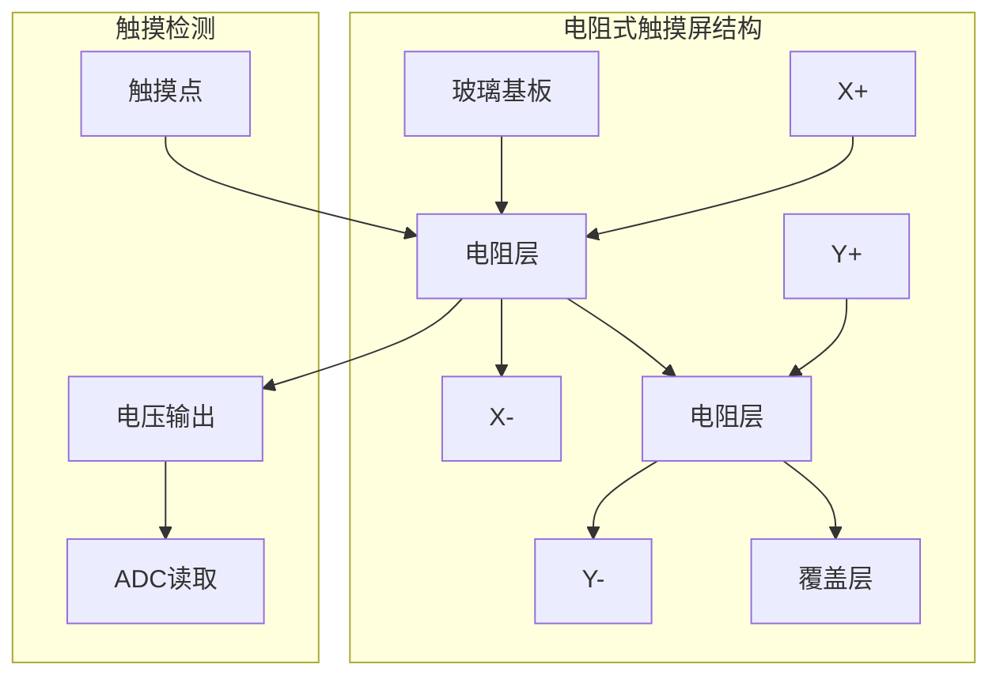

# 7.2 LCD显示与触摸屏

## 一、LCD显示器基础

### 1. LCD类型

| 类型 | 说明 | 接口 |
|-----|------|------|
| 字符型LCD | 显示字符数字 | 8位/4位并行 |
| TFT LCD | 彩色图形显示 | SPI/RGB/并口 |
| OLED | 自发光、对比度高 | SPI/I2C |
| 段码LCD | 显示固定格式 | 段码驱动 |

### 2. 字符型LCD（1602）

#### 特点

| 参数 | 值 |
|-----|----|
| 显示容量 | 16×2字符 |
| 工作电压 | 5V |
| 背光 | LED背光 |
| 接口 | 8位或4位并行 |

#### 1602引脚定义

| 引脚 | 名称 | 说明 |
|-----|------|------|
| 1 | VSS | 地 |
| 2 | VDD | 电源 (5V) |
| 3 | V0 | 对比度调整 |
| 4 | RS | 数据/命令选择 |
| 5 | R/W | 读/写选择 |
| 6 | E | 使能信号 |
| 7-14 | D0-D7 | 数据线 |
| 15 | A | 背光阳极 |
| 16 | K | 背光阴极 |

#### 1602初始化

```c
// 1602 LCD 4位模式驱动
#define LCD_RS_PORT GPIOB
#define LCD_RS_PIN  GPIO_Pin_0
#define LCD_E_PORT  GPIOB
#define LCD_E_PIN   GPIO_Pin_1
#define LCD_D_PORT  GPIOB
#define LCD_D_PINS  (GPIO_Pin_4 | GPIO_Pin_5 | GPIO_Pin_6 | GPIO_Pin_7)

void LCD_Init(void) {
    GPIO_InitTypeDef GPIO_InitStruct;
    
    RCC_APB2PeriphClockCmd(RCC_APB2Periph_GPIOB, ENABLE);
    
    // RS, E, D4-D7
    GPIO_InitStruct.GPIO_Pin = LCD_RS_PIN | LCD_E_PIN | LCD_D_PINS;
    GPIO_InitStruct.GPIO_Mode = GPIO_Mode_Out_PP;
    GPIO_InitStruct.GPIO_Speed = GPIO_Speed_2MHz;
    GPIO_Init(GPIOB, &GPIO_InitStruct);
    
    // 初始化序列（4位模式）
    delay_ms(50);  // 等待LCD上电
    
    LCD_WriteCmd(0x28);  // 4位模式，2行显示，5x8点阵
    LCD_WriteCmd(0x0C);  // 开显示，关光标
    LCD_WriteCmd(0x06);  // 光标右移，画面不动
    LCD_WriteCmd(0x01);  // 清屏
    delay_ms(5);
}

void LCD_WriteCmd(uint8_t cmd) {
    // RS=0, 命令模式
    GPIO_ResetBits(LCD_RS_PORT, LCD_RS_PIN);
    
    // 写高4位
    LCD_SendNibble(cmd >> 4);
    // 写低4位
    LCD_SendNibble(cmd & 0x0F);
    
    delay_us(100);
}

void LCD_WriteData(uint8_t data) {
    // RS=1, 数据模式
    GPIO_SetBits(LCD_RS_PORT, LCD_RS_PIN);
    
    LCD_SendNibble(data >> 4);
    LCD_SendNibble(data & 0x0F);
    
    delay_us(100);
}

void LCD_SendNibble(uint8_t nibble) {
    // 设置数据
    uint8_t port_val = GPIO_ReadOutputData(GPIOB);
    port_val &= ~LCD_D_PINS;
    port_val |= (nibble << 4) & LCD_D_PINS;
    GPIO_Write(GPIOB, port_val);
    
    // E脉冲
    GPIO_SetBits(LCD_E_PORT, LCD_E_PIN);
    delay_us(1);
    GPIO_ResetBits(LCD_E_PORT, LCD_E_PIN);
}
```

#### 1602显示函数

```c
// 设置光标位置
void LCD_SetCursor(uint8_t row, uint8_t col) {
    uint8_t address;
    
    if(row == 0) {
        address = 0x00 + col;  // 第一行
    } else {
        address = 0x40 + col;  // 第二行
    }
    
    LCD_WriteCmd(0x80 | address);
}

// 显示字符串
void LCD_ShowString(uint8_t row, uint8_t col, char *str) {
    LCD_SetCursor(row, col);
    
    while(*str) {
        LCD_WriteData(*str++);
    }
}

// 显示数字
void LCD_ShowNum(uint8_t row, uint8_t col, uint32_t num, uint8_t len) {
    char buf[10];
    uint8_t i;
    
    for(i = 0; i < len; i++) {
        buf[len - 1 - i] = '0' + (num % 10);
        num /= 10;
    }
    buf[len] = '\0';
    
    LCD_ShowString(row, col, buf);
}

// 显示浮点数
void LCD_ShowFloat(uint8_t row, uint8_t col, float num, uint8_t int_len, uint8_t dec_len) {
    uint32_t int_part = (uint32_t)num;
    uint32_t dec_part;
    char buf[16];
    
    // 整数部分
    LCD_ShowNum(row, col, int_part, int_len);
    
    // 小数点
    LCD_SetCursor(row, col + int_len);
    LCD_WriteData('.');
    
    // 小数部分
    dec_part = (uint32_t)((num - int_part) * pow(10, dec_len));
    LCD_ShowNum(row, col + int_len + 1, dec_part, dec_len);
}
```

## 二、OLED显示

### 1. OLED特点

| 参数 | 值 |
|-----|----|
| 显示技术 | 有机电致发光 |
| 优点 | 自发光、高对比度、宽视角 |
| 接口 | I2C/SPI |
| 分辨率 | 128x64 |
| 色彩 | 单色/双色/彩色 |

### 2. OLED I2C驱动（SSD1306）

```c
#define OLED_ADDR 0x78  // I2C地址

void OLED_Init(void) {
    // 初始化序列
    OLED_WriteCmd(0xAE);  // 关显示
    OLED_WriteCmd(0xD5);  // 时钟分频
    OLED_WriteCmd(0x80);  // 显示时钟 = 100Hz
    OLED_WriteCmd(0xA8);  // 复用率
    OLED_WriteCmd(0x3F);  // 64路
    OLED_WriteCmd(0xD3);  // 显示偏移
    OLED_WriteCmd(0x00);  // 偏移 = 0
    OLED_WriteCmd(0x40);  // 起始行
    OLED_WriteCmd(0xA1);  // 段映射
    OLED_WriteCmd(0xC8);  // COM扫描方向
    OLED_WriteCmd(0xDA);  // COM引脚
    OLED_WriteCmd(0x12);
    OLED_WriteCmd(0x81);  // 对比度
    OLED_WriteCmd(0xCF);
    OLED_WriteCmd(0xD9);  // 预周期
    OLED_WriteCmd(0xF1);
    OLED_WriteCmd(0xDB);  // VCOMH
    OLED_WriteCmd(0x40);
    OLED_WriteCmd(0xA4);  // 整屏开启
    OLED_WriteCmd(0xA6);  // 正常显示
    OLED_WriteCmd(0xAF);  // 开显示
}

void OLED_WriteCmd(uint8_t cmd) {
    I2C_Start();
    I2C_SendByte(OLED_ADDR << 1);  // 写
    I2C_WaitAck();
    I2C_SendByte(0x00);  // 命令标志
    I2C_WaitAck();
    I2C_SendByte(cmd);
    I2C_WaitAck();
    I2C_Stop();
}

void OLED_WriteData(uint8_t data) {
    I2C_Start();
    I2C_SendByte(OLED_ADDR << 1);
    I2C_WaitAck();
    I2C_SendByte(0x40);  // 数据标志
    I2C_WaitAck();
    I2C_SendByte(data);
    I2C_WaitAck();
    I2C_Stop();
}
```

### 3. OLED显示操作

```c
// 设置显示区域
void OLED_SetArea(uint8_t x, uint8_t y, uint8_t w, uint8_t h) {
    uint8_t x_start = x + 2;  // 偏移2
    uint8_t x_end = x + w + 1;
    
    OLED_WriteCmd(0xB0 + y);      // 页起始
    OLED_WriteCmd(((x_start & 0xF0) >> 4) | 0x10);  // 列高
    OLED_WriteCmd((x_start & 0x0F) | 0x01);  // 列低
}

// 清屏
void OLED_Clear(void) {
    uint8_t i, j;
    
    for(i = 0; i < 8; i++) {
        OLED_WriteCmd(0xB0 + i);
        OLED_WriteCmd(0x01);
        OLED_WriteCmd(0x10);
        
        for(j = 0; j < 128; j++) {
            OLED_WriteData(0);
        }
    }
}

// 显示字符串
void OLED_ShowString(uint8_t x, uint8_t y, char *str) {
    uint8_t i = 0;
    
    OLED_SetArea(x, y, strlen(str) * 8, 16);
    
    while(*str) {
        // 简单字模（8x16）
        OLED_ShowChar(x + i * 8, y, *str);
        str++;
        i++;
    }
}
```

## 三、TFT LCD驱动

### 1. TFT LCD特点

| 参数 | 值 |
|-----|----|
| 分辨率 | 240x320, 320x480, 480x800 |
| 颜色 | RGB565 / RGB888 |
| 接口 | SPI / RGB / 并口 |
| 控制器 | ILI9341, ST7789等 |

### 2. SPI TFT驱动（ILI9341）

```c
#define TFT_WIDTH  240
#define TFT_HEIGHT 320

// ILI9341命令
#define ILI9341_SWRESET    0x01
#define ILI9341_SLPOUT     0x11
#define ILI9341_NORON      0x13
#define ILI9341_DISPON     0x29
#define ILI9341_MEMADDR    0x20
#define ILI9341_MEMWRITE   0x2C
#define ILI9341_COLMOD     0x3A
#define ILI9341_MADCTL     0x36
#define ILI9341_CASET      0x2A
#define ILI9341_PASET      0x2B

void TFT_Init(void) {
    // 硬件SPI初始化...
    
    // 复位
    GPIO_ResetBits(RST_PORT, RST_PIN);
    delay_ms(50);
    GPIO_SetBits(RST_PORT, RST_PIN);
    delay_ms(50);
    
    // 初始化序列
    TFT_WriteCmd(ILI9341_SWRESET);
    delay_ms(50);
    
    TFT_WriteCmd(ILI9341_SLPOUT);
    delay_ms(200);
    
    TFT_WriteCmd(ILI9341_COLMOD);
    TFT_WriteData(0x55);  // RGB565
    
    TFT_WriteCmd(ILI9341_MADCTL);
    TFT_WriteData(0x48);  // 扫描方向
    
    TFT_WriteCmd(ILI9341_CASET);
    TFT_WriteData(0x00);
    TFT_WriteData(0x00);
    TFT_WriteData(0x00);
    TFT_WriteData(TFT_WIDTH - 1);
    
    TFT_WriteCmd(ILI9341_PASET);
    TFT_WriteData(0x00);
    TFT_WriteData(0x00);
    TFT_WriteData(0x00);
    TFT_WriteData(TFT_HEIGHT - 1);
    
    TFT_WriteCmd(ILI9341_NORON);
    delay_ms(10);
    
    TFT_WriteCmd(ILI9341_DISPON);
    delay_ms(100);
}

void TFT_WriteCmd(uint8_t cmd) {
    TFT_DC_LOW();
    SPI_Transfer(cmd);
}

void TFT_WriteData(uint8_t data) {
    TFT_DC_HIGH();
    SPI_Transfer(data);
}
```

### 3. TFT显示操作

```c
// 设置窗口区域
void TFT_SetWindow(uint16_t x, uint16_t y, uint16_t w, uint16_t h) {
    TFT_WriteCmd(0x2A);  // 列地址
    TFT_WriteData(x >> 8);
    TFT_WriteData(x & 0xFF);
    TFT_WriteData((x + w - 1) >> 8);
    TFT_WriteData((x + w - 1) & 0xFF);
    
    TFT_WriteCmd(0x2B);  // 页地址
    TFT_WriteData(y >> 8);
    TFT_WriteData(y & 0xFF);
    TFT_WriteData((y + h - 1) >> 8);
    TFT_WriteData((y + h - 1) & 0xFF);
    
    TFT_WriteCmd(0x2C);  // 内存写
}

// 画点
void TFT_DrawPoint(uint16_t x, uint16_t y, uint16_t color) {
    TFT_SetWindow(x, y, 1, 1);
    TFT_WriteData(color >> 8);
    TFT_WriteData(color & 0xFF);
}

// 填充矩形
void TFT_FillRect(uint16_t x, uint16_t y, uint16_t w, uint16_t h, uint16_t color) {
    uint32_t total = w * h;
    uint32_t i;
    
    TFT_SetWindow(x, y, w, h);
    
    for(i = 0; i < total; i++) {
        TFT_WriteData(color >> 8);
        TFT_WriteData(color & 0xFF);
    }
}

// 颜色定义
#define COLOR_BLACK   0x0000
#define COLOR_WHITE   0xFFFF
#define COLOR_RED     0xF800
#define COLOR_GREEN   0x07E0
#define COLOR_BLUE    0x001F
#define COLOR_YELLOW  0xFFE0
#define COLOR_CYAN    0x07FF
#define COLOR_MAGENTA 0xF81F
```

## 四、触摸屏

### 1. 触摸屏类型

| 类型 | 原理 | 特点 |
|-----|------|------|
| 电阻式 | 压力改变电阻 | 便宜、精度低、需触摸 |
| 电容式 | 改变电容 | 支持多点、价格高 |
| 红外式 | 光阻断 | 不受干扰、需要边框 |

### 2. 电阻式触摸屏原理



**原理**：
1. X轴检测：X+接VCC，X-接地，Y轴ADC读取电压
2. Y轴检测：Y+接VCC，Y-接地，X轴ADC读取电压
3. 根据电压值计算触摸位置

### 3. 电阻式触摸屏驱动

```c
// X轴读取（使用ADC）
uint16_t TP_ReadX(void) {
    uint16_t x_val;
    
    // 配置：X+接VCC, X-接地, Y接ADC
    GPIO_Write(GPIOA, 0xFFFF);  // X+ = VCC
    GPIO_Write(GPIOB, 0x0000);  // X- = GND
    
    // 配置Y为模拟输入
    ADC_ChannelConfig(ADC_Channel_5, ADC_SampleTime_239Cycles5);
    
    // 读取ADC
    x_val = ADC_GetValue(ADC1);
    
    return x_val;
}

// Y轴读取
uint16_t TP_ReadY(void) {
    uint16_t y_val;
    
    // 配置：Y+接VCC, Y-接地, X接ADC
    GPIO_Write(GPIOB, 0xFFFF);  // Y+ = VCC
    GPIO_Write(GPIOA, 0x0000);  // Y- = GND
    
    // 配置X为模拟输入
    ADC_ChannelConfig(ADC_Channel_6, ADC_SampleTime_239Cycles5);
    
    y_val = ADC_GetValue(ADC1);
    
    return y_val;
}

// 读取触摸坐标
uint8_t TP_ReadPoint(uint16_t *x, uint16_t *y) {
    uint16_t x_val, y_val;
    uint16_t x_filtered = 0, y_filtered = 0;
    uint8_t i;
    
    // 多次采样平均
    for(i = 0; i < 5; i++) {
        x_val = TP_ReadX();
        y_val = TP_ReadY();
        
        // 滤波
        x_filtered += x_val;
        y_filtered += y_val;
        delay_ms(5);
    }
    
    x_val = x_filtered / 5;
    y_val = y_filtered / 5;
    
    // 阈值判断（触摸检测）
    if(x_val > 100 && y_val > 100) {
        // 转换为屏幕坐标
        *x = (uint16_t)((float)(x_val - X_MIN) / (X_MAX - X_MIN) * LCD_WIDTH);
        *y = (uint16_t)((float)(y_val - Y_MIN) / (Y_MAX - Y_MIN) * LCD_HEIGHT);
        return 1;  // 有触摸
    }
    
    return 0;  // 无触摸
}
```

### 4. 触摸屏校准

```c
// 校准流程
void TP_Calibrate(void) {
    uint16_t x1, y1, x2, y2;
    uint16_t tp_x1, tp_y1, tp_x2, tp_y2;
    
    // 显示校准点
    TFT_DrawCrosshair(20, 20);
    TP_WaitForTouch(&x1, &y1);
    tp_x1 = x1;
    tp_y1 = y1;
    
    TFT_DrawCrosshair(TFT_WIDTH - 20, TFT_HEIGHT - 20);
    TP_WaitForTouch(&x2, &y2);
    tp_x2 = x2;
    tp_y2 = y2;
    
    // 计算校准参数
    tp_calib_x_scale = (float)(TFT_WIDTH - 40) / (tp_x2 - tp_x1);
    tp_calib_x_offset = 20 - tp_x1 * tp_calib_x_scale;
    
    tp_calib_y_scale = (float)(TFT_HEIGHT - 40) / (tp_y2 - tp_y1);
    tp_calib_y_offset = 20 - tp_y1 * tp_calib_y_scale;
    
    // 保存到Flash
    TP_SaveCalibration();
}

// 校准后坐标转换
void TP_ConvertCoords(uint16_t raw_x, uint16_t raw_y, 
                      uint16_t *screen_x, uint16_t *screen_y) {
    *screen_x = (uint16_t)(raw_x * tp_calib_x_scale + tp_calib_x_offset);
    *screen_y = (uint16_t)(raw_y * tp_calib_y_scale + tp_calib_y_offset);
}
```

### 5. 触摸事件处理

```c
// 触摸事件类型
typedef enum {
    TP_EVENT_NONE,
    TP_EVENT_TOUCH_DOWN,
    TP_EVENT_TOUCH_UP,
    TP_EVENT_TOUCH_MOVE
} TP_Event;

// 触摸状态机
typedef struct {
    uint16_t x;
    uint16_t y;
    uint8_t pressed;
    uint16_t last_x;
    uint16_t last_y;
} TP_State;

// 触摸扫描任务
void TP_ScanTask(void *pvParameters) {
    uint16_t raw_x, raw_y;
    uint16_t screen_x, screen_y;
    TP_Event event;
    static TP_State state = {0};
    
    while(1) {
        // 读取原始坐标
        if(TP_ReadPoint(&raw_x, &raw_y)) {
            // 转换为屏幕坐标
            TP_ConvertCoords(raw_x, raw_y, &screen_x, &screen_y);
            
            if(!state.pressed) {
                // 触摸按下
                event = TP_EVENT_TOUCH_DOWN;
                state.pressed = 1;
            } else if(screen_x != state.last_x || screen_y != state.last_y) {
                // 触摸移动
                event = TP_EVENT_TOUCH_MOVE;
            }
            
            state.last_x = screen_x;
            state.last_y = screen_y;
            state.x = screen_x;
            state.y = screen_y;
            
            // 处理事件
            HandleTouchEvent(event, screen_x, screen_y);
        } else {
            if(state.pressed) {
                // 触摸释放
                event = TP_EVENT_TOUCH_UP;
                state.pressed = 0;
                HandleTouchEvent(event, state.last_x, state.last_y);
            }
        }
        
        vTaskDelay(pdMS_TO_TICKS(20));
    }
}
```

---

**导航**：上一节 [[7.1-LED与数码管显示]] · [[MOC - 第7章\|返回章节导航]] · 下一节 [[7.3-传感器数据采集]]