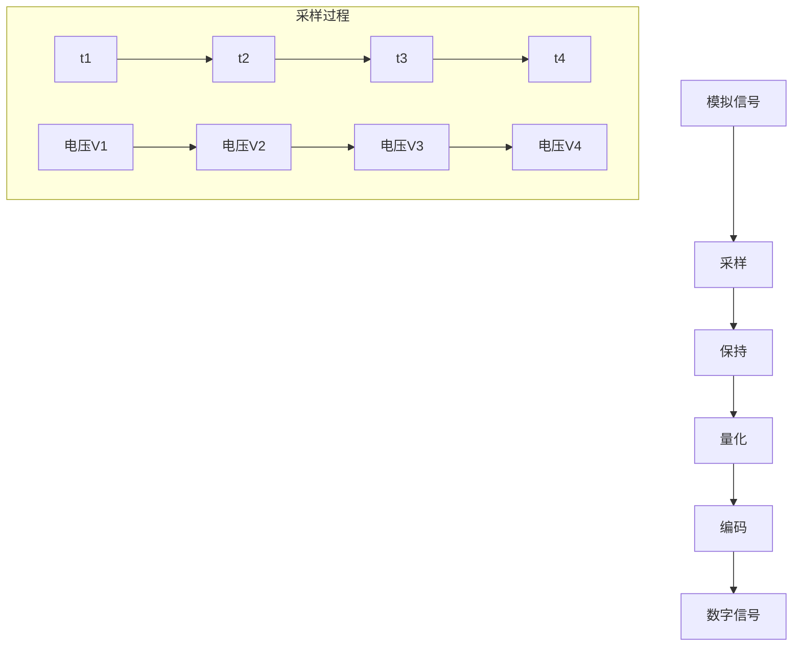
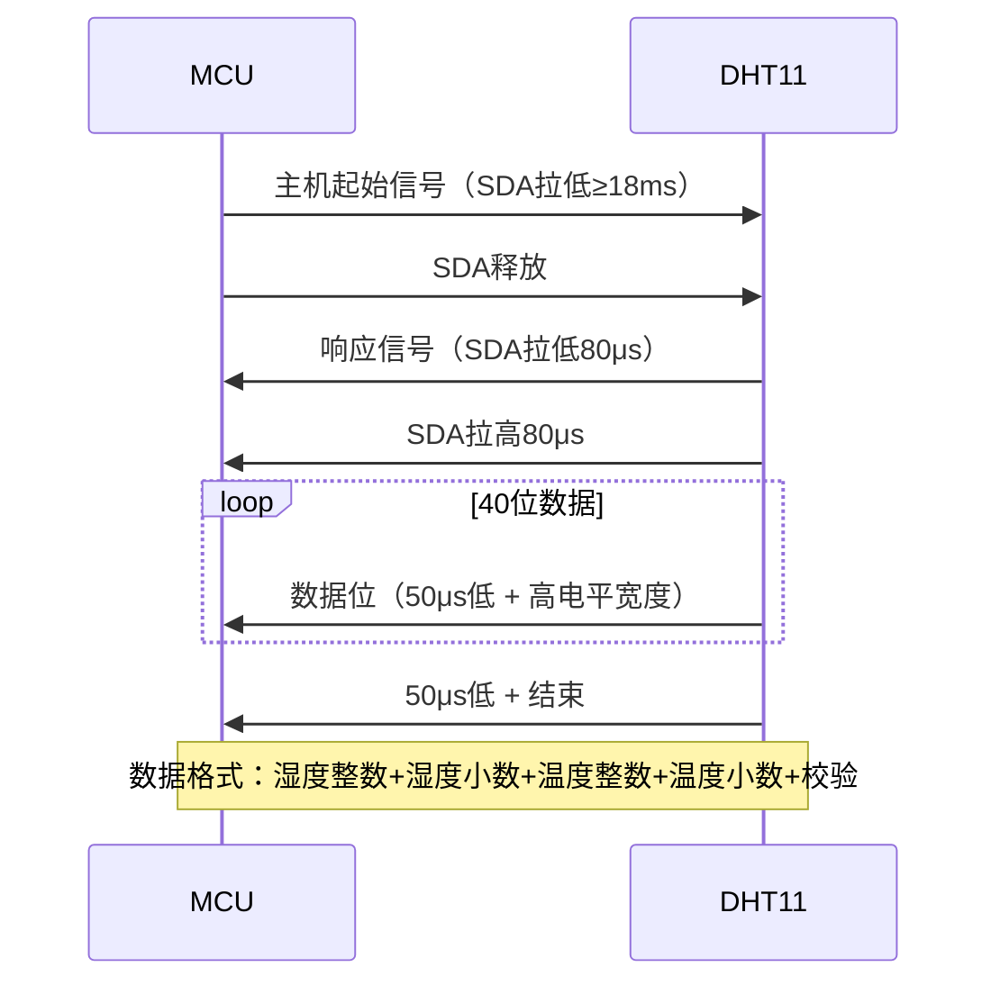

# 7.3 传感器数据采集

## 一、ADC采集基础

### 1. ADC工作原理



**关键参数**：
- 分辨率：12位（4096级）
- 采样率：1MHz（STM32）
- 参考电压：3.3V
- 转换时间：1μs（最快）

### 2. STM32 ADC配置

```c
void ADC_Init(void) {
    ADC_InitTypeDef ADC_InitStruct;
    GPIO_InitTypeDef GPIO_InitStruct;
    
    // 使能时钟
    RCC_APB2PeriphClockCmd(RCC_APB2Periph_ADC1 | RCC_APB2Periph_GPIOA, ENABLE);
    RCC_ADCCLKConfig(RCC_PCLK2_Div6);  // ADC时钟 = 72/6 = 12MHz
    
    // 配置模拟输入引脚
    GPIO_InitStruct.GPIO_Pin = GPIO_Pin_0 | GPIO_Pin_1 | GPIO_Pin_2;
    GPIO_InitStruct.GPIO_Mode = GPIO_Mode_AIN;
    GPIO_Init(GPIOA, &GPIO_InitStruct);
    
    // ADC配置
    ADC_DeInit(ADC1);
    
    ADC_InitStruct.ADC_Mode = ADC_Mode_Independent;
    ADC_InitStruct.ADC_ScanConvMode = ENABLE;  // 扫描模式
    ADC_InitStruct.ADC_ContinuousConvMode = DISABLE;  // 单次转换
    ADC_InitStruct.ADC_ExternalTrigConv = ADC_ExternalTrigConv_None;
    ADC_InitStruct.ADC_DataAlign = ADC_DataAlign_Right;
    ADC_InitStruct.ADC_NbrOfChannel = 3;  // 3个通道
    ADC_Init(ADC1, &ADC_InitStruct);
    
    // 配置通道和采样时间
    ADC_RegularChannelConfig(ADC1, ADC_Channel_0, 1, ADC_SampleTime_239Cycles5);
    ADC_RegularChannelConfig(ADC1, ADC_Channel_1, 2, ADC_SampleTime_239Cycles5);
    ADC_RegularChannelConfig(ADC1, ADC_Channel_2, 3, ADC_SampleTime_239Cycles5);
    
    // 校准
    ADC_Calibration(ADC1);
    
    // 使能ADC
    ADC_Cmd(ADC1, ENABLE);
}
```

### 3. ADC数据读取

```c
// 单次转换
uint16_t ADC_ReadChannel(uint8_t channel) {
    ADC_RegularChannelConfig(ADC1, channel, 1, ADC_SampleTime_239Cycles5);
    
    // 启动转换
    ADC_SoftStartConvCmd(ADC1, ENABLE);
    
    // 等待完成
    while(ADC_GetFlagStatus(ADC1, ADC_FLAG_EOC) == RESET);
    
    // 读取值
    return ADC_GetConversionValue(ADC1);
}

// 多通道扫描
void ADC_ScanChannels(uint16_t *values, uint8_t num_channels) {
    uint8_t i;
    
    // 启动扫描
    ADC_SoftStartConvCmd(ADC1, ENABLE);
    
    // 等待所有转换完成
    while(ADC_GetFlagStatus(ADC1, ADC_FLAG_EOC) == RESET);
    
    // 读取所有通道值
    for(i = 0; i < num_channels; i++) {
        values[i] = ADC_GetConversionValue(ADC1);
    }
}

// 中断方式读取
volatile uint16_t adc_values[3] = {0};
volatile uint8_t adc_ready = 0;

void ADC_IRQHandler(void) {
    if(ADC_GetITStatus(ADC1, ADC_IT_EOC) != RESET) {
        // 读取所有通道值
        adc_values[0] = ADC_GetConversionValue(ADC1);
        adc_values[1] = ADC_GetConversionValue(ADC1);
        adc_values[2] = ADC_GetConversionValue(ADC1);
        
        adc_ready = 1;
        ADC_ClearITPendingBit(ADC1, ADC_IT_EOC);
    }
}
```

### 4. ADC值转换

```c
// ADC值转电压
float ADC_ToVoltage(uint16_t adc_value) {
    return (float)adc_value * 3.3f / 4096.0f;
}

// ADC值转温度（LM35）
float ADC_ToTemperature(uint16_t adc_value) {
    float voltage = ADC_ToVoltage(adc_value);
    // LM35: 10mV/°C
    return voltage * 100.0f;
}

// ADC值转光照（光敏电阻）
float ADC_ToLight(uint16_t adc_value) {
    // 分压电路计算
    float voltage = ADC_ToVoltage(adc_value);
    float resistance = 10.0f * voltage / (3.3f - voltage);
    // 转换为照度（需要标定）
    return resistance;
}
```

## 二、I2C传感器

### 1. BME280温湿度气压传感器

#### 特点

| 参数 | 值 |
|-----|----|
| 测量参数 | 温度、湿度、气压 |
| 接口 | I2C (地址0x76) |
| 温度精度 | ±1°C |
| 湿度精度 | ±3% RH |
| 气压精度 | ±1 hPa |

#### BME280驱动

```c
#define BME280_ADDR  0x76

// BME280寄存器
#define BME280_REG_CHIP_ID    0xD0
#define BME280_REG_RESET      0xE0
#define BME280_REG_CTRL_HUM   0xF2
#define BME280_REG_STATUS     0xF3
#define BME280_REG_CTRL_MEAS  0xF4
#define BME280_REG_CONFIG     0xF5
#define BME280_REG_PRESS_MSB  0xF7
#define BME280_REG_TEMP_MSB   0xFA
#define BME280_REG_HUM_MSB    0xFD

typedef struct {
    float temperature;  // °C
    float humidity;     // %RH
    float pressure;     // hPa
} BME280_Data;

// 读取校准参数
void BME280_ReadCalibration(void) {
    uint8_t buf[24];
    
    I2C_ReadMulti(BME280_ADDR, 0x88, buf, 24);
    
    // 解析温度校准参数
    t1 = (uint16_t)buf[0] | ((uint16_t)buf[1] << 8);
    t2 = (uint16_t)buf[2] | ((uint16_t)buf[3] << 8);
    t3 = (uint8_t)buf[4];
    
    // 解析湿度校准参数
    h1 = (uint8_t)buf[5];
    h2 = (uint16_t)buf[6] | ((uint16_t)buf[7] << 8);
    h3 = (uint8_t)buf[8];
    
    // 解析气压校准参数
    // ...
}

// 初始化
uint8_t BME280_Init(void) {
    uint8_t id;
    
    // 读取芯片ID
    I2C_Read(BME280_ADDR, BME280_REG_CHIP_ID, &id);
    if(id != 0x60) return 1;  // ID不匹配
    
    // 软复位
    I2C_Write(BME280_ADDR, BME280_REG_RESET, 0xB6);
    delay_ms(100);
    
    // 读取校准参数
    BME280_ReadCalibration();
    
    // 配置过采样和滤波器
    I2C_Write(BME280_ADDR, BME280_REG_CONFIG, 0x28);  // 16倍滤波器
    I2C_Write(BME280_ADDR, BME280_REG_CTRL_HUM, 0x05);  // 16x湿度
    I2C_Write(BME280_ADDR, BME280_REG_CTRL_MEAS, 0x57);  // 16x温度+气压, 正常模式
    
    return 0;
}

// 读取数据
uint8_t BME280_ReadData(BME280_Data *data) {
    uint8_t buf[8];
    uint32_t raw_temp, raw_press, raw_hum;
    
    // 等待测量完成
    do {
        I2C_Read(BME280_ADDR, BME280_REG_STATUS, buf);
    } while(buf[0] & 0x09);  // 等待转换完成
    
    // 读取原始数据
    I2C_ReadMulti(BME280_ADDR, BME280_REG_PRESS_MSB, buf, 8);
    
    raw_press = ((uint32_t)buf[0] << 16) | 
                ((uint32_t)buf[1] << 8) | 
                (uint32_t)buf[2];
    raw_press >>= 4;
    
    raw_temp = ((uint32_t)buf[3] << 16) | 
               ((uint32_t)buf[4] << 8) | 
               (uint32_t)buf[5];
    raw_temp >>= 4;
    
    raw_hum = ((uint32_t)buf[6] << 8) | (uint32_t)buf[7];
    
    // 补偿计算
    data->temperature = bme280_compensate_T_float(raw_temp);
    data->pressure = bme280_compensate_P_float(raw_press);
    data->humidity = bme280_compensate_H_float(raw_hum);
    
    return 0;
}
```

### 2. MPU6050六轴传感器

#### 特点

| 参数 | 值 |
|-----|----|
| 测量参数 | 加速度、角速度 |
| 接口 | I2C (地址0x68) |
| 加速度范围 | ±2g / ±4g / ±8g / ±16g |
| 角速度范围 | ±250 / ±500 / ±1000 / ±2000 °/s |

#### MPU6050驱动

```c
#define MPU6050_ADDR  0x68

// MPU6050寄存器
#define MPU6050_REG_PWR_MGMT_1   0x6B
#define MPU6050_REG_ACCEL_XOUT_H 0x3B
#define MPU6050_REG_GYRO_XOUT_H  0x43
#define MPU6050_REG_WHO_AM_I     0x75

typedef struct {
    float accel_x;  // g
    float accel_y;
    float accel_z;
    float gyro_x;   // °/s
    float gyro_y;
    float gyro_z;
} MPU6050_Data;

uint8_t MPU6050_Init(void) {
    uint8_t id;
    
    I2C_Read(MPU6050_ADDR, MPU6050_REG_WHO_AM_I, &id);
    if(id != 0x68) return 1;
    
    // 唤醒芯片，选择时钟源
    I2C_Write(MPU6050_ADDR, MPU6050_REG_PWR_MGMT_1, 0x01);
    delay_ms(100);
    
    // 配置加速度计：±2g
    I2C_Write(MPU6050_ADDR, 0x1C, 0x00);
    
    // 配置陀螺仪：±250°/s
    I2C_Write(MPU6050_ADDR, 0x1B, 0x00);
    
    return 0;
}

uint8_t MPU6050_ReadData(MPU6050_Data *data) {
    uint8_t buf[14];
    int16_t raw_accel_x, raw_accel_y, raw_accel_z;
    int16_t raw_gyro_x, raw_gyro_y, raw_gyro_z;
    
    // 读取数据
    I2C_ReadMulti(MPU6050_ADDR, MPU6050_REG_ACCEL_XOUT_H, buf, 14);
    
    // 解析加速度
    raw_accel_x = (int16_t)((buf[0] << 8) | buf[1]);
    raw_accel_y = (int16_t)((buf[2] << 8) | buf[3]);
    raw_accel_z = (int16_t)((buf[4] << 8) | buf[5]);
    
    // 解析陀螺仪
    raw_gyro_x = (int16_t)((buf[8] << 8) | buf[9]);
    raw_gyro_y = (int16_t)((buf[10] << 8) | buf[11]);
    raw_gyro_z = (int16_t)((buf[12] << 8) | buf[13]);
    
    // 转换为物理单位
    data->accel_x = raw_accel_x / 16384.0f;  // g (±2g)
    data->accel_y = raw_accel_y / 16384.0f;
    data->accel_z = raw_accel_z / 16384.0f;
    data->gyro_x = raw_gyro_x / 131.0f;      // °/s (±250°/s)
    data->gyro_y = raw_gyro_y / 131.0f;
    data->gyro_z = raw_gyro_z / 131.0f;
    
    return 0;
}
```

## 三、单总线传感器

### 1. DHT11/DHT22温湿度传感器

#### 特点

| 参数 | DHT11 | DHT22 |
|-----|-------|-------|
| 温度精度 | ±2°C | ±0.5°C |
| 湿度精度 | ±5%RH | ±2%RH |
| 温度范围 | 0~50°C | -40~80°C |
| 湿度范围 | 20~90%RH | 0~100%RH |
| 采样周期 | 1s | 2s |

#### DHT11协议



#### DHT11驱动

```c
#define DHT_PORT  GPIOA
#define DHT_PIN   GPIO_Pin_7

// 单总线时序控制
#define DHT_PIN_IN()  GPIO_ReadInputDataBit(DHT_PORT, DHT_PIN)
#define DHT_PIN_OUT() GPIO_ResetBits(DHT_PORT, DHT_PIN)
#define DHT_PIN_HIGH() GPIO_SetBits(DHT_PORT, DHT_PIN)

void DHT11_Init(void) {
    GPIO_InitTypeDef GPIO_InitStruct;
    
    RCC_APB2PeriphClockCmd(RCC_APB2Periph_GPIOA, ENABLE);
    
    // 初始化为输出
    GPIO_InitStruct.GPIO_Pin = DHT_PIN;
    GPIO_InitStruct.GPIO_Mode = GPIO_Mode_Out_PP;
    GPIO_InitStruct.GPIO_Speed = GPIO_Speed_50MHz;
    GPIO_Init(DHT_PORT, &GPIO_InitStruct);
    
    DHT_PIN_HIGH();
}

// 主机发送起始信号
void DHT11_Start(void) {
    DHT_PIN_OUT();      // 拉低
    delay_ms(20);       // 持续18ms以上
    DHT_PIN_HIGH();     // 释放
    delay_us(30);       // 等待DHT响应
}

// 接收8位数据
uint8_t DHT11_ReadByte(void) {
    uint8_t byte = 0;
    uint8_t i, retry;
    
    for(i = 0; i < 8; i++) {
        byte <<= 1;
        
        // 等待50μs低电平结束
        retry = 100;
        while(DHT_PIN_IN() == 0 && retry--) {
            delay_us(1);
        }
        
        // 判断高电平宽度
        delay_us(40);  // 40μs后采样
        
        if(DHT_PIN_IN() == 1) {
            byte |= 1;
            // 等待高电平结束
            retry = 100;
            while(DHT_PIN_IN() == 1 && retry--) {
                delay_us(1);
            }
        }
    }
    
    return byte;
}

// 读取温湿度
uint8_t DHT11_Read(float *temperature, float *humidity) {
    uint8_t buf[5];
    uint8_t i;
    
    // 1. 主机起始
    DHT11_Start();
    
    // 2. 切换为输入
    GPIO_InitTypeDef GPIO_InitStruct;
    GPIO_InitStruct.GPIO_Pin = DHT_PIN;
    GPIO_InitStruct.GPIO_Mode = GPIO_Mode_IPU;
    GPIO_Init(DHT_PORT, &GPIO_InitStruct);
    
    // 3. 等待DHT响应
    retry = 100;
    while(DHT_PIN_IN() == 1 && retry--) {
        delay_us(1);
    }
    if(retry == 0) return 1;  // 无响应
    
    retry = 100;
    while(DHT_PIN_IN() == 0 && retry--) {
        delay_us(1);
    }
    
    retry = 100;
    while(DHT_PIN_IN() == 1 && retry--) {
        delay_us(1);
    }
    
    // 4. 读取40位数据
    for(i = 0; i < 5; i++) {
        buf[i] = DHT11_ReadByte();
    }
    
    // 5. 切换回输出
    GPIO_InitStruct.GPIO_Pin = DHT_PIN;
    GPIO_InitStruct.GPIO_Mode = GPIO_Mode_Out_PP;
    GPIO_Init(DHT_PORT, &GPIO_InitStruct);
    DHT_PIN_HIGH();
    
    // 6. 校验
    if(buf[0] + buf[1] + buf[2] + buf[3] != buf[4]) {
        return 2;  // 校验失败
    }
    
    // 7. 转换
    *humidity = buf[0] + buf[1] / 10.0f;
    *temperature = buf[2] + buf[3] / 10.0f;
    
    return 0;
}
```

## 四、SPI传感器

### 1. ADXL345三轴加速度传感器

#### 特点

| 参数 | 值 |
|-----|----|
| 测量范围 | ±2g / ±4g / ±8g / ±16g |
| 分辨率 | 10位（13位在±2g） |
| 接口 | SPI / I2C |
| 低功耗 | 400μA |

#### ADXL345驱动

```c
#define ADXL345_REG_DEVID    0x00
#define ADXL345_REG_BW_RATE  0x2C
#define ADXL345_REG_POWER_CTL 0x2D
#define ADXL345_REG_DATA_FORMAT 0x31
#define ADXL345_REG_DATAX0   0x32

typedef struct {
    int16_t x;  // g*256
    int16_t y;
    int16_t z;
} ADXL345_Data;

uint8_t ADXL345_ReadReg(uint8_t reg) {
    uint8_t val;
    
    CS_LOW();
    SPI_Transfer(reg | 0x80);  // 读命令
    val = SPI_Transfer(0xFF);
    CS_HIGH();
    
    return val;
}

void ADXL345_WriteReg(uint8_t reg, uint8_t val) {
    CS_LOW();
    SPI_Transfer(reg);  // 写命令
    SPI_Transfer(val);
    CS_HIGH();
}

uint8_t ADXL345_Init(void) {
    uint8_t id;
    
    id = ADXL345_ReadReg(ADXL345_REG_DEVID);
    if(id != 0xE5) return 1;  // ID不匹配
    
    // 设置测量范围：±2g
    ADXL345_WriteReg(ADXL345_REG_DATA_FORMAT, 0x0B);
    
    // 启动测量
    ADXL345_WriteReg(ADXL345_REG_POWER_CTL, 0x08);
    
    // 设置数据速率：100Hz
    ADXL345_WriteReg(ADXL345_REG_BW_RATE, 0x0A);
    
    return 0;
}

void ADXL345_ReadData(ADXL345_Data *data) {
    uint8_t buf[6];
    
    // 读取6字节数据
    CS_LOW();
    SPI_Transfer(ADXL345_REG_DATAX0 | 0xC0);  // 读+多字节
    buf[0] = SPI_Transfer(0xFF);  // X低
    buf[1] = SPI_Transfer(0xFF);  // X高
    buf[2] = SPI_Transfer(0xFF);  // Y低
    buf[3] = SPI_Transfer(0xFF);  // Y高
    buf[4] = SPI_Transfer(0xFF);  // Z低
    buf[5] = SPI_Transfer(0xFF);  // Z高
    CS_HIGH();
    
    data->x = (int16_t)((buf[1] << 8) | buf[0]);
    data->y = (int16_t)((buf[3] << 8) | buf[2]);
    data->z = (int16_t)((buf[5] << 8) | buf[4]);
}
```

## 五、传感器数据处理

### 1. 数据滤波

```c
// 移动平均滤波
#define WINDOW_SIZE 10

typedef struct {
    float buffer[WINDOW_SIZE];
    uint8_t index;
    float sum;
} MovingAverage;

float MovingAverage_Add(MovingAverage *ma, float new_value) {
    ma->sum -= ma->buffer[ma->index];
    ma->buffer[ma->index] = new_value;
    ma->sum += new_value;
    ma->index = (ma->index + 1) % WINDOW_SIZE;
    
    return ma->sum / WINDOW_SIZE;
}

// 一阶低通滤波
typedef struct {
    float alpha;  // 滤波系数 (0~1)
    float output;
} LowPassFilter;

float LowPassFilter_Update(LowPassFilter *lpf, float input) {
    lpf->output = lpf->alpha * input + 
                  (1 - lpf->alpha) * lpf->output;
    return lpf->output;
}

// 中值滤波
float MedianFilter(float *data, uint8_t size) {
    float sorted[5];
    uint8_t i, j;
    
    // 复制数据
    memcpy(sorted, data, size * sizeof(float));
    
    // 简单排序
    for(i = 1; i < size; i++) {
        float temp = sorted[i];
        j = i;
        while(j > 0 && temp < sorted[j-1]) {
            sorted[j] = sorted[j-1];
            j--;
        }
        sorted[j] = temp;
    }
    
    return sorted[size / 2];
}
```

### 2. 数据标定

```c
// 传感器标定
typedef struct {
    float scale;   // 比例系数
    float offset;  // 偏移量
} Calibration;

float ApplyCalibration(float raw_value, Calibration *cal) {
    return raw_value * cal->scale + cal->offset;
}

// 标定流程
void CalibrateSensor(void) {
    // 1. 零点标定
    float zero_raw = ReadSensorAverage(100);
    cal.offset = -zero_raw;
    
    // 2. 增益标定（使用已知标准）
    float known_value = 25.0f;  // 标准值
    float measured_raw = ReadSensorAverage(100);
    float measured = measured_raw + cal.offset;
    cal.scale = known_value / measured;
    
    // 保存标定参数
    SaveCalibration(&cal);
}
```

### 3. 传感器融合

```c
// 互补滤波（加速度计+陀螺仪）
typedef struct {
    float angle;      // 当前角度
    float gyro_x;     // 陀螺仪X轴
    float accel_x;    // 加速度计X轴
    float dt;         // 采样周期
    float alpha;      // 滤波系数
} ComplementaryFilter;

float ComplementaryFilter_Update(ComplementaryFilter *cf) {
    // 加速度计计算角度（低频）
    float accel_angle = atan2(cf->accel_x, 1.0f) * 180.0f / M_PI;
    
    // 陀螺仪积分角度（高频）
    cf->angle += cf->gyro_x * cf->dt;
    
    // 互补融合
    cf->angle = cf->alpha * cf->angle + 
                (1 - cf->alpha) * accel_angle;
    
    return cf->angle;
}

// 卡尔曼滤波（进阶）
typedef struct {
    float x_est;      // 估计值
    float p;          // 估计误差
    float q;          // 过程噪声
    float r;          // 测量噪声
    float k;          // 卡尔曼增益
} KalmanFilter;

float KalmanFilter_Update(KalmanFilter *kf, float measurement) {
    // 预测
    kf->p += kf->q;
    
    // 更新
    kf->k = kf->p / (kf->p + kf->r);
    kf->x_est += kf->k * (measurement - kf->x_est);
    kf->p *= (1 - kf->k);
    
    return kf->x_est;
}
```

---

**导航**：上一节 [[7.2-LCD显示与触摸屏]] · [[MOC - 第7章\|返回章节导航]]