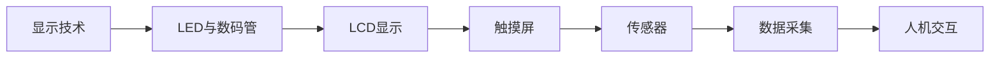

# 第7章 嵌入式人机交互与传感器采集

> [!abstract] 本章定位
> 本章学习嵌入式人机交互技术和传感器采集原理，包括LED、数码管、LCD、触摸屏和各类传感器。

## 学习主线

## 章节内容

- [[7.1-LED与数码管显示]]：LED驱动、数码管扫描、点阵显示
- [[7.2-LCD显示与触摸屏]]：LCD接口、显示驱动、触摸检测
- [[7.3-传感器数据采集]]：ADC采集、I2C传感器、SPI传感器

## 核心考点

> [!important] 必掌握
> 1. LED的静态与动态驱动方式
> 2. 数码管的段码扫描原理
> 3. 字符型LCD的接口与指令
> 4. TFT LCD的RGB接口驱动
> 5. 电阻式触摸屏的检测原理
> 6. ADC采集的采样与转换
> 7. 常见I2C传感器的驱动编程

## 复习自测

> [!question] 自测题
> 1. 动态扫描显示的优点是什么？如何避免闪烁？
> 2. 数码管的段码是如何编码的？
> 3. 1602 LCD有哪些主要指令？如何初始化？
> 4. 如何通过SPI接口驱动OLED屏幕？
> 5. 电阻式触摸屏如何检测触摸位置？
> 6. 如何配置ADC进行多通道扫描？
> 7. DHT11/DHT22温度传感器的单总线协议是什么？