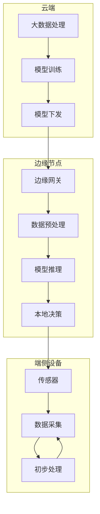
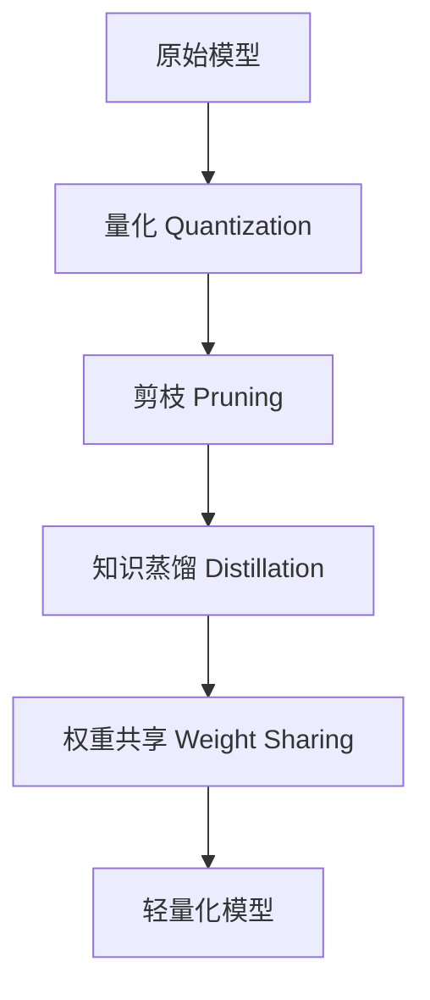
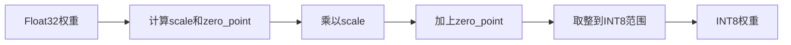
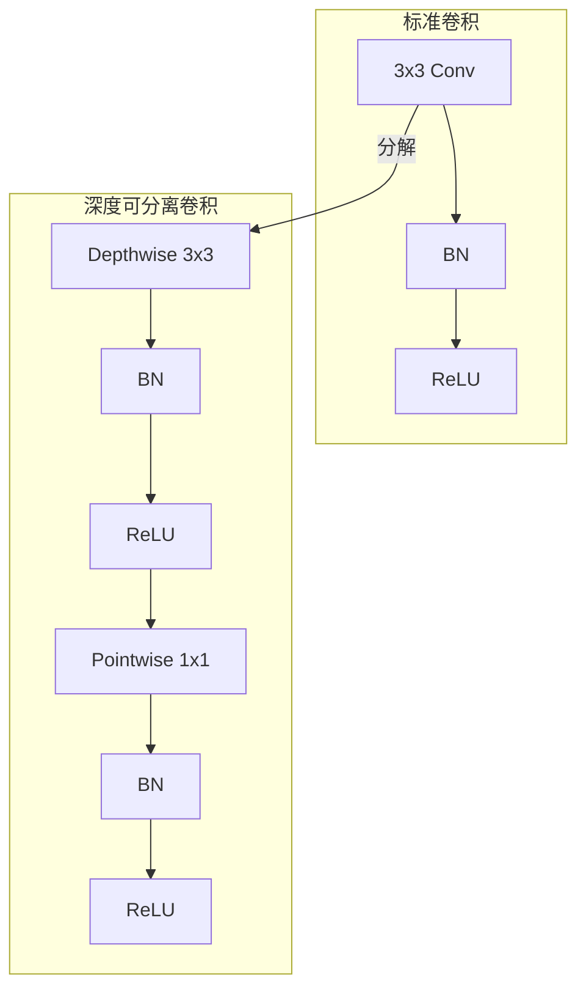

# 8.1 边缘计算与轻量化模型

## 一、边缘计算基础

### 1. 什么是边缘计算

> [!quote] 边缘计算
> 是将计算资源从云端下沉到数据源附近的网络边缘，实现低延迟、高带宽和隐私保护的计算模式。

### 2. 云计算 vs 边缘计算

| 对比项 | 云计算 | 边缘计算 |
|-------|--------|---------|
| 计算位置 | 远程数据中心 | 数据源附近 |
| 延迟 | 高（100ms+） | 低（<10ms） |
| 带宽需求 | 高 | 低 |
| 隐私保护 | 差 | 好 |
| 可靠性 | 依赖网络 | 独立运行 |
| 成本 | 低 | 较高 |
| AI能力 | 强 | 受限 |

### 3. 边缘计算架构



### 4. 边缘AI应用场景

| 场景 | 示例 | 要求 |
|-----|------|------|
| 智能家居 | 语音控制、人脸识别 | 低延迟、隐私保护 |
| 工业检测 | 缺陷检测、预测维护 | 高实时性 |
| 可穿戴设备 | 心率监测、运动识别 | 低功耗 |
| 智能汽车 | 车道检测、行人识别 | 高实时性、高可靠 |
| 环境监测 | 异常检测、预测报警 | 低功耗、长续航 |

## 二、模型压缩技术

### 1. 压缩方法概览



### 2. 量化（Quantization）

#### 什么是量化

> [!quote] 量化
> 将模型权重和激活值从高精度浮点数（Float32）转换为低精度整数（INT8/INT4）的过程。

#### 量化类型

| 类型 | 说明 | 精度损失 |
|-----|------|---------|
| 训练后量化（PTQ） | 训练完成后量化 | 小 |
| 量化感知训练（QAT） | 训练时考虑量化 | 更小 |
| 动态量化 | 运行时量化 | 中等 |
| 静态量化 | 离线量化 | 小 |

#### INT8量化原理



#### 量化实现（Python）

```python
import numpy as np

def quantize_to_int8(float_array, scale=None, zero_point=0):
    """将Float32数组量化为INT8"""
    if scale is None:
        abs_max = np.max(np.abs(float_array))
        if abs_max == 0:
            scale = 1.0
        else:
            scale = abs_max / 127.0
    
    int8_array = np.clip(
        np.round(float_array / scale + zero_point),
        -128, 127
    ).astype(np.int8)
    
    return int8_array, scale

def dequantize_int8(int8_array, scale, zero_point=0):
    """将INT8数组反量化为Float32"""
    float_array = (int8_array.astype(np.float32) - zero_point) * scale
    return float_array
```

#### Keras/TensorFlow量化

```python
import tensorflow as tf

# 方法1：训练后量化（Post-Training Quantization）
converter = tf.lite.TFLiteConverter.from_keras_model(model)
converter.optimizations = [tf.lite.Optimize.DEFAULT]

# 代表性数据集（用于校准）
def representative_data_gen():
    for input_value in tf.data.Dataset.from_tensor_slices(
        representative_dataset
    ).batch(1):
        yield [input_value]

converter.representative_dataset = representative_data_gen
converter.target_spec.supported_ops = [tf.lite.OpsSet.TFLITE_BUILTINS_INT8]
converter.inference_input_type = tf.int8
converter.inference_output_type = tf.int8

quantized_model = converter.convert()

# 方法2：量化感知训练（Quantization-Aware Training）
import tensorflow_model_optimization as tfmot

quantize_model = tfmot.quantization.keras.quantize_model
q_aware_model = quantize_model(model)

q_aware_model.compile(
    optimizer='adam',
    loss='categorical_crossentropy',
    metrics=['accuracy']
)

q_aware_model.fit(train_images, train_labels, epochs=5)
```

### 3. 剪枝（Pruning）

#### 剪枝类型

| 类型 | 说明 |
|-----|------|
| 非结构化剪枝 | 单个权重置零 |
| 结构化剪枝 | 整个通道/层置零 |
| 自动剪枝 | 自动学习剪枝率 |

#### 剪枝实现

```python
import tensorflow_model_optimization as tfmot

# 定义剪枝计划
prune_schedule = tfmot.sparsity.keras.PolynomialDecay(
    initial_sparsity=0.0,
    final_sparsity=0.5,
    begin_step=0,
    end_step=1000
)

# 应用剪枝
pruned_model = tfmot.sparsity.keras.prune_low_magnitude(
    model,
    pruning_schedule=prune_schedule
)

# 编译和训练
pruned_model.compile(...)
pruned_model.fit(...)

# 剥离剪枝包装
final_model = tfmot.sparsity.keras.strip_pruning(pruned_model)
```

### 4. 知识蒸馏（Knowledge Distillation）

> [!quote] 知识蒸馏
> 用大模型（教师）的输出指导小模型（学生）训练，使小模型学习大模型的知识。

```python
import tensorflow as tf

class DistillationModel(tf.keras.Model):
    def __init__(self, student_model, teacher_model, temperature=3.0):
        super().__init__()
        self.student = student_model
        self.teacher = teacher_model
        self.temperature = temperature
    
    def call(self, inputs):
        student_output = self.student(inputs)
        teacher_output = self.teacher(inputs)
        
        # 软标签损失
        soft_teacher = tf.nn.softmax(teacher_output / self.temperature)
        soft_student = tf.nn.softmax(student_output / self.temperature)
        distill_loss = tf.keras.losses.categorical_crossentropy(
            soft_teacher, soft_student
        )
        
        # 硬标签损失
        hard_loss = tf.keras.losses.categorical_crossentropy(
            inputs, student_output
        )
        
        return distill_loss + hard_loss
```

## 三、轻量化网络架构

### 1. 轻量模型对比

| 模型 | 参数量 | 计算量 | 精度 | 适用场景 |
|-----|--------|--------|------|---------|
| MobileNet V1 | 4.2M | 569M | 好 | 通用 |
| MobileNet V2 | 3.5M | 300M | 更好 | 通用 |
| MobileNet V3 | 2.5M | 200M | 最好 | 低延迟 |
| ShuffleNet V2 | 2.3M | 140M | 好 | 移动端 |
| SqueezeNet | 1.2M | 1.7G | 一般 | 极低端 |
| NanoNet | 0.1M | <10M | 可用 | MCU |

### 2. MobileNet架构特点



**深度可分离卷积**：
1. 深度卷积（Depthwise）：每个通道独立卷积
2. 逐点卷积（Pointwise）：1x1卷积进行通道混合

### 3. 为MCU设计的网络

```python
import tensorflow as tf

def create_mcu_model(input_shape, num_classes):
    """为MCU设计的极简网络"""
    model = tf.keras.Sequential([
        # 输入层
        tf.keras.layers.InputLayer(input_shape=input_shape),
        
        # 第一个深度可分离卷积
        tf.keras.layers.DepthwiseConv2D(
            kernel_size=(3, 3),
            padding='same',
            depth_multiplier=1,
            use_bias=False
        ),
        tf.keras.layers.BatchNormalization(),
        tf.keras.layers.ReLU(),
        tf.keras.layers.MaxPooling2D((2, 2)),
        
        # 第二个深度可分离卷积
        tf.keras.layers.DepthwiseConv2D(
            kernel_size=(3, 3),
            padding='same',
            depth_multiplier=2,
            use_bias=False
        ),
        tf.keras.layers.BatchNormalization(),
        tf.keras.layers.ReLU(),
        tf.keras.layers.MaxPooling2D((2, 2)),
        
        # 第三层
        tf.keras.layers.DepthwiseConv2D(
            kernel_size=(3, 3),
            padding='same',
            depth_multiplier=4,
            use_bias=False
        ),
        tf.keras.layers.BatchNormalization(),
        tf.keras.layers.ReLU(),
        tf.keras.layers.GlobalAveragePooling2D(),
        
        # 分类头
        tf.keras.layers.Dense(
            num_classes,
            activation='softmax',
            use_bias=True
        )
    ])
    
    return model
```

### 4. 模型大小优化

```python
# 优化流程
def optimize_model_for_mcu(model, representative_data):
    """将模型优化为MCU可部署格式"""
    
    # 1. 转换为TFLite
    converter = tf.lite.TFLiteConverter.from_keras_model(model)
    
    # 2. 启用优化
    converter.optimizations = [tf.lite.Optimize.DEFAULT]
    
    # 3. 设置代表性数据集
    def representative_gen():
        for data in representative_data:
            yield [data.astype(np.float32)]
    
    converter.representative_dataset = representative_gen
    
    # 4. 强制INT8量化
    converter.target_spec.supported_ops = [
        tf.lite.OpsSet.TFLITE_BUILTINS_INT8
    ]
    
    # 5. 设置输入输出类型
    converter.inference_input_type = tf.int8
    converter.inference_output_type = tf.int8
    
    # 6. 转换
    tflite_model = converter.convert()
    
    # 7. 检查大小
    model_size = len(tflite_model)
    print(f"模型大小: {model_size / 1024:.1f} KB")
    
    return tflite_model
```

---

**导航**：[[MOC - 第8章\|返回章节导航]] · 下一节 [[8.2-TensorFlow Lite Micro]]