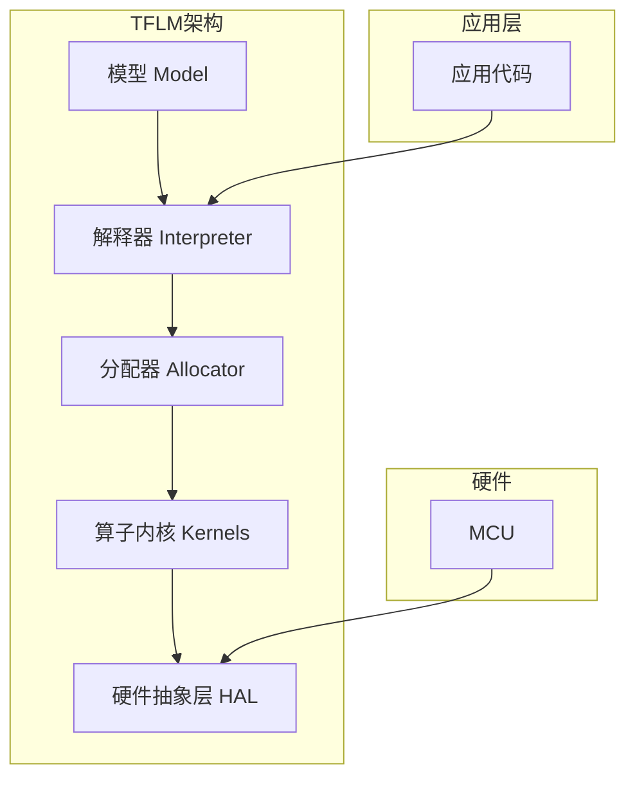

# 8.2 TensorFlow Lite Micro

## 一、TFLM概述

### 1. 什么是TFLM

> [!quote] TensorFlow Lite Micro (TFLM)
> 是Google开发的轻量级AI推理框架，专为微控制器和资源受限的嵌入式设备设计。

### 2. TFLM特点

| 特点 | 说明 |
|-----|------|
| 轻量级 | 内核仅约10KB |
| 无操作系统依赖 | 可运行在裸机系统 |
| 静态内存 | 不使用动态内存分配 |
| 跨平台 | 支持多种MCU架构 |
| C/C++实现 | 可移植性强 |

### 3. TFLM vs 其他框架

| 框架 | 内存需求 | 适用设备 | 功能 |
|-----|---------|---------|------|
| TFLM | ~10KB | MCU、传感器 | 推理 |
| TensorFlow Lite | ~1MB | 手机、嵌入式 | 训练+推理 |
| PyTorch Mobile | ~5MB | 手机、边缘设备 | 训练+推理 |
| ONNX Runtime | ~50MB | 服务器、PC | 多框架支持 |

## 二、TFLM架构

### 1. 核心组件



### 2. 四大组件

#### 模型（Model）

- 编译好的TFLite模型文件
- 包含网络结构和权重数据
- 使用C数组或二进制格式存储

#### 解释器（Interpreter）

- 推理执行的核心
- 管理算子执行顺序
- 处理输入输出数据

#### 分配器（MicroAllocator）

- 静态内存分配
- 管理张量缓冲区
- 避免内存碎片

#### 算子内核（Kernel）

- 实现各种神经网络算子
- 针对不同硬件优化
- 可扩展自定义算子

### 3. 内存布局

```mermaid
flowchart TD
    subgraph "TFLM内存布局"
        direction TB
        A[模型数据区] --> B[输入缓冲区]
        B --> C[中间张量区]
        C --> D[输出缓冲区]
        D --> E[工作区 Work Area]
    end
    
    A[模型数据区<br/>(Flash)] --- B[输入缓冲区<br/>(RAM)]
    B --- C[中间张量区<br/>(RAM)]
    C --- D[输出缓冲区<br/>(RAM)]
    D --- E[工作区<br/>(RAM)]
```

## 三、TFLM在STM32上的移植

### 1. 源码获取

```bash
# 克隆TFLM仓库
git clone https://github.com/tensorflow/tensorflow.git

# 切换到TFLM版本
cd tensorflow
git checkout r2.15  # 稳定版本

# 编译TFLM for STM32
tensorflow/lite/micro/tools/make/download_and_generate_project.py
```

### 2. 移植步骤

```c
// 1. 添加TFLM头文件
#include "tensorflow/lite/micro/micro_interpreter.h"
#include "tensorflow/lite/micro/micro_mutable_op_resolver.h"
#include "tensorflow/lite/schema/schema_generated.h"

// 2. 包含模型头文件（由Python生成）
#include "model_data.h"

// 3. 定义内存分配
namespace {
    // 模型数据（存储在Flash）
    const unsigned char model_data[] = MODEL_DATA;
    
    // 工作区（存储在RAM）
    constexpr int kModelArenaSize = 16 * 1024;  // 16KB
    constexpr int kTensorArenaSize = 8 * 1024;  // 8KB
    constexpr int kBufferSize = kModelArenaSize + kTensorArenaSize;
    
    // 内存缓冲区（static，避免动态分配）
    static uint8_t tensor_arena[kBufferSize];
}

// 4. 定义算子解析器
namespace {
    TFLM_REGISTER_KERNEL(Add);
    TFLM_REGISTER_KERNEL(Conv2D);
    TFLM_REGISTER_KERNEL(DepthwiseConv2D);
    TFLM_REGISTER_KERNEL(FullyConnected);
    TFLM_REGISTER_KERNEL(MaxPool2D);
    TFLM_REGISTER_Kernel(Mean);
    TFLM_REGISTER_Kernel(ResizeBilinear);
    TFLM_REGISTER_Kernel(Softmax);
}  // namespace

// 5. 创建解释器
tflite::MicroInterpreter interpreter(
    model,
    resolver,
    tensor_arena,
    kBufferSize
);

// 6. 分配张量
if(interpreter.AllocateTensors() != kTfLiteOk) {
    // 错误处理
}
```

### 3. 完整推理流程

```c
#include "tensorflow/lite/micro/micro_interpreter.h"
#include "tensorflow/lite/micro/micro_mutable_op_resolver.h"
#include "tensorflow/lite/schema/schema_generated.h"
#include "model_data.h"

namespace {
    constexpr int kModelArenaSize = 16 * 1024;
    constexpr int kTensorArenaSize = 8 * 1024;
    constexpr int kBufferSize = kModelArenaSize + kTensorArenaSize;
    
    static uint8_t tensor_arena[kBufferSize];
    
    tflite::MicroMutableOpResolver resolver;
    tflite::MicroInterpreter *interpreter = nullptr;
    
    TfLiteTensor *input = nullptr;
    TfLiteTensor *output = nullptr;
}

// 初始化AI模型
uint8_t AI_Init(void) {
    // 注册算子
    resolver.AddConv2D();
    resolver.AddDepthwiseConv2D();
    resolver.AddFullyConnected();
    resolver.AddMaxPool2D();
    resolver.AddMean();
    resolver.AddSoftmax();
    
    // 创建解释器
    interpreter = new tflite::MicroInterpreter(
        model_data,
        resolver,
        tensor_arena,
        kBufferSize
    );
    
    // 分配内存
    TfLiteStatus status = interpreter->AllocateTensors();
    if(status != kTfLiteOk) {
        return 1;  // 分配失败
    }
    
    // 获取输入输出张量
    input = interpreter->input(0);
    output = interpreter->output(0);
    
    return 0;
}

// 执行AI推理
uint8_t AI_RunInference(float *input_data, float *output_data) {
    // 1. 预处理：归一化和量化
    for(int i = 0; i < input->dims->data[1]; i++) {
        // 量化到INT8范围
        int8_t q_val = (int8_t)(input_data[i] / input->params.scale 
                                 + input->params.zero_point);
        input->data.int8[i] = q_val;
    }
    
    // 2. 执行推理
    TfLiteStatus status = interpreter->Invoke();
    if(status != kTfLiteOk) {
        return 2;  // 推理失败
    }
    
    // 3. 后处理：反量化
    float max_prob = 0;
    int max_index = 0;
    
    for(int i = 0; i < output->dims->data[1]; i++) {
        // 反量化
        float prob = (output->data.int8[i] - output->params.zero_point) 
                     * output->params.scale;
        output_data[i] = prob;
        
        if(prob > max_prob) {
            max_prob = prob;
            max_index = i;
        }
    }
    
    return max_index;  // 返回预测类别
}
```

## 四、TFLM算子支持

### 1. 常用算子

| 算子 | 说明 | 优先级 |
|-----|------|--------|
| Conv2D | 二维卷积 | 高 |
| DepthwiseConv2D | 深度卷积 | 高 |
| FullyConnected | 全连接 | 高 |
| MaxPool2D | 最大池化 | 高 |
| AveragePool2D | 平均池化 | 中 |
| Softmax | Softmax激活 | 高 |
| ReLU | ReLU激活 | 高 |
| Mean | 均值 | 中 |
| Reshape | 形状变换 | 高 |
| TransposeConv | 转置卷积 | 低 |
| Add | 加法 | 高 |
| Mul | 乘法 | 中 |

### 2. 添加自定义算子

```c
// 1. 创建自定义算子
TfLiteStatus CustomKernel_Prepare(TfLiteContext* context, TfLiteNode* node) {
    // 准备阶段：分配临时内存等
    return kTfLiteOk;
}

TfLiteStatus CustomKernel_Invoke(TfLiteContext* context, TfLiteNode* node) {
    // 执行阶段：实际计算
    const TfLiteTensor* input = tflite::GetInput(context, node, 0);
    TfLiteTensor* output = tflite::GetOutput(context, node, 0);
    
    // 自定义计算逻辑
    // ...
    
    return kTfLiteOk;
}

// 2. 注册算子
resolver.AddCustom("CustomKernel", 
                   CustomKernel_Register());

// 3. 在Python端注册
import tensorflow as tf
from tensorflow.lite.python import schema_py_generated as schema_fb

# 注册自定义算子到TFLite Converter
```

## 五、内存优化

### 1. 内存估算

```
TFLM内存需求估算：

1. 模型大小（Flash）
   - 取决于模型结构和量化方式
   - INT8量化后通常为原始的1/4

2. 工作区大小（RAM）
   - 用于中间张量存储
   - 通常为输入大小的数倍
   - 可通过估算工具确定

3. 输入输出缓冲区（RAM）
   - 取决于输入输出张量大小
   - 如：32x32x1图像 = 1024 Bytes

总RAM需求 ≈ 工作区 + 输入缓冲区 + 输出缓冲区
```

### 2. 内存优化技巧

| 技巧 | 说明 |
|-----|------|
| 减小模型 | 简化网络结构 |
| 减小输入 | 降低输入分辨率 |
| 量化精度 | 使用INT8甚至INT4 |
| 层融合 | 融合Conv+BN+ReLU |
| 内存复用 | 中间张量共享空间 |
| 按需分配 | 精确计算内存需求 |

### 3. 内存估算工具（Python）

```python
import numpy as np

def estimate_tflm_memory(model_content, input_shape):
    """估算TFLM内存需求"""
    
    # 1. 模型大小
    model_size = len(model_content)
    
    # 2. 遍历模型计算各层内存
    interpreter = tf.lite.Interpreter(model_content=model_content)
    interpreter.allocate_tensors()
    
    # 3. 获取各张量大小
    total_activation_size = 0
    
    for tensor in interpreter.tensor_details:
        if tensor['dtype'] == np.int8 or tensor['dtype'] == np.float32:
            size = np.prod(tensor['shape'])
            if tensor['dtype'] == np.float32:
                size *= 4  # Float32占4字节
            else:
                size *= 1  # INT8占1字节
            total_activation_size += size
    
    # 4. 估算工作区（预留1.5倍）
    work_area = int(total_activation_size * 1.5)
    
    return {
        'model_size': model_size,
        'work_area': work_area,
        'total_ram': work_area + 2048  # 额外开销
    }
```

### 4. STM32内存分配示例

```c
// STM32F411RE (128KB RAM, 512KB Flash)
// 模型大小：约60KB（Flash）
// 工作区：约20KB（RAM）
// 输入输出：约4KB（RAM）

// 方案1：使用静态数组
#define MODEL_SIZE     (60 * 1024)  // 60KB
#define WORK_AREA_SIZE (20 * 1024)  // 20KB
#define IO_BUFFER_SIZE (4 * 1024)   // 4KB
#define TOTAL_SIZE     (WORK_AREA_SIZE + IO_BUFFER_SIZE)

// 工作区（必须是static或全局）
static uint8_t tensor_arena[TOTAL_SIZE] __attribute__((section(".bss")));

// 模型数据（存储在Flash）
static const unsigned char model_data[] __attribute__((section(".rodata"))) = {
    // ... 模型数据
};

// 方案2：使用链接器脚本
// .ld文件中定义专用section
// __attribute__((section(".ai_heap")))
```

---

**导航**：上一节 [[8.1-边缘计算与轻量化模型]] · [[MOC - 第8章\|返回章节导航]] · 下一节 [[8.3-MCU AI部署实践]]