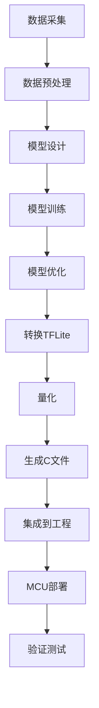

# 8.3 MCU AI部署实践

## 一、部署流程总览

### 1. 完整部署流程



### 2. 各阶段工具

| 阶段 | 工具 |
|-----|------|
| 数据采集 | Python脚本、传感器 |
| 数据预处理 | NumPy、Pandas |
| 模型设计 | TensorFlow/Keras |
| 模型训练 | TensorFlow、Google Colab |
| 模型优化 | TF Mot（剪枝、量化） |
| 格式转换 | TFLite Converter |
| 代码生成 | xxd/hexdump |
| 工程集成 | Keil、STM32CubeIDE |

## 二、关键词检测实战

### 1. 任务定义

**目标**：在STM32上实现"yes/no"二分类关键词检测

**输入**：音频特征（MFCC系数，40维）
**输出**：2个类别（yes/no）
**要求**：实时、低延迟

### 2. 数据采集（Python）

```python
import numpy as np
import sounddevice as sd
import os

# 音频参数
SAMPLE_RATE = 16000
DURATION = 1.0  # 秒

def record_audio(filename, duration=DURATION):
    """录制音频"""
    print(f"录音中... ({duration}s)")
    audio = sd.rec(
        int(duration * SAMPLE_RATE),
        samplerate=SAMPLE_RATE,
        channels=1
    )
    sd.wait()
    
    # 保存
    np.save(filename, audio.flatten())
    print(f"已保存: {filename}")

# 采集样本
for i in range(100):
    record_audio(f"yes/yes_{i:03d}.npy")
    record_audio(f"no/no_{i:03d}.npy")
```

### 3. 特征提取（MFCC）

```python
import numpy as np
from scipy import signal

def compute_mfcc(audio, sample_rate=16000, n_mfcc=40):
    """计算MFCC特征"""
    
    # 预加重
    pre_emphasis = 0.97
    emphasized = np.append(
        audio[0], 
        audio[1:] - pre_emphasis * audio[:-1]
    )
    
    # 分帧
    frame_size = int(0.025 * sample_rate)  # 25ms
    frame_stride = int(0.01 * sample_rate)  # 10ms
    
    # STFT
    n_fft = 512
    mel_filterbank = 40
    
    # Mel滤波器组
    low_freq_mel = 0
    high_freq_mel = 2595 * np.log10(1 + (sample_rate / 2) / 700)
    mel_points = np.linspace(low_freq_mel, high_freq_mel, mel_filterbank + 2)
    
    # 计算三角滤波器权重
    fft_freqs = np.linspace(0, sample_rate / 2, n_fft // 2 + 1)
    mel_filter = np.zeros((mel_filterbank, n_fft // 2 + 1))
    
    for i in range(mel_filterbank):
        for j in range(len(fft_freqs)):
            if mel_points[i] <= fft_freqs[j] <= mel_points[i + 1]:
                mel_filter[i, j] = (fft_freqs[j] - mel_points[i]) / \
                                   (mel_points[i + 1] - mel_points[i])
            elif mel_points[i + 1] <= fft_freqs[j] <= mel_points[i + 2]:
                mel_filter[i, j] = (mel_points[i + 2] - fft_freqs[j]) / \
                                   (mel_points[i + 2] - mel_points[i + 1])
    
    # 每帧计算MFCC
    # ... 实现完整的MFCC计算
    
    return mfcc_features
```

### 4. 模型设计与训练

```python
import tensorflow as tf
from tensorflow import keras

# 数据集加载
def load_dataset(data_dir):
    """加载关键词检测数据集"""
    X, y = [], []
    
    for label, class_name in enumerate(['no', 'yes']):
        class_dir = os.path.join(data_dir, class_name)
        for filename in os.listdir(class_dir):
            if filename.endswith('.npy'):
                audio = np.load(os.path.join(class_dir, filename))
                mfcc = compute_mfcc(audio)
                X.append(mfcc)
                y.append(label)
    
    return np.array(X), np.array(y)

# 加载数据
X, y = load_dataset('dataset/')

# 数据划分
from sklearn.model_selection import train_test_split
X_train, X_test, y_train, y_test = train_test_split(
    X, y, test_size=0.2, random_state=42
)

# 构建轻量模型
model = keras.Sequential([
    # 输入层：MFCC特征 (时间步 x 特征维)
    keras.layers.InputLayer(input_shape=(None, 40, 1)),
    
    # 第一层：深度可分离卷积
    keras.layers.DepthwiseConv2D(
        kernel_size=(3, 3),
        padding='same',
        depth_multiplier=4,
        use_bias=False
    ),
    keras.layers.BatchNormalization(),
    keras.layers.ReLU(),
    keras.layers.MaxPooling2D((2, 2)),
    
    # 第二层
    keras.layers.DepthwiseConv2D(
        kernel_size=(3, 3),
        padding='same',
        depth_multiplier=8,
        use_bias=False
    ),
    keras.layers.BatchNormalization(),
    keras.layers.ReLU(),
    keras.layers.MaxPooling2D((2, 2)),
    
    # 全局池化
    keras.layers.GlobalAveragePooling2D(),
    
    # 分类头
    keras.layers.Dense(2, activation='softmax')
])

# 编译模型
model.compile(
    optimizer='adam',
    loss='sparse_categorical_crossentropy',
    metrics=['accuracy']
)

# 训练
history = model.fit(
    X_train, y_train,
    validation_data=(X_test, y_test),
    epochs=20,
    batch_size=32
)

# 保存模型
model.save('keyword_detector.h5')
```

### 5. 模型转换与量化

```python
import tensorflow as tf
import numpy as np

# 加载训练好的模型
model = tf.keras.models.load_model('keyword_detector.h5')

# 代表性数据集（用于量化校准）
def representative_data_gen():
    for i in range(100):
        # 生成代表性输入数据
        input_data = np.random.randn(1, 49, 40, 1).astype(np.float32)
        yield [input_data]

# 转换为TFLite并量化
converter = tf.lite.TFLiteConverter.from_keras_model(model)
converter.optimizations = [tf.lite.Optimize.DEFAULT]
converter.representative_dataset = representative_data_gen
converter.target_spec.supported_ops = [tf.lite.OpsSet.TFLITE_BUILTINS_INT8]
converter.inference_input_type = tf.int8
converter.inference_output_type = tf.int8

tflite_model = converter.convert()

# 保存TFLite模型
with open('keyword_detector.tflite', 'wb') as f:
    f.write(tflite_model)

# 转换为C数组
import subprocess
subprocess.run([
    'xxd', '-i', 'keyword_detector.tflite',
    'keyword_detector_model.h'
])

print(f"模型大小: {len(tflite_model) / 1024:.1f} KB")
```

### 6. MCU端集成

```c
#include "keyword_detector_model.h"
#include "tensorflow/lite/micro/micro_interpreter.h"
#include "tensorflow/lite/micro/micro_mutable_op_resolver.h"

namespace {
    constexpr int kTensorArenaSize = 32 * 1024;  // 32KB
    static uint8_t tensor_arena[kTensorArenaSize];
    
    tflite::MicroMutableOpResolver resolver;
    tflite::MicroInterpreter *interpreter = nullptr;
    
    TfLiteTensor *input_tensor = nullptr;
    TfLiteTensor *output_tensor = nullptr;
}

// 初始化
void keyword_detector_init(void) {
    // 注册算子
    resolver.AddDepthwiseConv2D();
    resolver.AddConv2D();
    resolver.AddFullyConnected();
    resolver.AddMaxPool2D();
    resolver.AddMean();
    resolver.AddSoftmax();
    
    // 创建解释器
    static tflite::MicroInterpreter static_interpreter(
        keyword_detector_model,
        resolver,
        tensor_arena,
        kTensorArenaSize
    );
    interpreter = &static_interpreter;
    
    // 分配内存
    interpreter->AllocateTensors();
    
    // 获取张量
    input_tensor = interpreter->input(0);
    output_tensor = interpreter->output(0);
}

// 执行关键词检测
uint8_t keyword_detect(float *mfcc_features, uint8_t feature_count) {
    // 1. 量化输入
    for(uint8_t i = 0; i < feature_count; i++) {
        input_tensor->data.int8[i] = (int8_t)(
            mfcc_features[i] / input_tensor->params.scale 
            + input_tensor->params.zero_point
        );
    }
    
    // 2. 推理
    interpreter->Invoke();
    
    // 3. 反量化并找出最大概率
    float max_prob = -1.0f;
    uint8_t max_index = 0;
    
    for(uint8_t i = 0; i < 2; i++) {
        float prob = (output_tensor->data.int8[i] 
                      - output_tensor->params.zero_point) 
                     * output_tensor->params.scale;
        
        if(prob > max_prob) {
            max_prob = prob;
            max_index = i;
        }
    }
    
    // 4. 返回结果
    if(max_prob > 0.8f) {  // 阈值
        return max_index;  // 0=no, 1=yes
    }
    
    return 0xFF;  // 不确定
}
```

## 三、图像分类实战

### 1. 任务定义

**目标**：识别简单图像类别（如手写数字）

**输入**：28x28灰度图像
**输出**：10个类别（0-9）

### 2. 模型设计（Python）

```python
import tensorflow as tf
from tensorflow import keras

# 加载MNIST数据集
(x_train, y_train), (x_test, y_test) = keras.datasets.mnist.load_data()

# 预处理
x_train = x_train.astype('float32') / 255.0
x_test = x_test.astype('float32') / 255.0
x_train = x_train.reshape(-1, 28, 28, 1)
x_test = x_test.reshape(-1, 28, 28, 1)

# 轻量模型
model = keras.Sequential([
    keras.layers.InputLayer(input_shape=(28, 28, 1)),
    
    # 第一个卷积块
    keras.layers.Conv2D(
        filters=16,
        kernel_size=(3, 3),
        padding='same',
        activation='relu'
    ),
    keras.layers.MaxPooling2D((2, 2)),
    
    # 第二个卷积块
    keras.layers.Conv2D(
        filters=32,
        kernel_size=(3, 3),
        padding='same',
        activation='relu'
    ),
    keras.layers.MaxPooling2D((2, 2)),
    
    # 分类头
    keras.layers.Flatten(),
    keras.layers.Dense(10, activation='softmax')
])

model.compile(
    optimizer='adam',
    loss='sparse_categorical_crossentropy',
    metrics=['accuracy']
)

# 训练
model.fit(x_train, y_train, epochs=10, batch_size=256)

# 保存
model.save('mnist_model.h5')
```

### 3. MCU端实现

```c
#define IMAGE_SIZE  28
#define NUM_CLASSES 10

// 图像数据缓冲区
uint8_t image_buffer[IMAGE_SIZE * IMAGE_SIZE];

// 从OLED摄像头获取图像
void capture_image(uint8_t *buffer) {
    // 从OLED模块读取图像数据
    // 灰度格式，每像素1字节
    // ... 摄像头读取代码
}

// 预处理：归一化
void preprocess_image(uint8_t *input, float *output) {
    for(uint16_t i = 0; i < IMAGE_SIZE * IMAGE_SIZE; i++) {
        output[i] = (float)input[i] / 255.0f;
    }
}

// 图像分类
uint8_t classify_image(uint8_t *image, float *probabilities) {
    float preprocessed[IMAGE_SIZE * IMAGE_SIZE];
    
    // 1. 预处理
    preprocess_image(image, preprocessed);
    
    // 2. 量化输入
    for(uint16_t i = 0; i < IMAGE_SIZE * IMAGE_SIZE; i++) {
        input_tensor->data.int8[i] = (int8_t)(
            preprocessed[i] / input_tensor->params.scale
            + input_tensor->params.zero_point
        );
    }
    
    // 3. 推理
    interpreter->Invoke();
    
    // 4. 反量化
    float max_prob = -1.0f;
    uint8_t max_class = 0;
    
    for(uint8_t i = 0; i < NUM_CLASSES; i++) {
        probabilities[i] = (output_tensor->data.int8[i]
                           - output_tensor->params.zero_point)
                           * output_tensor->params.scale;
        
        if(probabilities[i] > max_prob) {
            max_prob = probabilities[i];
            max_class = i;
        }
    }
    
    return max_class;
}
```

## 四、性能优化

### 1. 推理时间优化

```c
// 1. 使用硬件加速（如Cortex-M4的DSP指令）
// TFLM已包含针对Cortex-M的优化内核

// 2. 优化内存布局
// 将频繁访问的缓冲区放在SRAM
// 使用链接器指定section
static uint8_t input_buffer[1024] __attribute__((section(".sram_bss")));

// 3. 减少数据拷贝
// 直接在TFLM缓冲区中处理数据
// 避免不必要的内存复制

// 4. 批处理
// 如果可能，批量处理多个输入
// 提高吞吐量
```

### 2. 精度优化

```python
# 1. 使用量化感知训练
import tensorflow_model_optimization as tfmot

quantize_model = tfmot.quantization.keras.quantize_model
q_aware_model = quantize_model(model)
q_aware_model.compile(...)
q_aware_model.fit(...)

# 2. 微调校准数据集
# 使用更多代表性数据
# 覆盖更多的输入分布

# 3. 调整量化参数
converter.target_spec.supported_types = [tf.int8]
# 或使用float16保持精度
converter.target_spec.supported_types = [tf.float16]
```

### 3. 模型剪枝优化

```python
# 结构化剪枝（通道剪枝）
from tensorflow.keras.layers import Conv2D, DepthwiseConv2D

def structured_pruning(model, pruning_ratio=0.3):
    """通道剪枝"""
    for layer in model.layers:
        if isinstance(layer, (Conv2D, DepthwiseConv2D)):
            # 获取当前层权重
            weights = layer.get_weights()[0]
            
            # 计算每个通道的L1范数
            norms = np.sum(np.abs(weights), axis=(0, 1, 2))
            
            # 剪枝最小的通道
            threshold = np.percentile(norms, pruning_ratio * 100)
            mask = norms > threshold
            
            # 更新权重
            pruned_weights = weights[:, :, :, mask]
            layer.set_weights([pruned_weights] + layer.get_weights()[1:])
    
    return model

# 应用剪枝
pruned_model = structured_pruning(model, pruning_ratio=0.3)
pruned_model.compile(...)
pruned_model.fit(...)
```

## 五、调试与验证

### 1. 精度验证（Python）

```python
# 验证量化模型精度
def verify_quantization_accuracy(model, tflite_model, test_data, test_labels):
    """比较原模型和量化模型的精度"""
    
    # 原模型推理
    original_acc = model.evaluate(test_data, test_labels)[1]
    
    # TFLite模型推理
    interpreter = tf.lite.Interpreter(model_content=tflite_model)
    interpreter.allocate_tensors()
    
    correct = 0
    for i in range(len(test_data)):
        input_data = test_data[i].reshape(1, 28, 28, 1).astype(np.float32)
        interpreter.set_tensor(
            interpreter.get_input_details()[0]['index'], 
            input_data
        )
        interpreter.invoke()
        output = interpreter.tensor(
            interpreter.get_output_details()[0]['index']
        )()[0]
        
        if np.argmax(output) == test_labels[i]:
            correct += 1
    
    tflite_acc = correct / len(test_data)
    
    print(f"原模型精度: {original_acc:.4f}")
    print(f"TFLite精度: {tflite_acc:.4f}")
    print(f"精度损失: {original_acc - tflite_acc:.4f}")

# 运行验证
verify_quantization_accuracy(model, tflite_model, x_test, y_test)
```

### 2. MCU端调试

```c
// 性能测量
void benchmark_inference(void) {
    uint32_t start_time, end_time;
    uint32_t total_time = 0;
    uint8_t i;
    
    // 预热
    interpreter->Invoke();
    
    // 测量100次推理
    for(i = 0; i < 100; i++) {
        start_time = HAL_GetTick();
        
        // 执行推理
        // ...
        
        end_time = HAL_GetTick();
        total_time += (end_time - start_time);
    }
    
    printf("平均推理时间: %lu ms\n", total_time / 100);
}

// 内存使用检查
void check_memory_usage(void) {
    // 检查堆栈使用
    uint32_t stack_used = get_stack_usage();
    uint32_t heap_used = get_heap_usage();
    
    printf("栈使用: %lu bytes\n", stack_used);
    printf("堆使用: %lu bytes\n", heap_used);
    printf("剩余RAM: %lu bytes\n", 
           128 * 1024 - stack_used - heap_used);
}

// 输出调试信息
void debug_output(TfLiteTensor *output) {
    printf("推理输出:\n");
    for(int i = 0; i < output->dims->data[1]; i++) {
        float prob = (output->data.int8[i] 
                     - output->params.zero_point)
                     * output->params.scale;
        printf("  类别%d: %.4f\n", i, prob);
    }
}
```

### 3. 常见问题排查

| 问题 | 可能原因 | 解决方案 |
|-----|---------|---------|
| 模型太大 | 网络结构复杂 | 简化网络、减小输入 |
| 内存不足 | 工作区不够 | 增加tensor_arena大小 |
| 精度下降 | 量化损失 | 使用QAT、增加校准数据 |
| 推理失败 | 算子不支持 | 检查支持的算子列表 |
| 运行时间长 | 模型太复杂 | 优化模型、使用硬件加速 |

---

**导航**：上一节 [[8.2-TensorFlow Lite Micro]] · [[MOC - 第8章\|返回章节导航]]