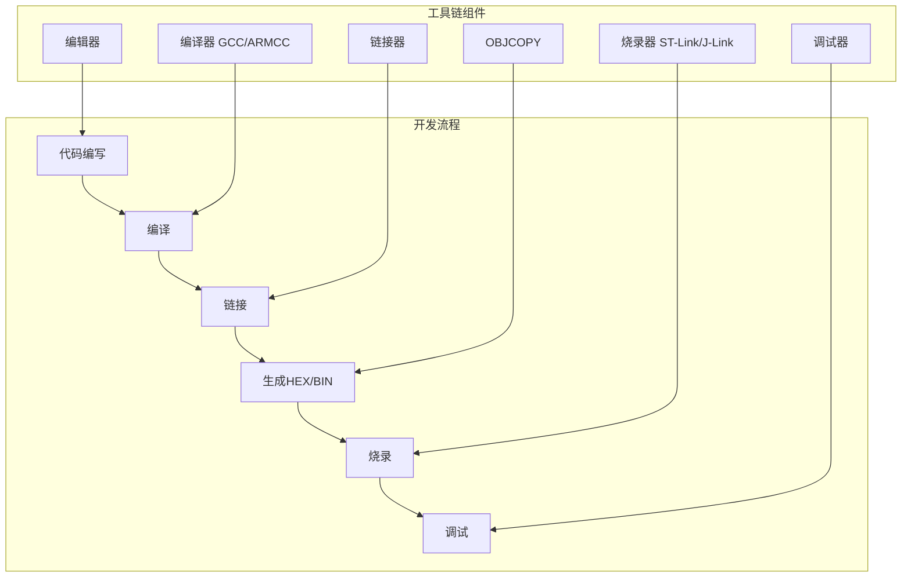
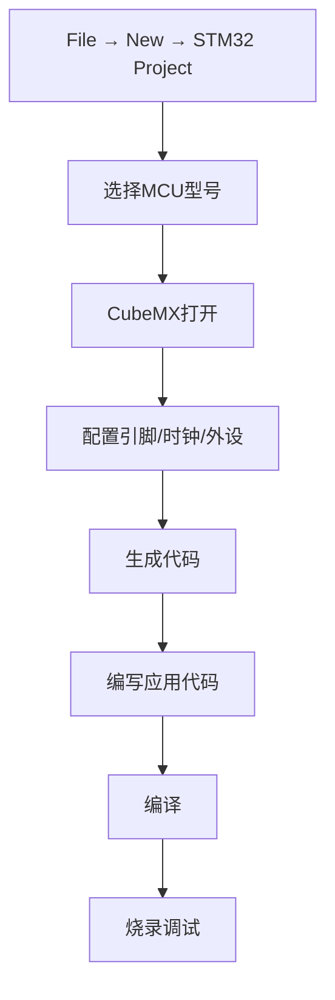
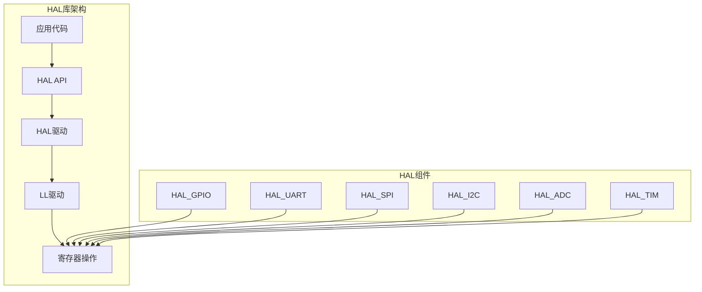

# 9.1 开发环境与工程创建

## 一、开发工具链

### 1. 常用开发工具

| 工具 | 说明 | 适用平台 |
|-----|------|---------|
| Keil MDK | 经典ARM开发环境 | Windows |
| STM32CubeIDE | 官方推荐IDE | Windows/Linux/Mac |
| IAR Embedded | 商业开发环境 | Windows |
| GCC + Make | 开源工具链 | 全平台 |
| PlatformIO | 现代化IDE | 全平台 |

### 2. 工具链架构



## 二、Keil MDK使用

### 1. 工程创建

#### 新建工程

1. Project → New μVision Project
2. 选择保存路径
3. 选择MCU型号（如STM32F103C8）
4. 选择添加启动文件（Startup）

#### 工程设置

```c
// 工程配置步骤
// 1. Target选项卡
// - Xtal (MHz): 8.0
// - 选中 "Use Simulation"

// 2. C/C++选项卡
// - Include Paths: 添加头文件路径
// - Define: 添加预定义宏
//     STM32F10X_MD, USE_STDPERIPH_DRIVER

// 3. Debug选项卡
// - 选择 ST-Link Debugger
// - 点击Settings配置调试器
```

### 2. 工程目录结构

```
Project/
├── Project.uvproj         # Keil工程文件
├── Project.uvopt          # Keil选项文件
├── Application/           # 应用代码
│   ├── main.c
│   ├── stm32f10x_it.c
│   └── system_stm32f10x.c
├── Libraries/             # 库文件
│   ├── CMSIS/
│   └── STM32F10x_StdPeriph_Driver/
├── User/                  # 用户代码
│   ├── main.h
│   ├── delay.c/h
│   ├── key.c/h
│   └── led.c/h
├── Output/                # 编译输出
│   ├── Project.hex
│   ├── Project.bin
│   └── Project.elf
└── Listings/              # 列表文件
    └── Project.lst
```

### 3. 编译下载

```
操作步骤：
1. 编译：Project → Build Target (F7)
2. 链接：生成.hex和.elf文件
3. 下载：Flash → Download (F8)
4. 运行：Debug → Start/Stop Debug Session (Ctrl+F5)
```

### 4. 常用快捷键

| 快捷键 | 功能 |
|-------|------|
| F7 | 编译工程 |
| F8 | 下载程序 |
| Ctrl+F5 | 启动/停止调试 |
| F5 | 运行到断点 |
| F11 | 单步进入 |
| F10 | 单步跳过 |
| Ctrl+F11 | 跳出函数 |
| Ctrl+Shift+F10 | 跳出循环 |

## 三、STM32CubeIDE使用

### 1. CubeIDE特点

| 特点 | 说明 |
|-----|------|
| 基于Eclipse | 开源IDE |
| 集成CubeMX | 图形化配置 |
| 免费使用 | 无需付费 |
| GCC工具链 | 开源编译器 |
| 调试功能强 | 支持SWV追踪 |

### 2. 工程创建流程



### 3. CubeMX配置

#### 常用配置项

| 配置项 | 说明 |
|-------|------|
| 引脚分配 | 图形化分配GPIO功能 |
| 时钟树 | 配置RCC时钟源和分频 |
| 外设初始化 | 配置UART/SPI/I2C/ADC等 |
| 中断配置 | 配置NVIC优先级 |
| RTOS配置 | 配置FreeRTOS任务和定时 |
| 中间件 | 添加FATFS/LWIP/USB等 |

#### 时钟配置示例

```
SYSCLK = 72MHz (HSE + PLL)
    ├── AHB = 72MHz (HPRE = /1)
    │   └── APB1 = 36MHz (PPRE1 = /2)
    │       └── TIM2-7, USART2-5, SPI2-3, I2C1-2
    └── APB2 = 72MHz (PPRE2 = /1)
        └── TIM1, ADC1-3, USART1, SPI1, GPIO
```

### 4. CubeMX代码生成

```c
// CubeMX生成的初始化代码示例
// main.c
int main(void) {
    // 1. HAL库初始化
    HAL_Init();
    
    // 2. 系统时钟配置
    SystemClock_Config();
    
    // 3. GPIO初始化
    MX_GPIO_Init();
    
    // 4. 外设初始化
    MX_USART1_UART_Init();
    MX_SPI1_Init();
    MX_ADC1_Init();
    
    // 5. RTOS初始化（如果启用）
    // MX_FREERTOS_Init();
    
    // 6. 主循环
    while(1) {
        // HAL_Delay(500);
        // HAL_GPIO_TogglePin(LED_GPIO_Port, LED_Pin);
    }
}
```

### 5. HAL库结构



## 四、工程规范

### 1. 代码结构规范

```c
// 文件：led.h
#ifndef __LED_H
#define __LED_H

#include "stm32f10x.h"

// LED引脚定义
#define LED_PIN      GPIO_Pin_0
#define LED_PORT     GPIOB
#define LED_RCC_CLK  RCC_APB2Periph_GPIOB

// LED状态
typedef enum {
    LED_OFF = 0,
    LED_ON = 1
} LED_State;

// 函数声明
void LED_Init(void);
void LED_Set(LED_State state);
void LED_Toggle(void);

#endif /* __LED_H */
```

```c
// 文件：led.c
#include "led.h"

void LED_Init(void) {
    GPIO_InitTypeDef GPIO_InitStruct;
    
    RCC_APB2PeriphClockCmd(LED_RCC_CLK, ENABLE);
    
    GPIO_InitStruct.GPIO_Pin = LED_PIN;
    GPIO_InitStruct.GPIO_Mode = GPIO_Mode_Out_PP;
    GPIO_InitStruct.GPIO_Speed = GPIO_Speed_2MHz;
    GPIO_Init(LED_PORT, &GPIO_InitStruct);
    
    LED_Set(LED_OFF);
}

void LED_Set(LED_State state) {
    if(state == LED_ON) {
        GPIO_SetBits(LED_PORT, LED_PIN);
    } else {
        GPIO_ResetBits(LED_PORT, LED_PIN);
    }
}

void LED_Toggle(void) {
    if(GPIO_ReadOutputDataBit(LED_PORT, LED_PIN) == Bit_SET) {
        LED_Set(LED_OFF);
    } else {
        LED_Set(LED_ON);
    }
}
```

### 2. 命名规范

| 类型 | 格式 | 示例 |
|-----|------|------|
| 文件名 | 小写_功能.c/h | led_driver.c |
| 函数名 | 模块_动作() | LED_Init() |
| 变量名 | 小写下划线 | led_state |
| 宏定义 | 大写 | LED_PORT |
| 类型名 | 大写开头 | LedState |
| 枚举值 | 模块_值 | LED_ON |

### 3. 注释规范

```c
/**
 * @file main.c
 * @brief 主程序入口
 * @author Author Name
 * @date 2024-01-01
 */

#include "stm32f10x.h"
#include "delay.h"
#include "led.h"

/**
 * @brief 主函数
 * @return 通常不返回
 */
int main(void) {
    // 初始化硬件
    Delay_Init();
    LED_Init();
    
    // 主循环：LED闪烁
    while(1) {
        LED_Toggle();  // 切换LED状态
        Delay_ms(500); // 延时500ms
    }
}
```

## 五、版本管理

### 1. Git基础

```bash
# 初始化仓库
git init

# 添加文件
git add .

# 首次提交
git commit -m "Initial commit"

# 推送到远程
git remote add origin https://github.com/user/repo.git
git push -u origin main
```

### 2. .gitignore示例

```
# 编译输出
Output/
Objects/
Listings/
*.hex
*.bin
*.elf
*.map

# Keil
*.uvguix.*
*.bak

# STM32CubeIDE
Debug/
Release/
.cproject
.project

# 系统文件
.DS_Store
Thumbs.db
*.log
```

### 3. 分支管理

```mermaid
gitgraph
    commit id: "初始版本"
    branch develop
    checkout develop
    commit id: "开发新功能"
    branch feature/led
    checkout feature/led
    commit id: "LED驱动"
    checkout develop
    merge feature/led
    branch release/v1.0
    checkout release/v1.0
    commit id: "准备发布"
    checkout main
    merge release/v1.0
    tag v1.0.0
```

---

**导航**：[[MOC - 第9章\|返回章节导航]] · 下一节 [[9.2-调试技术与工具]]