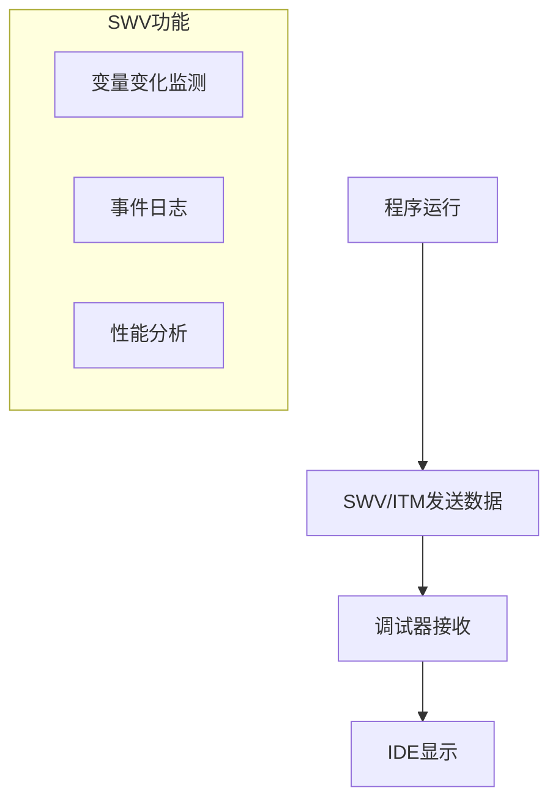
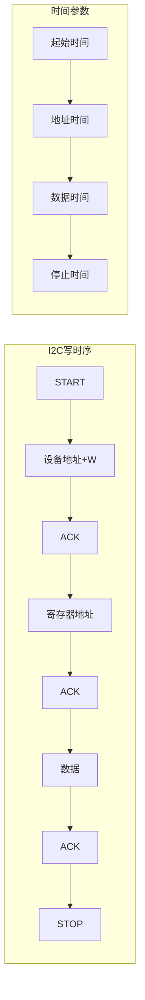
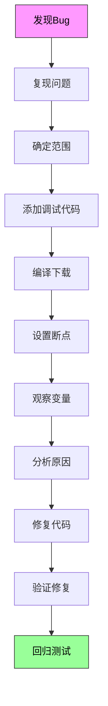

# 9.2 调试技术与工具

## 一、硬件调试工具

### 1. 调试器类型

| 调试器 | 接口 | 说明 |
|-------|------|------|
| J-Link | JTAG/SWD | 通用ARM调试器 |
| ST-Link | SWD | STM32专用 |
| U-Link | SWD | Keil专用 |
| CMSIS-DAP | SWD | 开源调试器 |

### 2. J-Link调试器

#### 特点

| 参数 | 值 |
|-----|----|
| 支持接口 | JTAG, SWD |
| 支持电压 | 1.2V ~ 5V |
| 最大速度 | 50MHz |
| 下载速度 | 约1MB/s |

#### 使用步骤

1. 连接调试器和目标板
2. 配置调试器驱动
3. 在IDE中选择调试器
4. 连接目标板
5. 下载程序
6. 开始调试

### 3. ST-Link调试器

#### 接线方式

| 引脚 | 连接 | 说明 |
|-----|------|------|
| VCC | 目标板VCC | 参考电压 |
| GND | 目标板GND | 公共地 |
| SWDIO | SWDIO | 数据线 |
| SWCLK | SWCLK | 时钟线 |

## 二、软件调试技术

### 1. 断点调试

#### 断点类型

| 类型 | 说明 | 适用场景 |
|-----|------|---------|
| 代码断点 | 断在指定地址 | 特定代码位置 |
| 数据断点 | 访问指定地址时断 | 监测变量变化 |
| 条件断点 | 满足条件时断 | 特定条件触发 |

#### 断点使用

```c
// 在调试器中设置断点
void debug_example(void) {
    int i;
    int sum = 0;
    
    // 在i=5时中断
    // 设置条件断点：i == 5
    for(i = 0; i < 10; i++) {
        sum += i;  // 代码断点
        printf("%d\n", sum);
    }
    
    // 查看sum变量
    // 设置数据断点：&sum
}
```

### 2. 单步调试

| 操作 | 快捷键 | 说明 |
|-----|--------|------|
| 单步进入 | F11 | 进入函数内部 |
| 单步跳过 | F10 | 执行当前行 |
| 跳出函数 | Ctrl+F11 | 跳出当前函数 |
| 运行到光标 | Ctrl+F5 | 运行到指定行 |

### 3. 调试窗口

| 窗口 | 功能 |
|-----|------|
| Watch | 查看和修改变量 |
| Memory | 查看内存内容 |
| Register | 查看CPU寄存器 |
| Call Stack | 查看调用栈 |
| Disassembly | 反汇编视图 |
| Logic Analyzer | 信号分析（SWV） |

### 4. SWV / ITM追踪



#### SWV使用示例

```c
// 启用SWV追踪
// 在代码中添加ITM打印
void SWV_Printf(const char *fmt, ...) {
    // ITM发送调试信息
    // 通过SWO引脚输出
    // Keil/STM32CubeIDE中查看
}

// 监控变量
volatile int debug_variable = 0;

void monitor_example(void) {
    while(1) {
        debug_variable++;
        // SWV可实时监测debug_variable的变化
        delay_ms(100);
    }
}
```

## 三、逻辑分析仪

### 1. 逻辑分析仪基础

| 参数 | 说明 |
|-----|------|
| 通道数 | 8~32通道 |
| 采样率 | 最高1GHz |
| 存储深度 | 1Mb~1Gb |
| 协议解析 | UART/SPI/I2C/CAN等 |

### 2. 常用逻辑分析仪

| 型号 | 通道 | 采样率 | 价格 |
|-----|------|--------|------|
| Saleae Logic | 8 | 24MHz | ~$200 |
| Saleae Logic Pro 16 | 16 | 100MHz | ~$600 |
| DreamSourceLab | 8 | 50MHz | ~$100 |
| OpenBench LogicSniffer | 8 | 100MHz | 开源 |

### 3. 逻辑分析仪使用

#### 捕获UART信号

```
步骤：
1. 连接通道：CH0 → TX, CH1 → RX, GND → GND
2. 设置触发：下降沿触发（起始位）
3. 设置波特率：115200
4. 捕获数据
5. 解码协议：选择UART 115200
```

#### 捕获I2C信号

```
步骤：
1. 连接通道：CH0 → SDA, CH1 → SCL
2. 设置触发：START条件
3. 设置协议：I2C，7位地址
4. 捕获数据
5. 分析读写操作
```

#### 捕获SPI信号

```
步骤：
1. 连接通道：CH0 → SCK, CH1 → MOSI, CH2 → MISO, CH3 → CS
2. 设置触发：CS下降沿
3. 设置模式：SPI Mode 0, MSB first
4. 捕获数据
5. 分析传输内容
```

### 4. 时序分析



## 四、常见调试技巧

### 1. LED调试法

```c
// 使用LED指示程序状态
void debug_with_led(void) {
    // 状态1：系统初始化
    LED_Set(LED_DEBUG_1, ON);
    system_init();
    LED_Set(LED_DEBUG_1, OFF);
    
    // 状态2：进入主循环
    LED_Set(LED_DEBUG_2, ON);
    
    while(1) {
        // 状态3：处理任务
        LED_Toggle(LED_DEBUG_3);
        process_task();
    }
}
```

### 2. 串口调试法

```c
// 重定向printf到UART
int fputc(int ch, FILE *f) {
    USART_SendData(USART1, ch);
    while(USART_GetFlagStatus(USART1, USART_FLAG_TXE) == RESET);
    return ch;
}

// 使用printf调试
void debug_with_uart(void) {
    printf("系统启动\r\n");
    printf("时钟频率: %lu Hz\r\n", SystemCoreClock);
    
    while(1) {
        printf("循环运行中...\r\n");
        delay_ms(1000);
    }
}
```

### 3. 看门狗调试

#### 独立看门狗（IWDG）

```c
// 独立看门狗配置
void IWDG_Init(void) {
    IWDG_WriteAccessCmd(IWDG_WriteAccess_Enable);
    
    // 预分频：40kHz/256 = 156Hz
    IWDG_SetPrescaler(IWDG_Prescaler_256);
    
    // 重载值：156ms超时
    IWDG_SetReload(0xFF);
    
    IWDG_ReloadCounter();
    IWDG_Enable();
}

// 喂狗（在主循环中）
void main_loop(void) {
    while(1) {
        // 喂狗
        IWDG_ReloadCounter();
        
        // 执行任务
        process_tasks();
    }
}
```

#### 窗口看门狗（WWDG）

```c
// 窗口看门狗配置
void WWDG_Init(void) {
    WWDG_DeInit();
    
    WWDG_SetPrescaler(WWDG_Prescaler_64);
    WWDG_SetWindowValue(0x50);
    WWDG_Enable(0x7F);
    
    // 早唤醒中断
    WWDG_ClearFlag();
    WWDG_ITConfig(WWDG_IT_WDT, ENABLE);
}

// WWDG中断处理
void WWDG_IRQHandler(void) {
    if(WWDG_GetFlagStatus() != RESET) {
        // 在窗口内喂狗
        WWDG_SetCounter(0x7F);
        WWDG_ClearFlag();
    }
}
```

### 4. 故障诊断

#### HardFault处理

```c
// 增强版HardFault处理
void HardFault_Handler(void) {
    // 保存关键寄存器
    __asm volatile
    (
        "TST LR, #4\n"
        "ITE EQ\n"
        "MRNN R0, MSP\n"
        "MRNN R0, PSP\n"
    );
    
    // 分析故障原因
    // 查看栈帧内容
    // 查看CFSR、HFSR寄存器
    
    // 故障处理
    // 1. 记录故障信息
    // 2. 尝试恢复或复位
    // 3. 进入安全模式
    
    while(1) {
        // 闪烁LED指示故障
        GPIO_Toggle(ERROR_LED);
        delay_ms(100);
    }
}
```

#### 栈溢出检测

```c
// FreeRTOS栈溢出钩子
void vApplicationStackOverflowHook(TaskHandle_t xTask, char *pcTaskName) {
    // 处理栈溢出
    // 可能的处理：
    // 1. 重启系统
    // 2. 增加任务栈
    // 3. 检查递归深度
    
    printf("Stack overflow in task: %s\n", pcTaskName);
    
    // 进入安全模式
    while(1);
}

// MPU配置栈保护
void MPU_ConfigStackProtection(void) {
    // 使用MPU保护栈区域
    // 栈溢出时触发MemManage异常
}
```

### 5. 内存检测

```c
// 堆使用监控
void heap_monitor_task(void *pvParameters) {
    while(1) {
        size_t free_heap = xPortGetFreeHeapSize();
        size_t min_heap = xPortGetMinimumEverFreeHeapSize();
        
        printf("Free heap: %u bytes\n", free_heap);
        printf("Min heap: %u bytes\n", min_heap);
        
        if(min_heap < 1024) {
            printf("Warning: Low heap memory!\n");
        }
        
        vTaskDelay(pdMS_TO_TICKS(5000));
    }
}
```

## 五、调试流程总结



---

**导航**：上一节 [[9.1-开发环境与工程创建]] · [[MOC - 第9章\|返回章节导航]] · 下一节 [[9.3-工程实战项目]]