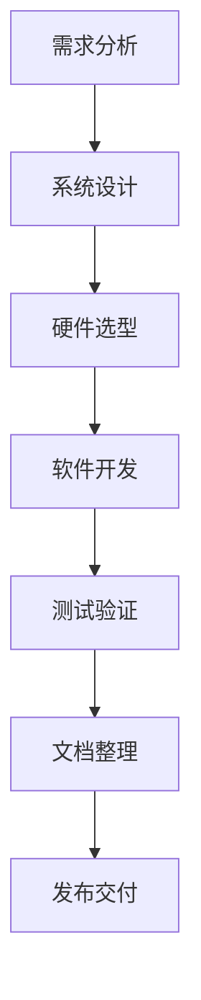
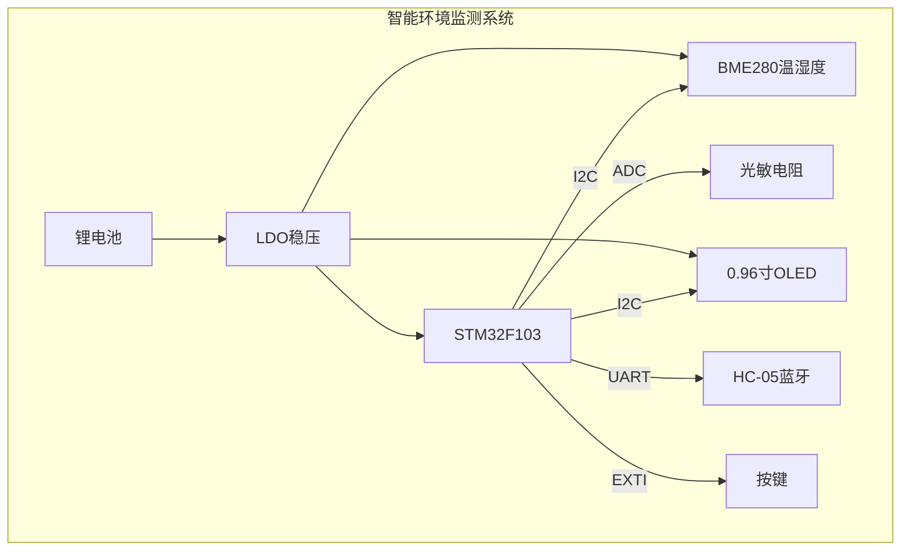
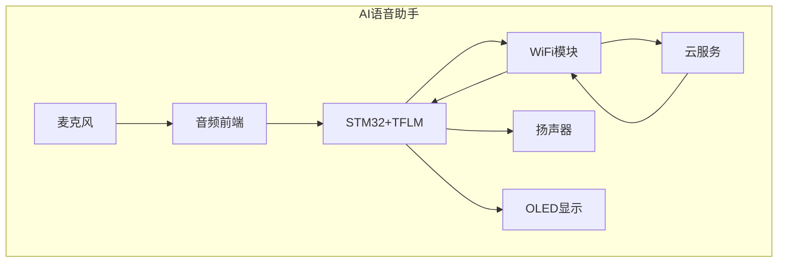

# 9.3 工程实战项目

## 一、项目开发流程

### 1. 项目生命周期



### 2. 各阶段任务

| 阶段 | 任务 | 产出 |
|-----|------|------|
| 需求分析 | 功能、性能、成本分析 | 需求文档 |
| 系统设计 | 架构、模块划分、接口定义 | 设计文档 |
| 硬件选型 | MCU、传感器、电源选择 | BOM表 |
| 软件开发 | 编码、调试、集成 | 源代码 |
| 测试验证 | 单元、集成、系统测试 | 测试报告 |
| 文档整理 | 用户手册、API文档 | 文档 |

## 二、项目案例一：智能环境监测系统

### 1. 项目需求

**功能需求**：
- 实时采集温度、湿度、光照数据
- OLED显示实时数据
- 蓝牙数据上传（可选）
- 按键控制显示模式
- 低功耗设计

**性能需求**：
- 采集周期：1秒
- 显示刷新：1秒
- 工作时间：>30天（锂电池）

### 2. 系统架构



### 3. 软件架构

```c
// 系统任务划分
void system_init(void) {
    // 1. 硬件初始化
    HAL_Init();
    SystemClock_Config();
    
    // 2. 外设初始化
    MX_GPIO_Init();
    MX_I2C1_Init();   // BME280 + OLED
    MX_ADC1_Init();    // 光敏
    MX_USART1_Init();  // 蓝牙
    
    // 3. 设备初始化
    BME280_Init();
    OLED_Init();
    HC05_Init();
    
    // 4. RTOS任务创建
    xTaskCreate(sensor_task, "Sensor", 256, NULL, 3, NULL);
    xTaskCreate(display_task, "Display", 512, NULL, 2, NULL);
    xTaskCreate(bluetooth_task, "BT", 256, NULL, 1, NULL);
    xTaskCreate(key_task, "Key", 128, NULL, 4, NULL);
    
    // 5. 启动调度器
    vTaskStartScheduler();
}
```

### 4. 核心任务实现

```c
// 传感器采集任务
void sensor_task(void *pvParameters) {
    BME280_Data data;
    uint16_t light_value;
    
    while(1) {
        // 1. 读取温湿度
        BME280_ReadData(&data);
        
        // 2. 读取光照
        light_value = ADC_Read(ADC_CHANNEL_0);
        
        // 3. 更新全局数据（加锁）
        if(xSemaphoreTake(data_mutex, 10) == pdTRUE) {
            g_sensor_data.temperature = data.temperature;
            g_sensor_data.humidity = data.humidity;
            g_sensor_data.light = light_value;
            xSemaphoreGive(data_mutex);
        }
        
        // 4. 延时1秒
        vTaskDelay(pdMS_TO_TICKS(1000));
    }
}

// 显示任务
void display_task(void *pvParameters) {
    uint8_t display_mode = 0;  // 0: 温度, 1: 湿度, 2: 光照
    
    while(1) {
        // 读取数据
        if(xSemaphoreTake(data_mutex, 10) == pdTRUE) {
            // 根据模式显示
            switch(display_mode) {
                case 0:
                    OLED_ShowString(0, 0, "Temp:");
                    OLED_ShowFloat(0, 32, g_sensor_data.temperature, 2, 1);
                    break;
                case 1:
                    OLED_ShowString(0, 0, "Hum:");
                    OLED_ShowFloat(0, 32, g_sensor_data.humidity, 2, 1);
                    break;
                case 2:
                    OLED_ShowString(0, 0, "Light:");
                    OLED_ShowNum(0, 32, g_sensor_data.light, 5);
                    break;
            }
            xSemaphoreGive(data_mutex);
        }
        
        vTaskDelay(pdMS_TO_TICKS(500));
    }
}

// 蓝牙通信任务
void bluetooth_task(void *pvParameters) {
    char tx_buf[64];
    
    while(1) {
        // 读取数据
        if(xSemaphoreTake(data_mutex, 10) == pdTRUE) {
            // 格式化数据
            sprintf(tx_buf, "T:%.1f,H:%.1f,L:%u\r\n",
                    g_sensor_data.temperature,
                    g_sensor_data.humidity,
                    g_sensor_data.light);
            xSemaphoreGive(data_mutex);
        }
        
        // 发送数据
        HC05_SendString(tx_buf);
        
        vTaskDelay(pdMS_TO_TICKS(2000));
    }
}

// 按键任务
void key_task(void *pvParameters) {
    uint8_t last_state = 1;
    
    while(1) {
        // 检测按键按下
        uint8_t current_state = GPIO_ReadInputDataBit(KEY_PORT, KEY_PIN);
        
        if(last_state == 1 && current_state == 0) {
            // 按键按下
            vTaskDelay(pdMS_TO_TICKS(20));  // 消抖
            
            current_state = GPIO_ReadInputDataBit(KEY_PORT, KEY_PIN);
            if(current_state == 0) {
                // 切换显示模式
                display_mode = (display_mode + 1) % 3;
            }
        }
        
        last_state = current_state;
        vTaskDelay(pdMS_TO_TICKS(10));
    }
}
```

### 5. 低功耗优化

```c
// 低功耗模式切换
void power_manager_task(void *pvParameters) {
    uint32_t last_activity = 0;
    
    while(1) {
        // 检查是否有活动
        if(system_activity > 0) {
            last_activity = xTaskGetTickCount();
            system_activity = 0;
        }
        
        // 超过30秒无活动
        if((xTaskGetTickCount() - last_activity) > 30000) {
            // 进入低功耗
            OLED_Clear();
            PWR_EnterSTOPMode(PWR_Regulator_LowPower, PWR_STOPEntry_WFI);
            
            // 唤醒后恢复
            SystemClock_Config();
            OLED_Init();
        }
        
        vTaskDelay(pdMS_TO_TICKS(1000));
    }
}
```

## 三、项目案例二：智能小车

### 1. 项目需求

**功能需求**：
- 红外遥控控制
- 蓝牙APP控制
- 循迹功能
- 避障功能
- 速度显示

### 2. 硬件清单

| 模块 | 型号 | 说明 |
|-----|------|------|
| MCU | STM32F103C8 | 主控 |
| 电机驱动 | L298N | 直流电机 |
| 编码器 | 红外对管 | 测速 |
| 循迹模块 | TCRT5000 | 红外循迹 |
| 超声波 | HC-SR04 | 测距避障 |
| 红外接收 | VS1838B | 遥控接收 |
| 蓝牙 | HC-05 | 手机控制 |

### 3. 控制系统设计

```c
// 智能小车主控制
typedef enum {
    MODE_MANUAL,    // 手动遥控
    MODE_TRACKING,  // 循迹模式
    MODE_AVOIDING,  // 避障模式
    MODE_BT         // 蓝牙控制
} ControlMode;

ControlMode current_mode = MODE_MANUAL;

void car_control_task(void *pvParameters) {
    uint16_t left_speed, right_speed;
    uint8_t tracking_data[3];
    float distance;
    
    while(1) {
        switch(current_mode) {
            case MODE_MANUAL:
                // 读取红外遥控
                Get_RC_Speed(&left_speed, &right_speed);
                Motor_SetSpeed(left_speed, right_speed);
                break;
                
            case MODE_TRACKING:
                // 读取循迹传感器
                TCRT_Read(tracking_data);
                
                // 简单循迹算法
                if(tracking_data[1]) {
                    // 居中，直走
                    Motor_SetSpeed(300, 300);
                } else if(tracking_data[0]) {
                    // 左偏，右转
                    Motor_SetSpeed(400, 200);
                } else if(tracking_data[2]) {
                    // 右偏，左转
                    Motor_SetSpeed(200, 400);
                }
                break;
                
            case MODE_AVOIDING:
                // 读取超声波距离
                distance = Ultrasonic_Read();
                
                if(distance < 30) {
                    // 避障
                    Motor_SetSpeed(-200, 200);  // 后退转向
                } else if(distance < 100) {
                    // 减速
                    Motor_SetSpeed(200, 200);
                } else {
                    // 正常行驶
                    Motor_SetSpeed(400, 400);
                }
                break;
                
            case MODE_BT:
                // 读取蓝牙指令
                BT_GetSpeed(&left_speed, &right_speed);
                Motor_SetSpeed(left_speed, right_speed);
                break;
        }
        
        vTaskDelay(pdMS_TO_TICKS(20));
    }
}
```

### 4. 电机控制

```c
// PWM电机控制
void Motor_Init(void) {
    GPIO_InitTypeDef GPIO_InitStruct;
    TIM_TimeBaseInitTypeDef TIM_InitStruct;
    TIM_OCInitTypeDef OC_InitStruct;
    
    // GPIO初始化（方向引脚）
    RCC_APB2PeriphClockCmd(RCC_APB2Periph_GPIOC, ENABLE);
    
    GPIO_InitStruct.GPIO_Pin = GPIO_Pin_0 | GPIO_Pin_1 | 
                                GPIO_Pin_2 | GPIO_Pin_3;
    GPIO_InitStruct.GPIO_Mode = GPIO_Mode_Out_PP;
    GPIO_Init(GPIOC, &GPIO_InitStruct);
    
    // TIM3 PWM初始化
    RCC_APB1PeriphClockCmd(RCC_APB1Periph_TIM3, ENABLE);
    
    TIM_InitStruct.TIM_Prescaler = 72 - 1;      // 1MHz
    TIM_InitStruct.TIM_Period = 1000 - 1;        // 1KHz
    TIM_InitStruct.TIM_CounterMode = TIM_CounterMode_Up;
    TIM_TimeBaseInit(TIM3, &TIM_InitStruct);
    
    // CH1 (PA6) - 左电机
    OC_InitStruct.TIM_OCMode = TIM_OCMode_PWM1;
    OC_InitStruct.TIM_OutputState = TIM_OutputState_Enable;
    OC_InitStruct.TIM_Pulse = 0;
    TIM_OC1Init(TIM3, &OC_InitStruct);
    
    // CH2 (PA7) - 右电机
    TIM_OC2Init(TIM3, &OC_InitStruct);
    
    TIM_Cmd(TIM3, ENABLE);
}

// 设置电机速度
void Motor_SetSpeed(int16_t left, int16_t right) {
    // 左电机
    if(left >= 0) {
        GPIO_SetBits(GPIOC, GPIO_Pin_0);      // 正转
        TIM_SetCompare1(TIM3, left);
    } else {
        GPIO_ResetBits(GPIOC, GPIO_Pin_0);    // 反转
        TIM_SetCompare1(TIM3, -left);
    }
    
    // 右电机
    if(right >= 0) {
        GPIO_SetBits(GPIOC, GPIO_Pin_2);
        TIM_SetCompare2(TIM3, right);
    } else {
        GPIO_ResetBits(GPIOC, GPIO_Pin_2);
        TIM_SetCompare2(TIM3, -right);
    }
}
```

## 四、项目案例三：AI语音助手

### 1. 项目架构



### 2. 核心功能

| 功能 | 实现方式 |
|-----|---------|
| 语音采集 | I2S + ADC |
| 关键词检测 | TFLM + KWS模型 |
| 语音识别 | WiFi上传云端 |
| 语音合成 | 云端下载播放 |
| 显示交互 | OLED显示状态 |

### 3. 主程序流程

```c
// AI语音助手主流程
void ai_assistant_main(void) {
    uint8_t keyword_detected = 0;
    char recognized_text[256];
    
    // 系统初始化
    System_Init();
    WiFi_Connect();
    TTS_Start("欢迎使用智能助手");
    
    while(1) {
        // 1. 持续监听关键词
        keyword_detected = KWS_Detect();
        
        if(keyword_detected) {
            // 2. 播放提示音
            TTS_Beep();
            
            // 3. 录制语音
            Record_Audio(5000);  // 5秒
            
            // 4. 上传语音到云端
            WiFi_Upload_Audio();
            
            // 5. 获取识别结果
            WiFi_Get_Text(recognized_text);
            
            // 6. 显示识别结果
            OLED_ShowString(0, 0, "您说:");
            OLED_ShowString(0, 16, recognized_text);
            
            // 7. AI处理（可选：本地或云端）
            AI_Process(recognized_text, response);
            
            // 8. 播放回复
            TTS_Speak(response);
        }
        
        // 低功耗等待
        PWR_EnterSTOPMode();
    }
}
```

### 4. 关键词检测实现

```c
// 关键词检测（简化版）
#define KWS_SAMPLE_RATE  16000
#define KWS_DURATION     1.0f
#define KWS_FRAMES       49

float mfcc_buffer[KWS_FRAMES][40];
volatile uint8_t audio_buffer[16000];
volatile uint8_t audio_ready = 0;

// 音频采集
void I2S_IRQHandler(void) {
    // I2S DMA接收
    // ...
    audio_ready = 1;
}

// MFCC特征提取
void extract_mfcc(void) {
    // 从音频缓冲区提取MFCC特征
    compute_mfcc_features(audio_buffer, mfcc_buffer);
}

// TFLM推理
uint8_t KWS_Detect(void) {
    uint8_t result;
    
    // 1. 等待音频采集
    while(!audio_ready);
    audio_ready = 0;
    
    // 2. 提取特征
    extract_mfcc();
    
    // 3. TFLM推理
    result = TFLM_Run(mfcc_buffer);
    
    return result;
}
```

## 五、项目总结与思考

### 1. 开发方法论

| 方法 | 说明 |
|-----|------|
| 模块化设计 | 分离关注点，便于维护 |
| 状态机 | 清晰描述系统行为 |
| 实时性分析 | 确保响应时间要求 |
| 功耗预算 | 估算和优化系统功耗 |
| 测试驱动 | 先写测试，再写实现 |

### 2. 常见问题与对策

| 问题 | 原因 | 对策 |
|-----|------|------|
| 系统死机 | 看门狗、电源 | 硬件看门狗、低电压复位 |
| 数据丢失 | 缓冲区溢出 | 环形缓冲区、流控 |
| 通信错误 | 干扰、波特率 | 校验、重试、错误检测 |
| 精度下降 | 量化、噪声 | 标定、滤波、校准 |
| 功耗超标 | 设计不合理 | 低功耗模式、动态调频 |

### 3. 学习路径建议


---

**导航**：上一节 [[9.2-调试技术与工具]] · [[MOC - 第9章\|返回章节导航]]