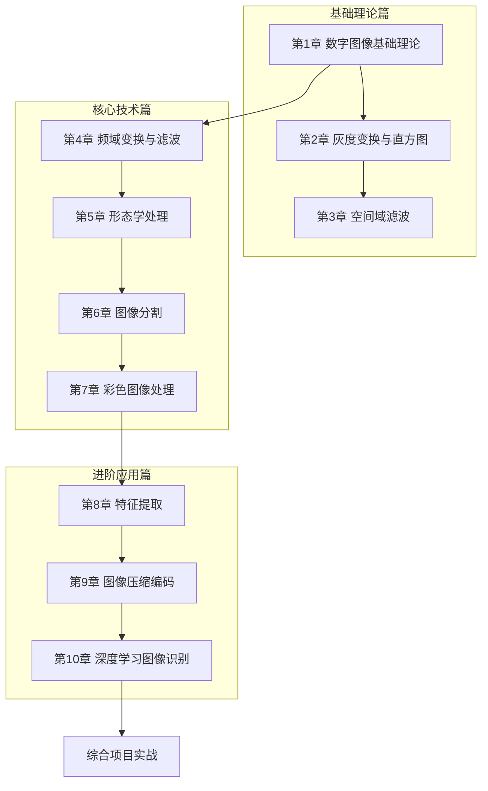

# 数字图像处理

> [!abstract] 课程定位
> 本课程系统介绍数字图像处理的基础理论、核心算法和工程实践，涵盖从图像采集、变换、滤波、分割到识别的完整技术链路，结合OpenCV和深度学习方法，培养学生的图像处理与计算机视觉能力。

## 课程结构

## 章节导航

| 章节 | 主题 | 核心知识点 |
|-----|------|-----------|
| [[第1章 数字图像基础理论/MOC - 第1章]] | 图像采集与表示 | 采样量化、像素矩阵、成像模型 |
| [[第2章 图像灰度变换与直方图处理/MOC - 第2章]] | 灰度映射与直方图 | 直方图均衡化、规定化、空间变换 |
| [[第3章 图像空间域滤波/MOC - 第3章]] | 平滑与锐化滤波 | 均值/中值/高斯滤波、微分算子 |
| [[第4章 频域变换傅里叶变换与频域滤波/MOC - 第4章]] | 傅里叶变换与滤波 | DFT、FFT、低通/高通滤波器 |
| [[第5章 形态学图像处理/MOC - 第5章]] | 形态学基本运算 | 膨胀腐蚀、开运算闭运算、连通域 |
| [[第6章 图像分割技术/MOC - 第6章]] | 图像分割方法 | 阈值分割、区域生长、边缘检测 |
| [[第7章 彩色图像处理/MOC - 第7章]] | 彩色空间与处理 | RGB/HSI空间、彩色增强、去噪 |
| [[第8章 图像特征提取/MOC - 第8章]] | 特征描述与匹配 | 形状特征、纹理特征、SIFT/HOG |
| [[第9章 图像压缩与编码/MOC - 第9章]] | 图像压缩算法 | 熵编码、变换编码、JPEG/JPEG2000 |
| [[第10章 图像识别与深度学习图像处理/MOC - 第10章]] | 深度学习图像应用 | CNN、目标检测、图像分割网络 |

## 学习路径建议

### 适合人群

| 背景 | 建议路径 |
|-----|---------|
| 计算机专业本科生 | 第1-10章（完整学习） |
| 视觉算法工程师 | 第3-10章（核心技术与深度学习） |
| 图像处理初学者 | 第1-5章（基础先行） |
| 考研复习 | 第1-8章（核心考点） |
| 视觉竞赛选手 | 第3-10章（算法与实战） |

### 先修知识

- 线性代数（矩阵运算、特征值）
- 信号与系统（傅里叶变换、卷积）
- 概率论与数理统计
- Python编程
- OpenCV基础

## 复习重点

> [!important] 考研/竞赛高频考点
> 1. 采样量化过程与图像质量关系
> 2. 直方图均衡化算法步骤与公式
> 3. 空间滤波（均值/中值/高斯）原理与实现
> 4. 傅里叶变换性质及卷积定理
> 5. 形态学基本运算（膨胀、腐蚀）及应用
> 6. 图像分割方法（阈值、边缘、区域）
> 7. 特征提取（SIFT/HOG/SURF）原理
> 8. 图像压缩编码（DCT、熵编码）
> 9. 深度学习在图像处理中的应用

## 工具推荐

| 工具 | 用途 | 学习阶段 |
|-----|------|---------|
| Python | 图像处理主语言 | 全程 |
| OpenCV | 传统图像处理 | 第1-8章 |
| NumPy/Pillow | 图像基础操作 | 第1章起 |
| Matplotlib | 图像可视化 | 全程 |
| PyTorch/TensorFlow | 深度学习 | 第10章 |
| scikit-image | 图像处理算法 | 第2-8章 |