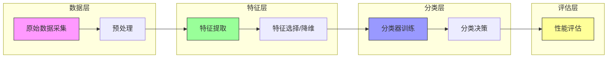
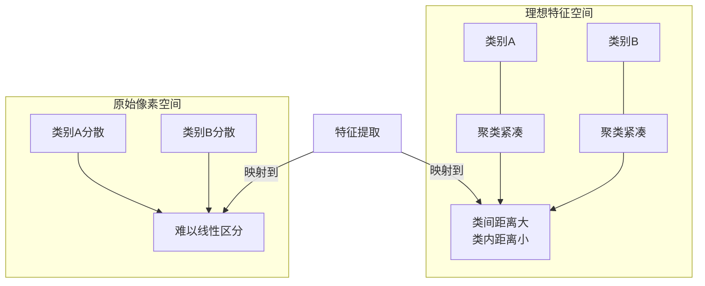
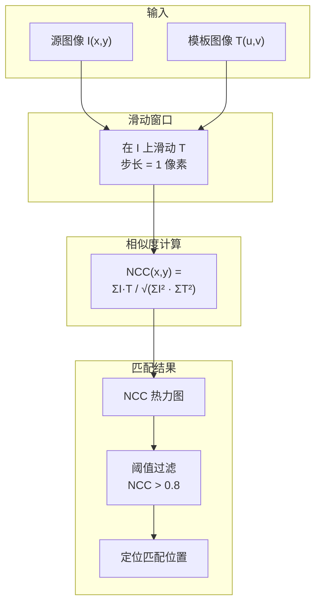
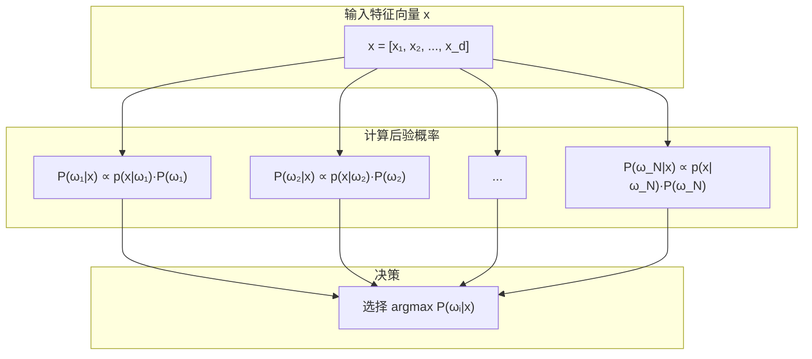
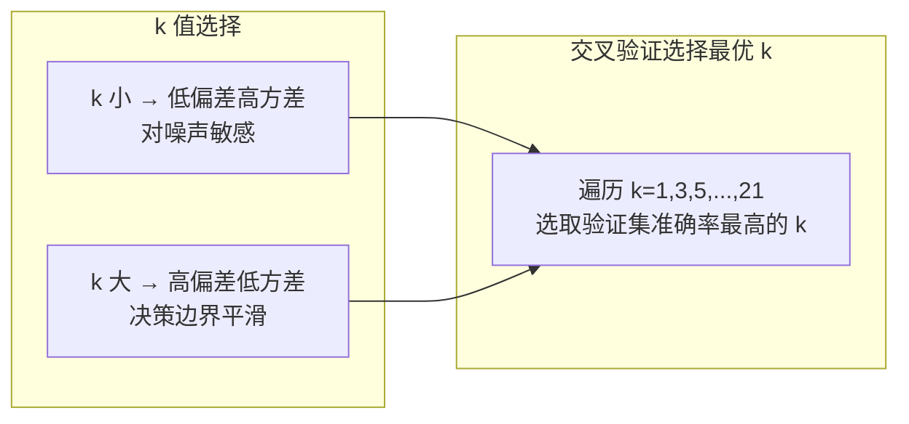
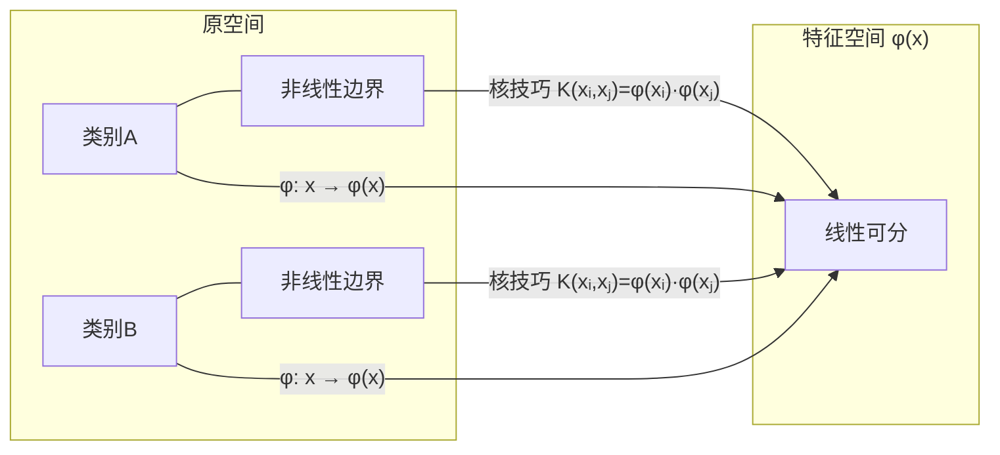
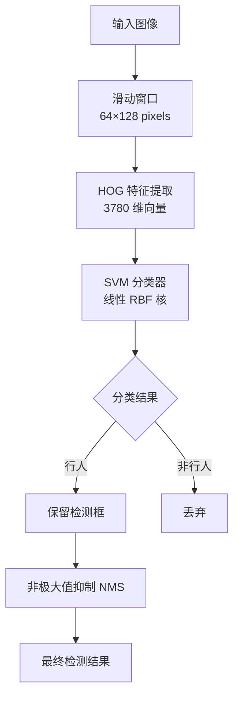
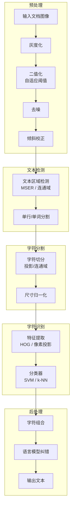
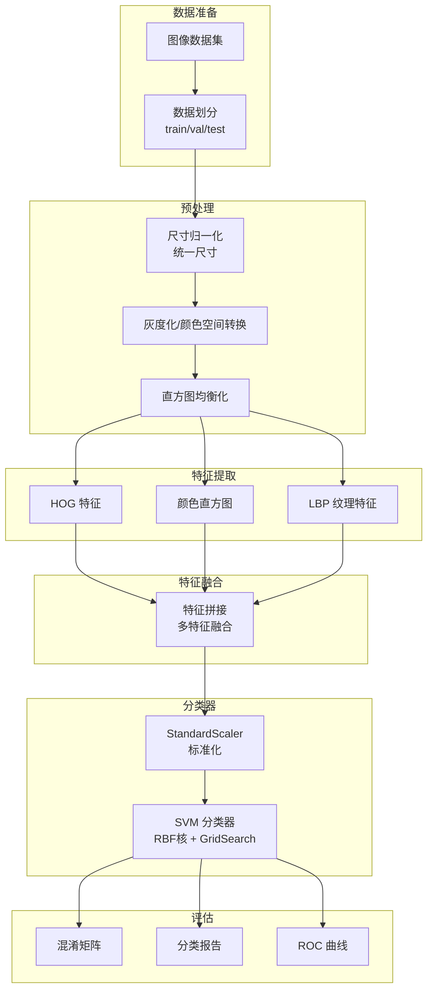

# 10.1 传统图像识别

## 📋 本节大纲

- [模式识别管线](#模式识别管线)
- [模板匹配](#模板匹配)
- [统计分类器](#统计分类器)
- [SVM 与经典特征组合](#svm-与经典特征组合)
- [OCR 光学字符识别管线](#ocr-光学字符识别管线)
- [综合实战：sklearn + OpenCV 图像分类](#综合实战sklearn--opencv-图像分类)
- [本节小结](#本节小结)

---

## 模式识别管线

### 基本流程

模式识别 (Pattern Recognition) 是将数据分到不同类别的过程。经典管线包含三个核心阶段：



| 阶段 | 输入 | 输出 | 典型方法 |
|------|------|------|---------|
| **数据采集** | 原始信号 | 数字化数据 | 相机、扫描仪、传感器 |
| **预处理** | 原始数据 | 净化数据 | 去噪、归一化、分割 |
| **特征提取** | 预处理数据 | 特征向量 | HOG、SIFT、LBP、颜色直方图 |
| **特征选择** | 高维特征 | 低维特征 | PCA、LDA、特征子集选择 |
| **分类器** | 特征向量 | 类别标签 | Bayes、k-NN、SVM、决策树 |

### 特征提取的重要性

特征工程是传统图像识别的核心。有效的特征应具备：

- **判别性**：不同类别的特征差异大
- **不变性**：对光照、旋转、缩放鲁棒
- **紧致性**：维度低，便于计算



---

## 模板匹配

### 基本原理

模板匹配 (Template Matching) 通过在图像上滑动一个模板图像，计算模板与图像各位置的相似度，找到匹配位置。

### 平方差匹配

$$
R_{SD}(x,y) = \sum_{u=0}^{W-1} \sum_{v=0}^{H-1} [I(x+u, y+v) - T(u,v)]^2
$$

- 值越小表示越匹配
- 对亮度变化敏感

### 归一化互相关

归一化互相关 (Normalized Cross-Correlation, NCC) 是最常用的模板匹配方法：

$$
R_{NCC}(x,y) = \frac{\sum_{u=0}^{W-1} \sum_{v=0}^{H-1} I(x+u, y+v) \cdot T(u,v)}{\sqrt{\sum I^2(x+u, y+v)} \cdot \sqrt{\sum T^2(u,v)}}
$$

- 值域 $[-1, 1]$，$1$ 为完美匹配
- 对亮度线性变化鲁棒



### 模板匹配实现

```python
import cv2
import numpy as np

def template_matching(image_path, template_path, threshold=0.8):
    """
    多目标模板匹配
    Args:
        image_path: 源图像路径
        template_path: 模板图像路径
        threshold: 匹配阈值
    Returns:
        result_img: 标注了匹配结果的图像
        matches: 匹配位置列表 [(x, y, score), ...]
    """
    image = cv2.imread(image_path)
    template = cv2.imread(template_path)

    img_gray = cv2.cvtColor(image, cv2.COLOR_BGR2GRAY)
    tpl_gray = cv2.cvtColor(template, cv2.COLOR_BGR2GRAY)

    th, tw = tpl_gray.shape[:2]

    result = cv2.matchTemplate(img_gray, tpl_gray, cv2.TM_CCOEFF_NORMED)

    locations = np.where(result >= threshold)

    matches = []
    for pt in zip(*locations[::-1]):
        score = result[pt[1], pt[0]]
        matches.append((pt[0], pt[1], score))

    result_img = image.copy()
    for x, y, s in matches:
        cv2.rectangle(result_img, (x, y), (x + tw, y + th), (0, 255, 0), 2)
        cv2.putText(result_img, f"{s:.2f}", (x, y - 5),
                    cv2.FONT_HERSHEY_SIMPLEX, 0.5, (0, 255, 0), 1)

    min_val, max_val, min_loc, max_loc = cv2.minMaxLoc(result)
    print(f"最大匹配值: {max_val:.4f}  at {max_loc}")
    print(f"匹配数量: {len(matches)}")

    return result_img, matches


def multi_scale_template_matching(image, template, scales=None):
    """
    多尺度模板匹配（应对尺寸变化）
    """
    if scales is None:
        scales = np.linspace(0.5, 2.0, 30)

    img_gray = cv2.cvtColor(image, cv2.COLOR_BGR2GRAY)
    tpl_gray = cv2.cvtColor(template, cv2.COLOR_BGR2GRAY)

    best_match = None
    best_score = -1
    best_scale = 1.0

    for scale in scales:
        scaled_tpl = cv2.resize(tpl_gray, None, fx=scale, fy=scale,
                                interpolation=cv2.INTER_AREA)
        th, tw = scaled_tpl.shape[:2]

        if th > img_gray.shape[0] or tw > img_gray.shape[1]:
            break

        result = cv2.matchTemplate(img_gray, scaled_tpl, cv2.TM_CCOEFF_NORMED)
        _, max_val, _, max_loc = cv2.minMaxLoc(result)

        if max_val > best_score:
            best_score = max_val
            best_match = max_loc
            best_scale = scale
            best_tpl_size = (tw, th)

    result_img = image.copy()
    if best_match is not None:
        x, y = best_match
        w, h = best_tpl_size
        cv2.rectangle(result_img, (x, y), (x + w, y + h), (0, 0, 255), 2)
        cv2.putText(result_img, f"scale={best_scale:.2f}, score={best_score:.3f}",
                    (x, y - 10), cv2.FONT_HERSHEY_SIMPLEX, 0.6, (0, 0, 255), 2)

    return result_img, best_score, best_scale
```

### 模板匹配的局限性

| 问题 | 描述 | 解决方案 |
|------|------|---------|
| **尺度变化** | 目标尺寸不一致 | 多尺度匹配 |
| **旋转变化** | 目标有旋转 | 多角度模板 |
| **光照变化** | 亮度不稳定 | NCC / 直方图匹配 |
| **遮挡** | 目标部分遮挡 | 局部特征匹配 |
| **形变** | 目标非刚性变形 | 基于特征点的匹配 |

---

## 统计分类器

### Bayes 分类器

#### Bayes 定理

$$
P(\omega_i \mid \mathbf{x}) = \frac{p(\mathbf{x} \mid \omega_i) P(\omega_i)}{p(\mathbf{x})}
$$

其中：
- $P(\omega_i)$ — 类别 $\omega_i$ 的先验概率
- $p(\mathbf{x} \mid \omega_i)$ — 类条件概率密度
- $P(\omega_i \mid \mathbf{x})$ — 后验概率

#### 决策规则

选择后验概率最大的类别：

$$
\text{decide } \omega_k \text{ if } P(\omega_k \mid \mathbf{x}) = \max_i P(\omega_i \mid \mathbf{x})
$$

等价判别函数：

$$
g_i(\mathbf{x}) = p(\mathbf{x} \mid \omega_i) P(\omega_i)
$$

#### 高斯假设下的判别函数

假设每类的类条件概率服从高斯分布：

$$
p(\mathbf{x} \mid \omega_i) = \frac{1}{(2\pi)^{d/2}|\Sigma_i|^{1/2}} \exp\left(-\frac{1}{2}(\mathbf{x}-\boldsymbol{\mu}_i)^T \Sigma_i^{-1} (\mathbf{x}-\boldsymbol{\mu}_i)\right)
$$

取对数后的判别函数为：

$$
g_i(\mathbf{x}) = -\frac{1}{2}\ln|\Sigma_i| - \frac{1}{2}(\mathbf{x}-\boldsymbol{\mu}_i)^T \Sigma_i^{-1} (\mathbf{x}-\boldsymbol{\mu}_i) + \ln P(\omega_i)
$$

**特殊情况**：当 $\Sigma_i = \sigma^2 I$ 时，判别函数退化为线性函数：

$$
g_i(\mathbf{x}) = -\frac{\|\mathbf{x}-\boldsymbol{\mu}_i\|^2}{2\sigma^2} + \ln P(\omega_i)
$$



#### 朴素 Bayes 分类器

朴素假设：特征之间条件独立：

$$
p(\mathbf{x} \mid \omega_i) = \prod_{j=1}^{d} p(x_j \mid \omega_i)
$$

判别函数简化为：

$$
g_i(\mathbf{x}) = \sum_{j=1}^{d} \ln p(x_j \mid \omega_i) + \ln P(\omega_i)
$$

#### Bayes 分类器实现

```python
from sklearn.naive_bayes import GaussianNB, MultinomialNB
from sklearn.metrics import accuracy_score, classification_report
import numpy as np

def bayes_classification_demo():
    """
    Bayes 分类器演示
    手写数字识别 (sklearn digits 数据集)
    """
    from sklearn.datasets import load_digits
    from sklearn.model_selection import train_test_split

    digits = load_digits()
    X, y = digits.data, digits.target

    X_train, X_test, y_train, y_test = train_test_split(
        X, y, test_size=0.2, random_state=42
    )

    gnb = GaussianNB()
    gnb.fit(X_train, y_train)

    y_pred = gnb.predict(X_test)
    accuracy = accuracy_score(y_test, y_pred)

    print(f"GaussianNB 准确率: {accuracy:.4f}")
    print("\n分类报告:")
    print(classification_report(y_test, y_pred))

    return gnb


def bayes_decision_boundary():
    """
    可视化二维特征空间中的 Bayes 决策边界
    """
    from sklearn.datasets import make_blobs

    X, y = make_blobs(n_samples=300, centers=3, n_features=2,
                      random_state=42, cluster_std=1.5)

    gnb = GaussianNB()
    gnb.fit(X, y)

    x_min, x_max = X[:, 0].min() - 1, X[:, 0].max() + 1
    y_min, y_max = X[:, 1].min() - 1, X[:, 1].max() + 1
    xx, yy = np.meshgrid(np.linspace(x_min, x_max, 300),
                          np.linspace(y_min, y_max, 300))

    Z = gnb.predict(np.c_[xx.ravel(), yy.ravel()])
    Z = Z.reshape(xx.shape)

    return xx, yy, Z, X, y
```

### k-NN 最近邻分类器

#### 基本思想

k-NN (k-Nearest Neighbors) 基于近邻投票进行分类：

$$
\hat{y} = \text{majority\_vote}\left(\text{Top-}k \text{ nearest neighbors of } \mathbf{x}\right)
$$

#### 距离度量

常用距离度量：

| 距离 | 公式 | 适用场景 |
|------|------|---------|
| 欧氏距离 | $d(\mathbf{x}, \mathbf{y}) = \sqrt{\sum (x_i - y_i)^2}$ | 连续特征 |
| 曼哈顿距离 | $d(\mathbf{x}, \mathbf{y}) = \sum |x_i - y_i|$ | 网格特征 |
| 余弦距离 | $d(\mathbf{x}, \mathbf{y}) = 1 - \frac{\mathbf{x} \cdot \mathbf{y}}{\|\mathbf{x}\|\|\mathbf{y}\|}$ | 文本特征 |
| 闵可夫斯基 | $d(\mathbf{x}, \mathbf{y}) = \left(\sum |x_i - y_i|^p\right)^{1/p}$ | 通用 |

#### k 值的选择



#### k-NN 实现

```python
from sklearn.neighbors import KNeighborsClassifier
from sklearn.model_selection import cross_val_score
from sklearn.preprocessing import StandardScaler

def knn_classification_pipeline(X_train, y_train, X_test, y_test, k_range=range(1, 22)):
    """
    k-NN 分类管线（含 k 值选择）
    """
    scaler = StandardScaler()
    X_train_scaled = scaler.fit_transform(X_train)
    X_test_scaled = scaler.transform(X_test)

    cv_scores = []
    for k in k_range:
        knn = KNeighborsClassifier(n_neighbors=k, metric='euclidean')
        scores = cross_val_score(knn, X_train_scaled, y_train, cv=5, scoring='accuracy')
        cv_scores.append(scores.mean())

    best_k = list(k_range)[np.argmax(cv_scores)]
    best_score = max(cv_scores)

    print(f"最优 k = {best_k}, 交叉验证准确率 = {best_score:.4f}")

    knn_best = KNeighborsClassifier(n_neighbors=best_k, metric='euclidean')
    knn_best.fit(X_train_scaled, y_train)

    y_pred = knn_best.predict(X_test_scaled)
    test_acc = accuracy_score(y_test, y_pred)
    print(f"测试集准确率: {test_acc:.4f}")

    return knn_best, best_k, cv_scores


def knn_from_scratch(X_train, y_train, X_test, k=5):
    """
    手写 k-NN 实现（便于理解原理）
    """
    predictions = []

    for test_point in X_test:
        distances = np.sqrt(np.sum((X_train - test_point) ** 2, axis=1))

        k_indices = np.argsort(distances)[:k]
        k_nearest_labels = y_train[k_indices]

        unique, counts = np.unique(k_nearest_labels, return_counts=True)
        predictions.append(unique[np.argmax(counts)])

    return np.array(predictions)
```

---

## SVM 与经典特征组合

### 支持向量机基础

#### 最大间隔原则

SVM 寻找使两类间隔最大的超平面：

$$
\min_{\mathbf{w}, b} \frac{1}{2}\|\mathbf{w}\|^2
$$

约束条件：

$$
y_i(\mathbf{w}^T \mathbf{x}_i + b) \geq 1, \quad i = 1, 2, \ldots, N
$$

#### 软间隔与核技巧

引入松弛变量 $\xi_i$ 和惩罚参数 $C$：

$$
\min_{\mathbf{w}, b, \xi} \frac{1}{2}\|\mathbf{w}\|^2 + C \sum \xi_i
$$

核函数将特征映射到高维空间：

$$
K(\mathbf{x}_i, \mathbf{x}_j) = \phi(\mathbf{x}_i)^T \phi(\mathbf{x}_j)
$$

| 核函数 | 表达式 | 适用场景 |
|--------|--------|---------|
| 线性核 | $K = \mathbf{x}_i^T \mathbf{x}_j$ | 线性可分 |
| RBF核 | $K = \exp(-\gamma\|\mathbf{x}_i - \mathbf{x}_j\|^2)$ | 通用非线性 |
| 多项式核 | $K = (\mathbf{x}_i^T \mathbf{x}_j + c)^d$ | 图像特征 |
| Sigmoid核 | $K = \tanh(\alpha \mathbf{x}_i^T \mathbf{x}_j + c)$ | 类似NN |



### HOG + SVM 行人检测

经典的 DPM (Deformable Part Model) 方法：HOG 特征 + SVM 分类器。

#### 完整流程



### SVM + 经典特征实现

```python
from sklearn.svm import SVC, LinearSVC
from sklearn.preprocessing import StandardScaler
from sklearn.pipeline import Pipeline
from sklearn.metrics import classification_report
import cv2
import numpy as np

def hog_svm_pipeline(train_images, train_labels, test_images, test_labels):
    """
    HOG + SVM 图像分类管线
    Args:
        train_images: 训练图像列表
        train_labels: 训练标签
        test_images: 测试图像列表
        test_labels: 测试标签
    Returns:
        clf: 训练好的分类器
        accuracy: 测试准确率
    """
    hog_descr = cv2.HOGDescriptor(
        (64, 64),
        (16, 16),
        (8, 8),
        (8, 8),
        9
    )

    def extract_hog_features(images):
        features = []
        for img in images:
            gray = cv2.cvtColor(img, cv2.COLOR_BGR2GRAY) if len(img.shape) == 3 else img
            resized = cv2.resize(gray, (64, 64))
            feat = hog_descr.compute(resized).flatten()
            features.append(feat)
        return np.array(features)

    print("提取训练集 HOG 特征...")
    X_train = extract_hog_features(train_images)
    print("提取测试集 HOG 特征...")
    X_test = extract_hog_features(test_images)

    pipeline = Pipeline([
        ('scaler', StandardScaler()),
        ('svm', SVC(kernel='rbf', C=10, gamma='scale', random_state=42))
    ])

    pipeline.fit(X_train, train_labels)

    y_pred = pipeline.predict(X_test)
    accuracy = accuracy_score(test_labels, y_pred)

    print(f"SVM 分类准确率: {accuracy:.4f}")
    print("\n分类报告:")
    print(classification_report(test_labels, y_pred))

    return pipeline, accuracy


def sift_svm_pipeline(train_images, train_labels, test_images, test_labels):
    """
    SIFT BoW + SVM 图像分类
    使用 SIFT 特征 + K-Means 构建词袋模型
    """
    sift = cv2.SIFT_create()

    def extract_sift_descriptors(images):
        all_descriptors = []
        for img in images:
            gray = cv2.cvtColor(img, cv2.COLOR_BGR2GRAY) if len(img.shape) == 3 else img
            kp, des = sift.detectAndCompute(gray, None)
            if des is not None:
                all_descriptors.append(des)
        return all_descriptors

    print("提取 SIFT 描述子...")
    train_descs = extract_sift_descriptors(train_images)

    all_desc = np.vstack(train_descs)

    from sklearn.cluster import KMeans
    n_clusters = 128
    kmeans = KMeans(n_clusters=n_clusters, random_state=42, n_init=10)
    kmeans.fit(all_desc)

    def compute_bow_hist(descriptors, kmeans):
        if descriptors is None or len(descriptors) == 0:
            return np.zeros(n_clusters)
        preds = kmeans.predict(descriptors)
        hist, _ = np.histogram(preds, bins=n_clusters, range=(0, n_clusters))
        hist = hist.astype(np.float32)
        hist /= hist.sum() + 1e-6
        return hist

    def get_bow_features(images):
        features = []
        for img in images:
            gray = cv2.cvtColor(img, cv2.COLOR_BGR2GRAY) if len(img.shape) == 3 else img
            kp, des = sift.detectAndCompute(gray, None)
            bow = compute_bow_hist(des, kmeans)
            features.append(bow)
        return np.array(features)

    print("计算 BoW 特征...")
    X_train_bow = get_bow_features(train_images)
    X_test_bow = get_bow_features(test_images)

    pipeline = Pipeline([
        ('scaler', StandardScaler()),
        ('svm', LinearSVC(C=1.0, random_state=42, dual='auto'))
    ])

    pipeline.fit(X_train_bow, train_labels)
    y_pred = pipeline.predict(X_test_bow)
    accuracy = accuracy_score(test_labels, y_pred)

    print(f"SIFT+BoW+SVM 准确率: {accuracy:.4f}")
    return pipeline, kmeans, accuracy
```

---

## OCR 光学字符识别管线

### OCR 完整流程

OCR (Optical Character Recognition) 将图像中的文字转换为可编辑文本。



### OCR 管线实现

```python
import cv2
import numpy as np
from collections import Counter

def ocr_pipeline(image_path, char_classifier=None):
    """
    完整 OCR 管线
    Args:
        image_path: 输入图像路径
        char_classifier: 预训练的字符分类器（可选）
    Returns:
        recognized_text: 识别的文本
    """
    image = cv2.imread(image_path)
    if image is None:
        raise FileNotFoundError(f"无法读取图像: {image_path}")

    gray = cv2.cvtColor(image, cv2.COLOR_BGR2GRAY)

    binary = cv2.adaptiveThreshold(
        gray, 255, cv2.ADAPTIVE_THRESH_GAUSSIAN_C,
        cv2.THRESH_BINARY_INV, 11, 2
    )

    kernel = cv2.getStructuringElement(cv2.MORPH_RECT, (3, 3))
    cleaned = cv2.morphologyEx(binary, cv2.MORPH_CLOSE, kernel)

    contours, _ = cv2.findContours(cleaned, cv2.RETR_EXTERNAL, cv2.CHAIN_APPROX_SIMPLE)

    char_regions = []
    for contour in contours:
        area = cv2.contourArea(contour)
        if area < 50:
            continue
        x, y, w, h = cv2.boundingRect(contour)
        if h < 10 or w < 5:
            continue
        aspect_ratio = w / h
        if aspect_ratio > 3 or aspect_ratio < 0.2:
            continue
        char_regions.append((x, y, w, h))

    char_regions.sort(key=lambda r: r[0])

    recognized_chars = []
    for i, (x, y, w, h) in enumerate(char_regions):
        char_img = gray[y:y+h, x:x+w]

        pad = 5
        char_img = cv2.copyMakeBorder(char_img, pad, pad, pad, pad,
                                       cv2.BORDER_CONSTANT, value=255)
        char_img = cv2.resize(char_img, (32, 32))

        if char_classifier is not None:
            feat = char_img.flatten().astype(np.float32) / 255.0
            feat = feat.reshape(1, -1)
            pred = char_classifier.predict(feat)[0]
            recognized_chars.append(pred)
        else:
            recognized_chars.append(f"?")

    recognized_text = ''.join(recognized_chars)
    return recognized_text, char_regions


def train_char_classizer(train_char_images, train_labels):
    """
    训练字符分类器 (HOG + SVM)
    """
    hog = cv2.HOGDescriptor((32, 32), (8, 8), (4, 4), (4, 4), 9)

    features = []
    for img in train_char_images:
        feat = hog.compute(img).flatten()
        features.append(feat)

    X = np.array(features)
    y = np.array(train_labels)

    svm = cv2.ml.SVM_create()
    svm.setType(cv2.ml.SVM_C_SVC)
    svm.setKernel(cv2.ml.SVM_RBF)
    svm.setGamma(0.01)
    svm.setC(10)
    svm.train(X.astype(np.float32), cv2.ml.ROW_SAMPLE, y.astype(np.int32))

    return svm
```

---

## 综合实战：sklearn + OpenCV 图像分类

### 完整分类管线



### 完整代码

```python
import cv2
import numpy as np
from sklearn.svm import SVC
from sklearn.model_selection import train_test_split, GridSearchCV
from sklearn.preprocessing import StandardScaler
from sklearn.metrics import (accuracy_score, classification_report,
                              confusion_matrix, roc_auc_score)
from sklearn.pipeline import Pipeline
import os
import glob

class TraditionalImageClassifier:
    """
    传统图像分类器：HOG + 颜色直方图 + LBP + SVM
    """

    def __init__(self, img_size=(128, 128), n_bins=256):
        self.img_size = img_size
        self.n_bins = n_bins
        self.hog = cv2.HOGDescriptor(
            (img_size[0], img_size[1]),
            (32, 32), (16, 16), (16, 16), 9
        )
        self.pipeline = None

    def load_dataset(self, data_dir):
        """
        从目录加载数据集
        目录结构: data_dir/
                    class_0/
                        img1.jpg
                        img2.jpg
                    class_1/
                        ...
        """
        images = []
        labels = []
        class_names = sorted([d for d in os.listdir(data_dir)
                              if os.path.isdir(os.path.join(data_dir, d))])

        for label, class_name in enumerate(class_names):
            class_dir = os.path.join(data_dir, class_name)
            for img_path in glob.glob(os.path.join(class_dir, '*.jpg')) + \
                          glob.glob(os.path.join(class_dir, '*.png')):
                img = cv2.imread(img_path)
                if img is not None:
                    img = cv2.resize(img, self.img_size)
                    images.append(img)
                    labels.append(label)

        print(f"加载 {len(images)} 张图像, {len(class_names)} 个类别")
        return images, labels, class_names

    def extract_features(self, image):
        """
        提取融合特征: HOG + 颜色直方图 + LBP
        """
        img_resized = cv2.resize(image, self.img_size)

        hog_feat = self.hog.compute(img_resized).flatten()

        hsv = cv2.cvtColor(img_resized, cv2.COLOR_BGR2HSV)
        hist_h = cv2.calcHist([hsv], [0], None, [self.n_bins], [0, 180])
        hist_s = cv2.calcHist([hsv], [1], None, [self.n_bins], [0, 256])
        hist_v = cv2.calcHist([hsv], [2], None, [self.n_bins], [0, 256])
        color_hist = np.concatenate([hist_h.flatten(), hist_s.flatten(),
                                      hist_v.flatten()])
        color_hist = color_hist / (color_hist.sum() + 1e-6)

        gray = cv2.cvtColor(img_resized, cv2.COLOR_BGR2GRAY)
        lbp_img = self._compute_lbp(gray)
        lbp_hist, _ = np.histogram(lbp_img.flatten(), bins=256, range=(0, 256))
        lbp_hist = lbp_hist.astype(np.float32)
        lbp_hist = lbp_hist / (lbp_hist.sum() + 1e-6)

        features = np.concatenate([hog_feat, color_hist, lbp_hist])
        return features

    def _compute_lbp(self, gray):
        """计算 LBP 图像"""
        lbp = np.zeros_like(gray)
        for i in range(1, gray.shape[0] - 1):
            for j in range(1, gray.shape[1] - 1):
                center = gray[i, j]
                code = 0
                code |= (gray[i-1, j-1] >= center) << 7
                code |= (gray[i-1, j] >= center) << 6
                code |= (gray[i-1, j+1] >= center) << 5
                code |= (gray[i, j+1] >= center) << 4
                code |= (gray[i+1, j+1] >= center) << 3
                code |= (gray[i+1, j] >= center) << 2
                code |= (gray[i+1, j-1] >= center) << 1
                code |= (gray[i, j-1] >= center) << 0
                lbp[i, j] = code
        return lbp

    def fit(self, images, labels):
        """
        训练分类器
        """
        print("提取特征...")
        X = np.array([self.extract_features(img) for img in images])
        y = np.array(labels)

        self.pipeline = Pipeline([
            ('scaler', StandardScaler()),
            ('svm', SVC(kernel='rbf', probability=True, random_state=42))
        ])

        param_grid = {
            'svm__C': [0.1, 1, 10, 100],
            'svm__gamma': ['scale', 'auto', 0.01, 0.1]
        }

        print("网格搜索最优 SVM 参数...")
        grid_search = GridSearchCV(
            self.pipeline, param_grid, cv=5,
            scoring='accuracy', n_jobs=-1
        )
        grid_search.fit(X, y)

        self.pipeline = grid_search.best_estimator_
        print(f"最优参数: {grid_search.best_params_}")
        print(f"CV 准确率: {grid_search.best_score_:.4f}")

        return self

    def predict(self, images):
        """预测"""
        X = np.array([self.extract_features(img) for img in images])
        return self.pipeline.predict(X)

    def evaluate(self, images, labels, class_names):
        """
        详细评估
        """
        y_pred = self.predict(images)
        accuracy = accuracy_score(labels, y_pred)

        print(f"\n测试集准确率: {accuracy:.4f}")
        print("\n分类报告:")
        print(classification_report(labels, y_pred, target_names=class_names))

        cm = confusion_matrix(labels, y_pred)
        print("混淆矩阵:")
        print(cm)

        return accuracy, cm
```

### 使用示例

```python
def run_full_pipeline(data_dir):
    """
    运行完整的传统图像分类管线
    """
    classifier = TraditionalImageClassifier(img_size=(128, 128))

    print("=" * 50)
    print("1. 加载数据集")
    images, labels, class_names = classifier.load_dataset(data_dir)

    X_train, X_test, y_train, y_test = train_test_split(
        images, labels, test_size=0.2, random_state=42, stratify=labels
    )

    print(f"训练集: {len(X_train)}, 测试集: {len(X_test)}")

    print("\n" + "=" * 50)
    print("2. 训练分类器")
    classifier.fit(X_train, y_train)

    print("\n" + "=" * 50)
    print("3. 评估分类器")
    accuracy, cm = classifier.evaluate(X_test, y_test, class_names)

    print("\n" + "=" * 50)
    print("4. 单张图像预测演示")
    if len(X_test) > 0:
        test_img = X_test[0]
        pred = classifier.predict([test_img])[0]
        print(f"预测类别: {class_names[pred]}")

    return classifier, accuracy
```

---

## 本节小结

### 方法对比

| 方法 | 类型 | 优点 | 缺点 | 适用场景 |
|------|------|------|------|---------|
| **模板匹配** | 确定性 | 实现简单、无需训练 | 对尺度/旋转敏感 | 固定场景定位 |
| **Bayes 分类器** | 生成式 | 理论坚实、速度快 | 需假设分布 | 小规模特征 |
| **k-NN** | 实例式 | 无需训练、直觉性强 | 预测慢、维度灾难 | 小数据集 |
| **SVM+特征** | 判别式 | 精度高、核技巧强大 | 特征工程依赖 | 中大规模图像 |

### 核心公式

| 方法 | 核心公式 |
|------|---------|
| Bayes定理 | $P(\omega_i \mid \mathbf{x}) = p(\mathbf{x} \mid \omega_i) P(\omega_i) / p(\mathbf{x})$ |
| 高斯判别函数 | $g_i(\mathbf{x}) = -\frac{1}{2}\|\mathbf{x}-\boldsymbol{\mu}_i\|^2/\sigma^2 + \ln P(\omega_i)$ |
| NCC | $R_{NCC} = \sum I \cdot T / \sqrt{\sum I^2 \cdot \sum T^2}$ |
| SVM | $f(\mathbf{x}) = \text{sign}(\sum \alpha_i y_i K(\mathbf{x}_i, \mathbf{x}) + b)$ |
| k-NN | $\hat{y} = \text{majority\_vote}(k \text{ nearest})$ |

### 课后练习

1. 使用 OpenCV `cv2.matchTemplate` 实现多尺度模板匹配，对工业零件检测图像进行缺陷定位
2. 使用 sklearn 实现 Bayes 分类器，在手写数字数据集上比较 GaussianNB 和 MultinomialNB 的性能
3. 实现 k-NN 分类器（手写版本），分析不同 k 值对分类准确率的影响
4. 使用 HOG + SVM 实现行人检测，在 INRIA 数据集上评估，并尝试不同的 SVM 核函数
5. 完整实现 OCR 管线：从图像预处理到字符识别，在简单验证码数据集上测试
6. 进阶：使用 SIFT + BoW + SVM 实现场景分类，对比 HOG+SVM 的性能差异