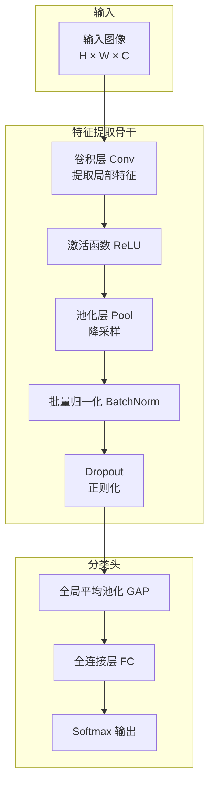
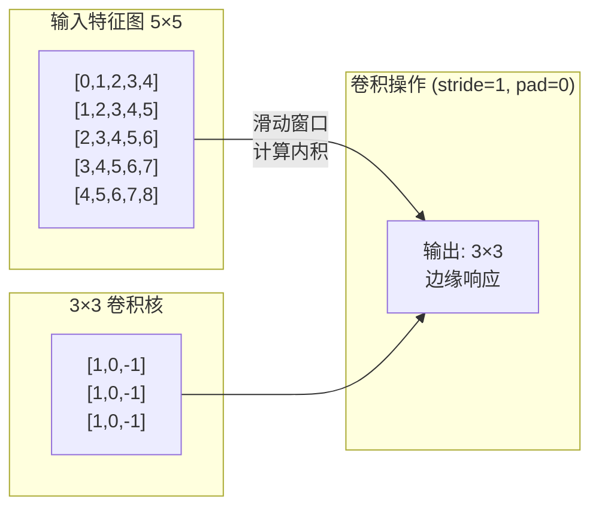
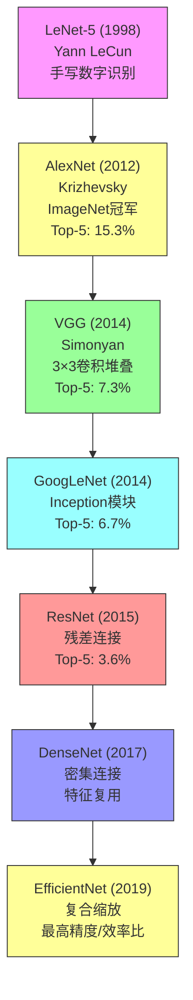
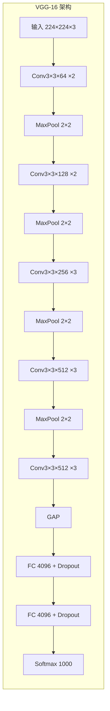
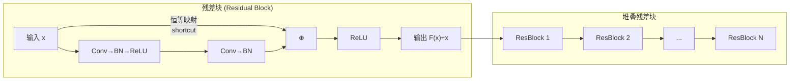
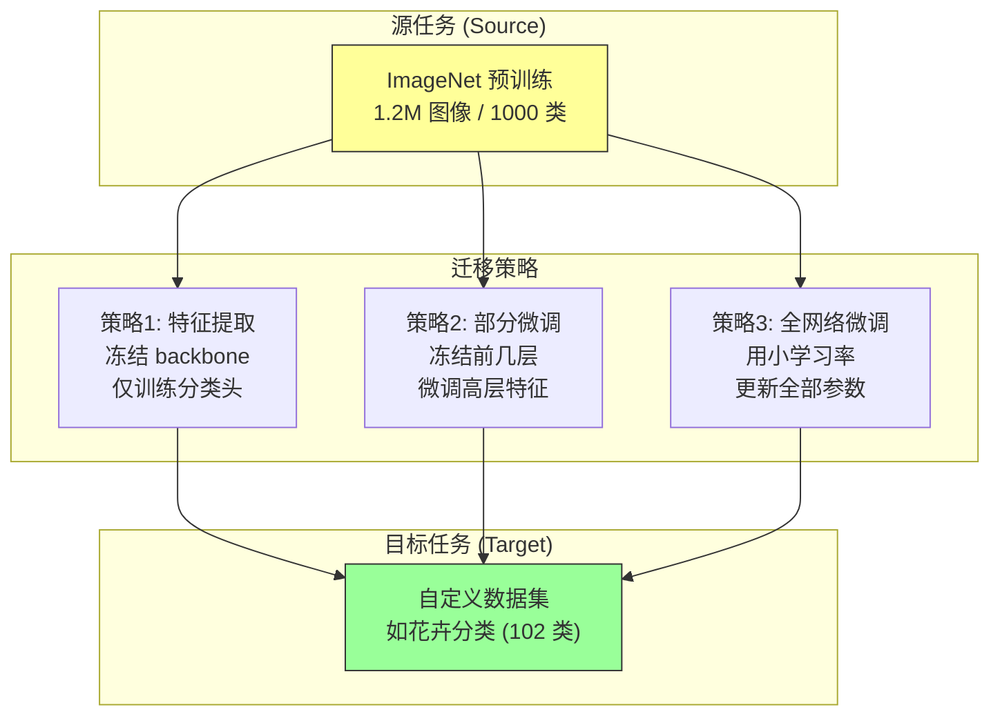
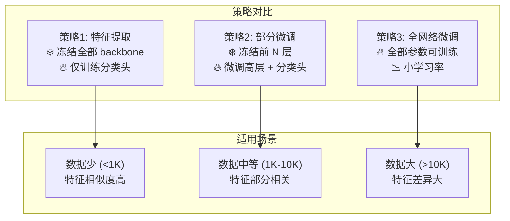
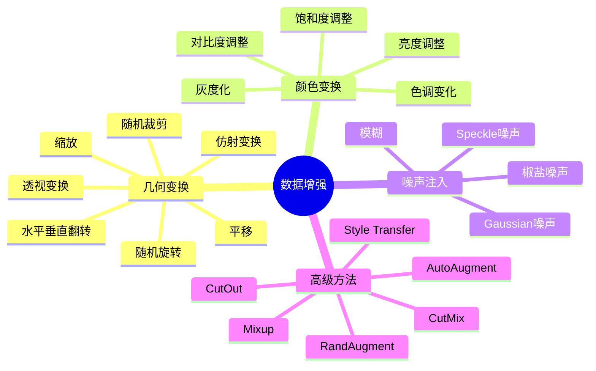
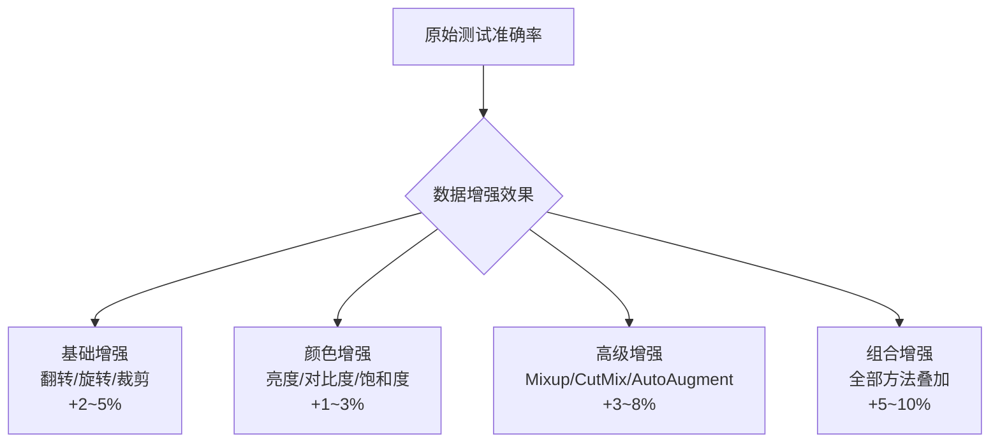
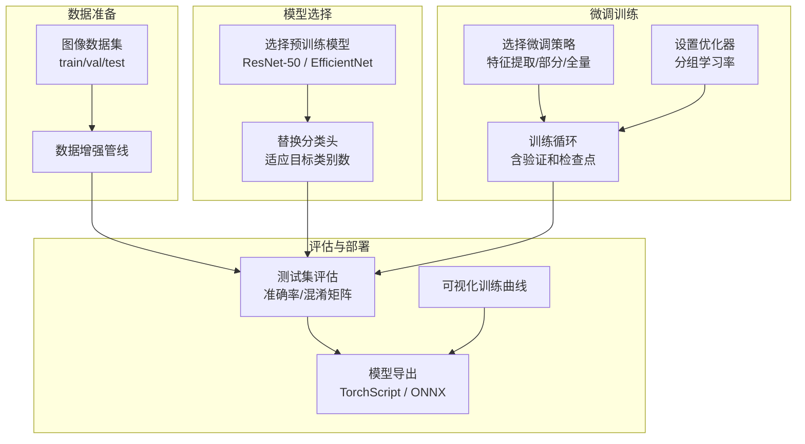

# 10.2 深度学习图像识别

## 📋 本节大纲

- [CNN 架构回顾](#cnn-架构回顾)
- [经典网络架构演进](#经典网络架构演进)
- [迁移学习与预训练模型](#迁移学习与预训练模型)
- [微调策略](#微调策略)
- [数据增强技术](#数据增强技术)
- [PyTorch 实战：预训练模型微调](#pytorch-实战预训练模型微调)
- [本节小结](#本节小结)

---

## CNN 架构回顾

### 卷积神经网络核心组件

CNN (Convolutional Neural Network) 通过局部连接和权值共享，有效处理图像的空间结构。



### 卷积层

卷积层是 CNN 的核心，通过可学习的卷积核提取特征：

$$
y_j^l = f\left(\sum_{i \in M_j} x_i^{l-1} * k_{ij}^l + b_j^l\right)
$$

参数说明：
- $x_i^{l-1}$ — 第 $l-1$ 层第 $i$ 个特征图
- $k_{ij}^l$ — 卷积核（可学习参数）
- $b_j^l$ — 偏置项
- $f$ — 非线性激活函数
- $*$ — 卷积操作



### 池化层

池化层进行空间降采样，增强平移不变性：

$$
\text{Pool}(x,y) = \frac{1}{|R|} \sum_{(i,j)\in R} I(i,j)
$$

| 池化类型 | 操作 | 特点 |
|---------|------|------|
| 最大池化 | $\max_{(i,j)\in R} I(i,j)$ | 保留最显著特征 |
| 平均池化 | $\frac{1}{|R|}\sum_{(i,j)\in R} I(i,j)$ | 保留整体信息 |
| 随机池化 | 按概率随机选取 | 正则化效果 |

### 批量归一化

BatchNorm 加速训练并提供正则化效果：

$$
\hat{x}_i = \frac{x_i - \mu_B}{\sqrt{\sigma_B^2 + \epsilon}}
$$

$$
y_i = \gamma \odot \hat{x}_i + \beta
$$

其中 $\mu_B$ 和 $\sigma_B^2$ 为 mini-batch 的均值和方差，$\gamma$ 和 $\beta$ 为可学习参数。

### 损失函数：交叉熵

分类任务使用交叉熵损失：

$$
\mathcal{L} = -\sum_{i=1}^{C} y_i \log(\hat{y}_i)
$$

其中 $y_i$ 为真实标签的 one-hot 编码，$\hat{y}_i$ 为预测概率。

---

## 经典网络架构演进

### 发展脉络



### 各架构对比

| 模型 | 年份 | 核心创新 | Top-5 错误率 | 参数量 | 特点 |
|------|------|---------|-------------|--------|------|
| **LeNet-5** | 1998 | CNN基础框架 | ~30% | 60K | 奠定CNN基础 |
| **AlexNet** | 2012 | ReLU、Dropout、双GPU | 15.3% | 60M | 深度学习复兴 |
| **VGG-16** | 2014 | 3×3卷积堆叠 | 7.3% | 138M | 结构简洁、常用 |
| **GoogLeNet** | 2014 | Inception模块 | 6.7% | 7M | 多尺度特征 |
| **ResNet-50** | 2015 | 残差连接 | 3.6% | 25M | 训练极深网络 |
| **DenseNet-121** | 2017 | 密集连接 | 2.8% | 8M | 特征复用 |
| **EfficientNet-B3** | 2019 | 复合缩放 | 1.5% | 12M | 精度/效率最优 |

### VGG 网络

VGG 使用统一的 3×3 卷积堆叠，结构简洁实用：



### ResNet 残差网络

ResNet 通过残差连接解决深度网络退化问题：

$$
\mathbf{y} = \mathcal{F}(\mathbf{x}, \{W_i\}) + \mathbf{x}
$$

$$
\mathbf{y} = \mathcal{F}(\mathbf{x}, \{W_i\}) + \mathcal{S}(\mathbf{x})
$$



ResNet-50 使用 bottleneck 设计：1×1 → 3×3 → 1×1 卷积，显著减少参数量。

### EfficientNet

EfficientNet 通过复合缩放（Compound Scaling）统一优化网络的深度、宽度和分辨率：

$$
\text{Compound Scaling:} \quad d = \alpha^\phi, \quad w = \beta^\phi, \quad r = \gamma^\phi
$$

其中 $\phi$ 为复合缩放系数，$\alpha, \beta, \gamma$ 为通过网格搜索确定的常数。

| 模型 | 深度 $d$ | 宽度 $w$ | 分辨率 $r$ | 参数量 | Top-1 Acc |
|------|---------|---------|-----------|--------|-----------|
| B0 | 1.0 | 1.0 | 224 | 5.3M | 77.3% |
| B1 | 1.0 | 1.0 | 240 | 7.8M | 78.8% |
| B2 | 1.1 | 1.0 | 260 | 9.2M | 79.8% |
| B3 | 1.2 | 1.1 | 300 | 12M | 81.5% |
| B4 | 1.4 | 1.2 | 380 | 19M | 82.9% |

---

## 迁移学习与预训练模型

### 迁移学习基础

迁移学习 (Transfer Learning) 将在大规模数据集上预训练的知识迁移到目标任务。



### 迁移学习的优势

| 场景 | 从头训练 | 迁移学习 |
|------|---------|---------|
| 数据量 < 10K | 过拟合、效果差 | 良好泛化 |
| 数据量 10K~100K | 可行但需调参 | 快速收敛、效果好 |
| 数据量 > 100K | 效果好 | 可进一步提升 |
| 训练时间 | 数天 | 数小时 |
| 计算资源 | 多GPU | 单GPU/CPU |

### ImageNet 预训练模型

PyTorch 提供丰富的预训练模型：

```python
import torch
import torchvision.models as models

model_configs = {
    'vgg16': {'weights': models.VGG16_Weights.IMAGENET1K_V1, 'feature_dim': 512},
    'resnet50': {'weights': models.ResNet50_Weights.IMAGENET1K_V1, 'feature_dim': 2048},
    'efficientnet_b0': {'weights': models.EfficientNet_B0_Weights.IMAGENET1K_V1, 'feature_dim': 1280},
    'densenet121': {'weights': models.DenseNet121_Weights.IMAGENET1K_V1, 'feature_dim': 1024},
    'mobilenet_v2': {'weights': models.MobileNet_V2_Weights.IMAGENET1K_V1, 'feature_dim': 1280},
    'vit_b16': {'weights': models.ViT_B_16_Weights.IMAGENET1K_V1, 'feature_dim': 768},
}

def load_pretrained_model(model_name, num_classes, pretrained=True):
    """
    加载预训练模型并替换分类头
    Args:
        model_name: 模型名称
        num_classes: 目标类别数
        pretrained: 是否使用预训练权重
    Returns:
        model: 修改后的模型
    """
    config = model_configs[model_name]
    weights = config['weights'] if pretrained else None

    if model_name == 'vgg16':
        model = models.vgg16(weights=weights)
        for param in model.parameters():
            param.requires_grad = False
        model.classifier = torch.nn.Sequential(
            torch.nn.Linear(512 * 7 * 7, 4096),
            torch.nn.ReLU(),
            torch.nn.Dropout(0.5),
            torch.nn.Linear(4096, num_classes)
        )

    elif model_name == 'resnet50':
        model = models.resnet50(weights=weights)
        for param in model.parameters():
            param.requires_grad = False
        model.fc = torch.nn.Linear(model.fc.in_features, num_classes)

    elif model_name == 'efficientnet_b0':
        model = models.efficientnet_b0(weights=weights)
        for param in model.parameters():
            param.requires_grad = False
        model.classifier = torch.nn.Sequential(
            torch.nn.Dropout(0.3),
            torch.nn.Linear(model.classifier[1].in_features, num_classes)
        )

    elif model_name == 'densenet121':
        model = models.densenet121(weights=weights)
        for param in model.parameters():
            param.requires_grad = False
        model.classifier = torch.nn.Linear(
            model.classifier.in_features, num_classes
        )

    return model
```

---

## 微调策略

### 三种微调策略对比



### 学习率设置

| 参数组 | 学习率 | 说明 |
|--------|--------|------|
| Backbone 预训练层 | $10^{-4}$ ~ $10^{-3}$ | 小学习率，避免破坏预训练特征 |
| 新增分类头 | $10^{-3}$ ~ $10^{-2}$ | 大学习率，快速收敛 |

### 渐进式微调实现

```python
def progressive_finetuning(model, train_loader, val_loader, device,
                              strategy='gradual', epochs=10):
    """
    渐进式微调策略
    Args:
        model: 预训练模型
        train_loader: 训练数据加载器
        val_loader: 验证数据加载器
        device: 计算设备
        strategy: 'feature_extract' / 'partial' / 'full'
        epochs: 训练轮数
    Returns:
        model: 微调后的模型
        history: 训练历史
    """
    model = model.to(device)

    if strategy == 'feature_extract':
        for param in model.parameters():
            param.requires_grad = False
        for param in model.classifier.parameters():
            param.requires_grad = True
        optimizer = torch.optim.Adam(
            filter(lambda p: p.requires_grad, model.parameters()),
            lr=1e-3
        )

    elif strategy == 'partial':
        for param in model.parameters():
            param.requires_grad = False
        for name, param in model.named_parameters():
            if 'layer4' in name or 'fc' in name or 'classifier' in name:
                param.requires_grad = True
        optimizer = torch.optim.Adam([
            {'params': filter(lambda p: p.requires_grad, model.parameters()),
             'lr': 1e-4}
        ])

    elif strategy == 'full':
        for param in model.parameters():
            param.requires_grad = True
        optimizer = torch.optim.Adam([
            {'params': [p for n, p in model.named_parameters()
                        if 'classifier' not in n], 'lr': 1e-4},
            {'params': model.classifier.parameters(), 'lr': 1e-3}
        ])

    criterion = torch.nn.CrossEntropyLoss()
    scheduler = torch.optim.lr_scheduler.CosineAnnealingLR(optimizer, T_max=epochs)

    history = {'train_loss': [], 'val_loss': [], 'train_acc': [], 'val_acc': []}

    for epoch in range(epochs):
        train_loss, train_acc = train_one_epoch(model, train_loader, optimizer,
                                                 criterion, device)
        val_loss, val_acc = validate(model, val_loader, criterion, device)

        scheduler.step()

        history['train_loss'].append(train_loss)
        history['val_loss'].append(val_loss)
        history['train_acc'].append(train_acc)
        history['val_acc'].append(val_acc)

        current_lr = optimizer.param_groups[0]['lr']
        print(f"Epoch {epoch+1}/{epochs} - "
              f"Train Loss: {train_loss:.4f} Acc: {train_acc:.4f} - "
              f"Val Loss: {val_loss:.4f} Acc: {val_acc:.4f} - "
              f"LR: {current_lr:.6f}")

    return model, history
```

---

## 数据增强技术

### 常用增强方法

数据增强通过对训练图像施加随机变换，增加数据多样性，防止模型过拟合。



### PyTorch 数据增强实现

```python
from torchvision import transforms
from torchvision.datasets import ImageFolder
from torch.utils.data import DataLoader
import torch
import numpy as np

def get_train_transform(img_size=224):
    """
    训练集数据增强管线
    """
    return transforms.Compose([
        transforms.RandomResizedCrop(img_size, scale=(0.5, 1.0)),
        transforms.RandomHorizontalFlip(p=0.5),
        transforms.RandomVerticalFlip(p=0.3),
        transforms.RandomRotation(degrees=30),
        transforms.ColorJitter(
            brightness=0.2,
            contrast=0.2,
            saturation=0.2,
            hue=0.1
        ),
        transforms.RandomAffine(
            degrees=0, translate=(0.1, 0.1), scale=(0.9, 1.1)
        ),
        transforms.ToTensor(),
        transforms.RandomErasing(p=0.3, scale=(0.02, 0.15)),
        transforms.Normalize(
            mean=[0.485, 0.456, 0.406],
            std=[0.229, 0.224, 0.225]
        )
    ])


def get_val_transform(img_size=224):
    """
    验证集变换（仅 resize + normalize）
    """
    return transforms.Compose([
        transforms.Resize((img_size, img_size)),
        transforms.ToTensor(),
        transforms.Normalize(
            mean=[0.485, 0.456, 0.406],
            std=[0.229, 0.224, 0.225]
        )
    ])


class MixupAugmentation:
    """
    Mixup 数据增强：两张图像按比例混合
    """
    def __init__(self, alpha=0.2):
        self.alpha = alpha

    def __call__(self, batch_x, batch_y):
        batch_size = batch_x.size(0)
        lam = np.random.beta(self.alpha, self.alpha)

        index = torch.randperm(batch_size)

        mixed_x = lam * batch_x + (1 - lam) * batch_x[index]
        y_a, y_b = batch_y, batch_y[index]

        return mixed_x, y_a, y_b, lam


def mixup_criterion(criterion, pred, y_a, y_b, lam):
    """
    Mixup 损失函数
    """
    return lam * criterion(pred, y_a) + (1 - lam) * criterion(pred, y_b)


def create_data_loaders(data_dir, img_size=224, batch_size=32, num_workers=4):
    """
    创建训练/验证/测试数据加载器
    """
    train_dataset = ImageFolder(
        root=f"{data_dir}/train",
        transform=get_train_transform(img_size)
    )
    val_dataset = ImageFolder(
        root=f"{data_dir}/val",
        transform=get_val_transform(img_size)
    )
    test_dataset = ImageFolder(
        root=f"{data_dir}/test",
        transform=get_val_transform(img_size)
    )

    train_loader = DataLoader(
        train_dataset, batch_size=batch_size, shuffle=True,
        num_workers=num_workers, pin_memory=True
    )
    val_loader = DataLoader(
        val_dataset, batch_size=batch_size, shuffle=False,
        num_workers=num_workers, pin_memory=True
    )
    test_loader = DataLoader(
        test_dataset, batch_size=batch_size, shuffle=False,
        num_workers=num_workers, pin_memory=True
    )

    return train_loader, val_loader, test_loader, train_dataset.classes
```

### 增强方法效果对比



---

## PyTorch 实战：预训练模型微调

### 完整微调管线



### 完整训练代码

```python
import torch
import torch.nn as nn
import torch.optim as optim
from torch.cuda.amp import autocast, GradScaler
import time
import os
import matplotlib.pyplot as plt

class Trainer:
    """
    图像分类模型训练器
    """

    def __init__(self, model, train_loader, val_loader, device,
                 save_dir='./checkpoints'):
        self.model = model.to(device)
        self.train_loader = train_loader
        self.val_loader = val_loader
        self.device = device
        self.save_dir = save_dir
        os.makedirs(save_dir, exist_ok=True)

        self.history = {
            'train_loss': [], 'val_loss': [],
            'train_acc': [], 'val_acc': [],
            'lr': []
        }
        self.best_val_acc = 0.0

    def train(self, epochs=20, lr=1e-3, weight_decay=1e-4,
              use_mixup=False, use_amp=True):
        """
        训练模型
        """
        optimizer = optim.AdamW(self.model.parameters(), lr=lr,
                                 weight_decay=weight_decay)
        scheduler = optim.lr_scheduler.CosineAnnealingWarmRestarts(
            optimizer, T_0=5, T_mult=2
        )
        criterion = nn.CrossEntropyLoss()
        scaler = GradScaler() if use_amp else None

        mixup_fn = MixupAugmentation(alpha=0.2) if use_mixup else None

        for epoch in range(epochs):
            start_time = time.time()

            self.model.train()
            train_loss = 0.0
            correct = 0
            total = 0

            for batch_idx, (images, labels) in enumerate(self.train_loader):
                images = images.to(self.device)
                labels = labels.to(self.device)

                if use_mixup and mixup_fn and np.random.random() > 0.5:
                    images, labels_a, labels_b, lam = mixup_fn(images, labels)
                    with autocast(enabled=use_amp):
                        outputs = self.model(images)
                        loss = mixup_criterion(criterion, outputs,
                                                labels_a, labels_b, lam)
                else:
                    with autocast(enabled=use_amp):
                        outputs = self.model(images)
                        loss = criterion(outputs, labels)

                optimizer.zero_grad()
                if scaler:
                    scaler.scale(loss).backward()
                    scaler.unscale_(optimizer)
                    torch.nn.utils.clip_grad_norm_(self.model.parameters(), 1.0)
                    scaler.step(optimizer)
                    scaler.update()
                else:
                    loss.backward()
                    torch.nn.utils.clip_grad_norm_(self.model.parameters(), 1.0)
                    optimizer.step()

                train_loss += loss.item() * images.size(0)
                _, predicted = outputs.max(1)
                total += labels.size(0)
                if not (use_mixup and mixup_fn and np.random.random() > 0.5):
                    correct += predicted.eq(labels).sum().item()

            scheduler.step()

            train_loss = train_loss / total
            train_acc = correct / total

            val_loss, val_acc = self._validate(criterion)

            current_lr = optimizer.param_groups[0]['lr']
            elapsed = time.time() - start_time

            self.history['train_loss'].append(train_loss)
            self.history['val_loss'].append(val_loss)
            self.history['train_acc'].append(train_acc)
            self.history['val_acc'].append(val_acc)
            self.history['lr'].append(current_lr)

            print(f"Epoch [{epoch+1}/{epochs}] "
                  f"Train Loss: {train_loss:.4f} Acc: {train_acc:.4f} | "
                  f"Val Loss: {val_loss:.4f} Acc: {val_acc:.4f} | "
                  f"LR: {current_lr:.6f} | Time: {elapsed:.1f}s")

            if val_acc > self.best_val_acc:
                self.best_val_acc = val_acc
                self._save_checkpoint(epoch, val_acc, is_best=True)

        self._save_checkpoint(epochs, val_acc, is_best=False)
        print(f"\n训练完成! 最佳验证准确率: {self.best_val_acc:.4f}")

        return self.history

    def _validate(self, criterion):
        """验证"""
        self.model.eval()
        val_loss = 0.0
        correct = 0
        total = 0

        with torch.no_grad():
            for images, labels in self.val_loader:
                images = images.to(self.device)
                labels = labels.to(self.device)

                with autocast(enabled=True):
                    outputs = self.model(images)
                    loss = criterion(outputs, labels)

                val_loss += loss.item() * images.size(0)
                _, predicted = outputs.max(1)
                total += labels.size(0)
                correct += predicted.eq(labels).sum().item()

        return val_loss / total, correct / total

    def _save_checkpoint(self, epoch, acc, is_best=False):
        """保存检查点"""
        checkpoint = {
            'epoch': epoch,
            'model_state_dict': self.model.state_dict(),
            'optimizer_state_dict': optimizer.state_dict(),
            'val_acc': acc,
            'history': self.history
        }
        if is_best:
            torch.save(checkpoint,
                      os.path.join(self.save_dir, 'best_model.pth'))
        else:
            torch.save(checkpoint,
                      os.path.join(self.save_dir, f'checkpoint_epoch_{epoch}.pth'))


def plot_training_curves(history):
    """
    绘制训练曲线
    """
    fig, (ax1, ax2) = plt.subplots(1, 2, figsize=(14, 4))

    epochs = range(1, len(history['train_loss']) + 1)

    ax1.plot(epochs, history['train_loss'], 'b-', label='Train Loss')
    ax1.plot(epochs, history['val_loss'], 'r-', label='Val Loss')
    ax1.set_xlabel('Epoch')
    ax1.set_ylabel('Loss')
    ax1.set_title('Training and Validation Loss')
    ax1.legend()
    ax1.grid(True, alpha=0.3)

    ax2.plot(epochs, history['train_acc'], 'b-', label='Train Acc')
    ax2.plot(epochs, history['val_acc'], 'r-', label='Val Acc')
    ax2.set_xlabel('Epoch')
    ax2.set_ylabel('Accuracy')
    ax2.set_title('Training and Validation Accuracy')
    ax2.legend()
    ax2.grid(True, alpha=0.3)

    plt.tight_layout()
    plt.savefig('training_curves.png', dpi=150, bbox_inches='tight')
    plt.close()

    print("训练曲线已保存至 training_curves.png")


def evaluate_on_test(model, test_loader, class_names, device):
    """
    在测试集上详细评估
    """
    model.eval()
    all_preds = []
    all_labels = []
    all_probs = []

    with torch.no_grad():
        for images, labels in test_loader:
            images = images.to(device)
            outputs = model(images)
            probs = torch.softmax(outputs, dim=1)
            _, preds = outputs.max(1)

            all_preds.extend(preds.cpu().numpy())
            all_labels.extend(labels.numpy())
            all_probs.extend(probs.cpu().numpy())

    from sklearn.metrics import (accuracy_score, classification_report,
                                  confusion_matrix)

    accuracy = accuracy_score(all_labels, all_preds)
    print(f"测试集准确率: {accuracy:.4f}")
    print("\n分类报告:")
    print(classification_report(all_labels, all_preds, target_names=class_names))

    cm = confusion_matrix(all_labels, all_preds)

    return accuracy, cm, all_probs


def full_training_pipeline(data_dir, model_name='resnet50',
                             img_size=224, batch_size=32, epochs=20):
    """
    完整的迁移学习训练管线
    """
    device = torch.device('cuda' if torch.cuda.is_available() else 'cpu')
    print(f"使用设备: {device}")

    train_loader, val_loader, test_loader, class_names = \
        create_data_loaders(data_dir, img_size, batch_size)

    num_classes = len(class_names)
    print(f"类别数: {num_classes}")
    print(f"类别名称: {class_names}")

    model = load_pretrained_model(model_name, num_classes, pretrained=True)
    print(f"\n已加载 {model_name} 预训练模型")
    print(f"参数量: {sum(p.numel() for p in model.parameters()):,}")

    total_params = sum(p.numel() for p in model.parameters())
    trainable_params = sum(p.numel() for p in model.parameters()
                            if p.requires_grad)
    print(f"可训练参数: {trainable_params:,} ({trainable_params/total_params*100:.1f}%)")

    trainer = Trainer(model, train_loader, val_loader, device)

    history = trainer.train(epochs=epochs, lr=1e-3, use_amp=True)

    plot_training_curves(history)

    best_checkpoint = torch.load(
        os.path.join('./checkpoints', 'best_model.pth'),
        map_location=device
    )
    model.load_state_dict(best_checkpoint['model_state_dict'])

    test_acc, cm, _ = evaluate_on_test(model, test_loader, class_names, device)

    return model, history, test_acc
```

### 使用示例

```python
# 示例：在花卉数据集上微调 ResNet-50
# data_dir 结构:
#   data/
#     train/
#       rose/
#       tulip/
#       ...
#     val/
#     test/

if __name__ == '__main__':
    data_dir = './flower_dataset'
    model, history, test_acc = full_training_pipeline(
        data_dir=data_dir,
        model_name='resnet50',
        img_size=224,
        batch_size=32,
        epochs=20
    )
    print(f"\n最终测试准确率: {test_acc:.4f}")
```

---

## 本节小结

### CNN 架构对比

| 架构 | 核心创新 | 适用场景 |
|------|---------|---------|
| **VGG** | 3×3卷积堆叠 | 特征提取基线 |
| **ResNet** | 残差连接 | 深层网络训练 |
| **EfficientNet** | 复合缩放 | 移动端/边缘设备 |
| **ViT** | Transformer | 大数据集 |

### 迁移学习策略选择

| 数据规模 | 策略 | 学习率 | 冻结层 |
|---------|------|--------|--------|
| < 1K | 特征提取 | 分类头: 1e-3 | 全部冻结 |
| 1K-10K | 部分微调 | Backbone: 1e-4, Head: 1e-3 | 前 N 层冻结 |
| > 10K | 全网络微调 | Backbone: 1e-4, Head: 1e-3 | 全部解冻 |

### 核心公式

| 组件 | 公式 |
|------|------|
| 卷积 | $y_j^l = f(\sum x_i^{l-1} * k_{ij}^l + b_j^l)$ |
| BatchNorm | $\hat{x} = (x - \mu_B) / \sqrt{\sigma_B^2 + \epsilon}$ |
| 残差连接 | $\mathbf{y} = \mathcal{F}(\mathbf{x}) + \mathbf{x}$ |
| 交叉熵损失 | $\mathcal{L} = -\sum y_i \log(\hat{y}_i)$ |
| 复合缩放 | $d = \alpha^\phi, w = \beta^\phi, r = \gamma^\phi$ |

### 课后练习

1. 使用 PyTorch 加载 ResNet-50 预训练模型，在 CIFAR-10 数据集上进行特征提取 + SVM 分类
2. 对比 VGG-16、ResNet-50、EfficientNet-B0 在自定义数据集上的微调性能（准确率、训练时间、推理速度）
3. 实现 Mixup 和 CutMix 数据增强，对比基础增强方法对模型泛化能力的影响
4. 使用渐进式微调策略，比较不同冻结层数量对验证准确率的影响
5. 进阶：实现一个简单的 ViT (Vision Transformer) 模型，与 CNN 架构进行性能对比
6. 进阶：模型部署优化——将 PyTorch 模型导出为 ONNX 格式，比较推理速度