# 10.3 目标检测与图像分割网络

## 📋 本节大纲

- [目标检测概述](#目标检测概述)
- [Two-Stage 检测器](#two-stage-检测器)
- [One-Stage 检测器](#one-stage-检测器)
- [Anchor-Free 检测器](#anchor-free-检测器)
- [实例分割：Mask R-CNN](#实例分割mask-r-cnn)
- [语义分割](#语义分割) 
- [全景分割](#全景分割)
- [PyTorch 实战：预训练检测/分割模型](#pytorch-实战预训练检测分割模型)
- [本节小结](#本节小结)

---

## 目标检测概述

### 任务定义

目标检测 (Object Detection) 在图像中定位并识别所有感兴趣的目标，输出边界框和类别标签。

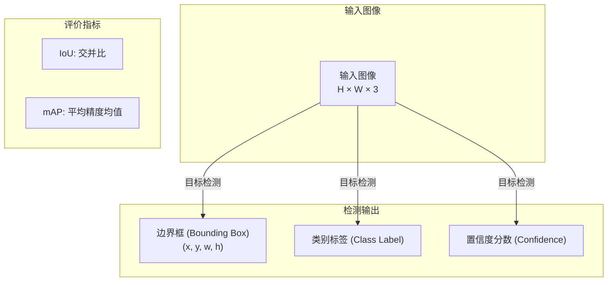

### 检测方法分类

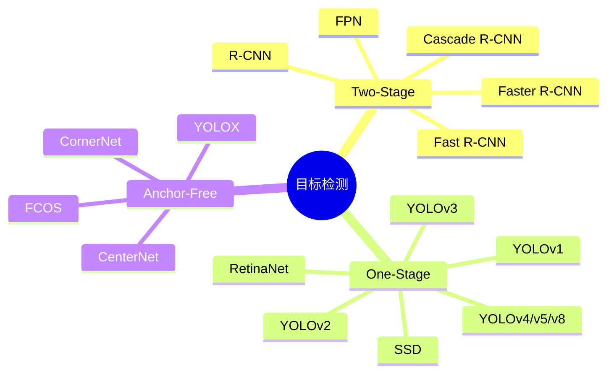

### 评价指标

#### 交并比 IoU

$$
\text{IoU} = \frac{\text{Area of Intersection}}{\text{Area of Union}} = \frac{|B_p \cap B_g|}{|B_p \cup B_g|}
$$

$$
\text{IoU} = \frac{\text{交集面积}}{\text{并集面积}}
$$

- $B_p$ — 预测边界框
- $B_g$ — 真实边界框 (Ground Truth)

#### mAP (mean Average Precision)

$$
\text{AP} = \frac{1}{11} \sum_{r \in \{0, 0.1, \ldots, 1.0\}} P(r)
$$

$$
\text{mAP} = \frac{1}{N} \sum_{i=1}^{N} \text{AP}_i
$$

其中 $P(r)$ 为在召回率 $r$ 下的精确率，$N$ 为类别数。

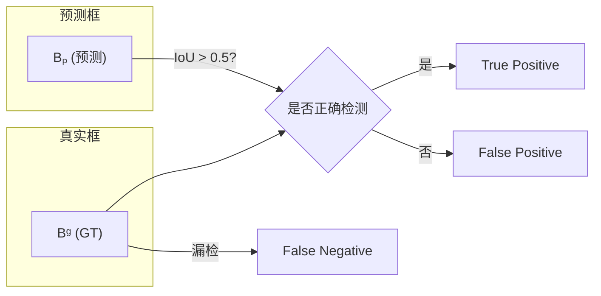

---

## Two-Stage 检测器

### R-CNN 系列演进

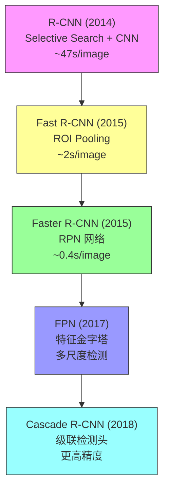

### R-CNN (Regions with CNN features)

R-CNN 是首个将深度学习应用于目标检测的方法。

**流程**：
1. Selective Search 生成 ~2000 个候选区域
2. 每个区域裁剪并缩放至固定尺寸
3. 送入 CNN 提取特征
4. SVM 分类 + 边界框回归

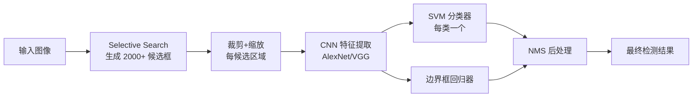

**问题**：每帧需提取 2000 次 CNN 特征，计算量巨大。

### Fast R-CNN

Fast R-CNN 共享特征提取，大幅提速：

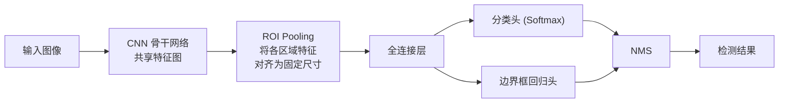

**ROI Pooling** 将不同大小的候选区域特征划分为 $H \times W$ 个 bin，每个 bin 做最大池化。

### Faster R-CNN — 引入 RPN

Faster R-CNN 用 Region Proposal Network (RPN) 替代 Selective Search，实现端到端训练。

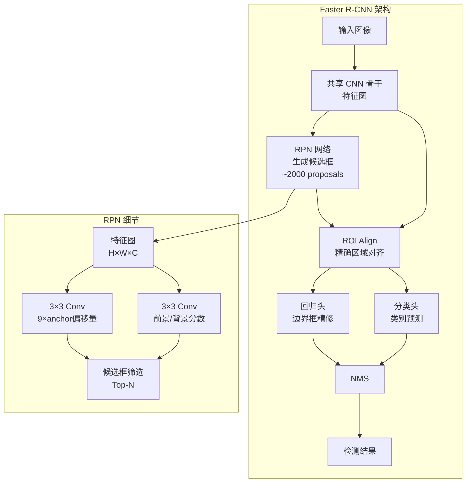

**RPN (Region Proposal Network)** 在特征图上滑动 3×3 窗口，对每个位置预测 9 个 anchor（3 尺度 × 3 长宽比）的前景概率和偏移量。

**ROI Align** 使用双线性插值精确对齐特征，解决 ROI Pooling 的量化误差：

$$
\text{ROI Align:} \quad y = \text{Interpolate}(\text{feature\_map}, \text{roi})
$$

### FPN — 特征金字塔网络

FPN (Feature Pyramid Network) 构建多尺度特征金字塔，有效检测不同尺寸目标。

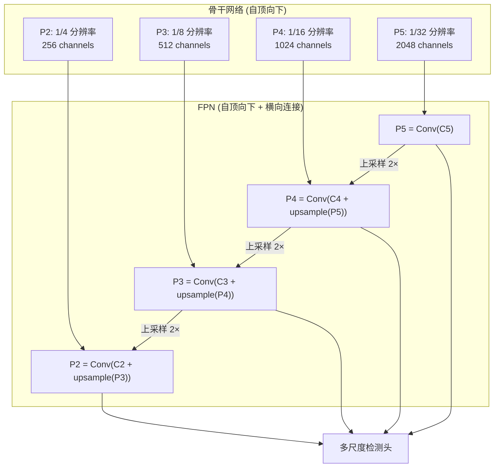

---

## One-Stage 检测器

### YOLO 系列

YOLO (You Only Look Once) 将检测视为单次前向传播的回归问题。

#### YOLO 核心思想

将输入图像划分为 $S \times S$ 网格，每个网格预测 $B$ 个边界框：

$$
\text{输出张量: } S \times S \times (B \times 5 + C)
$$

其中 $B$ 为边界框数量，$C$ 为类别数。每个边界框预测 $(x, y, w, h, \text{confidence})$。

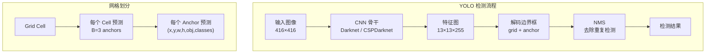

#### YOLOv3 多尺度检测

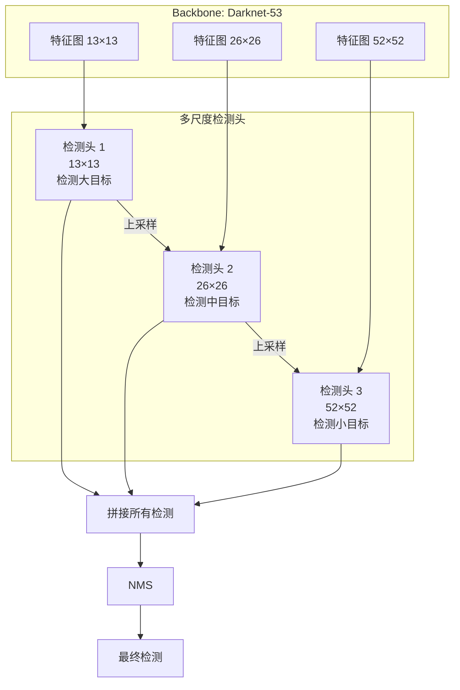

#### YOLOv5/v8 改进

| 版本 | 骨干 | 创新点 | mAP (COCO) |
|------|------|--------|-----------|
| YOLOv5 | CSPDarknet | 自适应锚框、Focus模块 | 50.7% |
| YOLOv8 | CSPDarknet + P2 | Anchor-free、解耦头、DFL | 53.9% |

### SSD (Single Shot MultiBox Detector)

SSD 在不同尺度的特征图上进行检测：

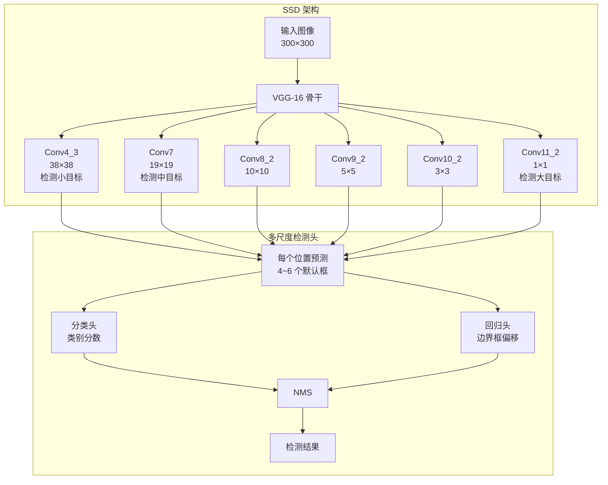

### One-Stage vs Two-Stage 对比

| 属性 | Two-Stage (Faster R-CNN) | One-Stage (YOLO/SSD) |
|------|--------------------------|----------------------|
| 检测流程 | 先生成候选框再分类 | 单次前向传播 |
| 精度 | 高 | 中 |
| 速度 | 中 (~7 FPS) | 高 (~45-155 FPS) |
| 小目标检测 | 好 | 较弱 |
| 密集目标 | 好 | 较弱 |
| 代表模型 | Faster R-CNN, Cascade R-CNN | YOLOv8, SSD, RetinaNet |

---

## Anchor-Free 检测器

### CornerNet

CornerNet 通过检测边界框的两个角点来替代 anchor：

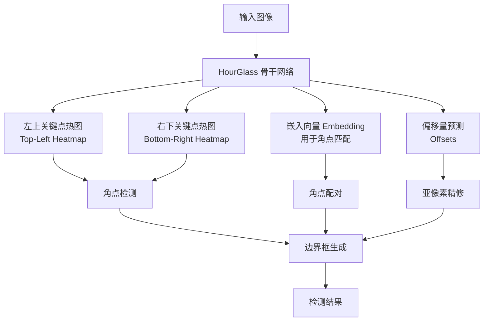

### CenterNet

CenterNet 检测目标中心点和尺寸，简化后处理：

$$
\text{输出: } \hat{Y}_{x,y} = \exp\left(-\frac{(x - c_x)^2 + (y - c_y)^2}{2\sigma^2}\right)
$$

$$
\text{边界框: } \left(c_x - \frac{w}{2}, c_y - \frac{h}{2}, c_x + \frac{w}{2}, c_y + \frac{h}{2}\right)
$$

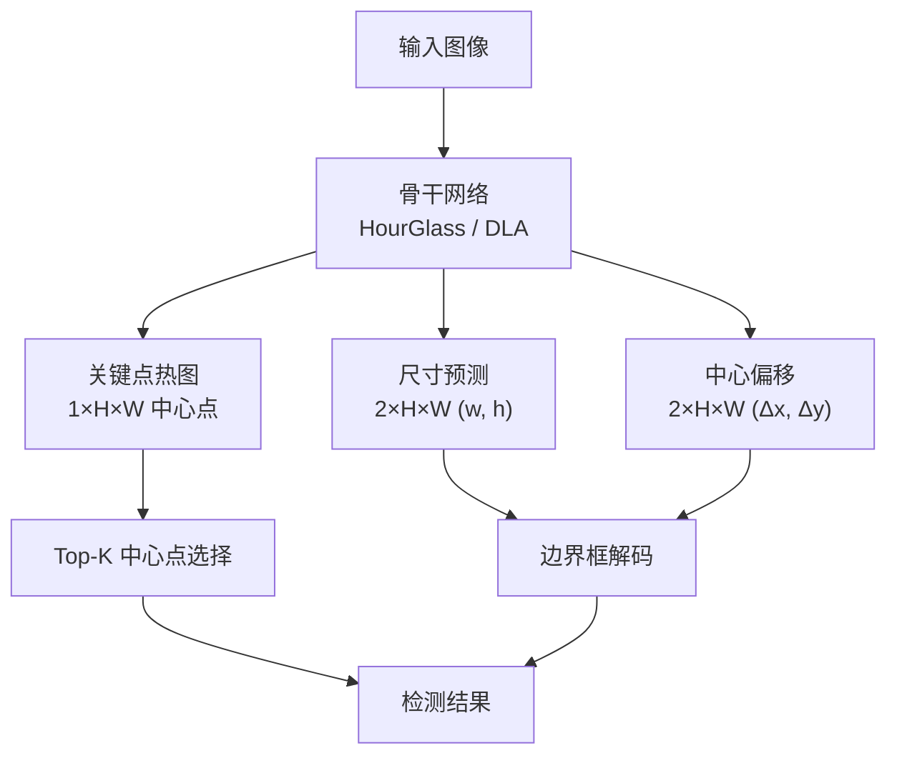

### Anchor-Free vs Anchor-Based

| 属性 | Anchor-Based | Anchor-Free |
|------|-------------|-------------|
| 先验知识 | 需要预设 anchor | 无需 anchor |
| 检测方式 | 分类 anchor | 检测关键点/中心 |
| 泛化性 | 受限于 anchor 设计 | 更灵活 |
| 后处理 | NMS | 简单配对 |
| 代表模型 | YOLO, SSD | CornerNet, CenterNet, FCOS |

---

## 实例分割：Mask R-CNN

### 架构

Mask R-CNN 在 Faster R-CNN 基础上增加分割分支，实现实例级分割。

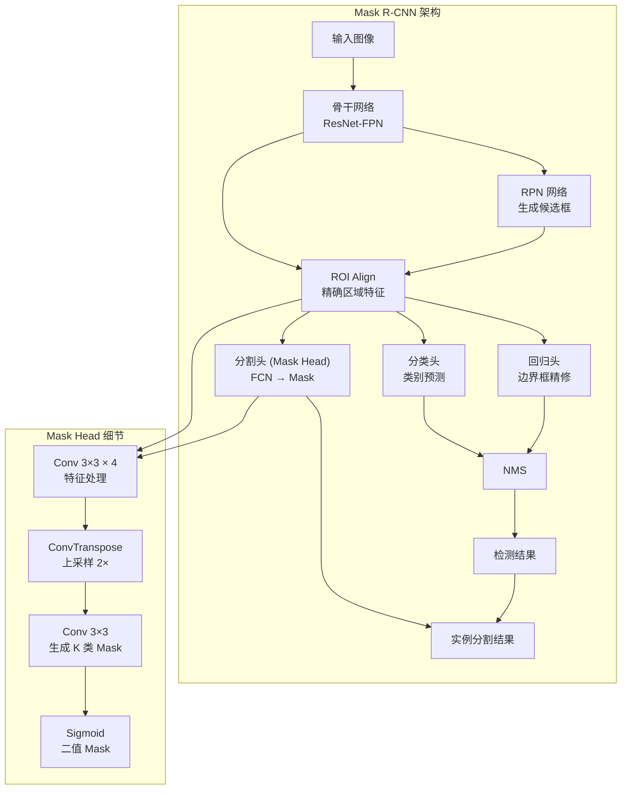

### 损失函数

Mask R-CNN 总损失：

$$
\mathcal{L} = \mathcal{L}_{\text{cls}} + \mathcal{L}_{\text{box}} + \mathcal{L}_{\text{mask}}
$$

其中：
- $\mathcal{L}_{\text{cls}}$ — 分类交叉熵损失
- $\mathcal{L}_{\text{box}}$ — 边界框回归平滑 L1 损失
- $\mathcal{L}_{\text{mask}}$ — 逐像素 sigmoid 交叉熵损失

$$
\mathcal{L}_{\text{mask}} = -\frac{1}{N} \sum_{i} \left[ y_i \log(\hat{y}_i) + (1-y_i) \log(1-\hat{y}_i) \right]
$$

### 关键创新：ROI Align

ROI Align 使用双线性插值代替 ROI Pooling 的量化操作：

| 操作 | 过程 | 误差 |
|------|------|------|
| ROI Pooling | 量化 bin 位置 | 有量化误差 |
| ROI Align | 双线性插值 | 无量化误差 |

---

## 语义分割

### 任务定义

语义分割 (Semantic Segmentation) 为图像中每个像素分配类别标签，但**不区分同类不同实例**。

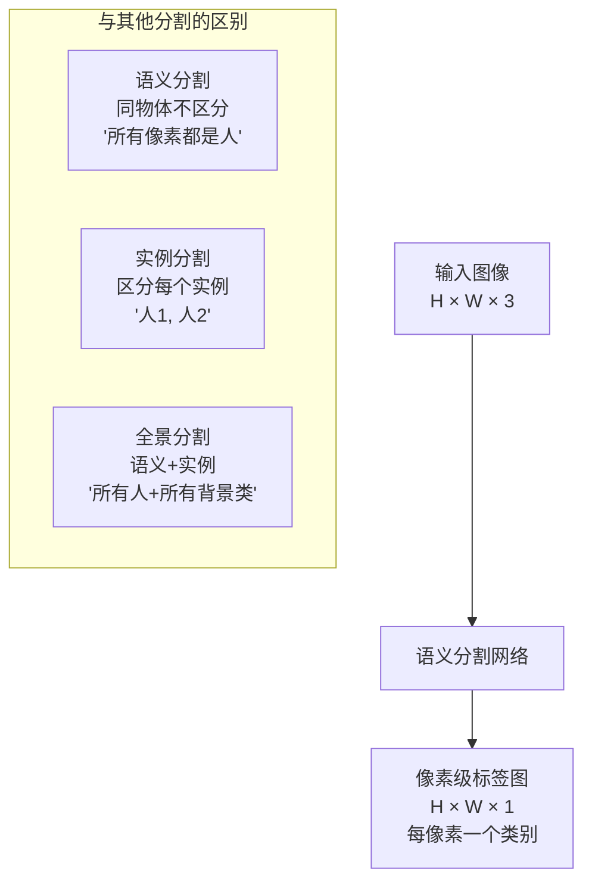

### FCN — 全卷积网络

FCN (Fully Convolutional Network) 将 CNN 中的全连接层替换为卷积层，实现像素级预测。

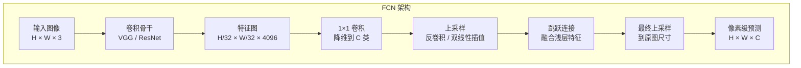

**核心思想**：将分类网络中的 FC 层替换为 1×1 卷积，保留空间分辨率。

**上采样方法**：
- 反卷积 (Transposed Convolution)：可学习的上采样
- 双线性插值：固定的上采样
- 最近邻插值：最简单的上采样

### U-Net

U-Net 是医学图像分割的经典架构，采用编码器-解码器+跳跃连接。

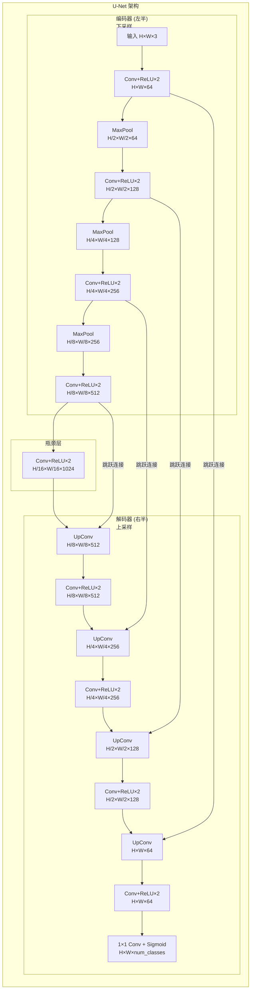

**U-Net 核心优点**：
- 对称编解码器结构
- 跳跃连接融合高低层特征
- 少量训练数据也能有效训练
- 对医学图像等小样本场景表现优异

### DeepLab 系列

DeepLab 系列引入空洞卷积 (Atrous Convolution) 和 ASPP (Atrous Spatial Pyramid Pooling)。

#### 空洞卷积

空洞卷积在不降低分辨率的情况下扩大感受野：

$$
y[i] = \sum_{k=1}^{K} x[i + r \cdot k] \cdot w[k]
$$

其中 $r$ 为膨胀率 (dilation rate)。

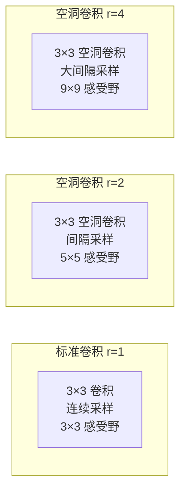

#### ASPP (Atrous Spatial Pyramid Pooling)

ASPP 使用多个膨胀率的并行空洞卷积，捕获多尺度上下文信息：

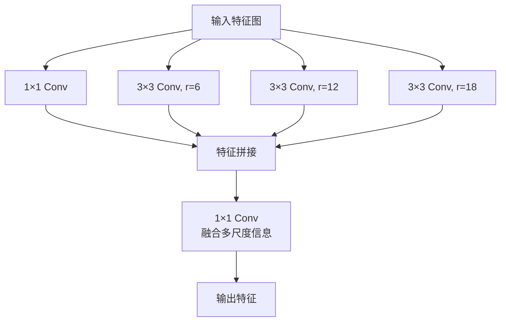

### 语义分割网络对比

| 网络 | 核心创新 | mIoU (Pascal VOC) | 特点 |
|------|---------|-------------------|------|
| FCN | 全卷积、跳跃连接 | 62.7% | 开创语义分割 |
| U-Net | 对称编解码器 | 88.1% (医学) | 小样本友好 |
| DeepLabV3+ | ASPP + 空洞卷积 | 89.0% | 多尺度上下文 |
| SegFormer | Transformer | 90.0%+ | 高效高精度 |

### 分割损失函数

#### 交叉熵损失

$$
\mathcal{L}_{\text{CE}} = -\frac{1}{N} \sum_{i} \sum_{c} y_{i,c} \log(\hat{y}_{i,c})
$$

#### Dice 损失

$$
\text{Dice Loss} = 1 - \frac{2|P \cap G| + \epsilon}{|P| + |G| + \epsilon}
$$

#### 组合损失

$$
\mathcal{L}_{\text{total}} = \lambda_1 \mathcal{L}_{\text{CE}} + \lambda_2 \mathcal{L}_{\text{Dice}}
$$

---

## 全景分割

### 全景分割概述

全景分割 (Panoptic Segmentation) 统一处理语义分割（stuff类）和实例分割（thing类）。

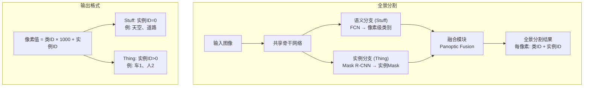

### 评价指标：PQ (Panoptic Quality)

$$
\text{PQ} = \frac{\sum_{(p,q) \in \text{matches}} \text{IoU}(p,q)}{|\text{matches}| + \sum \text{FP} + \sum \text{FN}}
$$

$$
\text{PQ} = \frac{\text{TP}}{\text{TP} + \text{FP} + \text{FN}} \times \frac{1}{|\text{类别}|} \sum \text{IoU}
$$

---

## PyTorch 实战：预训练检测/分割模型

### 使用 torchvision 预训练模型

```python
import torch
import torchvision
import torchvision.models.detection as detection
from torchvision.models.detection import (
    fasterrcnn_resnet50_fpn,
    maskrcnn_resnet50_fpn,
    retinanet_resnet50_fpn,
    ssd300_vgg16
)
from torchvision.models.segmentation import (
    fcn_resnet50,
    deeplabv3_resnet50
)
import cv2
import numpy as np
from PIL import Image
import matplotlib.pyplot as plt

COCO_CLASSES = [
    'person', 'bicycle', 'car', 'motorcycle', 'airplane', 'bus', 'train', 'truck', 'boat',
    'traffic light', 'fire hydrant', 'N/A', 'stop sign', 'parking meter', 'bench', 'bird',
    'cat', 'dog', 'horse', 'sheep', 'cow', 'elephant', 'bear', 'zebra', 'giraffe', 'N/A',
    'backpack', 'umbrella', 'N/A', 'N/A', 'handbag', 'tie', 'suitcase', 'frisbee',
    'skis', 'snowboard', 'sports ball', 'kite', 'baseball bat', 'baseball glove', 'skateboard',
    'surfboard', 'tennis racket', 'bottle', 'wine glass', 'cup', 'fork', 'knife', 'spoon',
    'bowl', 'banana', 'apple', 'sandwich', 'orange', 'broccoli', 'carrot', 'hot dog',
    'pizza', 'donut', 'cake', 'chair', 'couch', 'potted plant', 'bed', 'dining table',
    'toilet', 'tv', 'laptop', 'mouse', 'remote', 'keyboard', 'cell phone', 'microwave',
    'oven', 'toaster', 'sink', 'refrigerator', 'book', 'clock', 'vase', 'scissors',
    'teddy bear', 'hair drier', 'toothbrush'
]

PASCAL_VOC_CLASSES = [
    'background', 'aeroplane', 'bicycle', 'bird', 'boat', 'bottle', 'bus', 'car', 'cat',
    'chair', 'cow', 'diningtable', 'dog', 'horse', 'motorbike', 'person', 'pottedplant',
    'sheep', 'sofa', 'train', 'tvmonitor'
]


class PretrainedDetector:
    """
    预训练目标检测器封装
    """

    def __init__(self, model_name='fasterrcnn_resnet50_fpn', device=None):
        self.device = device or torch.device('cuda' if torch.cuda.is_available() else 'cpu')
        self.model_name = model_name
        self.model = self._load_model(model_name)
        self.model.eval()
        self.model.to(self.device)

        self.class_names = COCO_CLASSES

    def _load_model(self, model_name):
        """加载预训练模型"""
        models_map = {
            'fasterrcnn_resnet50_fpn': (
                fasterrcnn_resnet50_fpn,
                detection.FasterRCNN_ResNet50_FPN_Weights.DEFAULT
            ),
            'maskrcnn_resnet50_fpn': (
                maskrcnn_resnet50_fpn,
                detection.MaskRCNN_ResNet50_FPN_Weights.DEFAULT
            ),
            'retinanet_resnet50_fpn': (
                retinanet_resnet50_fpn,
                detection.RetinaNet_ResNet50_FPN_Weights.DEFAULT
            ),
            'ssd300_vgg16': (
                ssd300_vgg16,
                detection.SSD300_VGG16_Weights.DEFAULT
            ),
        }

        if model_name not in models_map:
            raise ValueError(f"未知模型: {model_name}。可选: {list(models_map.keys())}")

        model_fn, weights = models_map[model_name]
        model = model_fn(weights=weights)
        return model

    def detect(self, image_path, threshold=0.5):
        """
        对单张图像进行目标检测
        Args:
            image_path: 图像路径
            threshold: 置信度阈值
        Returns:
            results: 检测结果字典
            annotated_img: 标注后的图像
        """
        image = Image.open(image_path).convert('RGB')
        image_tensor = torchvision.transforms.functional.to_tensor(image).to(self.device)

        with torch.no_grad():
            outputs = self.model([image_tensor])

        output = outputs[0]
        boxes = output['boxes'].cpu().numpy()
        labels = output['labels'].cpu().numpy()
        scores = output['scores'].cpu().numpy()
        masks = output.get('masks', None)
        if masks is not None:
            masks = masks.cpu().numpy()

        keep = scores >= threshold
        boxes = boxes[keep]
        labels = labels[keep]
        scores = scores[keep]
        if masks is not None:
            masks = masks[keep]

        results = {
            'boxes': boxes,
            'labels': labels,
            'scores': scores,
            'class_names': [self.class_names[l] if l < len(self.class_names) else f'class_{l}'
                            for l in labels],
            'masks': masks
        }

        annotated_img = self._draw_detections(np.array(image), results)

        print(f"检测到 {len(boxes)} 个目标")
        for i, (label, score) in enumerate(zip(results['class_names'], scores)):
            print(f"  [{i}] {label}: {score:.3f}")

        return results, annotated_img

    def _draw_detections(self, image, results):
        """绘制检测结果"""
        img = image.copy()

        colors = plt.cm.tab20(np.linspace(0, 1, len(self.class_names)))
        np.random.seed(42)
        box_colors = {i: tuple((c[:3] * 255).astype(int)) for i, c in enumerate(colors)}

        for i, (box, label, score) in enumerate(zip(
                results['boxes'], results['labels'], results['scores'])):
            x1, y1, x2, y2 = box.astype(int)
            color = box_colors.get(label, (0, 255, 0))

            cv2.rectangle(img, (x1, y1), (x2, y2), color, 2)

            label_text = f"{self.class_names[label] if label < len(self.class_names) else '?'}: {score:.2f}"
            (tw, th), _ = cv2.getTextSize(label_text, cv2.FONT_HERSHEY_SIMPLEX, 0.5, 1)
            cv2.rectangle(img, (x1, y1 - th - 4), (x1 + tw, y1), color, -1)
            cv2.putText(img, label_text, (x1, y1 - 2),
                        cv2.FONT_HERSHEY_SIMPLEX, 0.5, (255, 255, 255), 1)

            if 'masks' in results and results['masks'] is not None:
                mask = results['masks'][i, 0]
                color_rgba = np.zeros((*mask.shape, 3), dtype=np.uint8)
                color_rgba[mask > 0.5] = color
                img = cv2.addWeighted(img, 1.0, color_rgba, 0.4, 0)

        return img

    def detect_video(self, video_path, output_path=None, threshold=0.5):
        """
        视频目标检测
        """
        cap = cv2.VideoCapture(video_path)
        if not cap.isOpened():
            raise FileNotFoundError(f"无法打开视频: {video_path}")

        width = int(cap.get(cv2.CAP_PROP_FRAME_WIDTH))
        height = int(cap.get(cv2.CAP_PROP_FRAME_HEIGHT))
        fps = cap.get(cv2.CAP_PROP_FPS)
        total_frames = int(cap.get(cv2.CAP_PROP_FRAME_COUNT))

        writer = None
        if output_path:
            fourcc = cv2.VideoWriter_fourcc(*'mp4v')
            writer = cv2.VideoWriter(output_path, fourcc, fps, (width, height))

        frame_count = 0
        while True:
            ret, frame = cap.read()
            if not ret:
                break

            frame_count += 1
            pil_image = Image.fromarray(cv2.cvtColor(frame, cv2.COLOR_BGR2RGB))
            image_tensor = torchvision.transforms.functional.to_tensor(pil_image).to(self.device)

            with torch.no_grad():
                outputs = self.model([image_tensor])

            output = outputs[0]
            boxes = output['boxes'].cpu().numpy()
            labels = output['labels'].cpu().numpy()
            scores = output['scores'].cpu().numpy()

            keep = scores >= threshold
            boxes = boxes[keep]
            labels = labels[keep]
            scores = scores[keep]

            for box, label, score in zip(boxes, labels, scores):
                x1, y1, x2, y2 = box.astype(int)
                class_name = self.class_names[label] if label < len(self.class_names) else '?'
                cv2.rectangle(frame, (x1, y1), (x2, y2), (0, 255, 0), 2)
                cv2.putText(frame, f"{class_name}: {score:.2f}",
                            (x1, y1 - 10), cv2.FONT_HERSHEY_SIMPLEX, 0.5, (0, 255, 0), 2)

            cv2.putText(frame, f"Frame: {frame_count}/{total_frames}",
                        (10, 30), cv2.FONT_HERSHEY_SIMPLEX, 0.7, (0, 0, 255), 2)

            if writer:
                writer.write(frame)

            if frame_count % 30 == 0:
                print(f"处理帧 {frame_count}/{total_frames}")

        cap.release()
        if writer:
            writer.release()
        print(f"视频检测完成: {frame_count} 帧")


class PretrainedSegmentor:
    """
    预训练语义分割模型封装
    """

    def __init__(self, model_name='deeplabv3_resnet50', device=None):
        self.device = device or torch.device('cuda' if torch.cuda.is_available() else 'cpu')
        self.model_name = model_name
        self.model = self._load_model(model_name)
        self.model.eval()
        self.model.to(self.device)
        self.class_names = PASCAL_VOC_CLASSES
        self.colors = self._create_color_map()

    def _load_model(self, model_name):
        models_map = {
            'fcn_resnet50': (
                fcn_resnet50,
                torchvision.models.segmentation.FCN_ResNet50_Weights.DEFAULT
            ),
            'deeplabv3_resnet50': (
                deeplabv3_resnet50,
                torchvision.models.segmentation.DeepLabV3_ResNet50_Weights.DEFAULT
            ),
        }
        model_fn, weights = models_map[model_name]
        return model_fn(weights=weights)

    def _create_color_map(self):
        """创建颜色映射"""
        np.random.seed(42)
        colors = np.zeros((256, 3), dtype=np.uint8)
        for i in range(256):
            colors[i] = [np.random.randint(0, 255) for _ in range(3)]
        colors[0] = [0, 0, 0]
        return colors

    def segment(self, image_path):
        """
        语义分割
        Args:
            image_path: 图像路径
        Returns:
            seg_map: 分割标签图
            colored_map: 彩色分割结果
            overlay: 叠加在原图上的结果
        """
        image = Image.open(image_path).convert('RGB')
        input_tensor = torchvision.transforms.functional.to_tensor(image)
        input_tensor = torchvision.transforms.functional.normalize(
            input_tensor,
            mean=[0.485, 0.456, 0.406],
            std=[0.229, 0.224, 0.225]
        ).unsqueeze(0).to(self.device)

        with torch.no_grad():
            output = self.model(input_tensor)

        if isinstance(output, dict):
            output = output['out']

        seg_map = output.squeeze(0).argmax(dim=0).cpu().numpy()

        colored_map = self.colors[seg_map]

        original = np.array(image)
        overlay = cv2.addWeighted(original, 0.6, colored_map, 0.4, 0)

        unique_classes = np.unique(seg_map)
        print(f"检测到 {len(unique_classes)} 个类别")
        for cls_id in unique_classes:
            cls_name = self.class_names[cls_id] if cls_id < len(self.class_names) else f'class_{cls_id}'
            pixel_count = np.sum(seg_map == cls_id)
            percentage = pixel_count / seg_map.size * 100
            print(f"  {cls_name}: {percentage:.1f}%")

        return seg_map, colored_map, overlay


def compare_detectors(image_path, model_names=None):
    """
    对比不同检测器的性能
    """
    if model_names is None:
        model_names = [
            'fasterrcnn_resnet50_fpn',
            'maskrcnn_resnet50_fpn',
            'retinanet_resnet50_fpn',
        ]

    results = {}
    for name in model_names:
        print(f"\n{'='*50}")
        print(f"测试模型: {name}")
        print('='*50)

        detector = PretrainedDetector(model_name=name)

        import time
        start = time.time()
        detections, annotated = detector.detect(image_path, threshold=0.5)
        elapsed = time.time() - start

        num_detections = len(detections['boxes'])
        results[name] = {
            'time': elapsed,
            'detections': num_detections,
            'annotated': annotated
        }

        print(f"耗时: {elapsed:.3f}s, 检测数: {num_detections}")

    return results


def detect_custom_classes(image_path, model_path, num_classes, class_names, threshold=0.5):
    """
    使用自定义训练的检测模型
    """
    model = fasterrcnn_resnet50_fpn(num_classes=num_classes)

    checkpoint = torch.load(model_path, map_location='cpu')
    if 'model_state_dict' in checkpoint:
        model.load_state_dict(checkpoint['model_state_dict'])
    else:
        model.load_state_dict(checkpoint)

    device = torch.device('cuda' if torch.cuda.is_available() else 'cpu')
    model.eval()
    model.to(device)

    image = Image.open(image_path).convert('RGB')
    image_tensor = torchvision.transforms.functional.to_tensor(image).to(device)

    with torch.no_grad():
        outputs = model([image_tensor])

    output = outputs[0]
    keep = output['scores'] >= threshold

    results = {
        'boxes': output['boxes'][keep].cpu().numpy(),
        'labels': output['labels'][keep].cpu().numpy(),
        'scores': output['scores'][keep].cpu().numpy(),
    }

    img_array = np.array(image)
    for box, label, score in zip(results['boxes'], results['labels'], results['scores']):
        x1, y1, x2, y2 = box.astype(int)
        class_name = class_names[label] if label < len(class_names) else '?'
        cv2.rectangle(img_array, (x1, y1), (x2, y2), (0, 255, 0), 2)
        cv2.putText(img_array, f"{class_name}: {score:.2f}",
                    (x1, y1 - 10), cv2.FONT_HERSHEY_SIMPLEX, 0.5, (0, 255, 0), 2)

    return img_array, results
```

### 使用示例

```python
if __name__ == '__main__':
    print("=" * 60)
    print("示例 1: Faster R-CNN 目标检测")
    print("=" * 60)

    detector = PretrainedDetector('fasterrcnn_resnet50_fpn')
    results, annotated = detector.detect('test_image.jpg', threshold=0.5)

    cv2.imwrite('detection_result.jpg',
                cv2.cvtColor(annotated, cv2.COLOR_RGB2BGR))

    print("\n" + "=" * 60)
    print("示例 2: Mask R-CNN 实例分割")
    print("=" * 60)

    mask_detector = PretrainedDetector('maskrcnn_resnet50_fpn')
    results, annotated = mask_detector.detect('test_image.jpg', threshold=0.5)

    cv2.imwrite('mask_result.jpg',
                cv2.cvtColor(annotated, cv2.COLOR_RGB2BGR))

    print("\n" + "=" * 60)
    print("示例 3: DeepLabV3 语义分割")
    print("=" * 60)

    segmentor = PretrainedSegmentor('deeplabv3_resnet50')
    seg_map, colored_map, overlay = segmentor.segment('test_image.jpg')

    cv2.imwrite('seg_result.jpg',
                cv2.cvtColor(overlay, cv2.COLOR_RGB2BGR))

    print("\n" + "=" * 60)
    print("示例 4: 视频检测")
    print("=" * 60)

    detector.detect_video('test_video.mp4', 'output_video.mp4', threshold=0.5)

    print("\n所有示例完成!")
```

---

## 本节小结

### 检测网络对比

| 方法 | 类型 | 速度 | 精度 | 核心创新 |
|------|------|------|------|---------|
| R-CNN | Two-Stage | 极慢 | 中 | 首个 CNN 检测 |
| Fast R-CNN | Two-Stage | 快 | 中 | ROI Pooling |
| Faster R-CNN | Two-Stage | 较快 | 高 | RPN 网络 |
| FPN | 架构 | 中 | 高 | 特征金字塔 |
| YOLOv8 | One-Stage | 极快 | 高 | Anchor-free + DFL |
| SSD | One-Stage | 极快 | 中 | 多尺度检测 |
| CornerNet | Anchor-Free | 中 | 中 | 角点检测 |
| CenterNet | Anchor-Free | 快 | 中 | 中心点检测 |

### 分割网络对比

| 方法 | 类型 | 核心创新 | mIoU |
|------|------|---------|------|
| FCN | 语义分割 | 全卷积 | 62.7% |
| U-Net | 语义分割 | 编解码器+跳跃连接 | 88.1% |
| DeepLabV3+ | 语义分割 | ASPP+空洞卷积 | 89.0% |
| Mask R-CNN | 实例分割 | 检测+分割并行 | 37.3% (AP) |
| Panoptic FPN | 全景分割 | 双分支融合 | 41.2% (PQ) |

### 核心公式

| 公式 | 表达式 | 含义 |
|------|--------|------|
| IoU | $\text{IoU} = |B_p \cap B_g| / |B_p \cup B_g|$ | 检测精度 |
| mAP | $\text{mAP} = \frac{1}{N}\sum \text{AP}_i$ | 平均精度均值 |
| 交叉熵 | $\mathcal{L} = -\sum y_i \log(\hat{y}_i)$ | 分类损失 |
| Smooth L1 | $\mathcal{L}_{\text{box}} = \text{SmoothL1}(\hat{b}, b)$ | 回归损失 |
| Dice Loss | $1 - 2|P \cap G| / (|P|+|G|)$ | 分割损失 |
| 空洞卷积 | $y[i] = \sum x[i+r\cdot k] \cdot w[k]$ | 扩大感受野 |
| Anchor-Free | 检测中心点+尺寸 | 无需预设锚框 |

### 课后练习

1. 使用 Faster R-CNN 和 YOLOv5 分别对同一幅图像进行检测，对比检测结果和速度差异
2. 使用 Mask R-CNN 对 COCO 数据集的图像进行实例分割，可视化分割效果
3. 使用 DeepLabV3+ 对 Pascal VOC 数据集进行语义分割，计算 mIoU 指标
4. 实现简单的 U-Net 网络，在医学影像数据集（如 ISBI）上进行训练和测试
5. 对比 Faster R-CNN、RetinaNet、SSD 在不同 IoU 阈值下的 Precision-Recall 曲线
6. 进阶：使用 PyTorch 实现一个简化版的 YOLO 检测器，在自定义数据集上训练
7. 进阶：实现全景分割管线，对图像进行全景分割并计算 PQ 指标