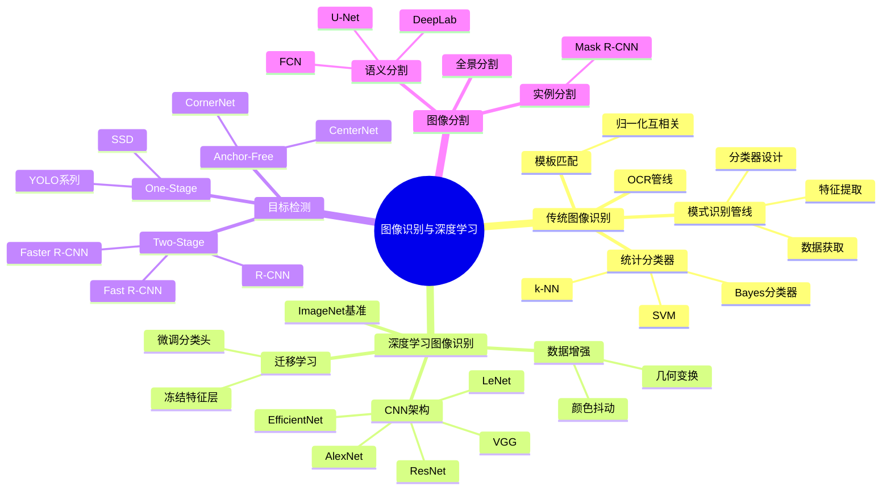

# 第10章 图像识别与深度学习图像处理 — 思维导图与导航

## 📑 章节导航

| 节次 | 主题 | 核心知识点 |
|------|------|-----------|
| [10.1 传统图像识别](#101-传统图像识别) | 经典模式识别方法 | 模板匹配、Bayes分类器、k-NN、SVM+HOG/SIFT、OCR管线 |
| [10.2 深度学习图像识别](#102-深度学习图像识别) | 基于CNN的图像分类 | CNN架构回顾、迁移学习(VGG/ResNet/EfficientNet)、微调策略、数据增强 |
| [10.3 目标检测与图像分割网络](#103-目标检测与图像分割网络) | 检测与分割网络演进 | R-CNN系列、YOLO/SSD、Anchor-free、Mask R-CNN、U-Net/DeepLab |

## 🗺️ 学习路线图

## 🎯 核心考点

### 高频考点

1. **模式识别管线** — 数据→特征→分类器的完整流程，各环节的作用与常见方法
2. **Bayes分类器** — 基于后验概率的决策规则，朴素假设与高斯假设
3. **SVM核技巧** — 线性可分/非线性可分，HOG+SVM行人检测的经典组合
4. **CNN核心组件** — 卷积层、池化层、ReLU激活、BatchNorm、Dropout的作用
5. **迁移学习策略** — 特征提取 vs 微调，冻结层的选择依据
6. **目标检测演进** — R-CNN→Fast R-CNN→Faster R-CNN→YOLO→SSD的架构差异
7. **U-Net架构** — 编码器-解码器+跳跃连接，医学图像分割的经典
8. **评价指标** — mAP (检测)、IoU/Dice (分割)、Top-K Accuracy (分类)

### 公式速查

| 公式 | 表达式 | 含义 |
|------|--------|------|
| Bayes决策 | $P(\omega_i \mid \mathbf{x}) = \frac{p(\mathbf{x} \mid \omega_i) P(\omega_i)}{p(\mathbf{x})}$ | 后验概率计算 |
| Bayes判别函数 | $g_i(\mathbf{x}) = \ln p(\mathbf{x} \mid \omega_i) + \ln P(\omega_i)$ | 对数判别式 |
| SVM决策函数 | $f(\mathbf{x}) = \text{sign}(\sum \alpha_i y_i K(\mathbf{x}_i, \mathbf{x}) + b)$ | 核SVM分类 |
| k-NN | $\hat{y} = \text{majority\_vote}(k \text{ nearest neighbors})$ | 最近邻投票 |
| 归一化互相关 | $R(x,y) = \sum \sum I(u,v) \cdot T(u-x, v-y)$ | 模板匹配相似度 |
| 卷积输出 | $y_j^l = f\left(\sum_{i \in M_j} x_i^{l-1} * k_{ij}^l + b_j^l\right)$ | CNN卷积层 |
| BatchNorm | $\hat{x} = \frac{x - \mu_B}{\sqrt{\sigma_B^2 + \epsilon}}$, $y = \gamma \hat{x} + \beta$ | 批归一化 |
| 交并比 IoU | $\text{IoU} = \frac{\text{Area of Intersection}}{\text{Area of Union}}$ | 检测/分割评价 |
| Dice系数 | $\text{Dice} = \frac{2|P \cap G|}{|P| + |G|}$ | 分割评价 |
| mAP | $\text{mAP} = \frac{1}{N} \sum_{i=1}^{N} \text{AP}_i$ | 平均精度均值 |

## 📝 自测题

### 基础题

1. 描述传统模式识别的完整管线，说明每个阶段的输入输出和典型方法。
2. 设两类问题的先验概率 $P(\omega_1) = 0.6$，$P(\omega_2) = 0.4$，条件概率密度为高斯分布，写出 Bayes 判别函数的具体形式。
3. k-NN 分类器中 k 值的选择对分类性能有何影响？如何确定最优 k？
4. 什么是迁移学习？在什么情况下使用迁移学习比从头训练更有效？

### 应用题

5. 使用 OpenCV 实现模板匹配，对一幅工业检测图像进行缺陷定位，绘制匹配结果矩形框。
6. 使用 PyTorch 加载预训练的 ResNet-50，对自定义数据集（如花卉分类）进行微调，绘制训练曲线。
7. 对比 Faster R-CNN 和 YOLOv5 在检测速度和精度上的差异，分析各自的适用场景。
8. 使用 PyTorch 实现 U-Net 对医学影像进行分割，计算 Dice 系数和 IoU。

### 考研真题

9. （2024 考研408）描述 Bayes 分类器的基本原理。对两类问题，若先验概率相等且类条件概率为高斯分布，证明 Bayes 判别函数为线性判别函数。
10. （2023 考研408）解释 CNN 中卷积层和池化层的作用，为什么 CNN 比传统全连接网络更适合图像处理？
11. （2022 考研408）比较 R-CNN、Fast R-CNN 和 Faster R-CNN 的架构差异，说明 Faster R-CNN 中 RPN (Region Proposal Network) 的作用。
12. （2021 考研408）描述 U-Net 的编码器-解码器架构及跳跃连接的作用，为什么 U-Net 在医学图像分割中表现优异？
13. （2020 考研408）什么是数据增强？列举图像分类任务中常用的三种数据增强方法及其对模型泛化能力的影响。

## 🔗 相关章节

- **前置**: [[第8章 图像特征提取]] — HOG/SIFT/LBP 等特征用于传统分类
- **前置**: [[第6章 图像分割技术]] — 阈值/边缘/区域分割是分割网络的基础
- **前置**: [[第4章 频域变换傅里叶变换与频域滤波]] — 频域特征在识别中的应用
- **后续**: [[第11章 图像理解与场景分析]] — 从识别到理解的跨越
- **拓展**: [[第12章 生成式模型与图像合成]] — GAN/扩散模型