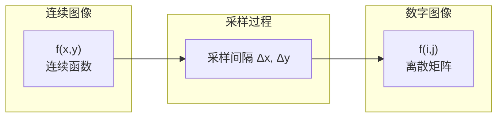
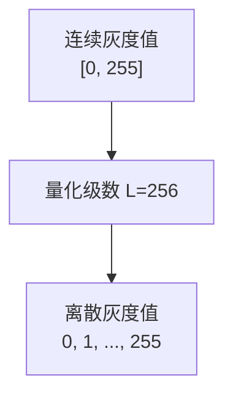

# 1.1 图像数字化：采样与量化

## 一、概述

图像数字化是将连续的模拟图像转换为计算机可处理的数字图像的过程。它包含两个关键步骤：**采样（Sampling）**和**量化（Quantization）**。

## 二、采样（Sampling）

### 2.1 定义

采样是将连续的空间坐标 $(x, y)$ 转换为离散坐标 $(i, j)$ 的过程。



### 2.2 采样参数

| 参数 | 符号 | 说明 | 单位 |
|------|------|------|------|
| 采样间隔 | $\Delta x, \Delta y$ | 相邻采样点的距离 | 像素/英寸 (ppi) |
| 采样率 | $R_x, R_y$ | 单位长度的采样点数 | 像素/英寸 (ppi) |
| 图像尺寸 | $M \times N$ | 采样后的图像宽高 | 像素 |

**采样率计算公式**：

$$R_x = \frac{1}{\Delta x}, \quad R_y = \frac{1}{\Delta y}$$

### 2.3 采样对图像的影响

| 采样率 | 效果 | 应用场景 |
|--------|------|---------|
| 低采样率 | 图像模糊、锯齿效应 | 缩略图 |
| 中等采样率 | 正常显示 | 屏幕显示 |
| 高采样率 | 清晰细节 | 印刷、医学影像 |

### 2.4 混叠效应（Aliasing）

当采样率低于信号最高频率的2倍时，会产生混叠效应。

**奈奎斯特采样定理**：

$$f_s \geq 2 \cdot f_{max}$$

其中 $f_s$ 为采样率，$f_{max}$ 为信号最高频率。

```python
import numpy as np
import cv2
import matplotlib.pyplot as plt

# 演示不同采样率的影响
img = cv2.imread('test_image.jpg', cv2.IMREAD_GRAYSCALE)
# 若没有测试图像，创建一个合成图像
if img is None:
    img = np.zeros((256, 256), dtype=np.uint8)
    for i in range(256):
        for j in range(256):
            img[i, j] = int(128 + 127 * np.sin(2 * np.pi * i / 32) * np.cos(2 * np.pi * j / 32))

# 不同采样率（通过缩小图像模拟）
resized_2x = cv2.resize(img, None, fx=0.5, fy=0.5, interpolation=cv2.INTER_AREA)
resized_4x = cv2.resize(img, None, fx=0.25, fy=0.25, interpolation=cv2.INTER_AREA)

print(f"原图尺寸: {img.shape}")
print(f"1/2采样: {resized_2x.shape}")
print(f"1/4采样: {resized_4x.shape}")
```

## 三、量化（Quantization）

### 3.1 定义

量化是将连续的灰度值范围 $[f_{min}, f_{max}]$ 映射为有限个离散灰度级的过程。



### 3.2 量化参数

| 参数 | 符号 | 说明 | 公式 |
|------|------|------|------|
| 灰度级数量 | $L$ | 离散灰度值的个数 | $L = 2^k$ |
| 量化位数 | $k$ | 表示每个像素所需的比特数 | $k = \log_2 L$ |
| 量化间隔 | $\Delta f$ | 相邻灰度级的差值 | $\Delta f = \frac{f_{max} - f_{min}}{L - 1}$ |

### 3.3 量化方式

#### 标量量化（Scalar Quantization）

$$f_q = \text{round}\left(\frac{f - f_{min}}{\Delta f}\right) \cdot \Delta f + f_{min}$$

```python
import numpy as np

def scalar_quantize(image, num_levels):
    """标量量化"""
    f_min, f_max = image.min(), image.max()
    delta_f = (f_max - f_min) / (num_levels - 1)
    quantized = np.round((image - f_min) / delta_f) * delta_f + f_min
    return quantized.astype(np.uint8)

# 不同量化级数的影响
img = np.random.randint(0, 256, (128, 128), dtype=np.uint8)

levels_list = [2, 4, 8, 16, 256]  # 对应1,2,3,4,8位
for levels in levels_list:
    k = int(np.log2(levels))
    quantized = scalar_quantize(img, levels)
    print(f"{k}位量化({levels}级): 存储需求 {k} 比特/像素")
```

### 3.4 量化对图像的影响

| 量化位数 | 灰度级数 | 效果 | 存储需求 |
|---------|---------|------|---------|
| 1位 | 2级 | 二值图像，黑白 | 1 bit/像素 |
| 4位 | 16级 | 灰度不足 | 4 bit/像素 |
| 8位 | 256级 | 标准灰度图 | 8 bit/像素 |
| 16位 | 65536级 | 高精度 | 16 bit/像素 |

### 3.5 伪轮廓效应（False Contouring）

当量化位数过少时，灰度变化处会出现不自然的等值线。

## 四、数字图像存储

### 4.1 存储空间计算

$$S = M \times N \times k \text{ bits}$$

$$S_{bytes} = \frac{M \times N \times k}{8} \text{ bytes}$$

**示例**：一幅640×480的8位灰度图像：

$$S = 640 \times 480 \times 8 = 2,457,600 \text{ bits} = 307,200 \text{ bytes} \approx 300 \text{ KB}$$

### 4.2 不同图像类型的存储

| 图像类型 | 尺寸 | 每像素位数 | 存储空间 |
|---------|------|-----------|---------|
| 二值图 | 640×480 | 1 bit | 38,400 B |
| 灰度图 | 640×480 | 8 bit | 307,200 B |
| RGB彩色 | 640×480 | 24 bit | 921,600 B |
| 16位灰度 | 640×480 | 16 bit | 614,400 B |

## 五、OpenCV实现

```python
import cv2
import numpy as np

# 图像数字化完整流程演示
def digitalize_image(image_path, scale_factor=0.5, quant_bits=4):
    """
    图像数字化：采样 + 量化
    
    参数:
        image_path: 输入图像路径
        scale_factor: 采样缩放因子
        quant_bits: 量化位数
    """
    # 1. 读取原始图像
    img = cv2.imread(image_path, cv2.IMREAD_GRAYSCALE)
    
    if img is None:
        # 创建合成测试图像
        img = np.zeros((256, 256), dtype=np.uint8)
        x = np.linspace(0, 10, 256)
        y = np.linspace(0, 10, 256)
        X, Y = np.meshgrid(x, y)
        img = np.uint8(128 + 127 * np.sin(X) * np.cos(Y))
    
    original_size = img.shape
    print(f"原始图像尺寸: {original_size}")
    
    # 2. 采样（降采样）
    sampled = cv2.resize(img, None, fx=scale_factor, fy=scale_factor, 
                         interpolation=cv2.INTER_AREA)
    print(f"采样后尺寸: {sampled.shape}")
    
    # 3. 量化
    num_levels = 2 ** quant_bits
    f_min, f_max = sampled.min(), sampled.max()
    delta_f = (f_max - f_min) / (num_levels - 1)
    quantized = np.round((sampled - f_min) / delta_f) * delta_f + f_min
    quantized = quantized.astype(np.uint8)
    print(f"量化级数: {num_levels}")
    print(f"量化后灰度范围: [{quantized.min()}, {quantized.max()}]")
    
    return img, sampled, quantized

# 使用示例
original, sampled, quantized = digitalize_image('test.jpg', 0.25, 4)
```

## 六、考研/考点总结

| 考点 | 要点 |
|------|------|
| 采样定理 | 奈奎斯特频率 = 2×最高频率 |
| 量化公式 | $\Delta f = (f_{max} - f_{min}) / (L-1)$ |
| 存储计算 | $S = M \times N \times k / 8$ bytes |
| 伪轮廓 | 量化级数不足导致 |
| 插值方法 | 最近邻、双线性、双三次 |

---

**导航**：上一节 [[MOC - 第1章\|返回章节导航]] · 下一节 [[1.2 图像表示矩阵与像素]]