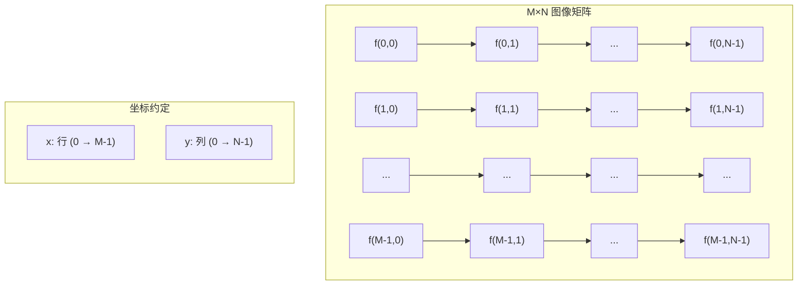
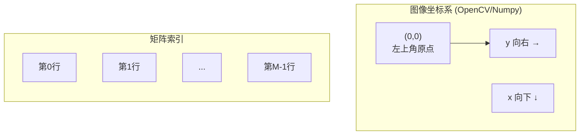
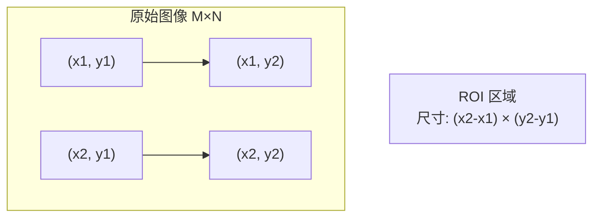
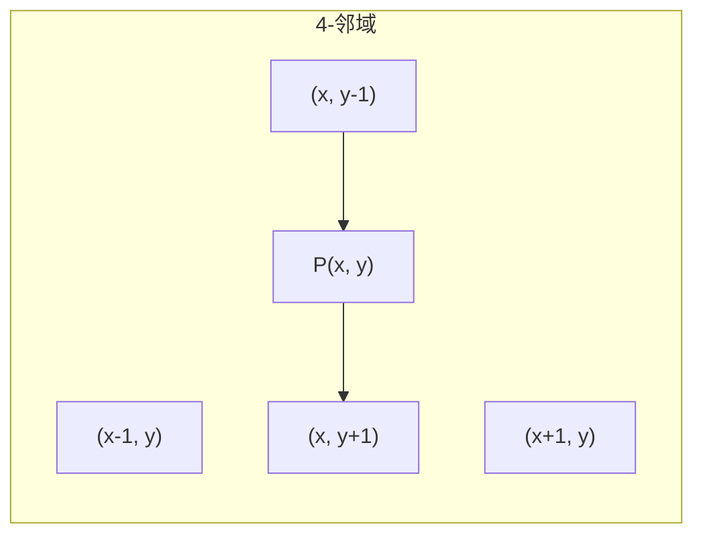
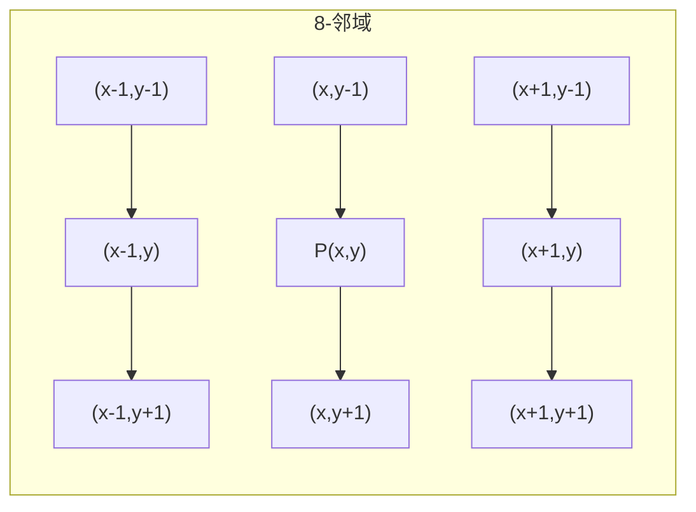
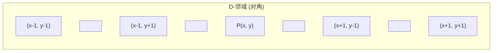
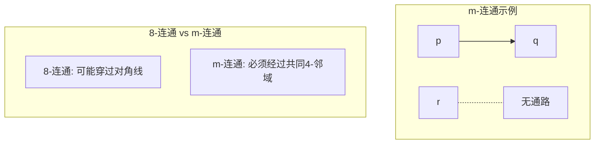
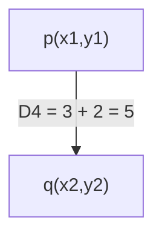
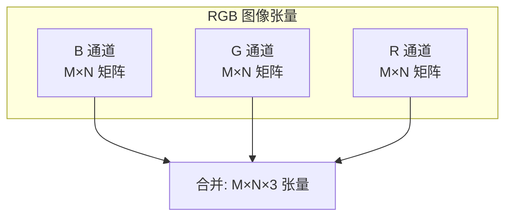

# 1.2 图像表示：矩阵与像素

## 一、概述

经过采样与量化后，连续的模拟图像被转换为离散的数字图像。数字图像在数学上可以表示为一个**二维矩阵**，矩阵中的每个元素对应图像上的一个**像素**（Pixel）。理解图像的矩阵表示和像素邻域关系，是后续学习图像滤波、形态学操作和边缘检测等内容的基础。

## 二、图像的矩阵表示

### 2.1 数字图像的数学定义

一幅数字图像可以表示为一个二维离散函数：

$$f(x, y) = \begin{bmatrix} f(0,0) & f(0,1) & \cdots & f(0, N-1) \\ f(1,0) & f(1,1) & \cdots & f(1, N-1) \\ \vdots & \vdots & \ddots & \vdots \\ f(M-1,0) & f(M-1,1) & \cdots & f(M-1, N-1) \end{bmatrix}$$

其中：
- $M$：图像的**行数**（Height，垂直方向像素数）
- $N$：图像的**列数**（Width，水平方向像素数）
- $f(x, y)$：位于坐标 $(x, y)$ 处的像素灰度值

### 2.2 图像的维度



> **注意**：在 OpenCV 中，图像以 `numpy.ndarray` 形式存储，维度为 `(M, N)` 或 `(M, N, C)`，访问方式为 `image[row, col]`，即 flexibility 。

###iw: 流动与 5节：

## 3.2 码,图像编码方法: 0
- 注意：**0.1 123

## Q:
## 1.1 16
## 关于作者信息
## 回放:
##定义 标题: Civilization 和响应, 定义和 1
##

##Nr

### 2.3 坐标系统约定

数字图像处理通常采用**左上角为原点**的坐标系：

- 坐标原点 $(0, 0)$ 位于图像的**左上角**
- $x$ 轴向下增长（行坐标）
- $y$ 轴向右增长（列坐标）



### 2.4 图像类型与数据类型

| 图像类型 | 维度 | 数据类型 | 值域 | 存储格式 |
|---------|------|---------|------|---------|
| 二值图像 | $M \times N$ | `uint8` | $\{0, 255\}$ | 1 bit/pixel |
| 灰度图像 | $M \times N$ | `uint8` | $[0, 255]$ | 8 bit/pixel |
| 16位灰度 | $M \times N$ | `uint16` | $[0, 65535]$ | 16 bit/pixel |
| RGB彩色 | $M \times N \times 3$ | `uint8` | $[0, 255]$ | 24 bit/pixel |

## 三、像素操作

### 3.1 像素的读取与写入

#### 读取单个像素

```python
import cv2
import numpy as np

img = cv2.imread('test_image.jpg', cv2.IMREAD_GRAYSCALE)

pixel_value = img[100, 200]
print(f"坐标(100,200)处的像素值: {pixel_value}")
```

#### 写入单个像素

```python
img[100, 200] = 128
print(f"修改后坐标(100,200)处的像素值: {img[100, 200]}")
```

#### 使用 `.item()` 和 `.setitem()` 方法

```python
pixel = img.item(100, 200)
img.itemset((100, 200), 200)
```

### 3.2 ROI（感兴趣区域）提取

ROI（Region of Interest）是图像中的一个矩形子区域。



```python
import cv2
import numpy as np

img = cv2.imread('test_image.jpg')

roi = img[100:300, 200:500]
print(f"ROI 尺寸: {roi.shape}")

cv2.imwrite('roi_output.jpg', roi)
```

#### ROI 操作示例

```python
import cv2
import numpy as np

img = cv2.imread('test_image.jpg')

roi = img[50:150, 100:250]

img[0:100, 0:150] = roi

cv2.imwrite('roi_result.jpg', img)
```

### 3.3 通道分离与合并

```python
import cv2
import numpy as np

img = cv2.imread('test_image.jpg')

b, g, r = cv2.split(img)

img_merged = cv2.merge([b, g, r])

b_channel = img[:, :, 0]
g_channel = img[:, :, 1]
r_channel = img[:, :, 2]

cv2.imwrite('blue_channel.jpg', b_channel)
```

#### OpenCV 中 BGR 成员的原因

几何255!.
```
## 表格示例：

## I
```
(definition of 1.5
```
)
<function>Create的1.3 数据集
##
##
##
##

## 四、邻域定义

### 4.1 邻域的基本概念

对于图像中的任意像素 $P(x, y)$，其邻域是指与它空间位置相邻的像素集合。

#### 4-邻域（4-Neighbors）

像素 $P$ 的4-邻域由其上下左右四个像素组成：

$$N_4(P) = \{(x+1, y), (x-1, y), (x, y+1), (x, y-1)\}$$



#### 8-邻域（8-Neighbors）

像素 $P$ 的8-邻域由其周围8个像素组成：

$$N_8(P) = N_4(P) \cup \{(x+1, y+1), (x+1, y-1), (x-1, y+1), (x-1, y-1)\}$$



#### D-邻域（D-Neighbors）

像素 $P$ 的D-邻域是其对角方向的4个像素：

$$N_D(P) = \{(x+1, y+1), (x+1, y-1), (x-1, y+1), (x-1, y-1)\}$$



### 4.2 邻域操作示例

```python
import cv2
import numpy as np

def get_4_neighbors(image, x, y):
    """获取4-邻域像素值"""
    neighbors = []
    M, N = image.shape[:2]
    
    if x > 0:
        neighbors.append(('up', image[x-1, y]))
    if x < M-1:
        neighbors.append(('down', image[x+1, y]))
    if y > 0:
        neighbors.append(('left', image[x, y-1]))
    if y < N-1:
        neighbors.append(('right', image[x, y+1]))
    
    return neighbors

def get_8_neighbors(image, x, y):
    """获取8-邻域像素值"""
    neighbors = []
    M, N = image.shape[:2]
    
    for dx in [-1, 0, 1]:
        for dy in [-1, 0, 1]:
            if dx == 0 and dy == 0:
                continue
            nx, ny = x + dx, y + dy
            if 0 <= nx < M and 0 <= ny < N:
                neighbors.append(((nx, ny), image[nx, ny]))
    
    return neighbors

img = np.random.randint(0, 256, (5, 5), dtype=np.uint8)
neighbors_4 = get_4_neighbors(img, 2, 2)
neighbors_8 = get_8_neighbors(img, 2, 2)

print(f"中心像素值: {img[2, 2]}")
print(f"4-邻域: {neighbors_4}")
print(f"8-邻域数量: {len(neighbors_8)}")
```

## 五、连通性

### 5.1 基本定义

连通性描述了像素之间的连接关系，是图像分割、区域生长等操作的基础。

#### 4-连通（4-Connectivity）

两个像素 $p$ 和 $q$ 是4-连通的，当且仅当：
1. 它们在4-邻域内：$q \in N_4(p)$
2. 它们具有相同的灰度值

$$p \leftrightarrow_4 q \iff q \in N_4(p) \text{ 且 } f(p) = f(q)$$

#### 8-连通（8-Connectivity）

两个像素 $p$ 和 $q$ 是8-连通的，当且仅当：
1. 它们在8-邻域内：$q \in N_8(p)$
2. 它们具有相同的灰度值

$$p \leftrightarrow_8 q \iff q \in N_8(p) \text{ 且 } f(p) = f(q)$$

#### m-连通（m-Connectivity）

$m$-连通是8-连通的一种特例，用于消除8-连通可能产生的歧义。

像素 $p$ 和 $q$ 是$m$-连通的，当且仅当：
1. $q \in N_8(p)$
2. $f(p) = f(q)$
3. $N_4(p) \cap N_4(q)$ 中没有与 $p$ 灰度值相同的像素



### 5.2 连通分量

连通分量是图像中具有相同灰度值且相互连通的像素集合。

```python
import cv2
import numpy as np

def find_connected_components(image, connectivity=8):
    """使用 OpenCV 查找连通分量"""
    num_labels, labels, stats, centroids = cv2.connectedComponentsWithStats(
        image, connectivity=connectivity
    )
    return num_labels, labels, stats, centroids

binary_img = np.array([
    [0, 0, 255, 255, 0],
    [0, 0, 255, 255, 0],
    [0, 0, 0, 0, 0],
    [0, 255, 255, 0, 0],
    [0, 255, 255, 0, 0]
], dtype=np.uint8)

num_labels_4, labels_4, _, _ = find_connected_components(binary_img, connectivity=4)
num_labels_8, labels_8, _, _ = find_connected_components(binary_img, connectivity=8)

print(f"4-连通分量数: {num_labels_4 - 1}")
print(f"8-连通分量数: {num_labels_8 - 1}")
```

## 六、距离度量

### 6.1 欧几里得距离（Euclidean Distance）

欧几里得距离是平面上两点的直线距离：

$$D_E(p, q) = \sqrt{(x_1 - x_2)^2 + (y_1 - y_2)^2}$$

### 6.2 城市街区距离（City-Block Distance, $D_4$）

城市街区距离（也称曼哈顿距离）只考虑4-邻域方向的移动：

$$D_4(p, q) = |x_1 - x_2| + |y_1 - y_2|$$



### 6.3 棋盘距离（Chessboard Distance, $D_8$）

棋盘距离（也称切比雪夫距离）考虑8-邻域方向的移动：

$$D_8(p, q) = \max(|x_1 - x_2|, |y_1 - y_2|)$$

```mermaid
graph TD
    A["p(x1,y1)"] -->|D8 = max(3,2) = 3| B["q(x2,y2)"]
```

### 6.4 距离计算示例

**示例1**：计算两点 $p(1, 2)$ 和 $q(4, 6)$ 的距离。

$$D_E = \sqrt{(1-4)^2 + (2-6)^2} = \sqrt{9 + 16} = 5$$

$$D_4 = |1-4| + |2-6| = 3 + 4 = 7$$

$$D_8 = \max(|1-4|, |2-6|) = \max(3, 4) = 4$$

**示例2**：计算两点 $p(0, 0)$ 和 $q(5, 3)$ 的距离。

$$D_E = \sqrt{(0-5)^2 + (0-3)^2} = \sqrt{25 + 9} = \sqrt{34} \approx 5.83$$

$$D_4 = |0-5| + |0-3| = 5 + 3 = 8$$

$$D_8 = \max(|0-5|, |0-3|) = \max(5, 3) = 5$$

### 6.5 Python 实现距离计算

```python
import numpy as np

def euclidean_distance(p, q):
    """欧几里得距离"""
    return np.sqrt((p[0] - q[0])**2 + (p[1] - q[1])**2)

def city_block_distance(p, q):
    """城市街区距离 (D4)"""
    return abs(p[0] - q[0]) + abs(p[1] - q[1])

def chessboard_distance(p, q):
    """棋盘距离 (D8)"""
    return max(abs(p[0] - q[0]), abs(p[1] - q[1]))

p = (1, 2)
q = (4, 6)

print(f"D_Euclidean: {euclidean_distance(p, q):.2f}")
print(f"D4 (City-Block): {city_block_distance(p, q)}")
print(f"D8 (Chessboard): {chessboard_distance(p, q)}")
```

### 6.6 距离变换

距离变换计算图像中每个像素到最近背景像素的距离。

```python
import cv2
import numpy as np

def distance_transform(image):
    """计算距离变换"""
    dist_transform = cv2.distanceTransform(image, cv2.DIST_L2, 5)
    return dist_transform

binary_img = np.zeros((100, 100), dtype=np.uint8)
binary_img[20:80, 20:80] = 255
binary_img[40:60, 40:60] = 0

dist = distance_transform(binary_img)

print(f"距离变换最大值: {dist.max():.2f}")
print(f"距离变换矩阵尺寸: {dist.shape}")
```

## 七、彩色图像的矩阵表示

### 7.1 RGB 图像的张量表示

RGB 彩色图像是一个三维张量：

$$\mathbf{I} = \begin{bmatrix} I_{RGB}(x, y, 0) & I_{RGB}(x, y, 1) & I_{RGB}(x, y, 2) \end{bmatrix}$$

其中：
- 通道 0：蓝色通道（B）
- 通道 1：绿色通道（G）
- 通道 2：红色通道（R）



### 7.2 颜色空间转换

#### BGR ↔ RGB

```python
import cv2
import numpy as np

img_bgr = cv2.imread('test_image.jpg')

img_rgb = cv2.cvtColor(img_bgr, cv2.COLOR_BGR2RGB)

img_bgr_back = cv2.cvtColor(img_rgb, cv2.COLOR_RGB2BGR)
```

#### BGR ↔ HSV

```python
img_bgr = cv2.imread('test_image.jpg')

img_hsv = cv2.cvtColor(img_bgr, cv2.COLOR_BGR2HSV)

h_channel = img_hsv[:, :, 0]
s_channel = img_hsv[:, :, 1]
v_channel = img_hsv[:, :, 2]
```

#### BGR ↔ 灰度

```python
img_bgr = cv2.imread('test_image.jpg')

img_gray = cv2.cvtColor(img_bgr, cv2.COLOR_BGR2GRAY)
```

### 7.3 通道操作

```python
import cv2
import numpy as np

img = cv2.imread('test_image.jpg')

b, g, r = cv2.split(img)

zero_channel = np.zeros_like(b)

img_b_only = cv2.merge([b, zero_channel, zero_channel])
img_g_only = cv2.merge([zero_channel, g, zero_channel])
img_r_only = cv2.merge([zero_channel, zero_channel, r])

cv2.imwrite('blue_only.jpg', img_b_only)
cv2.imwrite('green_only.jpg', img_g_only)
cv2.imwrite('red_only.jpg', img_r_only)
```

## 八、综合代码示例

### 8.1 图像表示与像素操作完整示例

```python
import cv2
import numpy as np

class ImageRepresentation:
    """图像表示与像素操作类"""
    
    def __init__(self, image_path=None, size=(256, 256)):
        """
        初始化图像表示对象
        
        参数:
            image_path: 图像路径，若为 None 则创建合成图像
            size: 合成图像尺寸
        """
        if image_path:
            self.image = cv2.imread(image_path)
            if self.image is None:
                self.image = self._create_synthetic_image(size)
        else:
            self.image = self._create_synthetic_image(size)
        
        if len(self.image.shape) == 2:
            self.height, self.width = self.image.shape
            self.channels = 1
        else:
            self.height, self.width, self.channels = self.image.shape
    
    def _create_synthetic_image(self, size):
        """创建合成测试图像"""
        h, w = size
        img = np.zeros((h, w, 3), dtype=np.uint8)
        
        for i in range(h):
            for j in range(w):
                img[i, j, 0] = int(128 + 127 * np.sin(2 * np.pi * i / h))
                img[i, j, 1] = int(128 + 127 * np.cos(2 * np.pi * j / w))
                img[i, j, 2] = int(128 + 127 * np.sin(2 * np.pi * (i + j) / (h + w)))
        
        return img
    
    def get_pixel(self, x, y):
        """读取像素值"""
        if 0 <= x < self.height and 0 <= y < self.width:
            if self.channels == 1:
                return self.image[x, y]
            else:
                return tuple(self.image[x, y])
        else:
            return None
    
    def set_pixel(self, x, y, value):
        """写入像素值"""
        if 0 <= x < self.height and 0 <= y < self.width:
            self.image[x, y] = value
            return True
        return False
    
    def get_roi(self, x1, y1, x2, y2):
        """提取 ROI"""
        roi = self.image[x1:x2, y1:y2].copy()
        return roi
    
    def get_neighbors_4(self, x, y):
        """获取4-邻域"""
        neighbors = {}
        if x > 0:
            neighbors['up'] = self.image[x-1, y].copy()
        if x < self.height - 1:
            neighbors['down'] = self.image[x+1, y].copy()
        if y > 0:
            neighbors['left'] = self.image[x, y-1].copy()
        if y < self.width - 1:
            neighbors['right'] = self.image[x, y+1].copy()
        return neighbors
    
    def get_neighbors_8(self, x, y):
        """获取8-邻域"""
        neighbors = {}
        for dx in [-1, 0, 1]:
            for dy in [-1, 0, 1]:
                if dx == 0 and dy == 0:
                    continue
                nx, ny = x + dx, y + dy
                if 0 <= nx < self.height and 0 <= ny < self.width:
                    neighbors[(dx, dy)] = self.image[nx, ny].copy()
        return neighbors
    
    def compute_distances(self, p, q):
        """计算三种距离"""
        de = np.sqrt((p[0]-q[0])**2 + (p[1]-q[1])**2)
        d4 = abs(p[0]-q[0]) + abs(p[1]-q[1])
        d8 = max(abs(p[0]-q[0]), abs(p[1]-q[1]))
        return {'euclidean': de, 'D4': d4, 'D8': d8}
    
    def get_channel(self, channel_idx):
        """获取指定通道"""
        if self.channels == 3 and 0 <= channel_idx < 3:
            return self.image[:, :, channel_idx].copy()
        elif self.channels == 1 and channel_idx == 0:
            return self.image.copy()
        return None
    
    def get_info(self):
        """获取图像信息"""
        info = {
            'height': self.height,
            'width': self.width,
            'channels': self.channels,
            'total_pixels': self.height * self.width,
            'data_type': str(self.image.dtype),
        }
        if self.channels == 1:
            info['min_val'] = int(self.image.min())
            info['max_val'] = int(self.image.max())
        return info


if __name__ == '__main__':
    img_rep = ImageRepresentation('test_image.jpg')
    
    print("=== 图像基本信息 ===")
    info = img_rep.get_info()
    for key, value in info.items():
        print(f"{key}: {value}")
    
    print("\n=== 像素操作示例 ===")
    pixel = img_rep.get_pixel(100, 100)
    print(f"原像素值 (100,100): {pixel}")
    
    img_rep.set_pixel(100, 100, [0, 0, 255])
    print(f"修改后像素值: {img_rep.get_pixel(100, 100)}")
    
    print("\n=== ROI 提取 ===")
    roi = img_rep.get_roi(50, 50, 150, 200)
    print(f"ROI 尺寸: {roi.shape}")
    
    print("\n=== 邻域示例 ===")
    neighbors_4 = img_rep.get_neighbors_4(100, 100)
    neighbors_8 = img_rep.get_neighbors_8(100, 100)
    print(f"4-邻域数量: {len(neighbors_4)}")
    print(f"8-邻域数量: {len(neighbors_8)}")
    
    print("\n=== 距离计算 ===")
    p, q = (10, 20), (50, 80)
    distances = img_rep.compute_distances(p, q)
    for name, dist in distances.items():
        print(f"{name}: {dist:.2f}")
    
    print("\n=== 通道分离 ===")
    if info['channels'] == 3:
        for i, name in enumerate(['Blue', 'Green', 'Red']):
            channel = img_rep.get_channel(i)
            print(f"{name}通道均值: {channel.mean():.2f}")
```

## 九、考研/考点总结

| 考点 | 要点 |
|------|------|
| 图像矩阵表示 | $f(x,y)$ 为 $M \times N$ 矩阵 |
| 坐标约定 | 左上角为原点，$x$ 向下，$y$ 向右 |
| 4-邻域 | 上下左右 4 个像素 |
| 8-邻域 | 周围 8 个像素 |
| D-邻域 | 对角 4 个像素 |
| 4-连通 | 4-邻域内且灰度相同 |
| 8-连通 | 8-邻域内且灰度相同 |
| m-连通 | 8-连通但无歧义 |
| $D_4$ 距离 | $|x_1-x_2| + |y_1-y_2|$ |
| $D_8$ 距离 | $\max(|x_1-x_2|, |y_1-y_2|)$ |
| RGB 张量 | $M \times N \times 3$ 三维数组 |
| ROI 提取 | NumPy 切片操作 |

## 十、常见错误与注意事项

| 错误 | 说明 | 正确做法 |
|------|------|---------|
| 坐标顺序混淆 | OpenCV 中 `img[x, y]` 是 `(row, col)` | 使用 `img[row, col]` 访问 |
| 通道顺序错误 | OpenCV 默认 BGR 而非 RGB | 使用 `cv2.cvtColor()` 转换 |
| 边界检查缺失 | 访问邻域时可能越界 | 检查 $0 \leq x < M, 0 \leq y < N$ |
| ROI 切片错误 | `img[y1:y2, x1:x2]` 行列顺序 | 正确使用 `img[row_range, col_range]` |
| 数据类型错误 | 整数运算可能溢出 | 使用适当的数据类型 |

---

**导航**：上一节 [[1.1 图像数字化采样与量化]] · 下一节 [[1.3 图像分类与成像模型]] · 返回 [[MOC - 第1章\|章节导航]]