# 1.3 图像分类与成像模型

## 一、概述

数字图像可以从不同角度进行分类：按像素值的物理意义可分为二值图像、灰度图像、索引图像和真彩色图像；按文件存储格式可分为 BMP、TIFF、JPEG、PNG 等。理解图像的类型和成像模型，有助于根据实际应用场景选择合适的图像表示方式和处理方法。

## 二、图像类型

### 2.1 二值图像（Binary Image）

二值图像的每个像素只能取两个值之一：0（黑色）或 1/255（白色）。

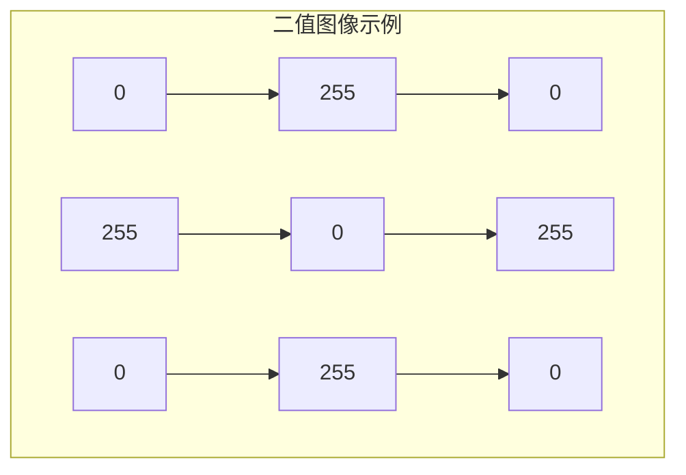

| 属性 | 说明 |
|------|------|
| 像素值 | $\{0, 255\}$ 或 $\{0, 1\}$ |
| 存储 | 1 bit/pixel |
| 典型应用 | 文字识别、指纹识别、掩码 |

```python
import cv2
import numpy as np

def create_binary_image():
    """创建二值图像"""
    img = np.zeros((100, 100), dtype=np.uint8)
    img[20:80, 20:80] = 255
    img[40:60, 40:60] = 0
    return img

binary_img = create_binary_image()
print(f"二值图像值域: [{binary_img.min()}, {binary_img.max()}]")
print(f"二值图像尺寸: {binary_img.shape}")
```

### 2.2 灰度图像（Grayscale Image）

灰度图像的每个像素用一个数值表示亮度，通常为 8 位无符号整数。

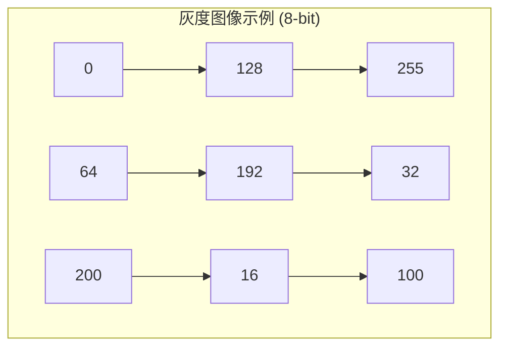

| 属性 | 说明 |
|------|------|
| 像素值 | $[0, 255]$（8-bit）或 $[0, 65535]$（16-bit） |
| 存储 | 8 bit/pixel 或 16 bit/pixel |
| 典型应用 | 医学影像、遥感、工业检测 |

```python
import cv2
import numpy as np

def create_grayscale_image():
    """创建灰度图像"""
    img = np.zeros((256, 256), dtype=np.uint8)
    x = np.linspace(0, 255, 256)
    y = np.linspace(0, 255, 256)
    X, Y = np.meshgrid(x, y)
    img = np.uint8(np.sin(2 * np.pi * X / 64) * np.cos(2 * np.pi * Y / 64) * 127 + 128)
    return img

gray_img = create_grayscale_image()
print(f"灰度图像值域: [{gray_img.min()}, {gray_img.max()}]")
print(f"灰度图像尺寸: {gray_img.shape}")
```

### 2.3 索引图像（Indexed Image）

索引图像使用颜色映射表（调色板）来表示颜色，每个像素存储的是调色板索引而非实际颜色值。

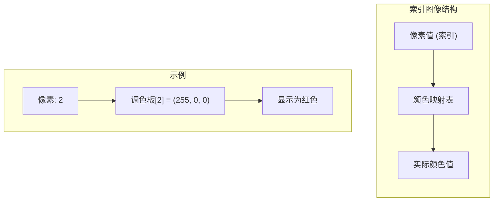

| 属性 | 说明 |
|------|------|
| 像素值 | 调色板索引（0-255） |
| 存储 | 索引 + 调色板 |
| 典型应用 | GIF、有限颜色显示 |

```python
import cv2
import numpy as np

def create_indexed_image():
    """创建索引图像（模拟）"""
    img = np.zeros((100, 100), dtype=np.uint8)
    img[0:33, :] = 0
    img[33:66, :] = 1
    img[66:100, :] = 2
    
    palette = np.array([
        [255, 0, 0],
        [0, 255, 0],
        [0, 0, 255]
    ], dtype=np.uint8)
    
    return img, palette

indexed_img, palette = create_indexed_image()
print(f"索引图像尺寸: {indexed_img.shape}")
print(f"调色板大小: {palette.shape}")
```

### 2.4 真彩色图像（True Color Image）

真彩色图像使用三个通道（通常为 RGB）表示每个像素的颜色。

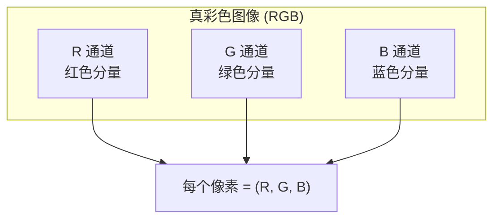

| 属性 | 说明 |
|------|------|
| 像素值 | $(R, G, B)$ 三元组，各通道 $[0, 255]$ |
| 存储 | 24 bit/pixel |
| 典型应用 | 数码相机、显示器、图像处理 |

```python
import cv2
import numpy as np

def create_rgb_image():
    """创建 RGB 彩色图像"""
    img = np.zeros((200, 200, 3), dtype=np.uint8)
    
    img[0:66, :, 0] = 255
    img[66:133, :, 1] = 255
    img[133:200, :, 2] = 255
    
    return img

rgb_img = create_rgb_image()
print(f"RGB 图像尺寸: {rgb_img.shape}")
print(f"像素 (100,100) 值: {rgb_img[100, 100]}")
```

### 2.5 图像类型转换

```python
import cv2
import numpy as np

def convert_image_types(img_path):
    """演示图像类型转换"""
    img = cv2.imread(img_path)
    if img is None:
        img = np.random.randint(0, 256, (200, 200, 3), dtype=np.uint8)
    
    gray = cv2.cvtColor(img, cv2.COLOR_BGR2GRAY)
    
    _, binary = cv2.threshold(gray, 128, 255, cv2.THRESH_BINARY)
    
    return {
        'original': img,
        'grayscale': gray,
        'binary': binary
    }

converted = convert_image_types('test_image.jpg')
for name, img in converted.items():
    print(f"{name}: shape={img.shape}, dtype={img.dtype}")
```

## 三、图像文件格式

### 3.1 常见图像格式对比

| 格式 | 类型 | 压缩方式 | 特点 | 适用场景 |
|------|------|---------|------|---------|
| BMP | 位图 | 无压缩 | 简单、兼容好 | Windows 系统、简单图形 |
| TIFF | 标签图像 | 可选（无损/有损） | 灵活、支持多通道 | 印刷、医学、遥感 |
| JPEG | 联合摄影专家组 | 有损压缩 | 文件小、质量可调 | 照片、网络图片 |
| PNG | 可移植网络图形 | 无损压缩 | 支持透明、无损 | 网页、图标、截图 |
| GIF | 图形交换格式 | LZW 无损 | 支持动画、256 色 | 简单动画、表情包 |
| WebP | 现代图像格式 | 有损/无损 | 高压缩比 | 现代网页、移动应用 |

### 3.2 BMP 格式

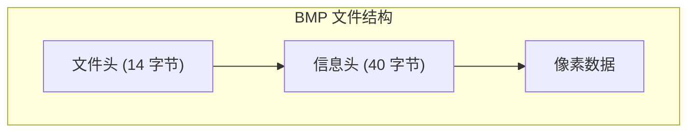

**特点**：
- 无压缩，文件较大
- 结构简单，易于读写
- 支持多种色深（1/4/8/16/24/32 位）

```python
import cv2
import numpy as np

def save_bmp_example():
    """保存 BMP 文件"""
    img = np.random.randint(0, 256, (100, 100, 3), dtype=np.uint8)
    cv2.imwrite('test.bmp', img)
    
    loaded = cv2.imread('test.bmp')
    print(f"BMP 文件读写成功: {loaded.shape}")

save_bmp_example()
```

### 3.3 TIFF 格式

**特点**：
- 支持多种压缩算法（LZW、Deflate、JPEG 等）
- 支持多通道、多层图像
- 支持 16 位、32 位等高精度数据
- 可存储元数据（地理信息、采集参数等）

```python
import cv2
import numpy as np

def save_tiff_example():
    """保存 TIFF 文件"""
    img = np.random.randint(0, 256, (100, 100, 3), dtype=np.uint8)
    
    cv2.imwrite('test.tiff', img, [cv2.IMWRITE_TIFF_COMPRESSION, cv2.IMWRITE_TIFF_COMPRESSION_LZW])
    
    loaded = cv2.imread('test.tiff')
    print(f"TIFF 文件读写成功: {loaded.shape}")

save_tiff_example()
```

### 3.4 JPEG 格式

**特点**：
- 有损压缩，压缩比高
- 通过质量参数控制压缩程度
- 不支持透明通道
- 适合存储照片类图像

```python
import cv2
import numpy as np

def save_jpeg_example():
    """保存 JPEG 文件（不同质量）"""
    img = np.random.randint(0, 256, (100, 100, 3), dtype=np.uint8)
    
    qualities = [50, 80, 100]
    for q in qualities:
        filename = f'test_q{q}.jpg'
        cv2.imwrite(filename, img, [cv2.IMWRITE_JPEG_QUALITY, q])
        
        loaded = cv2.imread(filename)
        print(f"JPEG (quality={q}): {loaded.shape}")

save_jpeg_example()
```

### 3.5 PNG 格式

**特点**：
- 无损压缩（基于 DEFLATE 算法）
- 支持 Alpha 透明通道
- 支持多种色深
- 文件比 BMP 小，比 JPEG 大

```python
import cv2
import numpy as np

def save_png_example():
    """保存 PNG 文件（带透明通道）"""
    img = np.random.randint(0, 256, (100, 100, 4), dtype=np.uint8)
    
    cv2.imwrite('test.png', img)
    
    loaded = cv2.imread('test.png', cv2.IMREAD_UNCHANGED)
    print(f"PNG 文件读写成功: {loaded.shape}")

save_png_example()
```

### 3.6 格式选择指南

| 场景 | 推荐格式 | 原因 |
|------|---------|------|
| 高质量印刷 | TIFF | 支持无损压缩和高色深 |
| 网页照片 | JPEG | 文件小，加载快 |
| 网页图标/截图 | PNG | 无损压缩，支持透明 |
| 简单动画 | GIF | 兼容性好 |
| 医疗影像 | TIFF (DICOM) | 支持高精度和元数据 |
| 遥感图像 | TIFF | 支持地理坐标和多通道 |

## 四、成像模型

### 4.1 点源模型

点源模型假设图像由一个或多个点光源产生。

#### 单点源

$$f(x, y) = k \cdot \delta(x - x_0, y - y_0)$$

其中 $\delta(x, y)$ 是狄拉克 delta 函数，$k$ 是常数。

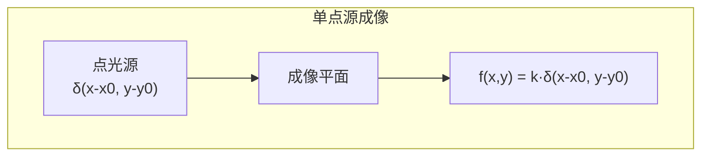

#### 多点源

$$f(x, y) = \sum_{i=1}^{N} k_i \cdot \delta(x - x_i, y - y_i)$$

```python
import numpy as np
import cv2

def point_source_model(image_size, points):
    """点源成像模型"""
    img = np.zeros(image_size, dtype=np.float64)
    for (x, y, intensity) in points:
        img[y, x] = intensity
    return img

points = [(100, 50, 255), (200, 150, 200), (150, 100, 180)]
img = point_source_model((300, 300), points)
img_uint8 = np.clip(img, 0, 255).astype(np.uint8)

print(f"点源模型图像尺寸: {img.shape}")
```

### 4.2 线模型

线模型假设图像由线光源产生，函数沿一条线分布。

#### 水平线

$$f(x, y) = \begin{cases} A & y = y_0 \\ 0 & \text{其他} \end{cases}$$

#### 斜线

$$f(x, y) = \begin{cases} A & y = kx + b \\ 0 & \text{其他} \end{cases}$$

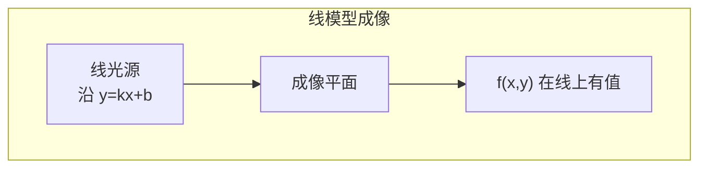

```python
import numpy as np

def line_model(image_size, line_params):
    """线成像模型"""
    img = np.zeros(image_size, dtype=np.float64)
    height, width = image_size[:2]
    
    for k, b, intensity in line_params:
        for x in range(width):
            y = int(k * x + b)
            if 0 <= y < height:
                img[y, x] = intensity
    
    return img

lines = [(0, 100, 255), (0.5, 50, 200), (-0.3, 200, 180)]
img = line_model((300, 400), lines)

print(f"线模型图像尺寸: {img.shape}")
```

### 4.3 针孔相机模型

针孔相机模型是最基本的成像模型，描述了三维空间点到二维图像平面的投影过程。

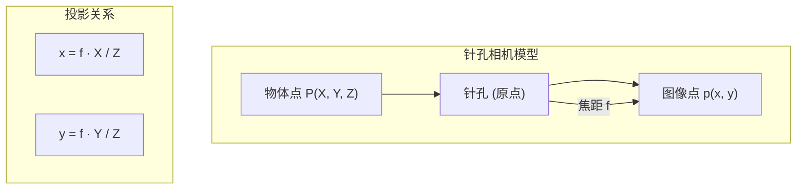

#### 透视投影公式

$$x = f \cdot \frac{X}{Z}$$

$$y = f \cdot \frac{Y}{Z}$$

其中：
- $(X, Y, Z)$：物体点的三维坐标
- $(x, y)$：图像点的二维坐标
- $f$：相机焦距

#### 矩阵表示

$$\begin{bmatrix} x \\ y \\ 1 \end{bmatrix} \sim \mathbf{K} \begin{bmatrix} X \\ Y \\ Z \end{bmatrix}$$

其中相机内参矩阵 $\mathbf{K}$：

$$\mathbf{K} = \begin{bmatrix} f & 0 & c_x \\ 0 & f & c_y \\ 0 & 0 & 1 \end{bmatrix}$$

$c_x, c_y$ 是图像主点坐标。

```python
import numpy as np

def pinhole_project(points_3d, focal_length, principal_point):
    """针孔相机投影"""
    fx, fy = focal_length, focal_length
    cx, cy = principal_point
    
    projection_matrix = np.array([
        [fx, 0, cx],
        [0, fy, cy],
        [0, 0, 1]
    ])
    
    points_2d = []
    for point in points_3d:
        X, Y, Z = point
        point_homogeneous = np.array([X, Y, Z])
        projected = projection_matrix @ point_homogeneous
        
        x = projected[0] / projected[2]
        y = projected[1] / projected[2]
        points_2d.append((x, y))
    
    return points_2d

points_3d = [(100, 200, 1000), (150, 250, 800), (50, 100, 500)]
focal_length = 500
principal_point = (320, 240)

points_2d = pinhole_project(points_3d, focal_length, principal_point)
for i, (p3d, p2d) in enumerate(zip(points_3d, points_2d)):
    print(f"3D 点 {p3d} → 2D 点 ({p2d[0]:.1f}, {p2d[1]:.1f})")
```

### 4.4 透视投影 vs 正交投影

#### 透视投影（Perspective Projection）

- 远处物体看起来小，近处物体看起来大
- 符合人眼视觉感知
- 使用针孔相机模型

$$x = f \cdot \frac{X}{Z}, \quad y = f \cdot \frac{Y}{Z}$$

#### 正交投影（Orthographic Projection）

- 不考虑深度信息
- 物体大小与距离无关
- 简化的成像模型

$$x = X, \quad y = Y$$

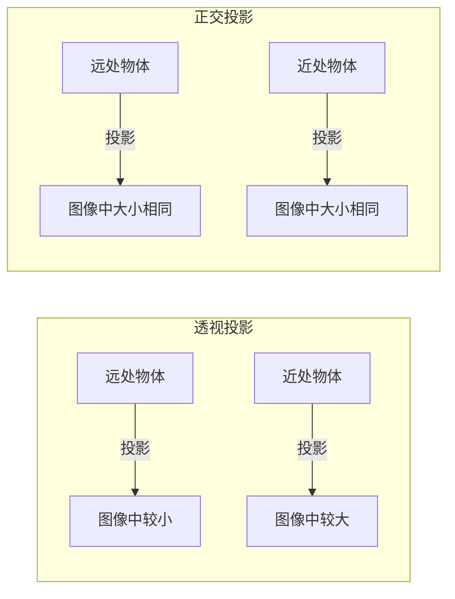

| 特性 | 透视投影 | 正交投影 |
|------|---------|---------|
| 近大远小 | 是 | 否 |
| 深度感知 | 有 | 无 |
| 适用场景 | 真实场景、3D 重建 | 工程图、俯视图 |
| 计算复杂度 | 高 | 低 |

## 五、图像形成模型

### 5.1 照度-反射模型

图像可以表示为**照度（Illumination）**和**反射率（Reflectance）**的乘积：

$$f(x, y) = i(x, y) \cdot r(x, y)$$

其中：
- $i(x, y)$：照度函数，表示场景的光照强度
- $r(x, y)$：反射率函数，表示物体表面的反射特性

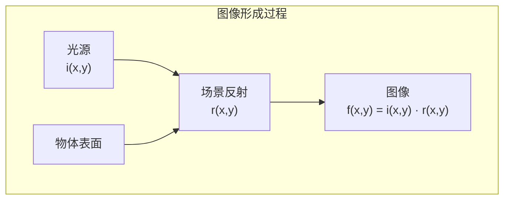

#### 照度函数特性

$$i(x, y) \in [0, \infty)$$

- 由光源决定
- 通常变化缓慢（低频特性）

#### 反射率函数特性

$$r(x, y) \in [0, 1]$$

- 由物体表面特性决定
- 包含物体的纹理和边缘信息

### 5.2 照度-反射模型的应用

#### 同态滤波

基于照度-反射模型，可以对图像进行同态滤波：

$$\ln f(x, y) = \ln i(x, y) + \ln r(x, y)$$

在频域中分离照度和反射率分量，分别进行处理。

```python
import numpy as np
import cv2

def homomorphic_filter(image, gamma_h=1.5, gamma_l=0.5, c=2, d0=30):
    """同态滤波"""
    img_float = np.float64(image)
    img_log = np.log1p(img_float)
    
    img_fft = np.fft.fft2(img_log)
    img_fft_shift = np.fft.fftshift(img_fft)
    
    rows, cols = img.shape
    crow, ccol = rows // 2, cols // 2
    
    mask = np.zeros((rows, cols), np.float64)
    for i in range(rows):
        for j in range(cols):
            d = np.sqrt((i - crow)**2 + (j - ccol)**2)
            mask[i, j] = (gamma_h - gamma_l) * (1 - np.exp(-c * d**2 / d0**2)) + gamma_l
    
    img_filtered = img_fft_shift * mask
    img_fft_ishift = np.fft.ifftshift(img_filtered)
    img_back = np.fft.ifft2(img_fft_ishift)
    img_back = np.real(img_back)
    
    img_result = np.expm1(img_back)
    img_result = np.uint8(np.clip(img_result, 0, 255))
    
    return img_result

img = cv2.imread('test_image.jpg', cv2.IMREAD_GRAYSCALE)
if img is None:
    img = np.random.randint(0, 256, (256, 256), dtype=np.uint8)

filtered = homomorphic_filter(img)
print(f"同态滤波完成: {filtered.shape}")
```

### 5.3 光照补偿

通过估计照度分量来补偿不均匀光照：

$$\hat{r}(x, y) = \frac{f(x, y)}{\hat{i}(x, y)}$$

其中 $\hat{i}(x, y)$ 是照度分量的估计值。

## 六、数字相机组件

### 6.1 主要组件

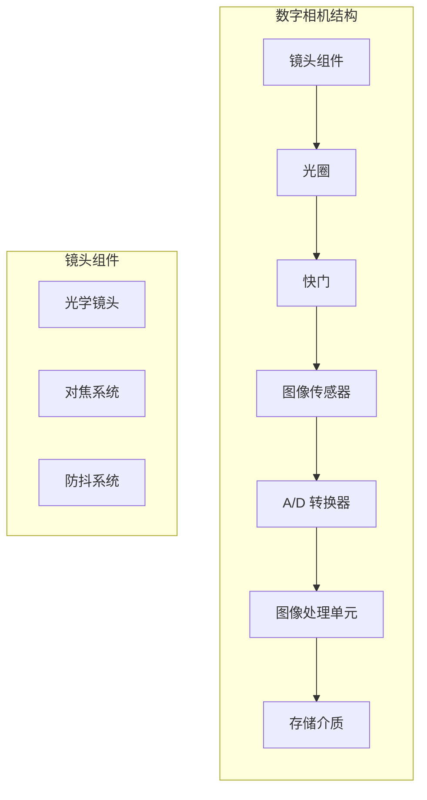

### 6.2 镜头（Lens）

镜头由多片光学透镜组成，负责将光线聚焦到图像传感器上。

| 参数 | 说明 |
|------|------|
| 焦距 | 决定视角和放大倍数 |
| 光圈 | 控制进光量和景深 |
| 对焦 | 调整焦点位置 |
| 畸变 | 镜头光学缺陷 |

### 6.3 光圈（Aperture）

光圈控制进入相机的光通量：

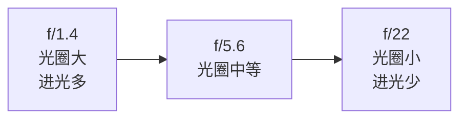

- 大光圈：背景虚化，适合人像
- 小光圈：景深大，适合风景

### 6.4 快门（Shutter）

快门控制光线照射传感器的时间：

| 快门速度 | 应用场景 |
|---------|---------|
| 1/1000s 以上 | 抓拍高速运动 |
| 1/60s - 1/250s | 日常拍摄 |
| 1s 以上 | 夜景、光绘 |

### 6.5 图像传感器

图像传感器是相机的核心组件，将光信号转换为电信号。

#### CCD vs CMOS

| 特性 | CCD | CMOS |
|------|-----|------|
| 读出方式 | 逐行读出 | 行列选址 |
| 功耗 | 高 | 低 |
| 速度 | 较慢 | 快 |
| 集成度 | 低 | 高 |
| 成本 | 高 | 低 |
| 噪声 | 低 | 较高 |
| 应用 | 专业相机、科学成像 | 手机、普通相机 |

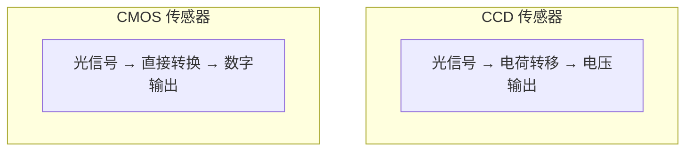

### 6.6 A/D 转换器

A/D（模数）转换器将模拟信号转换为数字信号：


| 参数 | 说明 |
|------|------|
| 采样率 | 每秒采样次数 |
| 量化位数 | 通常为 12-14 bit |
| 动态范围 | 可表示的亮度范围 |

### 6.7 图像处理单元

相机内置的图像处理单元执行：
- 去马赛克（Demosaicing）
- 降噪
- 色彩校正
- 锐化
- JPEG 压缩

## 七、图像采集设备

### 7.1 CCD 传感器

CCD（Charge-Coupled Device）电荷耦合器件：

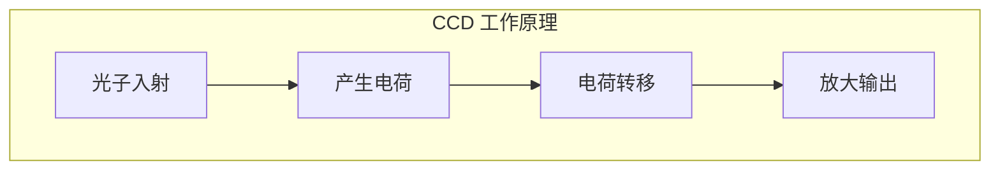

**特点**：
- 图像质量高，噪声低
- 功耗大
- 读出速度慢
- 成本高

**应用**：
- 专业数码相机
- 天文望远镜
- 科学成像

### 7.2 CMOS 传感器

CMOS（Complementary Metal-Oxide-Semiconductor）互补金属氧化物半导体：

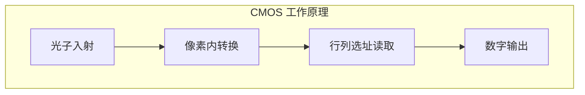

**特点**：
- 集成度高
- 功耗低
- 读出速度快
- 成本低

**应用**：
- 手机摄像头
- 普通数码相机
- 摄像头
- 工业检测

### 7.3 其他采集设备

| 设备 | 特点 | 应用 |
|------|------|------|
| 扫描仪 | 高分辨率、平板式 | 文档、照片数字化 |
| 高速摄像机 | 高帧率（>1000fps） | 运动分析、科学研究 |
| 红外相机 | 红外波段成像 | 夜视、热成像 |
| X 射线成像 | 穿透式成像 | 医学检查、工业探伤 |
| MRI | 核磁共振 | 医学影像 |
| 超声成像 | 超声波成像 | 医学检查 |

## 八、应用领域

### 8.1 卫星遥感

卫星遥感图像用于：
- 土地利用分类
- 城市规划
- 环境监测
- 农业调查
- 气象预报

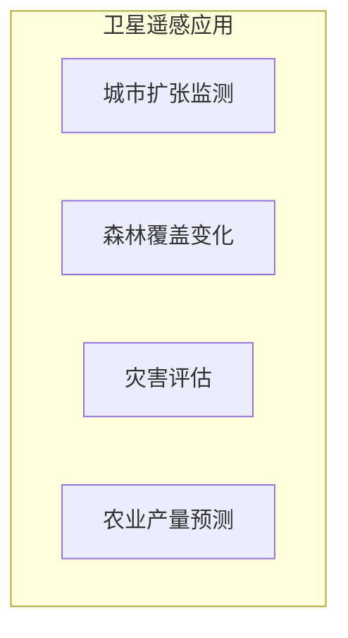

**特点**：
- 多光谱/高光谱成像
- 高空间分辨率（亚米级）
- 周期性重访

### 8.2 医学影像

医学影像用于：
- X 射线摄影
- CT 扫描
- MRI 成像
- 超声检查
- 病理切片分析

**特点**：
- 高精度成像
- 多模态融合
- 实时成像
- 三维重建

### 8.3 工业检测

工业检测应用：
- 产品外观检查
- 尺寸测量
- 缺陷检测
- 装配验证
- 条码识别

**特点**：
- 高速在线检测
- 高可靠性
- 自动化程度高

### 8.4 其他应用

| 领域 | 应用示例 |
|------|---------|
| 安防监控 | 人脸识别、行为分析 |
| 自动驾驶 | 车道检测、障碍物识别 |
| 手机摄影 | 计算摄影、AI 美化 |
| 增强现实 | 虚实融合、手势识别 |
| 虚拟现实 | 场景渲染、交互反馈 |

## 九、综合代码示例

### 9.1 图像类型读取与显示

```python
import cv2
import numpy as np
import matplotlib.pyplot as plt

class ImageTypeDemo:
    """图像类型演示类"""
    
    @staticmethod
    def create_test_images():
        """创建不同类型的测试图像"""
        images = {}
        
        binary = np.zeros((200, 200), dtype=np.uint8)
        binary[50:150, 50:150] = 255
        images['binary'] = binary
        
        x = np.linspace(0, 255, 200)
        y = np.linspace(0, 255, 200)
        X, Y = np.meshgrid(x, y)
        grayscale = np.uint8(np.sin(2 * np.pi * X / 64) * np.cos(2 * np.pi * Y / 64) * 127 + 128)
        images['grayscale'] = grayscale
        
        rgb = np.zeros((200, 200, 3), dtype=np.uint8)
        rgb[:, :, 0] = np.uint8(X)
        rgb[:, :, 1] = np.uint8(Y)
        rgb[:, :, 2] = np.uint8((X + Y) / 2)
        images['rgb'] = rgb
        
        return images
    
    @staticmethod
    def convert_between_types(image):
        """图像类型转换"""
        results = {}
        
        if len(image.shape) == 2:
            results['original_gray'] = image
            
            _, binary = cv2.threshold(image, 128, 255, cv2.THRESH_BINARY)
            results['binary'] = binary
            
            rgb = cv2.cvtColor(image, cv2.COLOR_GRAY2BGR)
            results['rgb'] = rgb
            
        elif len(image.shape) == 3 and image.shape[2] == 3:
            results['original_rgb'] = image
            
            gray = cv2.cvtColor(image, cv2.COLOR_BGR2GRAY)
            results['grayscale'] = gray
            
            _, binary = cv2.threshold(gray, 128, 255, cv2.THRESH_BINARY)
            results['binary'] = binary
        
        return results
    
    @staticmethod
    def save_different_formats(image, filename_prefix='test'):
        """保存为不同格式"""
        formats = {
            'bmp': None,
            'tiff': [cv2.IMWRITE_TIFF_COMPRESSION, 1],
            'jpg': [cv2.IMWRITE_JPEG_QUALITY, 95],
            'png': [cv2.IMWRITE_PNG_COMPRESSION, 3]
        }
        
        saved_files = []
        for fmt, params in formats.items():
            filename = f"{filename_prefix}.{fmt}"
            if params:
                cv2.imwrite(filename, image, params)
            else:
                cv2.imwrite(filename, image)
            saved_files.append(filename)
            print(f"保存: {filename}")
        
        return saved_files
    
    @staticmethod
    def compare_file_sizes(filenames):
        """比较不同格式的文件大小"""
        import os
        
        for filename in filenames:
            size = os.path.getsize(filename)
            print(f"{filename}: {size} bytes ({size/1024:.2f} KB)")
    
    @staticmethod
    def demonstrate_pinhole_camera():
        """演示针孔相机模型"""
        points_3d = [
            [100, 100, 500],
            [200, 200, 500],
            [100, 100, 1000],
            [200, 200, 1000]
        ]
        
        focal_length = 500
        cx, cy = 320, 240
        
        print("3D 到 2D 投影 (针孔相机模型):")
        for point in points_3d:
            X, Y, Z = point
            x = focal_length * X / Z + cx
            y = focal_length * Y / Z + cy
            print(f"  3D({X}, {Y}, {Z}) → 2D({x:.1f}, {y:.1f})")


if __name__ == '__main__':
    demo = ImageTypeDemo()
    
    print("=== 1. 创建测试图像 ===")
    images = demo.create_test_images()
    for name, img in images.items():
        print(f"{name}: shape={img.shape}, dtype={img.dtype}")
    
    print("\n=== 2. 图像类型转换 ===")
    converted = demo.convert_between_types(images['rgb'])
    for name, img in converted.items():
        print(f"{name}: shape={img.shape}")
    
    print("\n=== 3. 保存不同格式 ===")
    gray_img = images['grayscale']
    saved = demo.save_different_formats(gray_img, 'demo_image')
    
    print("\n=== 4. 文件大小比较 ===")
    demo.compare_file_sizes(saved)
    
    print("\n=== 5. 针孔相机模型演示 ===")
    demo.demonstrate_pinhole_camera()
```

### 9.2 图像采集模拟

```python
import numpy as np
import cv2

def simulate_image_acquisition(scene_type='indoor', noise_level=0.01):
    """
    模拟图像采集过程
    
    参数:
        scene_type: 场景类型 ('indoor', 'outdoor', 'lowlight')
        noise_level: 噪声水平
    """
    if scene_type == 'indoor':
        illumination = np.ones((480, 640), dtype=np.float64) * 150
        reflection = np.random.rand(480, 640) * 100 + 50
    elif scene_type == 'outdoor':
        x = np.linspace(0, 1, 640)
        y = np.linspace(0, 1, 480)
        X, Y = np.meshgrid(x, y)
        illumination = (1 - Y) * 200 + 50
        reflection = np.random.rand(480, 640) * 80 + 100
    elif scene_type == 'lowlight':
        illumination = np.ones((480, 640), dtype=np.float64) * 20
        reflection = np.random.rand(480, 640) * 60 + 100
    else:
        raise ValueError(f"Unknown scene type: {scene_type}")
    
    image = illumination * reflection
    
    noise = np.random.randn(480, 640) * noise_level * 255
    image_noisy = image + noise
    
    image_noisy = np.clip(image_noisy, 0, 255).astype(np.uint8)
    
    return image_noisy, illumination, reflection


def demosaic_simulation(bayer_pattern):
    """
    模拟去马赛克过程
    
    参数:
        bayer_pattern: Bayer 阵列数据
    """
    height, width = bayer_pattern.shape
    output = np.zeros((height, width, 3), dtype=np.float64)
    
    for i in range(0, height, 2):
        for j in range(0, width, 2):
            output[i, j, 0] = bayer_pattern[i, j]
    
    for i in range(0, height, 2):
        for j in range(1, width, 2):
            output[i, j, 1] = bayer_pattern[i, j]
    
    for i in range(1, height, 2):
        for j in range(0, width, 2):
            output[i, j, 1] = bayer_pattern[i, j]
    
    for i in range(1, height, 2):
        for j in range(1, width, 2):
            output[i, j, 2] = bayer_pattern[i, j]
    
    return np.clip(output, 0, 255).astype(np.uint8)


if __name__ == '__main__':
    print("=== 图像采集模拟 ===")
    
    for scene in ['indoor', 'outdoor', 'lowlight']:
        img, illum, refl = simulate_image_acquisition(scene, 0.02)
        print(f"{scene} 场景:")
        print(f"  图像值域: [{img.min()}, {img.max()}]")
        print(f"  照度范围: [{illum.min():.1f}, {illum.max():.1f}]")
        print(f"  反射率范围: [{refl.min():.1f}, {refl.max():.1f}]")
        print()
```

## 十、考研/考点总结

| 考点 | 要点 |
|------|------|
| 图像类型 | 二值、灰度、索引、真彩色 |
| BMP | 无压缩、结构简单 |
| TIFF | 灵活、支持多通道 |
| JPEG | 有损压缩、质量可调 |
| PNG | 无损压缩、支持透明 |
| 点源模型 | $f(x,y) = k \cdot \delta(x-x_0, y-y_0)$ |
| 针孔相机 | $x = f \cdot X/Z, y = f \cdot Y/Z$ |
| 照度-反射 | $f(x,y) = i(x,y) \cdot r(x,y)$ |
| CCD vs CMOS | CCD 质量高，CMOS 功耗低 |
| 应用领域 | 遥感、医学、工业、安防 |

## 十一、常见错误与注意事项

| 错误 | 说明 | 正确做法 |
|------|------|---------|
| 格式选择不当 | 用 BMP 存照片、用 JPEG 存带透明图 | 根据场景选择合适格式 |
| 忽略照度不均匀 | 直接处理光照不均的图像 | 使用同态滤波或光照补偿 |
| 相机模型混淆 | 针孔模型用于 3D，正交用于 2D | 根据应用选择正确模型 |
| 忽视传感器差异 | 对 CCD/CMOS 使用相同参数 | 根据传感器特性调整算法 |
| 压缩质量设置 | 过度压缩导致画质下降 | 选择合适的压缩质量参数 |

---

**导航**：上一节 [[1.2 图像表示矩阵与像素]] · 下一节 [[1.4 图像基本运算与变换]] · 返回 [[MOC - 第1章\|章节导航]]