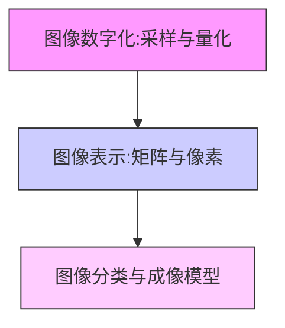

# 第1章 数字图像基础理论

> [!info] 章节概述
> 本章介绍数字图像处理的基础理论，包括图像数字化过程（采样与量化）、图像的矩阵表示与像素操作，以及图像的分类和成像模型。这些基础概念是后续学习所有图像处理技术的前提。

## 学习路线图

## 章节内容

### 核心知识点

| 知识点 | 文件链接 | 重要程度 |
|--------|---------|---------|
| 采样与量化 | [[1.1 图像数字化采样与量化]] | ⭐⭐⭐⭐⭐ |
| 矩阵与像素表示 | [[1.2 图像表示矩阵与像素]] | ⭐⭐⭐⭐ |
| 图像分类与成像 | [[1.3 图像分类与成像模型]] | ⭐⭐⭐ |

### 关键概念

- **采样(Sampling)**: 将连续空间坐标转换为离散坐标
- **量化(Quantization)**: 将连续灰度值转换为离散灰度级
- **像素(Pixel)**: 图像的最小基本单元
- **分辨率(Resolution)**: 图像的空间尺寸和灰度精度

## 核心考点

| 考点 | 说明 | 常考形式 |
|-----|------|---------|
| 采样率与图像质量 | 采样间隔与混叠效应 | 选择题、简答题 |
| 量化级数与灰度分辨率 | 量化位数与灰度范围 | 计算题 |
| 图像矩阵运算 | 加法、减法、乘法运算 | 计算题 |
| 邻域操作 | 4-邻域、8-邻域、D邻域 | 简答题 |
| 成像模型 | 点光源、线模型、相机模型 | 简答题 |

## 自测题

1. **选择题**: 一幅640×480的8位灰度图像需要多少字节存储空间？
   - A. 307200字节
   - B. 614400字节
   - C. 153600字节
   - D. 1228800字节

2. **简答题**: 解释采样和量化的区别，并说明它们如何影响图像质量。

3. **计算题**: 对一幅4×4的灰度图像进行3位量化，写出量化后的像素值分布。

4. **编程题**: 使用Python/OpenCV读取一幅图像，显示其基本属性（尺寸、通道数、数据类型）。

---

**导航**：[[MOC - 数字图像处理\|返回课程导航]] · [[第2章 图像灰度变换与直方图处理/MOC - 第2章\|下一章：灰度变换]]