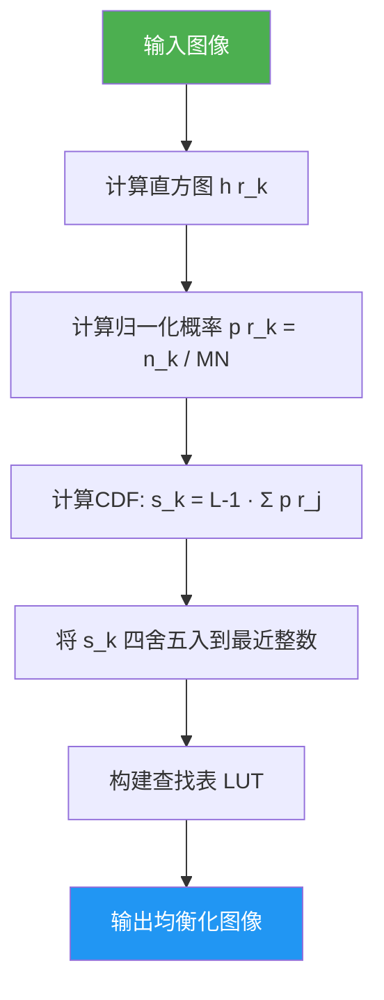
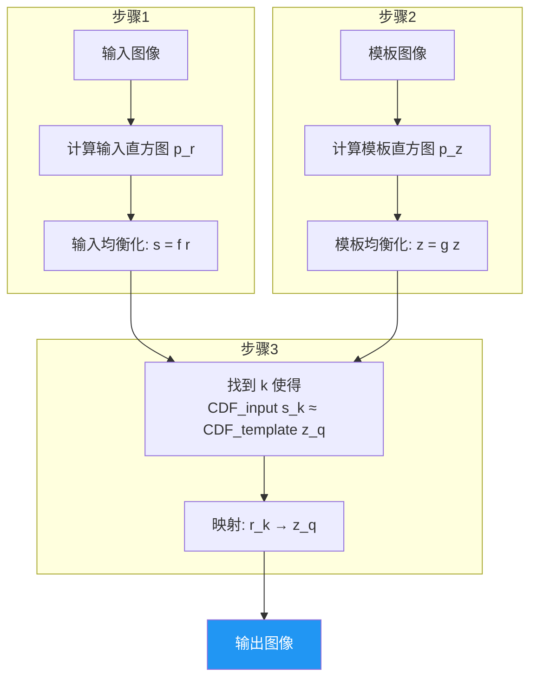
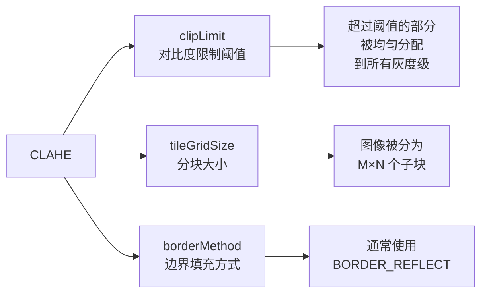
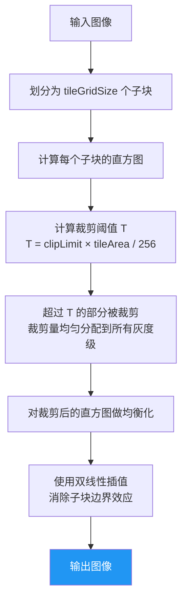
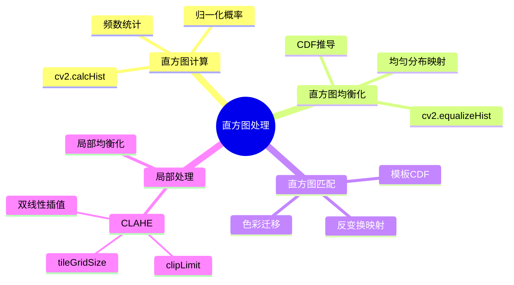

# 2.2 直方图处理

## 📖 基本概念

图像直方图（Histogram）描述了图像中各灰度级像素的分布情况，是图像的重要统计特征。直方图处理技术利用灰度级的统计分布来调整图像的外观，是图像增强的核心手段之一。

### 直方图定义

设图像 $f(x,y)$ 的灰度级为 $L$（通常 $L=256$），总像素数为 $M \times N$，则：

**直方图（频数表示）**：

$$h(r_k) = n_k, \quad k = 0, 1, \ldots, L-1$$

其中 $n_k$ 为图像中灰度级 $r_k$ 出现的像素数量。

**归一化直方图（概率表示）**：

$$p(r_k) = \frac{n_k}{M \cdot N}, \quad k = 0, 1, \ldots, L-1$$

显然 $\sum_{k=0}^{L-1} p(r_k) = 1$，即所有灰度级概率之和为 1。

## 📊 直方图的计算与显示

### Python 实现

```python
import cv2
import numpy as np
import matplotlib.pyplot as plt

img = cv2.imread('input.jpg', cv2.IMREAD_GRAYSCALE)

# 方法1: NumPy 实现
def compute_histogram(image):
    hist = np.zeros(256, dtype=np.int64)
    for pixel in image.flatten():
        hist[pixel] += 1
    return hist

hist_custom = compute_histogram(img)

# 方法2: OpenCV 内置函数
hist_cv = cv2.calcHist([img], [0], None, [256], [0, 256])

# 方法3: Matplotlib 直接绘制
plt.figure(figsize=(10, 4))
plt.subplot(121)
plt.imshow(img, cmap='gray')
plt.title('Original Image')
plt.axis('off')
plt.subplot(122)
plt.hist(img.flatten(), bins=256, range=[0, 256], color='blue')
plt.title('Histogram')
plt.xlabel('Gray Level')
plt.ylabel('Pixel Count')
plt.tight_layout()
plt.show()
```

## ⚡ 直方图均衡化

### 原理

直方图均衡化（Histogram Equalization）的目标是将原始图像的直方图变换为**均匀分布**，即每个灰度级的像素数量大致相等，从而最大化图像的对比度。

### 数学推导

设原始图像的灰度级概率为 $p(r_k)$，均衡化映射函数为 $s = f(r)$，则：

$$s_k = f(r_k) = \frac{L-1}{M \cdot N} \sum_{j=0}^{k} n_j = (L-1) \cdot \sum_{j=0}^{k} p(r_j)$$

**推导过程**：

1. 要求均衡化后每个灰度级的概率相等：$p(s) = \frac{1}{L-1}$
2. 设映射函数为 $s = f(r)$，且 $f$ 单调递增
3. 由概率密度变换公式：$p(s) = p(r) \cdot \left|\frac{dr}{ds}\right|$
4. 积分得：$F(s) = \int_0^s p(t) dt = \frac{s}{L-1}$（均匀分布的 CDF）
5. 因此映射函数为原始图像的 CDF：$s = (L-1) \cdot F(r)$

### 均衡化算法步骤



### OpenCV 实现

```python
import cv2
import numpy as np

img = cv2.imread('input.jpg', cv2.IMREAD_GRAYSCALE)

# OpenCV 直方图均衡化
equalized = cv2.equalizeHist(img)

# 自定义直方图均衡化（NumPy实现）
def histogram_equalization(image):
    hist, _ = np.histogram(image.flatten(), bins=256, range=[0, 256])
    cdf = hist.cumsum()
    cdf_normalized = cdf * (255.0 / cdf[-1])
    cdf_masked = np.ma.masked_equal(cdf_normalized, 0)
    cdf_masked = (cdf_masked - cdf_masked.min()) / (cdf_masked.max() - cdf_masked.min()) * 255
    cdf_final = np.ma.filled(cdf_masked, 0).astype('uint8')
    return cdf_final[image]

custom_eq = histogram_equalization(img)
```

### 效果分析

直方图均衡化能有效提升对比度，但存在以下局限：

- 过度增强可能导致**噪声放大**
- 某些灰度级可能被**过度合并**，丢失细节
- 对于双峰分布的直方图效果较差

## 🎯 直方图匹配（Specification）

### 原理

直方图匹配（Histogram Specification）的目标是将输入图像的直方图匹配到一个**预定的直方图**（模板），使得输出图像具有与模板图像相似的灰度分布。

### 算法流程



### 数学描述

1. 对输入图像做均衡化：$s = f(r)$，得到 $p_s(s)$ 均匀分布
2. 对模板图像做均衡化：$z = g(z')$，得到 $p_z(z)$ 均匀分布
3. 由于 $p_s(s)$ 和 $p_z(z)$ 都是均匀分布，存在映射 $s \leftrightarrow z$
4. 反推：$r \xrightarrow{f} s \xrightarrow{h} z \xrightarrow{g^{-1}} z'$

最终映射函数为：

$$z' = g^{-1}(f(r))$$

### Python 实现

```python
def histogram_match(source, template):
    src_hist, _ = np.histogram(source.flatten(), bins=256, range=[0, 256])
    tpl_hist, _ = np.histogram(template.flatten(), bins=256, range=[0, 256])

    src_cdf = src_hist.cumsum().astype(np.float64)
    tpl_cdf = tpl_hist.cumsum().astype(np.float64)

    src_cdf_norm = src_cdf / src_cdf[-1]
    tpl_cdf_norm = tpl_cdf / tpl_cdf[-1]

    lut = np.zeros(256, dtype=np.uint8)
    for i in range(256):
        lut[i] = np.searchsorted(tpl_cdf_norm, src_cdf_norm[i]) * 255

    return lut[source]

source_img = cv2.imread('source.jpg', cv2.IMREAD_GRAYSCALE)
template_img = cv2.imread('template.jpg', cv2.IMREAD_GRAYSCALE)
matched = histogram_match(source_img, template_img)
```

## 🌍 局部直方图处理

### 问题背景

全局直方图均衡化对整幅图像使用相同的变换，当图像不同区域的亮度差异较大时效果不佳。例如，一幅图像中一部分很暗、一部分很亮，全局均衡化可能导致暗部过曝或亮部欠曝。

### 局部直方图均衡化

对每个像素 $(x,y)$，仅考虑其邻域内的直方图来计算映射函数：

$$s(x,y) = f_{local}(r(x,y))$$

其中 $f_{local}$ 是由 $(x,y)$ 的邻域直方图计算得到的 CDF 映射。

**优缺点**：
- ✅ 增强局部对比度，效果更自然
- ❌ 计算量大，且可能在平坦区域放大噪声

## 🔬 CLAHE — 对比度受限自适应直方图均衡化

### 原理

CLAHE（Contrast Limited Adaptive Histogram Equalization）是局部直方图均衡化的改进版本，核心思想是**限制对比度放大因子**。

### 三大核心参数



### CLAHE 算法流程



### OpenCV 实现

```python
import cv2
import numpy as np

img = cv2.imread('input.jpg', cv2.IMREAD_GRAYSCALE)

# 创建 CLAHE 对象
clahe = cv2.createCLAHE(
    clipLimit=2.0,          # 对比度限制阈值
    tileGridSize=(8, 8),    # 子块大小
    tileHistogramBins=256   # 直方图 bin 数量
)

# 应用 CLAHE
clahe_result = clahe.apply(img)

# 可调参数示例
fig, axes = plt.subplots(1, 4, figsize=(20, 5))
params = [
    (1.0, (8, 8)),
    (2.0, (8, 8)),
    (3.0, (8, 8)),
    (2.0, (16, 16))
]
for ax, (cl, tg) in zip(axes, params):
    c = cv2.createCLAHE(clipLimit=cl, tileGridSize=tg)
    ax.imshow(c.apply(img), cmap='gray')
    ax.set_title(f'clipLimit={cl}, tile={tg}')
    ax.axis('off')
plt.tight_layout()
plt.show()
```

### 参数选择指南

| 参数 | 推荐范围 | 效果 |
|------|----------|------|
| `clipLimit` | 1.0 ~ 5.0 | 越大对比度越强，过大可能产生伪影 |
| `tileGridSize` | (4,4) ~ (16,16) | 越小局部适应性越强，计算量越大 |
| `tileHistogramBins` | 128 ~ 256 | 越大灰度分辨率越高 |

### 全局 vs 局部 vs CLAHE 对比

| 方法 | 适用场景 | 优点 | 缺点 |
|------|----------|------|------|
| 全局均衡化 | 整体对比度低 | 实现简单 | 局部细节丢失 |
| 局部均衡化 | 局部对比度差异大 | 保留细节 | 噪声放大，计算量大 |
| CLAHE | 通用场景 | 抑制噪声，保留细节 | 参数调节需要经验 |

## 💻 综合对比代码

```python
import cv2
import numpy as np
import matplotlib.pyplot as plt

img = cv2.imread('low_contrast.jpg', cv2.IMREAD_GRAYSCALE)

# 1. 全局直方图均衡化
global_eq = cv2.equalizeHist(img)

# 2. CLAHE
clahe = cv2.createCLAHE(clipLimit=2.0, tileGridSize=(8, 8))
clahe_eq = clahe.apply(img)

# 3. 直方图匹配
template = cv2.imread('template.jpg', cv2.IMREAD_GRAYSCALE)
matched = histogram_match(img, template)

# 可视化对比
fig, axes = plt.subplots(2, 3, figsize=(15, 10))
axes[0, 0].imshow(img, cmap='gray')
axes[0, 0].set_title('Original')
axes[0, 1].imshow(global_eq, cmap='gray')
axes[0, 1].set_title('Global Equalization')
axes[0, 2].imshow(clahe_eq, cmap='gray')
axes[0, 2].set_title('CLAHE')

axes[1, 0].hist(img.flatten(), 256, [0, 256])
axes[1, 0].set_title('Original Histogram')
axes[1, 1].hist(global_eq.flatten(), 256, [0, 256])
axes[1, 1].set_title('Equalized Histogram')
axes[1, 2].hist(clahe_eq.flatten(), 256, [0, 256])
axes[1, 2].set_title('CLAHE Histogram')

for ax in axes.flatten():
    ax.axis('off')
plt.tight_layout()
plt.show()
```

## ❓ 常见问题

### Q1：直方图均衡化后直方图真的均匀吗？

不是。由于灰度级的离散性，均衡化后的直方图只能做到**近似均匀**。当原始图像灰度级数较少时，偏差会更明显。连续情况下才能达到完全均匀。

### Q2：CLAHE 的 clipLimit 如何选择？

`clipLimit` 的默认值为 2.0，通常有效范围为 1.0 ~ 5.0。过大可能导致：
- 平坦区域噪声放大
- 出现块状伪影
- 色彩失真（彩色图像需在 LAB 空间中对 L 通道处理）

### Q3：直方图匹配在色彩迁移中的应用？

直方图匹配是**风格迁移**的经典方法之一。将源图像的直方图匹配到目标图像，可以实现色彩风格的迁移。但需注意：
- 在 LAB 色彩空间中分别对 L、a、b 通道做匹配效果最佳
- RGB 空间直接匹配可能产生严重的色彩偏差

## 📊 知识总结



> 📌 **关键总结**：直方图处理是图像增强最重要的工具之一。全局均衡化适用于整体对比度提升，CLAHE 适用于需要保留局部细节的场景，直方图匹配适用于风格迁移。实际工程中应根据图像特点和应用需求灵活选择。